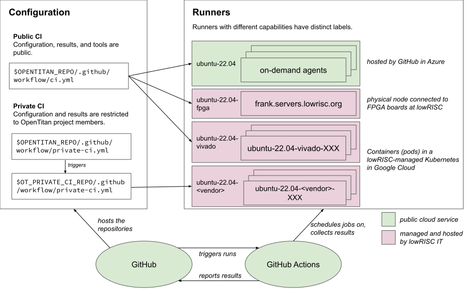

# OpenTitan Continuous Integration

All changes to the OpenTitan source code are tested thoroughly in a continuous integration system.
Tests run automatically when changes are proposed for inclusion by submitting a pull request, and on the `master` branch after changes are merged.
This ensures that the OpenTitan source code meets certain quality criteria at all points in time, as defined by the tests which are executed.

Read on to learn more about the types of tests, and the infrastructure that runs these tests.

## How to report CI problems

If you detect CI failures which look like they might not be related to the tested code, but the test infrastructure, please file an [issue on GitHub](https://github.com/lowRISC/opentitan/issues).
In urgent cases also reach out on Slack and send an email to lowRISC IT at [internal-tech@lowrisc.org](mailto:internal-tech@lowrisc.org).
Note that lowRISC is based in the UK and most active during European business hours.

## Overview

<!--
Source: https://docs.google.com/drawings/d/1-Zjm3k2S0TNmne3F9z3rpTFJfLJJvvmrBAsfx_HG5lk/edit

Download the SVG from Google Draw, open it in Inkscape once and save it without changes to add width/height information to the image.
-->


OpenTitan uses [GitHub Actions](https://github.com/features/actions) as continuous integration provider: test jobs are described in an GitHub Actions-specific way, and then executed on compute resources, some of which are provided by GitHub, and others of which are provided by lowRISC.

Two things are special in the way OpenTitan does continuous integration: private CI, and testing on FPGA boards.

"Private CI" is a term we use for a subset of test jobs which require tighter access control.
The primary use case for private CI are tests using proprietary EDA tools, where the license agreement prevents us from testing arbitrary code with it, from showing the configuration or the output in public, etc.
We run such test jobs in a separate environment where only OpenTitan project members have access.
The test result (pass/fail) is still shared publicly to enable outside contributors to at least get some feedback if their pull request passed our tests.

To test OpenTitan (both the hardware and the software) on FPGAs we have various FPGA boards connected to a machine at lowRISC.
We configure GitHub Actions to schedule test jobs on this machine when FPGA testing is required.
The results and logs of these test runs are shown publicly.

## Test descriptions

All tests are described in a GitHub Actions-specific YAML syntax.
`$REPO_TOP/.github/workflows/ci.yml` is the main configuration file for all public CI jobs.
The private CI jobs are described in a separate private repository, [lowrisc/opentitan-private-ci](https://github.com/lowRISC/opentitan-private-ci), to keep the job descriptions internal for legal reasons.

GitHub Actions documentation can be found at https://docs.github.com/en/actions.

## Compute resources: runners

Each job in the YAML file also specifies which type of compute resource it wants to run on.
An individual compute resource is called a *runner*, and we separate runners by giving them distinct labels for runners with different capability.

For OpenTitan, we have the following runner labels available:
* The *ubuntu-22.04* label is backed a GitHub-provided pool of VMs which are free of charge for us.
  They are described in more detail in the [GitHub Actions documentation](https://docs.github.com/en/actions/using-github-hosted-runners/using-github-hosted-runners/about-github-hosted-runners).
* The *ubuntu-22.04-vivado* label is backed by containers with a lowRISC-specific setup with Xilinx Vivado installed, but has no access to tools with special license restrictions.
* The *ubuntu-22.04-&lt;vendor&gt;* labels have proprietary EDA tools installed and access to the respective licenses.
* The *ubuntu-22.04-fpga* label currently consists of containers on a single machine with our FPGA boards connected to it.

All self-hosted runners (i.e. non-GitHub runners) are managed by lowRISC IT.

All runners provide ephemeral test environments: the test environment is initialized at the start of a test job and completely destroyed at the end.
This is achieved by running tests in Docker containers which are recreated after each run.
The base image used for all lowRISC-hosted runners is available [as lowrisc/eda-runner-ubuntu-22.04 on DockerHub](https://hub.docker.com/r/lowrisc/eda-runner-ubuntu-22.04).
(The build rules/Dockerfile for this image are lowRISC-internal.)

lowRISC-provided runners run in a Kubernetes cluster on Google Cloud (GCP), where we also define the resources allocated for the individual runners.
The number of runners automatically scale depending on the number of scheduled jobs and has an upper limit.

## Job scheduling, build triggers and status reporting

When an event, e.g. the creation of new pull requests, are triggered, GitHub Actions compares them with the configured workflow triggers in the `.github/workflows/ci.yml` file.
It then processes the workflow description and queues and dispatches test jobs to the respective runners, taking test dependencies into account.

After the runner has completed a test job it reports back the result GitHub Actions, which makes this information (build artifacts and logs) available to users through the web UI.
The status of GitHub Actions is displayed below a pull request, as marks next to commits, and in various other places.

## Bitstream Caching

Since full bitstream builds for FPGA testing & development can take over an hour, we cache the output artifacts in multiple ways.

First, a GCS bucket is used to keep bitstreams for merged PRs. When a new PR is subsequently uploaded, CI evaluates whether to reuse an entry from the cache or instead rebuilt the bitstream from scratch. This involves checking the files that were changed since the last cached bitstream entry, and comparing these to a list of excluded patterns. If this check decides that a build is needed, then the relevant Bazel targets are built and the corresponding bitstream artifacts are uploaded to the GCS bucket. Refer to the relevant documentation on the [implementation of bitstream caching](../fpga/ref_manual_fpga.md#implementation-of-bitstream-caching-and-splicing) for more information on this caching mechanism.

Second, the [GitHub action cache](https://github.com/actions/cache) is used to save bitstreams during a PR's review lifetime. This is useful for PRs that change the bitstream and require it to be rebuilt. The GitHub cache saves the bitstream in early PR uploads so that it can be reused in later revisions where possible, e.g. for PR revisions that fix bits of documentation or touch parts of the codebase not involved in the bitstream creation. This mechanism works by collecting a list of files (from FuseSoC) that are used as source for the Bitstream creation and generating a digest SHA that identifies them. This SHA is then used as a key to index the GitHub cache. A bitstream will then be reused in revisions of the same PR with matching digest. Note that the GitHub action cache is scoped to the repository branch and therefore cannot be reused across different PRs.

It is important to note that the digest is created solely based on the list of source files involved in the bitstream creation. A PR update that only changes the FuseSoC command line may end up incorrectly reusing a bitstream from an earlier revision of the same PR. This issue may be resolved in the future by making the FuseSoC command line part of the inputs used to calculate the digest SHA.

Finally, it should be noted that Bazel itself may be able to cache the bitstream build action, depending on whether any of the input files that it feeds to FuseSoC have been changed. (This is effectively a third caching mechanism for bitstreams.) You can get a rough measure of what Bazel considers as an input to the bitstream build by enumerating the dependencies of the relevant target.
For example:

```sh
bazel cquery --notool_deps --nohost_deps --noimplicit_deps 'deps(//hw/bitstream/vivado:fpga_cw340)'
```

More generally, the glob patterns listed under the `//hw:rtl_files` filegroup encompass most of the hardware files that are treated as FuseSoC inputs.
If you change a file that is included in those patterns, then the full bitstream build cost will be incurred - regardless of whether that change actually requires a new bitstream to be built.

## Merge Queue

OpenTitan uses a [merge queue](https://docs.github.com/en/repositories/configuring-branches-and-merges-in-your-repository/configuring-pull-request-merges/managing-a-merge-queue) to sequence merges and ensure that bitstreams are always available in the cache by the time that changes have been merged.
This means that, whenever you are developing from a branch with cached builds, the Bazel bitstream flow will always be able to retrieve a cached bitstream corresponding to the latest hardware state, accelerating local development.

One of the main advantages of using a merge queue is that it ensures bitstreams are cached for future CI runs.
Without such a system, it is easy for CI to be bottlenecked during periods of heavy activity.
This is because several PRs (which may or may not make any changes that impact the bitstream build) would then be unable to see a cached bitstream for some time after a merge, and thus would all try to build bitstreams in parallel.
This can then further delay the bitstream builds of PRs that are subsequently merged, leading to the problem intensifying.
At that point, queues lasting several days can materialize and may require manual intervention in the form of skipping or cancelling CI jobs, which is not ideal.
The behaviour enforced by the merge queue prevents this kind of situation, at the cost of taking longer to merge PRs.

If there are many PRs that _do_ require bitstream changes, this can result in longer queues as many PRs must wait to be merged.
In critical situations, committers have the ability to completely bypass the merge queue - however this ability should be used sparingly and _only_ when appropriately communicated.
In practice, the merge queue should be left to run and should not require any manual intervention.
