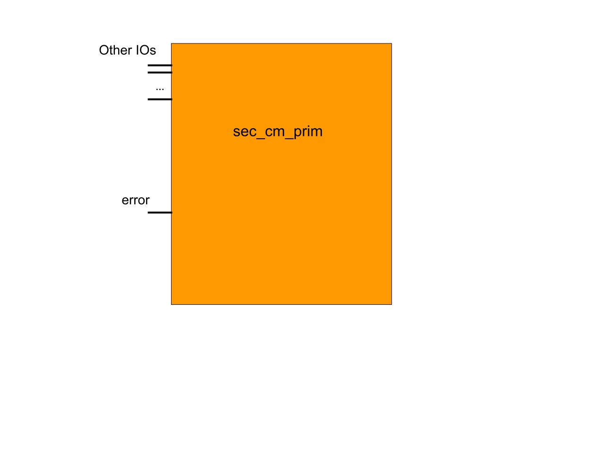
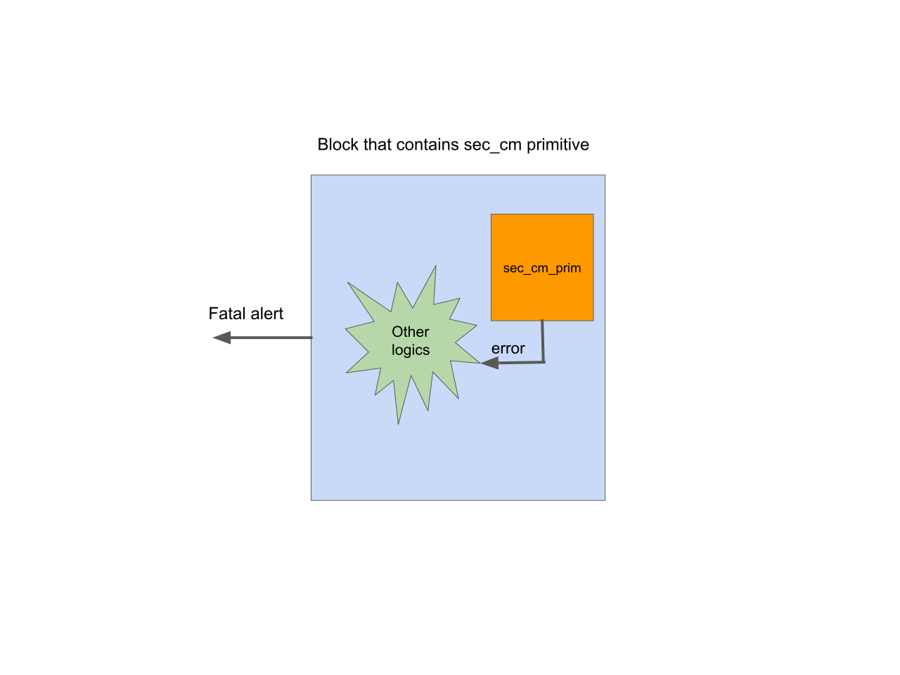

## Purpose
In a security chip, there are many hardening security countermeasures implemented in security blocks.
Hardened security countermeasures are used to detect attacks by embedding integrity checks.
Usually it can’t be triggered by software or toggling the pins on the chip.
So, this may need to be tested one by one via forcing internal design signals on the security countermeasure related logic, which mimics attackers to flip the circuit.
This kind of verification is needed but the effort could be tremendous.
The work can be significantly reduced by using a unified verification framework.

## Standardized Design Countermeasure Primitive
Each countermeasure is implemented as a primitive - an RTL design building block written in SystemVerilog.
The standardization of how these building blocks are designed paves the way for automated verification.

There are 2 requirements that are needed in this primitive.
1. Create a standard primitive for each kind of countermeasure, which can be reused across all blocks in the chip.
Each primitive has an error indicator as an IO (or an internal signal if other blocks don’t need to connect with this error indicator).
Once the design detects an attack, the error will be set.



2. Once the error is set, the block should report a fatal alert or trigger unmasked interrupt to the system.
As shown in the diagram below, there could be some additional logics which are triggered when error occurs but not unified across the blocks.
For example, the block may contain custom logics which cancelling the operation when error occurs.


## Embedded Common Checks In The Design
At the top of each IP, an assertion check should be added to ensure that the fatal alert will be triggered once error is set.
In the countermeasure primitive, there is another check to ensure that each instance of the countermeasure primitive must contain this assertion check.
These 2 things can be accomplished by using the SystemVerilog macro.

Firstly, define a macro in the countermeasure primitive and declare a logic “assert_connected” which will be assigned when the macro is invoked correctly.
If the macro isn’t used for any instance of countermeasure primitive, the assertion will fail.

```systemverilog
`define ASSERT_PRIM_COUNT_ERROR_TRIGGER_ALERT(NAME_, PRIM_HIER_, ALERT_, MAX_CYCLES_ = 5) \
  NAME_: assert property (@(posedge clk)) disable iff(!rst_n) \
                ($rose(PRIM_HIER_.err_o) |-> ##[1:MAX_CYCLES_] $rose(ALERT_.alert_p)) \
  `ifdef SIM_OR_FPV \
  assign PRIM_HIER_.unused_assert_connected = 1'b1; \
  `endif

module prim_count();
  ...
  // This logic that will be assign to one, when user adds macro
  // ASSERT_PRIM_COUNT_ERROR_TRIGGER_ALERT to check the error with alert, in case that prim_count
  // is used in design without adding this assertion check.
  `ifdef SIM_OR_FPV \
  logic assert_connected;

  initial #0 assert(assert_connected === 1'b1);
  `endif
endmodule
```

Secondly, invoke the assertion macro for each instance of the countermeasure primitive in the IP top.

```systemverilog
module a_ip_top();
  ...
  // Invoke the assertion macro for each instance of the countermeasure primitive
  `ASSERT_PRIM_COUNT_ERROR_TRIGGER_ALERT(CtrlCntAlertCheck_A, u_ctrl.u_cnt, alert_tx_o[0])

  `ASSERT_PRIM_COUNT_ERROR_TRIGGER_ALERT(FsmCntAlertCheck_A, u_fsm.u_cnt, alert_tx_o[0])

endmodule

```

### Special Handling of Sparse FSM Primitive

Sparse FSMs in OpenTitan security IPs are implemented with the `prim_sparse_fsm_flop` countermeasure primitive to ensure that the state encoding cannot be altered by synthesis tools.
This primitive also implements the embedded common checks mentioned above.

However, simulation tools like Xcelium and VCS are at this time not able to correctly infer FSMs and report FSM coverage when the state registers reside in a different hierarchy (such as `prim_sparse_fsm_flop`) than the next-state logic of the FSMs.

In order to work around this issue, the wrapper macro `PRIM_FLOP_SPARSE_FSM` should be used instead of directly instantiating the `prim_sparse_fsm_flop` primitive.
The `PRIM_FLOP_SPARSE_FSM` macro instantiates a behavioral state register in addition to the `prim_sparse_fsm_flop` primitive when the design is built with `SIMULATION` defined.
This enables simulation tools to correctly infer FSMs and report coverage accordingly.
For other build targets that do not define `SIMULATION` this macro only instantiates the `prim_sparse_fsm_flop` primitive.

An example of how the macro should be used is shown below:

```systemverilog
// u_state_flops: instance name of the prim_sparse_fsm_flop primitive
// state_d: FSM next state
// state_q: FSM current state
// state_e: FSM state enum type
// ResetSt: FSM reset state
// clk_i: Clock of the design (defaults to clk_i)
// rst_ni: Reset of the design (defaults to rst_ni)
// SvaEn: A value of 1 enables the embedded assertion (defaults to 1)
`PRIM_FLOP_SPARSE_FSM(u_state_flops, state_d, state__q, state_e, ResetSt, clk_i, rst_ni, SvaEn)
```

In order to generate a complete template for sparsely encoded FSMs, please refer to the [the sparse-fsm-encode.py script](https://github.com/lowRISC/opentitan/blob/master/util/design/sparse-fsm-encode.py).

## Verification Framework For The Standardized Design Countermeasures

This verification framework involves three different steps, which are all needed in order to achieve the completed verification for countermeasures.

### Primitive-Level Verification
Use FPV or a simple simulation based testbench to verify the correctness of the error indicator as well as other functionality in the primitive.
This unit-level testing eases the verification work at the higher level.
Coverage closure for this primitive at higher-level can be eliminated.

### FPV Proves The Embedded Assertion
Use FPV to prove that the embedded assertion is true (fatal alert is triggered once error is set).
This mathematically proves that an error unconditionally leads to the fatal alert.

### Block-Level Verification With A Unified Semi-Automated Framework.
Triggering the fatal alert is usually not the only outcome of detecting an attack.
Some other behavior may occur as well, such as wiping all the internal secrets or invaliding new commands, after detecting a fault.
However, there are usually many security primitives that are embedded in different places of the security chip.
It could take tremendous effort to manually test them one by one.
The following steps are the key implementation of this framework, which uses some automation to reduce the effort.

1. Create a SystemVerilog interface with a proxy class (refer to this [article](https://blog.verificationgentleman.com/2015/08/31/sv-if-polymorphism-extendability.html) for implementation) for each countermeasure primitive and bind the interface to the primitive module.
All the proxy classes extend from the same base class.

2. In the interface, implement an “initial” block that stores the handle of the proxy class to a queue in a package.
This queue is declared as the base type of the proxy class. All the handles of various proxy classes are automatically stored at time 0 in the simulation.

```systemverilog
interface prim_count_if;

  // this class has the access to any signals in the interface and interface can connect to the signals in the primitive
  class prim_count_if_proxy extends sec_cm_pkg::sec_cm_base_if_proxy; // allow extendability
    virtual task inject_fault();
       // use uvm_hdl_force/deposit to do fault injection
    endtask
  endclass

  prim_count_if_proxy if_proxy;
  initial begin
    if_proxy = new("if_proxy");
    if_proxy.sec_cm_type = sec_cm_pkg::SecCmPrimCount;
    if_proxy.prim_path = $sformatf("%m");
    sec_cm_pkg::sec_cm_if_proxy_q.push_back(if_proxy);
  end
```

3. In the base sequence, create a loop to test each instance of the countermeasure primitive. In each loop, “inject_fault” task from the proxy class will be invoked, which is followed by a “check_resp” task. The block owner can extend this sequence and add additional checks for non-standardized behavior based on the proxy_class info such as the hierarchy of the primitive instance.

```systemverilog
foreach (sec_cm_pkg::sec_cm_if_proxy_q[i]) begin
    sec_cm_pkg::sec_cm_base_if_proxy if_proxy = sec_cm_pkg::sec_cm_if_proxy_q[i];
    inject_fault(if_proxy));  // call if_proxy.inject_fault
    check_resp(if_proxy);
end
```
This automation essentially relies on standardizing design countermeasure primitives.
It uses the primitive types to anchor all the instances of countermeasure primitives and store all the handles that associate to the interface of the countermeasure primitive in a global location.
The framework loops over all the handles and provides a common sequence to check common behavior as well as callback functions that allow users to test any non-standard behavior.

Refer to cip_lib [document]() at the section - "Security Verification for common countermeasure primitives" for the steps to enable this test in block-level testbench.
