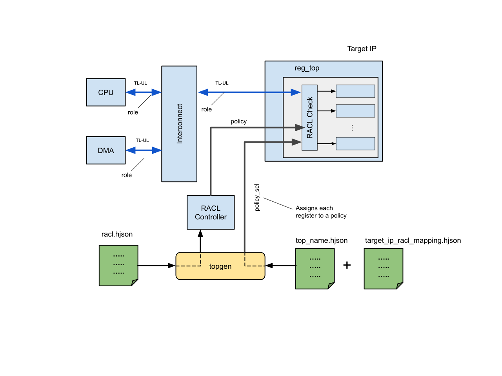

# RACL: Register Access Control List

## Introduction
A System-on-Chip (SOC) must provide differentiated security on access to registers in the SOC and the CPU.
RACL is a lightweight, fine-grained access control mechanism to restrict CSR access to specific originators, which fulfills this need.

### Definitions
Each processing element in the SOC, i.e. each component that can actively generate a register read and/or write request, is a _subject_.
A subject may have one or more _roles_ associated with it and the subject may be allowed to switch between the roles.
For example, a CPU processing element may switch between multiple roles based on the mode of execution.
The set of roles that can be assumed by a subject may also change temporally.
For example, the role of CPU core to configure the system may be restricted to an early window at boot.

Each register (or window) that can be accessed by processing elements is an _object_.
For each object or group of objects, an access-control-list (ACL), or _policy_, is defined that determines if the subject in its current role can read the object and if the subject in its current role can write the object.

A role is defined by a 4-bit encoding.
The role encoding is determined by the implementer, and may have different meaning depending on their use case.
The implementation shall provide an abstraction to allow different implementers defining their role assignments based on their needs.
The role is transmitted across the fabric as part of a transaction so that a given policy can be enforced at the target based on this role.
For the TLUL fabric used within OpenTitan, the [top-level RACL configuration](#top-level-racl-configuration) defines which bits of the `a_user` field are used to carry this information.

### Overview


The figure above shows how the role of a source processing element is sent across the fabric along with the transaction.
In this example, the source processing element can pick between 3 roles - `RoleID0`, `RoleID1`, and `RoleID2`.
The RoleSelector - selects the current role - muxes out the ID corresponding to the current role onto the fabric.
At the target, the role and the attributes of the transaction (Read/Write, address, and size) are used to determine if the access is allowed or denied.
If the access is denied then the error is logged into an Error-Log register.

### RACL Policies
Each policy register takes the form of a pair of permission bitmaps, `ReadPerm` and `WritePerm`, where each bit corresponds to a role.
E.g., if 16 different roles are defined, the register looks as follows, where the bit position of each role is defined by the role encoding that is specified via the `role_id` in the [configuration file](#top-level-racl-configuration).

|                 | Role 0 | Role 1 | ... | Role 14 | Role 15 |
|-----------------|:------:|:------:|:---:|:-------:|:-------:|
| *Bit position:* | *0*    | *1*    | ... | *14*    | *15*    |
| `WritePerm`     |        |        |     |         |         |
| `ReadPerm`      |        |        |     |         |         |

Each `ReadPerm` bit indicates if the corresponding role (see column header) has read permission to objects (e.g., registers) controlled by this policy.
Each `WritePerm` bit indicates if the corresponding role has write permission.
When the bit is 1, the corresponding permission is granted and when it is 0 it is denied.

The policy registers is mapped as shown below.
Note, the policy registers are 64-bit aligned to allow room for future use.

| Name     | Offset | Bits 31:16  | Bits 15:0  |
|----------|:------:|:-----------:|:----------:|
| Policy 0 | 0x000  | `writePerm` | `readPerm` |
|          | 0x004  | reserved    | reserved   |
| Policy 1 | 0x008  | `writePerm` | `readPerm` |
|          | 0x00c  | reserved    | reserved   |
| Policy 2 | 0x010  | `writePerm` | `readPerm` |
|          | 0x014  | reserved    | reserved   |
| Policy 3 | 0x018  | `writePerm` | `readPerm` |
|          | 0x01c  | reserved    | reserved   |
| Policy 4 | 0x020  | `writePerm` | `readPerm` |
|          | 0x024  | reserved    | reserved   |

In the [RACL configuration file](#top-level-racl-configuration), exactly one policy must be defined with `rot_private: true`.
This policy is then used to statically protect the policy registers themselves.
The read and write permissions are used from this policy as defined in the configuration file at design time.
For all policy registers, the configuration specified in the configuration file is the reset default value.
However, depending on the permissions defined for the `rot_private`-designated policy, the policy registers may also be updated at runtime.

### RACL Controller

For a top-level that uses RACL, there is an associated RACL Controller (`racl_ctrl`), which acts as the interface between the TileLink bus and the RACL matching logic.
For example, see the documentation for the [Darjeeling racl_ctrl](../../../../hw/top_darjeeling/ip_autogen/racl_ctrl/README.md).
The RACL Controller implements the policy registers, distributes them to subscribing IPs and collects error logs from them through its hardware interface.

### RACL Controller Groups
A RACL controller group is defined by a name and a set of policies.
Each group must also have one instance of a RACL controller associated with this group.
Currently, only a single group is supported, but this is expected to change in the future.
Any RACL-enabled IP subscribing to a specific RACL controller group is automatically connected to the associated RACL controller to get the appropriate policies and to collect the error logs from that specific group.

## RACL Rules
1. Each instantiation of a RACL-enabled IP must state which [RACL Controller Group](#racl-controller-groups) it subscribes to.
2. Each instantiation of a RACL-enabled IP must state whether RACL is used for any given bus interface.
3. For each bus interface where RACL is enabled, each of its registers and windows must be mapped to a RACL policy that exists within the RACL Controller Group which is used for this IP.
4. The following rules must be observed by the IP on a register access:
   - An IP should enforce alignment
      i.  The access must not be wider than the register width and the address of the access must be naturally aligned to the size of the access.
      ii. Not allow a read or write to span multiple registers.
   - If alignment property is violated then treat as if access violates RACL
   - If the transaction is a read then use the “Role” to index into the ReadPerm bitmap of the policy governing this register to locate the PermR bit.
   - If the transaction is a write then use the “Role” to index into the WritePerm  bitmap of the policy governing this register to locate the PermW bit.
   - If the transaction is a read and if PermR==0 then RACL is violated.
      + Complete the transaction with dummy data (e.g. 0).
        A design parameter dictates if a bus error is returned or not.
      + Note: It is not okay to hang by not returning a completion as this may be used as a way to mount a denial of service (DoS) attacks by adversaries.
   - If the transaction is a write and if PermW==0 then: RACL is violated:
      + If the transaction semantics is
        * Posted then drop the write
        * Posted-with-Completion-with-no-data then returns a completion.
        * Posted-with-Completion-with-data then returns completion with dummy data (e.g, all 1 or all 0).
        * Note: It is not okay to hang by not returning a completion.
        * A design parameter dictates if a bus error is returned or not.
   - If the RACL was violated
      + If a previously logged error is present then set the overflow bit else log an error in an error logging register

## Processing Element (Subject) Requirements
1. Processing elements must not allow the role encodings for a transaction to be mutable under firmware control to a role that is not defined for that processing element.
2. The processing element may obtain the encodings for each role through a set of straps from the SOC.
   Alternatively, the processing element may support a configurable register that allows configuring encodings for each role.
   If such a configurable register exists that register must be access controlled such that it can be only updated by the ROT role.
3. Where an IP supports selecting multiple roles, the mechanism to select the role must be restricted such that a lower privileged entity cannot request a higher privileged role.

## Pass-through processing elements
Some processing elements pass-through transactions received upstream to fabric downstream.
Examples of such processing elements include I/O bridges.
Such bridges must pass through the role verbatim from the upstream to downstream and must not substitute their own role for the downstream transaction.


## Security
RACL is currently not protected against fault attacks.

### RACL_001

- **Asset:**  Registers protected by RACL policy
- **Threat:** Faking RACL role
- **Actor:**
  + Privileged SW adversary in M/S/HS
  + Devices connected to SoC
- **Attack Point(s):** Fabric transactions

Privilege escalation by allowing untrusted roles to tamper/modify registers protected by RACL.

**HW mitigation**
- RACL roles are immutable and cannot be changed by hardware or firmware.
- Where an endpoint can originate multiple roles, the hardware restricts the set of roles that can be selected but not the role ID itself.

### RACL_002

- **Asset:**  RACL policy registers
- **Threat:** Changing policy registers to allow register access by untrusted roles
- **Actor:**
  + Privileged SW adversary in M/S/HS
  + Devices connected to SoC
- **Attack Point(s):** Fabric transactions to read/write RACL policy registers

Privilege escalation by allowing untrusted roles to tamper/modify registers protected by RACL.

**HW mitigation**
- RACL policy registers can be written only by the ROT role.
- Only RoT is allowed to assume the ROT role.
- RACL policy registers reset defaults configured to not allow unprivileged roles by default in the RACL policies.

### RACL_003

- **Asset:**  Registers protected by RACL
- **Threat:** M/S/HS-mode attempting to cause privilege escalation for transactions passing through bridges
- **Actor:**
  + Privileged SW adversary in M/S/HS privilege.
- **Attack Point(s):** Fabric transactions

Components that bridge fabric transactions may substitute the role in incoming transactions with a higher privileged role leading to privilege escalation by allowing untrusted roles to tamper/modify registers protected by RACL.

**HW mitigation**
- Components that bridge fabric requests may substitute the role in incoming transactions must do one of following
  + Pass through the role carried in the original request
  + Demote the role to a lower role

## Configuration

RACL is configured in two ways.
First, through a top-level configuration file, and second, through a per-instance racl-mapping configuration file.
These are detailed below.
The specific configuration for Darjeeling is given [here](../../../../hw/top_darjeeling/ip_autogen/racl_ctrl/doc/racl_configuration.md)

### Top-level RACL Configuration

The top-level role definition and policy mapping is done via a file.
That file is top-specific and defined by the integrator in the top-level hjson configuration file via the `racl_config` key. E.g., `racl_config: 'racl.hjson'`.
A top-level configuration file consists of two main parts: The list of roles, as well as the specific policies for each RACL controller group.
For each such group one policy must set `rot_private` to `true`, indicating that this policy is used for protecting the policy registers of that group.

The following shows an example top-level configuration with a single RACL controller group called `Null`, which is the default RACL controller group name.

```
{
  // error_response controls whether to return TLUL error on RACL errors
  error_response: true
  // The CTN UID is transfered via the TLUL reserved user bits: rsvd[ctn_uid_bit_msb:ctn_uid_bit_lsb]
  ctn_uid_bit_lsb: 0
  ctn_uid_bit_msb: 4
  // The RACL role is transfered via the TLUL reserved user bits: rsvd[role_bit_msb:role_bit_lsb]
  role_bit_lsb: 5
  role_bit_msb: 8
  roles: {
    // role_id must be between 0 and 15 (inclusive).
    "ROT" :  { role_id: 0 }
    "ROLE1": { role_id: 1 }
    "SOC":   { role_id: 2 }
  }
  policies: {
    Null: [
      { name: "ALL_RD_WR"
        desc: "Policy allowing all roles to access a register"
        allowed_rd: [ "ROT", "ROLE1", "SOC" ]
        allowed_wr: [ "ROT", "ROLE1", "SOC" ]
      }
      { name: "ROT_PRIVATE"
        desc: "Policy allowing only the ROT role to access a register"
        rot_private: true // Specifies that the policy registers are protected using this policy
        allowed_rd: [ "ROT" ]
        allowed_wr: [ "ROT" ]
      }
      { name: "SOC_ROT"
        desc: "Custom policy allowing SOC and ROT"
        allowed_rd: [ "ROT", "SOC" ]
        allowed_wr: [ "ROT", "SOC" ]
      }
    ]
  }
}
```

### Instance-level Policy Mapping

RACL policies apply on a per-instance basis, meaning that different instances of the same IP can be protected using different RACL policies, or different RACL groups.
To do so, the integrator defines a mapping of each register or window of an instance to one of the policies defined in `racl.hjson`.
As a short-hand, `*` may be used as a catch-all in case a register is not explicitly named in the configration file.
The following shows a few different examples of an instance-level policy mapping:

1. This minimal configuration specifies that for the RACL controller group `Null`, all registers shall be protected using the `SOC_ROT` policy.
```
{
  Null: {
    registers: {
      "*": "SOC_ROT"
    }
  }
}
```

2. RACL also supports so-called _ranges_, which can be used by a RACL-enabled IP to protect whole address ranges, e.g., for protecting different SRAM address ranges.
The `*` option does not exist for ranges.
These must be explicitly defined as follows.
The given configuration defines one range with 4KiB in size protected by the `ROT_PRIVATE` policy, and another 4 Byte range using the `ALL_RD_WR` policy.
```
{
  Null: {
    registers: {
      "*": "SOC_ROT"
    }
    windows: {
      "*": "SOC_ROT"
    }
    ranges: [
        {
            'base': "0x0000"
            'size': "0x1000"
            'policy': "ROT_PRIVATE"
        }
        {
            'base': "0x1000"
            'size': "0x0004"
            'policy': "ALL_RD_WR"
        }
    ]
  }
}
```

3. Individual registers and windows can also be protected with different policies each by naming them explicitly instead of using `*`.
```
{
  Null: {
    registers: {
      "SOC_CONTROL":           "SOC_ROT"
      "SOC_STATUS":            "SOC_ROT"
      "SOC_DOE_INTR_MSG_ADDR": "SOC_ROT"
      "SOC_DOE_INTR_MSG_DATA": "SOC_ROT"
    }
    windows: {
      "WDATA": "SOC_ROT"
      "RDATA": "ALL_RD_WR"
    }
  }
}
```

The instance mapping is added to the instantiation in the top-level HJSON as defined as follows.
If no RACL mapping is provided to an instance, the instance does not use RACL and no overhead is generated.
```
{ name: "mbx0",
  // ...
  base_addrs: {
    core: {hart: "0x22000000"},
    soc:  {soc_mbx: "0x01465000"},
  },
  racl_mappings: {
    soc: 'racl/all_rd_wr_mapping.hjson'
  }
}
```

In this example, RACL is only generated for the `soc` interface of the mailbox.

## RTL Implementation

RACL is opt-in.
If no `racl.hjson` is defined in the top-level HJSON and no RACL mappings are used there, no RACL logic is generated.
There will be no logic overhead to the design (see [System with No RACL Use](#system-with-no-racl-use) for details).



The tooling generates a parameterized [RACL controller](#racl-controller) based on the top-level configuration.
This controller implements the policy registers (statically protected via the `rot_private`-designated policy) and exposes all policies via a top-level vector.


The RACL policy vector gets distributed to all IPs that subscribe to that RACL group.
The RACL policy vector, along with a static per-instance selection vector is routed to the IP that subscribes to RACL.
A RACL-supported IP’s top-level I/O interface is changed to include RACL signals such as the policy vector, a policy selection vector, and a RACL error log output.

These wires are routed to the internal reg\_top.
If IPs use more than one reg\_top, each reg\_top will get a dedicated selection vector.
- `racl_policies_i`: A vector of all possible policies defined by `racl.hjson`.
  This is coming from the RACL controller.
- `racl_policy_sel_i`: A vector of indices that select the policy from the policy vector.
  Entry 0 of this array defines the policy selection for register 0 in that IP, entry 1 defines the selection for register 1, etc.
  In the example from above, the vector might look like `[1, 1, 1, 1, 1, 0, 1, 1, 1, 1, 1, 1, 2, 1]`.
  + If an IP features multiple reg\_tops, each will have its own `racl_policy_sel_<reg_top_name>_i` policy selector input.
    `racl_violation_o` will then be the OR combination of violations among reg\_tops.
    If multiple RACL violations can happen at the same time, they must be arbitrated appropriately before passing the error log to the RACL controller.

### System with No RACL Use
The system supports instantiating IPs with and without RACL alongside.
If an IP is instantiated in a non-RACL use case, no overhead is added to the IP.
The additional inputs are tied off, and the outputs are left open.
Inside the IP, the RACL comparison logic is gated via a per-instance synthesis parameter, hence the (unused) RACL logic appears neither in synthesis nor in DV.
If the system does not use RACL at all, there is no overhead in terms of additional transported bits in the crossbar.

## Out of Tree Usage

RACL may also be used outside of OpenTitan.
For this purpose, the RACL controller provides an additional input to collect error logs from externally subscribing IPs.
See the [interface documentation for the Darjeeling racl_ctrl](../../../../hw/top_darjeeling/ip_autogen/racl_ctrl/doc/interfaces.md).
Additionally, the `util/raclgen.py` tool can be used to generate the necessary policy selection vectors.
