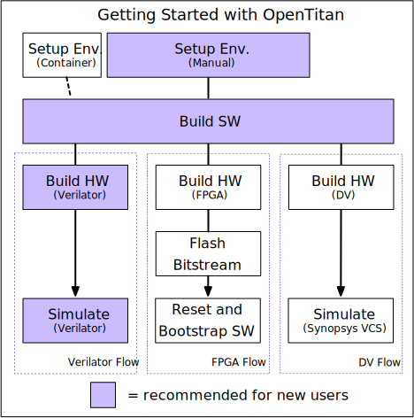

# Getting started

Welcome!
This guide will help you get OpenTitan up and running.

## Workflow options

An important preliminary note: to run OpenTitan software, you won't just need to build the software itself.
You'll also need to somehow simulate the hardware it runs on.
We currently support multiple build targets and workflows, shown in the diagram below.
These include: Verilator, FPGA, and DV (commercial RTL simulators, such as VCS and Xcelium).

**If you are new to the project, we recommend simulation with Verilator.**
This uses only free tools, and does not require any additional hardware such as an FPGA.



This guide will focus on the Verilator workflow, but indicate when those following FPGA or DV workflows should do something different.
Just keep in mind, if you're a new user and you don't know you're part of the FPGA or DV crowd, "Verilator" means you!

## Step 0: Clone the OpenTitan repository

Clone the [OpenTitan repository](https://github.com/lowRISC/opentitan):
```console
git clone https://github.com/lowRISC/opentitan.git
```

If you wish to *contribute* to OpenTitan you will need to make a fork on GitHub and may wish to clone the fork instead.
We have some [notes for using GitHub](../contributing/github_notes.md) which explain how to work with your own fork (and perform many other GitHub tasks) in the OpenTitan context.

***Note: throughout the documentation `$REPO_TOP` refers to the path where the OpenTitan repository is checked out.***
Unless you've specified some other name in the clone, `$REPO_TOP` will be a directory called `opentitan`.
You can create the environment variable by calling the following command from the same directory where you ran `git clone`:
```console
export REPO_TOP=$PWD/opentitan
```

## Step 1: Check system requirements

**OpenTitan installation requires Linux.**
If you do not have Linux, please stop right here and use the (experimental) [Docker container](https://github.com/lowRISC/opentitan/tree/master/util/container).
You can then **skip to step 4** (building software).

If you do have Linux, you are still welcome to try the Docker container.
However, as the container option is currently experimental, we recommend following the steps below to build manually if you plan on being a long-term user or contributor for the project.

Our continuous integration setup runs on Ubuntu 20.04 LTS, which gives us the most confidence that this distribution works out of the box.
We do our best to support other distributions, but cannot guarantee they can be used "out of the box" and they might require updates of packages.
Please file a [GitHub issue](https://github.com/lowRISC/opentitan/issues) if you need help or would like to propose a change to increase compatibility with other distributions.

You will need at least **7GiB of available RAM** in order to build the Verilator simulation.
If you are building another form of simulation, this constraint does not apply.

If you are specifying a new machine to run top-level simulations of the whole of OpenTitan using Verilator, it is recommended that you
have a minimum of **32GiB of physical RAM** and at least **512GiB of disk storage** for the build tools, repository and Ubuntu installation.

There are unofficial guides for alternate Linux environments.
The unofficial guides are not formally supported by the OpenTitan project. YMMV.
- [RedHat/Fedora](unofficial/fedora.md)

## Step 2: Install dependencies using the package manager

*Skip this step if using the Docker container.*

A number of software packages from the distribution's package manager are required.
On Ubuntu 20.04, the required packages can be installed with the following command.

```sh
sed '/^#/d' ./apt-requirements.txt | xargs sudo apt install -y
```

## Step 3: Install Python libraries needed

Some tools in this repository are written in Python and require their dependencies to be installed through `pip`.
We recommend installing the latest version of `pip` and `setuptools` (especially if on older systems such as Ubuntu 18.04) using:

```console
python3 -m pip install --user -U pip "setuptools<66.0.0"
```

The `pip` installation instructions use the `--user` flag to install without root permissions.
Binaries are installed to `~/.local/bin`; check that this directory is listed in your `PATH` by running `which pip3`.
It should show `~/.local/bin/pip3`.
If it doesn't, prepend `~/.local/bin` to your `PATH`, e.g. by adding the following line to your `~/.bashrc` file:

```console {title=~/.bashrc}
export PATH=~/.local/bin:$PATH
```

Now install additional Python dependencies:

```console
cd $REPO_TOP
pip3 install --user -r python-requirements.txt --require-hashes
```

## Step 4: Install the lowRISC RISC-V toolchain

*Skip this step if using the Docker container.*

To build device software you need a baremetal RISC-V toolchain (including, for example, a C compiler).
Even if you already have one installed, we recommend using the prebuilt toolchain provided by lowRISC, because it is built with the specific patches and options that OpenTitan needs.
You can install the toolchain using the `util/get-toolchain.py` script, which will download and install the toolchain to the default path, `/tools/riscv`.

```console
cd $REPO_TOP
./util/get-toolchain.py
```

If you did not encounter errors running the script, **you're done and can go to step 5**.
If you did, read on.

#### Troubleshooting

If you need to install to a different path than `/tools/riscv` (for instance, if you do not have permission to write to the `/tools` directory), then you can specify a different location using the `--install-dir` option.
Run `./util/get-toolchain.py --help` for details.
You can alternatively download the tarball starting with `lowrisc-toolchain-rv32imcb-` from [GitHub releases](https://github.com/lowRISC/lowrisc-toolchains/releases/latest) and unpack it to the desired installation directory.

Assuming one of the above worked and you have installed to a non-standard location, you will need to set the `TOOLCHAIN_PATH` environment variable to match whatever path you used.
For example, if I wanted to install to `~/ot_tools/riscv`, then I would use:
```console
./util/get-toolchain.py --install-dir ~/ot_tools/riscv
export TOOLCHAIN_PATH=~/ot_tools/riscv
```
Add the `export` command to your `~/.bashrc` or equivalent to ensure that the `TOOLCHAIN_PATH` variable is set for future sessions.
Check that it worked by opening a new terminal and running:
```console
ls $TOOLCHAIN_PATH/bin/riscv32-unknown-elf-as
```
If that prints out the file path without errors, then you've successfully installed the toolchain.
Otherwise, try to find the `riscv32-unknown-elf-as` file in your file system and make sure `$TOOLCHAIN_PATH` is correctly set.

## Step 5: Set up your simulation tool or FPGA

*Note: If you are using the pre-built Docker container, Verilator is already installed.
Unless you know you need the FPGA or DV guides, you can skip this step.*

In order to run the software, we need to have some way to emulate an OpenTitan chip.
There are a few different options depending on your equipment and use-case.
Follow the guide(s) that applies to you:
* **Option 1 (Verilator setup, recommended for new users):** [Verilator guide](./setup_verilator.md), or
* Option 2 (FPGA setup): [FPGA guide](./setup_fpga.md), or
* Option 3 (design verification setup): [DV guide](./setup_dv.md)

## Step 6: Build OpenTitan software

Follow the [dedicated guide](./build_sw.md) to build OpenTitan's software and run tests.

## Step 7: Optional additional steps

If you have made it this far, congratulations!
Hopefully you got a "Hello World!" demo running on OpenTitan using either the Verilator or FPGA targets.

Depending on the specific way you want to use or contribute to OpenTitan, there may be a few extra steps you want to do.
In particular:
* *If you want to contribute SystemVerilog code upstream to OpenTitan*, follow step 7a to install Verible.
* *If you want to run supported formal verification flows for OpenTitan, using tools like JasperGold,* follow step 7b to set up formal verification.
* *If you want to simulate OpenTitan using Siemens Questa,* follow step 7c to set it up.

It also may make sense to stick with the basic setup and come back to these steps if you find you need them later.

### Step 7a: Install Verible (optional)

Verible is an open source SystemVerilog style linter and formatting tool.
The style linter is relatively mature and we use it as part of our [RTL design flow](../contributing/hw/methodology.md).
The formatter is still under active development, and hence its usage is more experimental in OpenTitan.

You can download and build Verible from scratch as explained on the [Verible GitHub page](https://github.com/google/verible/).
But since this requires the Bazel build system the recommendation is to download and install a pre-built binary as described below.

Go to [this page](https://github.com/google/verible/releases) and download the correct binary archive for your machine.

The example below is for Ubuntu 20.04:

```
export VERIBLE_VERSION={{#tool-version verible }}
wget https://github.com/google/verible/releases/download/${VERIBLE_VERSION}/verible-${VERIBLE_VERSION}-Ubuntu-20.04-focal-x86_64.tar.gz
tar -xf verible-${VERIBLE_VERSION}-Ubuntu-20.04-focal-x86_64.tar.gz
```

If you are using Ubuntu 18.04 then instead use:

```console
export VERIBLE_VERSION={{#tool-version verible }}
wget https://github.com/google/verible/releases/download/${VERIBLE_VERSION}/verible-${VERIBLE_VERSION}-Ubuntu-18.04-bionic-x86_64.tar.gz
tar -xf verible-${VERIBLE_VERSION}-Ubuntu-18.04-bionic-x86_64.tar.gz
```

Then install Verible within 'tools' using:

```
sudo mkdir -p /tools/verible/${VERIBLE_VERSION}/
sudo mv verible-${VERIBLE_VERSION}/* /tools/verible/${VERIBLE_VERSION}/
```

After installation you need to add `/tools/verible/$VERIBLE_VERSION/bin` to your `PATH` environment variable.

Note that we currently use version {{#tool-version verible }}, but it is expected that this version is going to be updated frequently, since the tool is under active development.

### Step 7b: Set up formal verification (optional)

See the [formal verification setup guide](./setup_formal.md)

### Step 7c: Set up Siemens Questa (optional)

Once a standard installation of Questa has been completed, add `QUESTA_HOME` as an environment variable which points to the Questa installation directory.

As of Questa version 21.4 there are some code incompatibilities with the OpenTitan code-base.
See issue [#9514](https://github.com/lowRISC/opentitan/issues/9514) for the list of issues and temporary workarounds.

## Step 8: Additional resources

As you may have guessed, there are several other pieces of hardware and software, besides a "Hello World!" demo, that are being actively developed for the OpenTitan project.
If you are interested in these, check out the additional resources below.

### General
* [Directory Structure](../contributing/directory_structure.md)
* [GitHub Notes](../contributing/github_notes.md)
* [Building Documentation](./build_docs.md)
* [Design Methodology within OpenTitan](../contributing/hw/methodology.md)

### Hardware
* [Designing Hardware](../contributing/hw/design.md)
* [OpenTitan Hardware](../../hw/README.md)

### Software
* [OpenTitan Software](../../sw/README.md)
* [Writing and Building Software for OTBN](../contributing/sw/otbn_sw.md)
* [Rust for Embedded C Programmers](../rust_for_c_devs.md)
