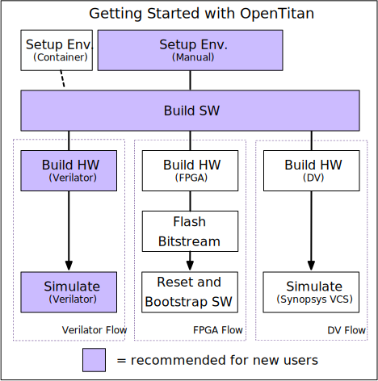

Welcome!
This guide will help you get OpenTitan up and running by instructing you how to:

1. clone the OpenTitan Git repository,
2. setup an adequate build/testing environment on your machine, and
3. build OpenTitan software/hardware for the target of your choosing.

## Workflow Options

An important preliminary note: to run OpenTitan software, you will need to not only build the software but somehow simulate the hardware it runs on.
As shown in the diagram below, we currently support multiple build targets and workflows, including: Verilator, FPGA, and DV.
**However, if you are new to the project, we recommend simulation with Verilator.**
This uses only free tools, and does not require any additional hardware such as an FPGA.



This guide will focus on the Verilator workflow, but indicate when those following FPGA or DV workflows should do something different.
Just keep in mind, if you're a new user and you don't know you're part of the FPGA or DV crowd, "Verilator" means you!

## Step 0: System Requirements

**OpenTitan installation requires Linux.**
If you do not have Linux, please stop right here and use the (experimental) [provided
Docker container]().
You can then **skip to step 4** (building software).

If you do have Linux, you are still welcome to try the Docker container.
However, as the container option is currently experimental, we recommend installing manually if you plan on being a long-term user or contributor for the project.

Our continuous integration setup runs on Ubuntu 18.04 LTS, which gives us the most confidence that this distribution works out of the box.
We do our best to support other distributions, but cannot guarantee they can be used "out of the box" and might require updates of packages.
Please file a [GitHub issue](https://github.com/lowRISC/opentitan/issues) if you need help or would like to propose a change to increase compatibility with other distributions.

## Step 1: Clone the OpenTitan Repository

*Skip this step if using the Docker container.*

Clone the [OpenTitan repository](https://github.com/lowRISC/opentitan):
```console
$ git clone https://github.com/lowRISC/opentitan.git
```

If you wish to *contribute* to OpenTitan you will need to make a fork on GitHub and may wish to clone the fork instead.
We have some [notes for using GitHub]() which explain how to work with your own fork (and perform many other GitHub tasks) in the OpenTitan context.

***Note: throughout the documentation `$REPO_TOP` refers to the path where the OpenTitan repository is checked out.***
Unless you've specified some other name in the clone, `$REPO_TOP` will be a directory called `opentitan`.
You can create the environment variable by calling the following command from the same directory where you ran `git clone`:
```console
$ export REPO_TOP=opentitan
```

## Step 2: Install Package Manager Dependencies

*Skip this step if using the Docker container.*

A number of software packages from the distribution's package manager are required.
On Ubuntu 18.04, the required packages can be installed with the following command.



Some tools in this repository are written in Python 3 and require Python dependencies to be installed through `pip`.
We recommend installing the latest version of `pip` and `setuptools` (especially if on older systems such as Ubuntu 18.04) using:

```console
python3 -m pip install --user -U pip setuptools
```

The `pip` installation instructions use the `--user` flag to install without root permissions.
Binaries are installed to `~/.local/bin`; check that this directory is listed in your `PATH` by running `which pip3`, which should show `~/.local/bin/pip3`.
If it doesn't, add `~/.local/bin` to your `PATH`, e.g. by modifying your `~/.bashrc` file.

Now install additional Python dependencies:

```console
$ cd $REPO_TOP
$ pip3 install --user -r python-requirements.txt
```

## Step 3: Install the LowRISC RISC-V Toolchain

*Skip this step if using the Docker container.*

To build device software you need a baremetal RISC-V toolchain.
Even if you already have one installed, we recommend using the prebuilt toolchain provided by lowRISC, because it is built with the specific patches and options that OpenTitan needs.
You can install the toolchain using the `util/get-toolchain.py` script, which will download and install the toolchain to the default path, `/tools/riscv`.

```console
$ cd $REPO_TOP
$ ./util/get-toolchain.py
```

If you got no errors from that script, **you're done and can go to step 4**. If there were problems, read on.

#### Troubleshooting

If you need to install to a different path than `/tools/riscv` (for instance, if you do not have permission to write to the `/tools` directory), then you can specify a different location using the `--install-dir` option.
Run `./util/get-toolchain.py --help` for details.
You can alternatively download the file starting with `lowrisc-toolchain-rv32imcb-` from [GitHub releases](https://github.com/lowRISC/lowrisc-toolchains/releases/latest) and unpack it to the desired installation directory.

Assuming one of the above worked and you have installed to a non-standard location, you will need to set the `TOOLCHAIN_PATH` environment variable to match whatever path you used.
For example, if I wanted to install to `~/ot_tools/riscv`, then I would use:
```console
$ ./util/get-toolchain.py --install_dir=~/ot_tools/riscv
$ export TOOLCHAIN_PATH=~/ot_tools/riscv
```
Add the `export` command to your `~/.bashrc` or equivalent to ensure that the `TOOLCHAIN_PATH` variable is set for future sessions.
Check that it worked by opening a new terminal and running:
```console
$ ls $TOOLCHAIN_PATH/bin/riscv32-unknown-elf-as
```
If that prints out the file path without errors, then you've successfully installed the toolchain.
Otherwise, try to find the `riscv32-unknown-elf-as` file in your file system and make sure `$TOOLCHAIN_PATH` is correctly set.

## Step 4: Build OpenTitan Software

Follow the [dedicated guide]() to build OpenTitan's software, and then return to this page.

## Step 5: Set up your Simulation Tool or FPGA

*Note: If you are using the pre-built Docker container, Verilator is already installed.
Unless you know you need the FPGA or DV guides, you can skip this step.*

In order to run the software we built in the last step, we need to have some way to mimic an OpenTitan chip.
There are a few different options depending on your equipment and use-case.
Follow the guide that applies to you:
* **Option 1 (default, recommended for new users):** [Verilator guide](), or
* Option 2 (FPGA setup): [FPGA guide](), or
* Option 3 (design verification setup): [DV guide]()
* Option 4 (formal verification setup): [Formal Verification guide]()

(TODO: FPGA guide says to install vivado, need to fix the link and say you need a license and should use bitstream from CI)

## Step 6: Optional Additional Steps

If you have made it this far, congratulations!
Hopefully you got a "Hello World!" demo running on OpenTitan using either the Verilator or FPGA targets.

Depending on the specific way you want to use or contribute to OpenTitan, there may be a few extra steps you want to do.
In particular:
* *If you want to contribute SystemVerilog code upstream to OpenTitan*, follow step 6a to install Verible.
* *If you want to interact with the chip over JTAG or use GDB for OpenTitan software*, follow step 6b to install OpenOCD.

It also may make sense to stick with the basic setup and come back to these steps if you find you need them later on.

### Step 6a: Install Verible (optional)

Verible is an open source SystemVerilog style linter and formatting tool.
The style linter is relatively mature and we use it as part of our [RTL design flow]().
The formatter is still under active development, and hence its usage is more experimental in OpenTitan.

You can download and build Verible from scratch as explained on the [Verible GitHub page](https://github.com/google/verible/).
But since this requires the Bazel build system the recommendation is to download and install a pre-built binary as described below.

Go to [this page](https://github.com/google/verible/releases) and download the correct binary archive for your machine.
The example below is for Ubuntu 18.04:

```console
$ export VERIBLE_VERSION=

$ wget https://github.com/google/verible/releases/download/${VERIBLE_VERSION}/verible-${VERIBLE_VERSION}-Ubuntu-18.04-bionic-x86_64.tar.gz
$ tar -xf verible-${VERIBLE_VERSION}-Ubuntu-18.04-bionic-x86_64.tar.gz

$ sudo mkdir -p /tools/verible/${VERIBLE_VERSION}/
$ sudo mv verible-${VERIBLE_VERSION}/* /tools/verible/${VERIBLE_VERSION}/
```

After installation you need to add `/tools/verible/$VERIBLE_VERSION/bin` to your `PATH` environment variable.

Note that we currently use version , but it is expected that this version is going to be updated frequently, since the tool is under active develpment.

### Step 6b: Install OpenOCD (optional)

See the [OpenOCD install guide]().

## Step 7: Additional Resources

As you may have guessed, there are several other pieces of hardware and software, besides a "Hello World!" demo, that are being actively developed for the OpenTitan project.
If you are interested in these, check out the additional resources below.

### General
* [Documentation Index]()
* [Directory Structure]()
* [GitHub Notes]()
* [Building Documentation]()
* [Design Methodology within OpenTitan]()

### Hardware
* [Getting Started Designing Hardware]()
* [OpenTitan Hardware]()

### Software
* [OpenTitan Software]()
* [Writing and Building Software for OTBN]()
* [Rust for Embedded C Programmers]()

