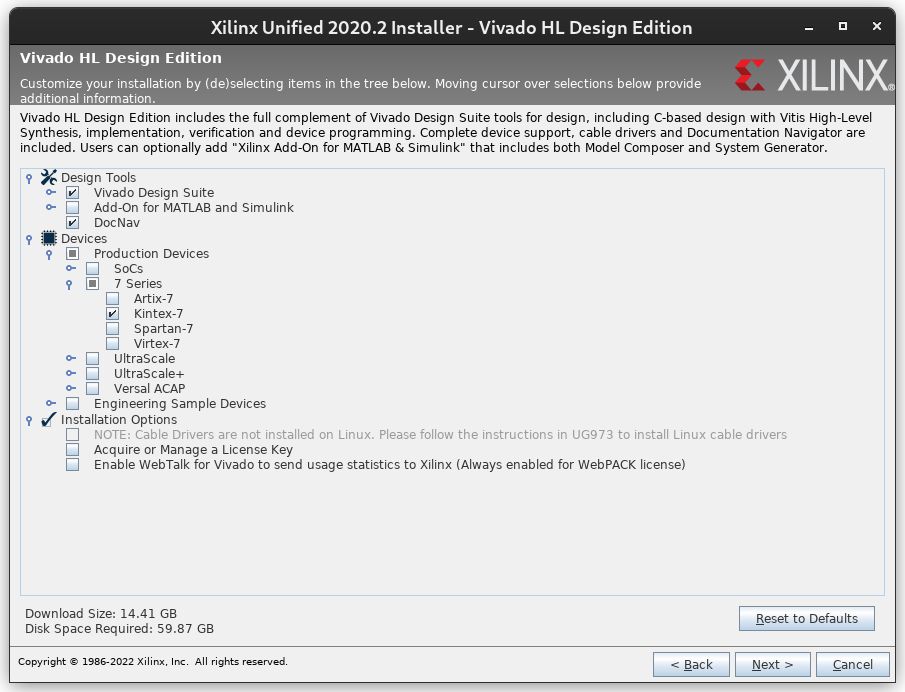

# Install Vivado

Generating a bitstream for Xilinx devices requires a
[Vivado](https://www.xilinx.com/products/design-tools/vivado.html) installation.
Please note that the "WebPACK" edition __does not__ support the Xilinx Kintex 7
XC7K410T used on the CW310 board.

For software development, Vivado is still necessary for most workflows.
However, the (free) Lab Edition is sufficient, and it has a significantly smaller installation footprint.
For example, Vivado's `updatemem` tool is used to splice ROM images into the bitstream, and this is included in the Lab Edition.

## Install Xilinx Vivado

_**Vivado Version:** The recommendation is to use Vivado {{#tool-version vivado }}._

Following the arrival of Vivado ML Edition, you will need to follow the links for that, eg. Products -> Hardware Development -> Vivado ML.
Then click on 'Vivado Archive' in the Version list and locate version {{#tool-version vivado }} of Vivado Design Suite.

See [Download and
Installation](https://docs.xilinx.com/r/{{#tool-version vivado }}-English/ug973-vivado-release-notes-install-license/Download-and-Installation)
for installation instructions.

When asked what edition to install, choose "Vivado HL Design Edition".
_Note: If you are only developing software, you may select the "Lab Edition" instead._
On the feature selection screen, select at least the following features:

After installing Vivado, you will need to add Vivado's paths to your shell
environment. See [Launching the Vivado IDE from the Command Line on Windows or
Linux](https://docs.xilinx.com/r/{{#tool-version vivado }}-English/ug892-vivado-design-flows-overview/Launching-the-Vivado-IDE-from-the-Command-Line-on-Windows-or-Linux)
for instructions.
