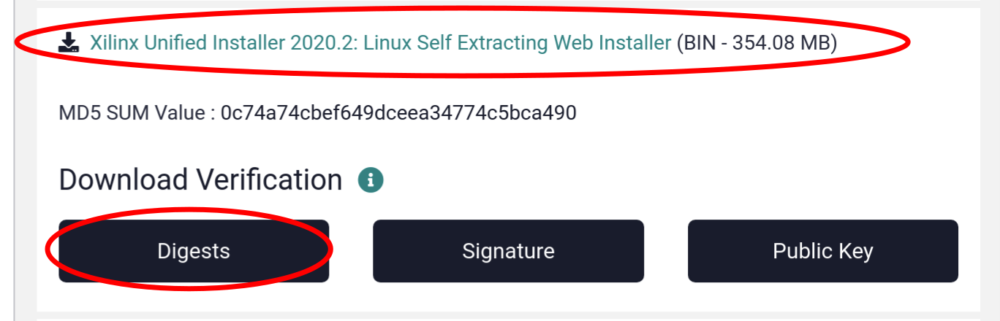
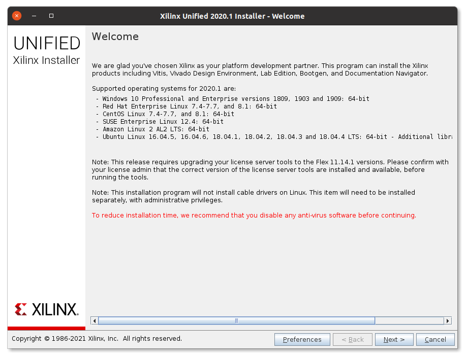
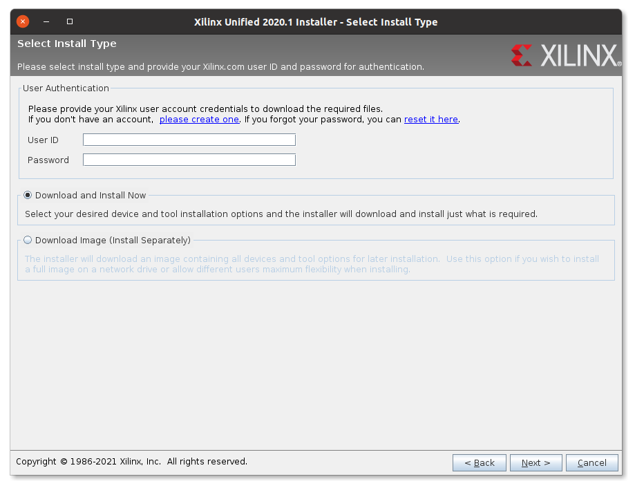
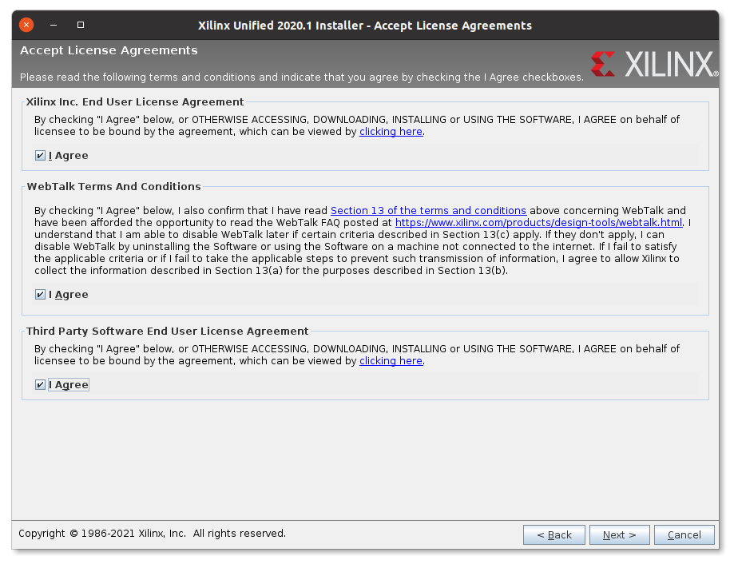
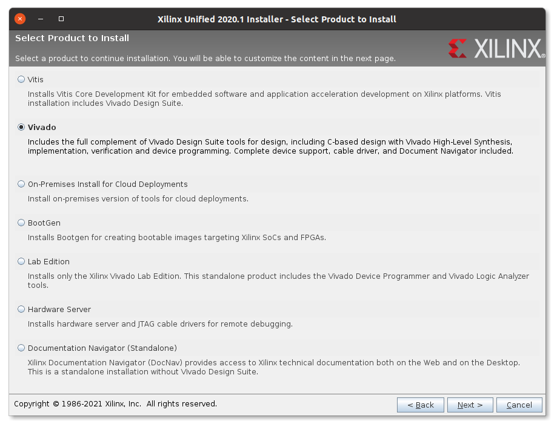
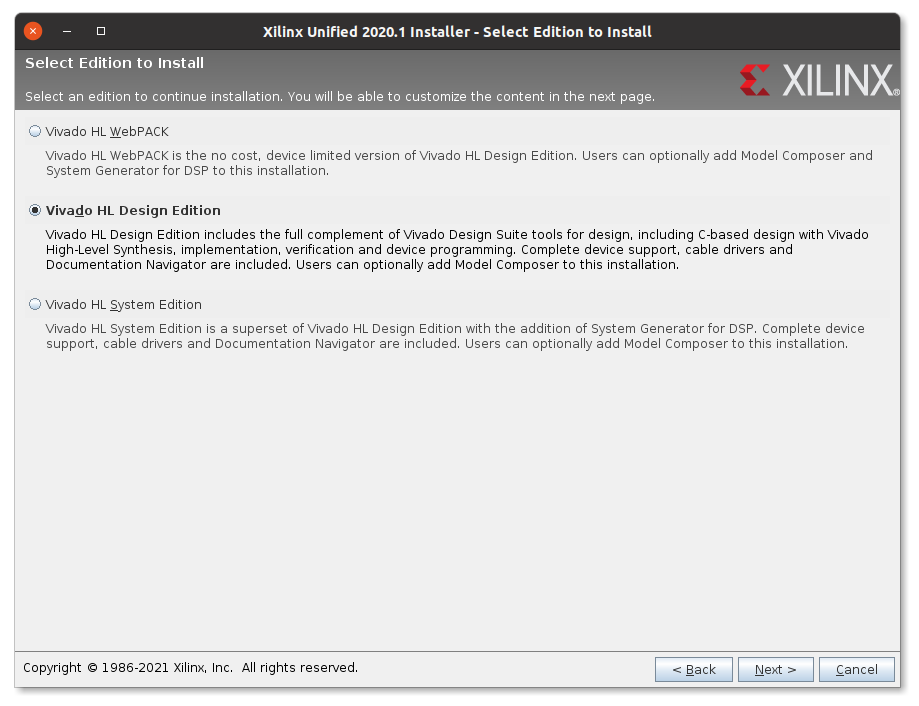
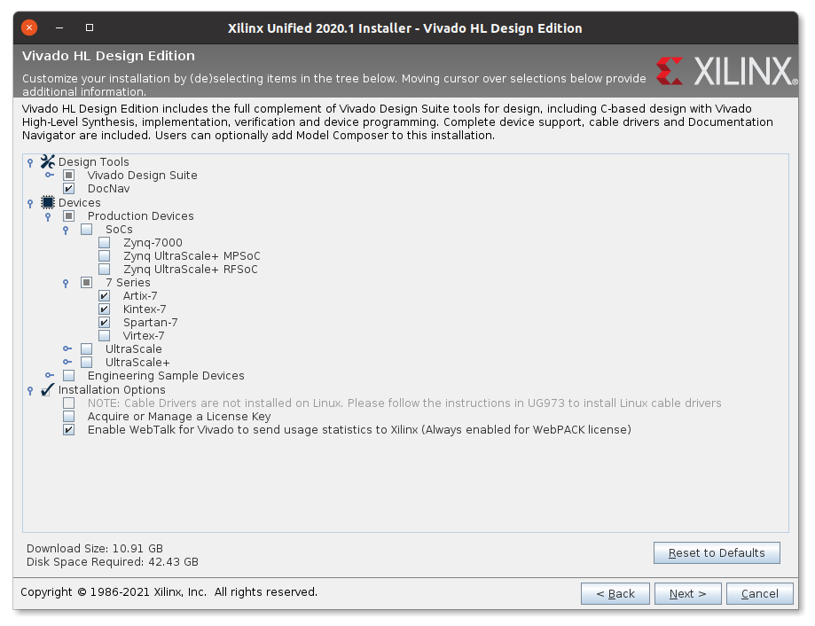
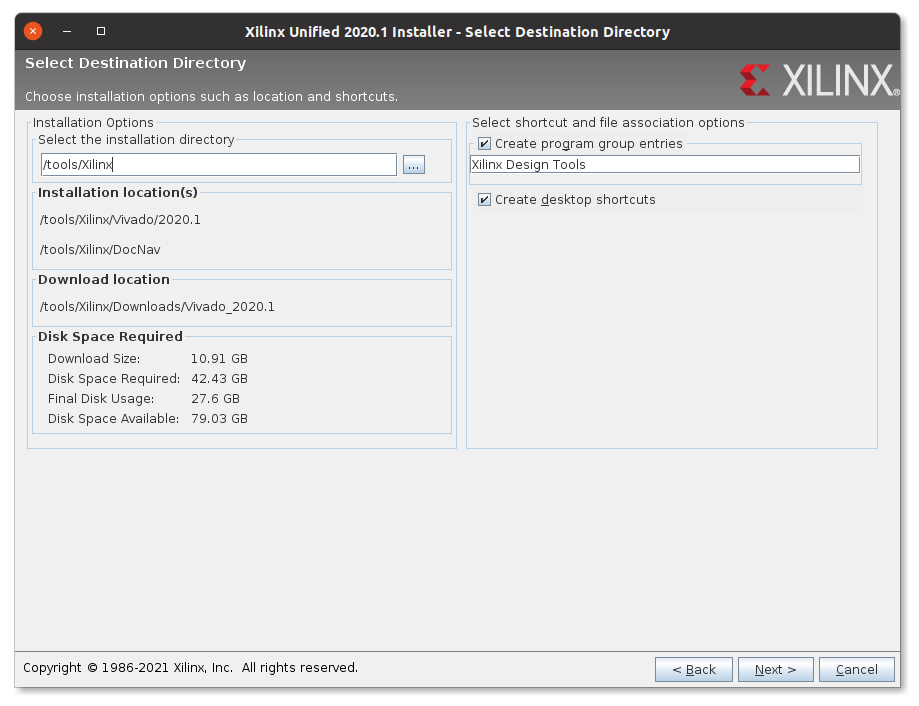
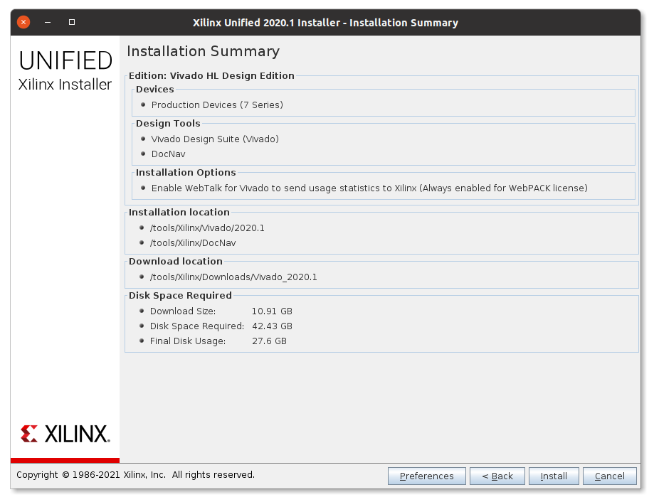
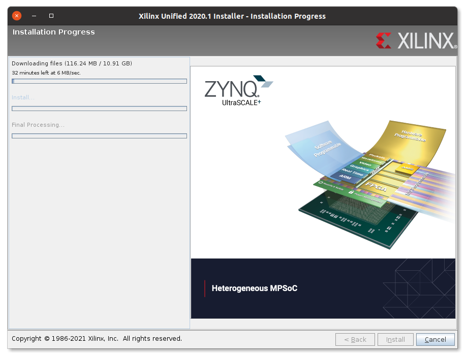

## About Xilinx Vivado

Generating a bitstream for Xilinx devices requires a Vivado installation.
Vivado is provided by Xilinx, it is freeware for certain (smaller) FPGA devices but requires a commercial license for larger FPGAs.
The free version is called "WebPACK", the commercial version "Design Edition".
The installation instructions below are valid for both installation methods.

## Install Xilinx Vivado

_**Vivado Version:** The recommendation is to use Vivado .
The following instructions have been tested with Vivado 2020.2.
Some screenshots are generated from Vivado 2020.1, but the installation process has not changed.
Vivado 2019.1 and all its minor updates are not compatible with this project._

Vivado can be installed in two ways: either through an "All OS installer Single-File Download", or via the "Linux Self Extracting Web Installer".
Neither option is great:
the "All OS installer" is a huge download of around 20 GB (and the Xilinx download servers seem to be overloaded regularly), but it supports an unattended installation.
The web installer downloads only necessary subsets of the software, which significantly reduces the download size.
But unfortunately it doesn't support the batch mode for unattended installations, requiring users to click through the GUI and select the right options.

To get started faster we use the web installer in the following.

1. Go to the [Xilinx download page](https://www.xilinx.com/support/download.html). Select Vivado  from the left-hand side and download two files:
   1. The file "Xilinx Unified Installer : Linux Self Extracting Web Installer".
   2. The "Digests" file below the download.

   

   You need to register for a free Xilinx account to download the software, and you'll need it again later to install the software.
   Create a new account if you don't have one yet.

2. Before you proceed ensure that the download didn't get corrupted by verifying the checksum.

    ```console
    $ sha512sum --check Xilinx_Unified_2020.2_1118_1232_Lin64.bin.digests
    Xilinx_Unified_2020.2_1118_1232_Lin64.bin: OK
    sha512sum: WARNING: 22 lines are improperly formatted
    ```

    If you see an "OK" after the downloaded file proceed to the next step. Otherwise delete the download and start over. (You can ignore the warning produced by `sha512sum`.)
3. Run the graphical installer. It may warn you that a newer version is available; you can ignore the warning.

    ```console
    $ sh Xilinx_Unified_2020.2_1118_1232_Lin64.bin
    ```

4. Now you need to click through the installer.
   Click "Next" on the first screen.

   

5. Type in your Xilinx User ID (your email address) and the associated password.
   Choose the "Download and Install Now" option.
   Click "Next" to continue.

   

6. Click all "I Agree" checkboxes, and click on "Next" to continue.

   

7. Choose "Vivado", and click on "Next" to continue.

   

8. Choose "Vivado HL Design Edition".
   This is required to enable support for the Xilinx Kintex 7 XC7K410T FPGA device found on the ChipWhisperer CW310 board.
   You'll need a commercial Vivado license for this FPGA device.
   Without a valid license, you are still able to install the Vivado HL Design Edition but you'll only be able to work with devices supported by the free WebPACK license.
   If you don't have a valid license and if you're only planning to work with devices supported by the free WebPACK license, you can also choose "Vivado HL WebPACK" instead.

   

9. Choose the features to install.
   You can restrict the features to the ones shown in the screenshot below.
   Click "Next" to continue.

   

10. Choose an installation location.
    Any location which doesn't have a whitespace in its path and enough free space is fine.
    We use `/tools` in our example, but a path in `/opt` or within the home directory works equally well.
    Click "Next" to continue.

    

11. Double-check the installation summary and click on "Install" to start the installation process.

    

12. Now Vivado is downloaded and installed, a process which can easily take multiple hours.

    

13. As soon as the installation has completed close the installer and you're now ready to use Vivado!

## Device permissions: udev rules

To program an FPGAs the user using Vivado typically needs to have permissions to access USB devices connected to the PC.
Depending on your security policy you can take different steps to enable this access.
One way of doing so is given in the udev rule outlined below.

To do so, create a file named `/etc/udev/rules.d/90-lowrisc.rules` and add the following content to it:

```
# Grant access to board peripherals connected over USB:
# - The USB devices itself (used e.g. by Vivado to program the FPGA)
# - Virtual UART at /dev/tty/XXX

# NewAE Technology Inc. ChipWhisperer boards e.g. CW310, CW305, CW-Lite, CW-Husky
ACTION=="add|change", SUBSYSTEM=="usb|tty", ATTRS{idVendor}=="2b3e", ATTRS{idProduct}=="ace[0-9]|c[3-6][0-9][0-9]", MODE="0666"

# Future Technology Devices International, Ltd FT2232C/D/H Dual UART/FIFO IC
# used on Digilent boards
ACTION=="add|change", SUBSYSTEM=="usb|tty", ATTRS{idVendor}=="0403", ATTRS{idProduct}=="6010", ATTRS{manufacturer}=="Digilent", MODE="0666"

# Future Technology Devices International, Ltd FT232 Serial (UART) IC
ACTION=="add|change", SUBSYSTEM=="usb|tty", ATTRS{idVendor}=="0403", ATTRS{idProduct}=="6001", MODE="0666"
```

You then need to reload the udev rules:

```console
$ sudo udevadm control --reload
```
