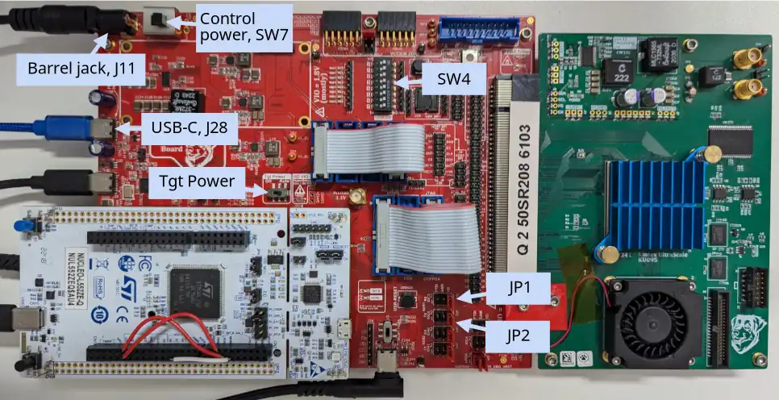
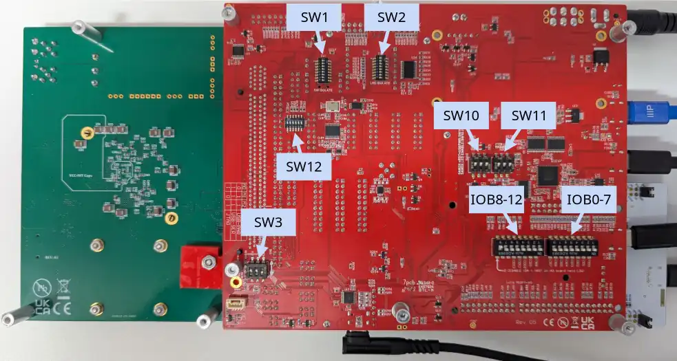
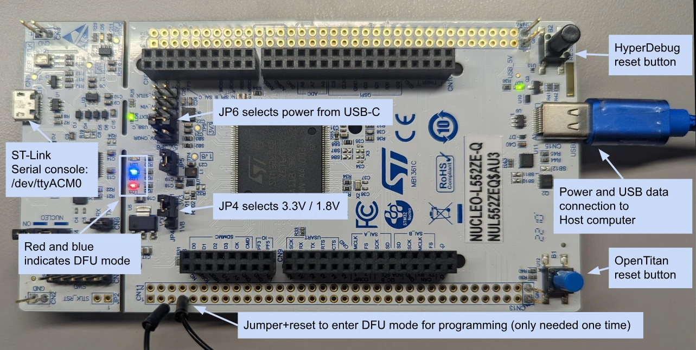

# FPGA Setup

_Before following this guide, make sure you've followed the [dependency installation and software build instructions](README.md)._

Do you want to try out OpenTitan, but don't have a couple thousand or million dollars ready for an ASIC tapeout?
Running OpenTitan on an FPGA board can be the answer!

## Prerequisites

To use the OpenTitan on an FPGA you need two things:

* A supported FPGA board
* A tool from the FPGA vendor

Depending on the design/target combination that you want to synthesize you will need different tools and boards.
Refer to the design documentation for information on what exactly is needed.

* [Obtain an FPGA board](../contributing/fpga/get_a_board.md)

## Obtain an FPGA bitstream

To instantiate OpenTitan on an FPGA you will need a bitstream.
You can either download an existing bitstream for one of the supported ChipWhisperer boards or you can build it yourself.
To ensure the commands shown in this tutorial work for any supported board, we use the `BOARD` and `INTERFACE` environment variables to specify the target board.

```sh
export BOARD=cw340
# Use the "hyper340" interface if you have a HyperDebug, otherwise use "cw340".
export INTERFACE=hyper340
```

In this case, the interface of "hyper340" refers to the combination of the HyperDebug board with the Chip Whisperer CW340 board.
The Hyperdebug board is required to be able to program the FPGA with various memories (e.g. ROM/OTP) for executing tests, as well as for more advanced test cases that drive various communication peripherals on OpenTitan.

### Download a Pre-built Bitstream

If you are using the ChipWhisperer CW340 board with the Xilinx XCKU095-1FFVA1156C Kintex UltraScale, you can download the latest passing [pre-built bitstream](https://storage.googleapis.com/opentitan-bitstreams/master/bitstream-latest.tar.gz) from our public bitstream cache GCS bucket.

For example, to download and unpack the bitstream, run the following:

```sh
mkdir -p /tmp/bitstream-latest
pushd /tmp/bitstream-latest
curl https://storage.googleapis.com/opentitan-bitstreams/master/bitstream-latest.tar.gz -o bitstream-latest.tar.gz
tar -xvf bitstream-latest.tar.gz
popd
```

By default, the bitstream is built with a version of the boot ROM used for testing (called the _test ROM_; pulled from `sw/device/lib/testing/test_rom`).
There is also a version of the boot ROM used in production (called the _ROM_; pulled from `sw/device/silicon_creator/rom`).
When the bitstream cache is used in bazel flows, the ROMs from the cache are not used.
Instead, the bazel-built ROMs are programmed to the relevant FPGA BRAMs via the bkdr_loader, using the mechanism described [here](#programming-the-fpga-with-rom--otp-images).
The metadata for the latest bitstream (the approximate creation time and the associated commit hash) is also available as a text file and can be [downloaded separately](https://storage.googleapis.com/opentitan-bitstreams/master/latest.txt).

### Using the `@bitstreams` repository

OpenTitan's build system automatically fetches pre-built bitstreams via the `@bitstreams` repository.

To keep the `@bitstreams` repository in sync with the current Git revision, install the Git post-checkout hook:

```sh
cp util/git/hooks/post-checkout .git/hooks/
```

### Build an FPGA bitstream

#### Using a Cached Bitstream

The default bitstreams cached in our public GCS bucket are built with a test version of the boot ROM and a minimally configured OTP image.
For FPGA workflows, there is a "backdoor loader" block that we use to load data into FPGA memories for test purposes.
Because of this, it is sufficient to use the base CW340 bitstream which is available in the GCS bucket cache.

#### From Scratch

If you would like to synthesize a bitstream from scratch (e.g., to test a new RTL change), you can synthesize one locally.
Synthesizing a design for an FPGA board is simple with Bazel.
While Bazel is the entry point for kicking off the FPGA synthesis, under the hood, it invokes FuseSoC, the hardware package manager / build system supported by OpenTitan.
During the build process, the boot ROM is baked into the bitstream.
As mentioned above, we maintain two boot ROM programs, one for faster testing (_test ROM_), and one for production (_ROM_).

To build an FPGA bitstream with the _test ROM_ for the chosen board, use:
```sh
cd $REPO_TOP
bazel build //hw/bitstream/vivado:fpga_${BOARD}_test_rom
```

To build an FPGA bitstream with the _ROM_ for the chosen board, use:
```sh
cd $REPO_TOP
bazel build //hw/bitstream/vivado:fpga_${BOARD}_rom_with_fake_keys
```

>**Note**: Building these bitstreams will require Vivado to be installed on your system, with access to the proper (paid) licenses, described [here](./install_vivado/README.md).

#### Dealing with FPGA Congestion Issues

The default Vivado tool placement may sometimes result in congested FPGA floorplans.
When this happens, the implementation time and results become unpredictable.
It may become necessary for the user to manually adjust certain placement.
See [this comment](https://github.com/lowRISC/opentitan/pull/8138#issuecomment-916696830) for a thorough analysis of one such situation and what changes were made to improve congestion.

#### Opening an existing project with the Vivado GUI

Sometimes, it may be desirable to open the generated project in the Vivado GUI for inspection.
To this end, run:

```sh
. /tools/Xilinx/Vivado/{{#tool-version vivado }}/settings64.sh
cd $REPO_TOP
make -C $(dirname $(find bazel-out/* -wholename '*synth-vivado/Makefile')) build-gui
```

Now the Vivado GUI opens and loads the project.

#### Develop with the Vivado GUI

TODO(lowRISC/opentitan[#13213](https://github.com/lowRISC/opentitan/issues/13213)): the below does not work with the Bazel FPGA bitstream build flow.

Sometimes it is helpful to use the Vivado GUI to debug a design.
FuseSoC (the tool Bazel invokes) makes that easy, with one small caveat: by default FuseSoC copies all source files into a staging directory before the synthesis process starts.
This behavior is helpful to create reproducible builds and avoids Vivado modifying checked-in source files.
But during debugging this behavior is not helpful.
The `--no-export` option of FuseSoC disables copying the source files into the staging area, and `--setup` instructs fusesoc to not start the synthesis process.

##### Only create Vivado project directory by using FuseSoC directly (skipping Bazel invocation).

```sh
cd $REPO_TOP
fusesoc --cores-root hw run --target=synth --no-export --setup lowrisc:systems:chip_earlgrey_${BOARD}
```

You can then navigate to the created project directory, and open Vivado
```sh
. /tools/Xilinx/Vivado/{{#tool-version vivado }}/settings64.sh
cd $REPO_TOP/build/lowrisc_systems_chip_earlgrey_${BOARD}_0.1/synth-vivado/vivado
```

Finally, using the Tcl console, you can kick off the project setup with
```sh
source lowrisc_systems_chip_earlgrey_${BOARD}_0.1.tcl
```

## Connecting ChipWhisperer FPGA (and HyperDebug) Boards to your PC

### Device Permissions: udev rules

To program any FPGAs or HyperDebug boards users need permissions to access USB devices connected to the PC.
Depending on your security policy you can take different steps to enable this access.
One way of doing so is given in the udev rule outlined below.

To do so, create a file named `/etc/udev/rules.d/90-lowrisc.rules` and add the following content to it:

```
# Grant access to board peripherals connected over USB:
# - The USB devices itself (used e.g. by Vivado to program the FPGA)
# - Virtual UART at /dev/tty/XXX

# NewAE Technology Inc. ChipWhisperer boards e.g. CW340, CW305, CW-Lite, CW-Husky
ACTION=="add|change", SUBSYSTEM=="usb|tty", ATTRS{idVendor}=="2b3e", ATTRS{idProduct}=="ace[0-9]|c[3-6][0-9][0-9]", MODE="0666"

# Future Technology Devices International, Ltd FT2232C/D/H Dual UART/FIFO IC
# used on Digilent boards
ACTION=="add|change", SUBSYSTEM=="usb|tty", ATTRS{idVendor}=="0403", ATTRS{idProduct}=="6010", ATTRS{manufacturer}=="Digilent", MODE="0666"

# Future Technology Devices International, Ltd FT232 Serial (UART) IC
ACTION=="add|change", SUBSYSTEM=="usb|tty", ATTRS{idVendor}=="0403", ATTRS{idProduct}=="6001", MODE="0666"

# HyperDebug
ACTION=="add|change", SUBSYSTEM=="usb|tty", ATTRS{idVendor}=="0483", ATTRS{idProduct}=="df11", MODE="0666", SYMLINK+="hyperdebug_dfu"
ACTION=="add|change", SUBSYSTEM=="usb|tty", ATTRS{idVendor}=="18d1", ATTRS{idProduct}=="520e", MODE="0666", SYMLINK+="hyperdebug"
```

You then need to reload the udev rules:

```console
sudo udevadm control --reload-rules && sudo service udev restart && sudo udevadm trigger
```

### CW340 Board

The CW340 board should be powered via the included DC power adapter.
To this end:
1. Turn off the board by setting the *Control Power* switch (top left corner, *SW7*) to the right (towards the OpenTitan logo).
2. Ensure the *Tgt Power* switch (center of the board) is set to the right, towards the *Auto* option.
3. Plug the DC power adapter into the barrel jack (*J11*) in the top left corner of the board.
4. Use a USB-C cable to connect your PC (*host*) with the *USB-C* connector (*J28*) in the lower left corner on the board.
5. Set the jumpers *JP1* and *JP2* to select the UART0 routing:
   1. If set to FTDI the UART0 will (likely) be routed to `/dev/ttyUSB2`.
   2. If set to SAM the UART0 will be routed to `/dev/ttyACM0`.
6. Make sure the DIP switch SW4 on the top side of the board has all switches (1-8) in the ON position.
7. Make sure the DIP switches on the bottom side of the board are set up as follows:
   - SW1, SW2: all switches (1 to 8) in the OFF position
   - SW3: switch 1 in the ON position, switch 2, 3 in the OFF position.
   - SW10, SW11: all switches (1 to 3) in the ON position
   - SW12: all switches (1 to 6) in the ON position
   - DIP switch connected to IOB0 - IOB7: all switches (1 to 8) in the ON position
   - DIP switch connected to IOB8 - IOB12: switch 1 to 7 in the ON position, switch 8 in the OFF position.
8. Depending on your use case, do one of the following:
   1. If you are connecting a HyperDebug board to your CW340 base board, follow instructions in the [HyperDebug Board](#hyperdebug-board) section.
   2. Otherwise, move the *Control Power* switch (top left corner, *SW7*) to the left (towards the barrel jack) to power on the board.

After completing the rest of the FPGA setup process, you can confirm that these DIP switches are configured correctly by running the following test targets:

```sh
bazel test --test_output=streamed \
  //sw/device/tests:gpio_intr_test_fpga_cw340_sival_rom_ext \
  //sw/device/tests:sysrst_ctrl_in_irq_test_fpga_cw340_sival_rom_ext \
  //sw/device/tests:sysrst_ctrl_inputs_test_fpga_cw340_sival_rom_ext \
  //sw/device/tests:sysrst_ctrl_outputs_test_fpga_cw340_sival_rom_ext \
  //sw/device/tests:sysrst_ctrl_ulp_z3_wakeup_test_fpga_cw340_sival_rom_ext
```

Find below the top view and a bottom view photos of a fully configured CW340 board.

[](cw340-top.webp)

[](cw340-bottom.webp)


#### HyperDebug Board

To be able to run OpenTitan tests, you need to have a HyperDebug board that is connected to your CW340 board.
Below we describe how to:
1. flash firmware onto your HyperDebug board, and
2. connect it to you CW340 board



##### Flashing HyperDebug Firmware for the First Time

*BEFORE* connecting your HyperDebug board to the CW340 base board ST Zio connectors, do the following to install the firmware on it for the first time:
1. Move jumper JP6 to select `5V_USB_C`.
2. Move jumper JP4 to select `3.3V` mode (_this will be changed before connecting to CW340_).
3. Use a USB-C cable to connect your PC with the `USB1` power and data connector near the blue and black push buttons.
4. Using a jumper wire, connect pins 5 and 7 on bank CN11, and hit the black `RESET` push button to put the device in DFU mode.
5. Remove the jumper wire, the red and blue LEDs should both remain on, indicating the board is in DFU mode.
6. Flash the firmware by running `cd $REPO_TOP && ./bazelisk.sh run //sw/host/opentitantool -- --interface=hyperdebug_dfu transport update-firmware`.

Note: after flashing the HyperDebug firmware for the first time, it can be updated (*without* needing to put the board into DFU mode) by running the same command used above to flash the firmware for the first time.

##### Before Connecting HyperDebug to the CW340 Base Board

On your HyperDebug board:
1. Disconnect the PC USB-C cable from your HyperDebug board.
2. Move jumper JP4 to select `1.8V` mode.

On your CW340 base board (the red board):
1. Move the following single pin-to-pin jumpers in the bottom right corner of the board to `HD` (for "HyperDebug").
    1. UART0 RX/TX (OpenTitan pins IOC3/4): JP1 & JP2
    2. UART1 RX/TX (OpenTitan pins IOA0/1): JP3 & JP4
    3. JTAG TAP select straps (OpenTitan pins IOC5/8): JP11 & JP12
2. Connect the following blue socket-to-socket jumpers in the middle of the board to `HD` (for "HyperDebug").
    1. SPI Device: connect J23 to J25
    2. JTAG: connect J12 to J13

##### Connecting HyperDebug to the CW340 Base Board

1. Ensure the CW340 FPGA base board is:
    1. Powered off (the *Control Power* switch in the top left corner, *SW7*, is set to the right towards the OpenTitan logo).
    2. Connected via USB-C to your PC (described above).
2. Ensure the HyperDebug jumper JP4 is set to select `1.8V`.
3. Connect the HyperDebug board to the ST Zio connectors in the bottom left of the board.
4. Connect the PC USB-C cable back to your HyperDebug board.
5. Power on the CW340 by setting the *Control Power* switch in the top left corner, *SW7*, to the left towards the barrel jack.

##### Running TPM tests with HyperDebug

To be able to run a specific subset of tests related to the SPI TPM, you will need some additional wires on your HyperDebug board:

1. Between CN7.15 and CN10.24 (SPI SCK).
2. Between CN7.14 and CN10.23 (SPI D0).
3. Between CN7.12 and CN10.10 (SPI D1).

When you've completed the rest of the setup, you can test that this is configured correctly by running a TPM test:

```sh
bazel test --test_output=streamed //sw/device/tests:spi_device_tpm_tx_rx_test_fpga_cw340_sival
```

### Detecting the PC Connections to the Board(s)

To detect if your PC has successfully connected to your FPGA and/or HyperDebug boards, you can use the following command to monitor output from dmesg:
```sh
sudo dmesg -Hw
```
This should show which serial ports have been assigned, or if the boards are having trouble connecting to USB.
If `dmesg` reports a problem you can:
1. trigger a reset of your CW340 with *Control Power* on *SW7*, and/or
2. trigger a reset of your HyperDebug with the black *RESET* button on *B2*.
When properly connected, `dmesg` should identify each board, not show any errors.
The serial ports identified should be named `/dev/ttyACM*` + `/dev/ttyUSB*` + for CW340 depending on the jumpers *JP1* and *JP2* described above.
 >e.g. `/dev/ttyACM1`.

To ensure that you have sufficient access permissions, set up the udev rules as explained above.

You will then need to run this command to configure the board. You only need to run it once.
```sh
bazel run //sw/host/opentitantool -- --interface=${INTERFACE} fpga set-pll
```

Check that it's working by [running the demo](#bootstrapping-the-demo-software) or a test, such as the `uart_smoketest` below.
```sh
cd $REPO_TOP
bazel test --test_output=streamed //sw/device/tests:uart_smoketest_fpga_${BOARD}_rom_with_fake_keys
```

### Troubleshooting

If the tests/demo aren't working on the FPGA (especially if you get an error like `SFDP header contains incorrect signature`) then try adding `--rcfile=` to the `set-pll` command:
```sh
bazel run //sw/host/opentitantool -- --rcfile= --interface=${INTERFACE} fpga set-pll
```
It's also worth pressing the `USB_RST` and `USR_RESET` buttons on the FPGA if you face continued errors.

## Flash the bitstream onto the FPGA and bootstrap software into flash

There are two ways to load a bitstream on to the FPGA and bootstrap software into the OpenTitan embedded flash:
1. **automatically**, on single invocations of `bazel test ...`.
2. **manually**, using multiple invocations of `opentitantool`, and
Which one you use, will depend on how the build target is defined for the software you would like to test on the FPGA.
Specifically, for software build targets defined in Bazel BUILD files using the `opentitan_test` Bazel macro, you will use the latter (**automatic**) approach.
Alternatively, for software build targets defined in Bazel BUILD files using the `opentitan_binary` Bazel macro, you will use the former (**manual**) approach.

See below for details on both approaches.

### Automatically loading FPGA bitstreams and bootstrapping software with Bazel

A majority of on-device software tests are defined using the custom `opentitan_test` Bazel macro, which under the hood, instantiates several Bazel [`native.sh_test` rules](https://docs.bazel.build/versions/main/be/shell.html#sh_test).
In doing so, this macro provides a convenient interface for developers to run software tests on OpenTitan FPGA instances with a single invocation of `bazel test ...`.
For example, to run the UART smoke test (which is an `opentitan_test` defined in `sw/device/tests/BUILD`) on FPGA hardware, and see the output in real time, use:
```sh
cd $REPO_TOP
bazel test --test_tag_filters=${BOARD} --test_output=streamed //sw/device/tests:uart_smoketest
```
or
```sh
cd $REPO_TOP
bazel test --test_output=streamed //sw/device/tests:uart_smoketest_fpga_${BOARD}_rom_with_fake_keys
```

Under the hood, Bazel conveniently dispatches `opentitantool` to:
* ensure the correct version of the FPGA bitstream has been loaded onto the FPGA, and
* program the requested ROM and OTP images into relevant FPGA memories, and
* bootstrap the desired software test image into the OpenTitan embedded flash.

To get a better understanding of the `opentitantool` functions Bazel invokes automatically, follow the instructions for manually loading FPGA bitstreams below.

#### Configuring Bazel to load the Vivado-built bitstream

By default, the above invocations of `bazel test ...` use the pre-built (Internet downloaded) FPGA bitstream.
To instruct bazel to load the bitstream built earlier, or to have bazel build an FPGA bitstream on the fly, and load that bitstream onto the FPGA, add the `--define bitstream=vivado` flag to either of the above Bazel commands, for example, run:
```sh
bazel test --define bitstream=vivado --test_output=streamed //sw/device/tests:uart_smoketest_fpga_${BOARD}_rom_with_fake_keys
```

#### Configuring Bazel to skip loading a bitstream

Alternatively, if you would like to instruct Bazel to skip loading any bitstream at all, and simply use the bitstream that is already loaded, add the `--define bitstream=skip` flag, for example, run:
```sh
bazel test --define bitstream=skip --test_output=streamed //sw/device/tests:uart_smoketest_fpga_${BOARD}_rom_with_fake_keys
```

### Manually loading FPGA bitstreams and bootstrapping OpenTitan software with `opentitantool`

Some on-device software targets are defined using the custom `opentitan_binary` Bazel macro.
Unlike the `opentitan_test` macro, the `opentitan_binary` macro does **not** instantiate any Bazel test rules under the hood.
Therefore, to run such software on OpenTitan FPGA hardware, both a bitstream and the software target must be loaded manually onto the FPGA.
Below, we describe how to accomplish this, and in doing so, we shed some light on the tasks that Bazel automates through the use of `opentitan_test` Bazel rules.

#### Manually loading a bitstream onto the FPGA with `opentitantool`

Note: The following examples assume that you have a `~/.config/opentitantool/config` with the proper `--interface` option.
For the CW340 running with HyperDebug, its contents would look like:
```sh
--interface=hyper340
```

To flash the bitstream onto the FPGA using `opentitantool`, use the following command:

##### If you downloaded the bitstream from the Internet:
```sh
cd $REPO_TOP
bazel run //sw/host/opentitantool -- fpga load-bitstream /tmp/bitstream-latest/lowrisc_systems_chip_earlgrey_${BOARD}_0.1.bit.orig
```
##### if you built the bitstream yourself:
```sh
cd $REPO_TOP
bazel run //sw/host/opentitantool -- fpga load-bitstream $(ci/scripts/target-location.sh //hw/bitstream/vivado:fpga_${BOARD}_test_rom)
```

Depending on the FPGA device, the flashing itself may take several seconds.
After completion, a message like this should be visible from the UART:

```console
I00000 test_rom.c:81] Version: earlgrey_silver_release_v5-5886-gde4cb1bb9, Build Date: 2022-06-13 09:17:56
I00001 test_rom.c:87] TestROM:6b2ca9a1
I00002 test_rom.c:118] Test ROM complete, jumping to flash!
```

#### Programming the FPGA with ROM & OTP Images

##### Backdoor Loading

When running a test, you may want to customize the ROM and OTP that are used to suit your execution environment.
For FPGA, this is done using the unique "backdoor loader" IP", which you can communicate with using `opentitantool`.
The backdoor loader can only be used by resetting OpenTitan with the both TAP straps enabled.
After you have finished using the loader, it takes the chip out of reset, and the loader can no longer be used until the next reset.
Because of this, `opentitantool` offers an `fpga backdoor enter` command to "enter" into the backdoor loading mode, and an `fpga backdoor exit` command to finish.

##### JTAG

We communicate with the loader itself via JTAG.
Make sure to first follow the setup shown in the [Debugging with JTAG](#debugging-with-jtag) section.
You can find more information about configuring your JTAG and OpenOCD configuration specifically in [Connecting OpenOCD](#connecting-openocd).
Since we need to carry some patches, you should use the OpenOCD built with Bazel:

```sh
bazel build //third_party/openocd:openocd_bin
```

##### Using the Loader

For example, to build & program the mask ROM on the CW340, you can use the following commands:

```sh
# Make sure OpenOCD is built
bazel build //third_party/openocd:openocd_bin
# Build the mask ROM for the CW340
bazel build //sw/device/silicon_creator/rom:mask_rom_fpga_cw340
# Enter the backdoor loader (which involves resetting OpenTitan)
bazel run //sw/host/opentitantool -- --interface=${INTERFACE} fpga backdoor enter
# Load the ROM image
bazel run //sw/host/opentitantool -- --interface=${INTERFACE} fpga backdoor \
    --openocd=$(ci/scripts/target-location.sh //third_party/openocd:openocd_bin) \
    write ROM vmem $(ci/scripts/target-location.sh //sw/device/silicon_creator/rom:mask_rom_fpga_cw340)
```

If you need to load an OTP image, at this stage you can follow a similar flow:

```sh
# Build an OTP image that you want to use
bazel build //hw/top_earlgrey/data/otp/emulation:otp_img_prod_manuf_personalized
# Load the OTP image (assuming you already did `fpga backdoor enter` and have not yet done `fpga backdoor exit`)
bazel run //sw/host/opentitantool -- --interface=${INTERFACE} fpga backdoor \
    --openocd=$(ci/scripts/target-location.sh //third_party/openocd:openocd_bin) \
    write OTP vmem $(ci/scripts/target-location.sh //hw/top_earlgrey/data/otp/emulation:otp_img_prod_manuf_personalized)
```

Finally, when you're done using the backdoor loader to interact with FPGA memories, you can exit with the following command:

```sh
bazel run //sw/host/opentitantool -- --interface=${INTERFACE} fpga backdoor \
    --openocd=$(ci/scripts/target-location.sh //third_party/openocd:openocd_bin) \
    exit
```

From this point onwards, you cannot use `opentitantool fpga backdoor ...` without first calling `opentitantool fpga backdoor enter`, which will reset the system.

##### USR_ACCESS and Loading Bitstreams

Note that when using `opentitantool fpga load-bitstream`, it uses the `USR_ACCESS` value in the bitstream to determine whether it needs to load a bitstream.
This is unique per bitstream, however it only tells you the identity of the bistream, and not any memories programmed after the bitstream was loaded.

To be sure that a bitstream is definitely running on the board, without any additional programmed memories, you can either power cycle the board, or use the `--force` flag when loading the bitstream:

```sh
bazel run //sw/host/opentitantool -- fpga load-bitstream --force $(ci/scripts/target-location.sh //hw/bitstream/vivado:fpga_${BOARD}_test_rom)
```

#### Bootstrapping the demo software

The `hello_world` demo software shows off some capabilities of the OpenTitan hardware.
To load `hello_world` into the FPGA on the ChipWhisperer CW340 board follow the steps shown below.

1. Generate the bitstream and flash it to the FPGA as described above.
2. Open a serial console (use the device file determined before) and connect.
   Settings: 115200 baud, 8 bits per byte, no software flow-control for sending and receiving data.
   ```sh
   screen /dev/ttyACM1 115200,cs8,-ixon,-ixoff
   ```
3. Run `opentitantool`.
   ```sh
   cd ${REPO_TOP}
   bazel run //sw/host/opentitantool -- --interface=${INTERFACE} fpga set-pll # This needs to be done only once.
   bazel build //sw/device/examples/hello_world:hello_world_fpga_${BOARD}_bin
   bazel run //sw/host/opentitantool -- bootstrap $(ci/scripts/target-location.sh //sw/device/examples/hello_world:hello_world_fpga_${BOARD}_bin)
   ```

   And then output like this should appear from the UART:
   ```console
   I00000 test_rom.c:81] Version: earlgrey_silver_release_v5-5886-gde4cb1bb9, Build Date: 2022-06-13 09:17:56
   I00001 test_rom.c:87] TestROM:6b2ca9a1
   I00000 test_rom.c:81] Version: earlgrey_silver_release_v5-5886-gde4cb1bb9, Build Date: 2022-06-13 09:17:56
   I00001 test_rom.c:87] TestROM:6b2ca9a1
   I00002 test_rom.c:118] Test ROM complete, jumping to flash!
   I00000 hello_world.c:66] Hello World!
   I00001 hello_world.c:67] Built at: Jun 13 2022, 14:16:59
   I00002 demos.c:18] Watch the LEDs!
   I00003 hello_world.c:74] Try out the switches on the board
   I00004 hello_world.c:75] or type anything into the console window.
   I00005 hello_world.c:76] The LEDs show the ASCII code of the last character.
   ```

4. Observe the output both on the board and the serial console. Type any text into the console window.
5. Exit `screen` by pressing CTRL-a k, and confirm with y.
6. Alternatively you can use the console embedded into `opentitantool` to see the output from the UART instead of `screen`.
```sh
bazel run //sw/host/opentitantool -- \
--exec "bootstrap $(ci/scripts/target-location.sh //sw/device/examples/hello_world:hello_world_fpga_${BOARD}_bin)"\
console
```

#### Troubleshooting

If the firmware load fails, try pressing the "USR-RST" button before loading the bitstream.

## Debugging with JTAG

### CW340 Board

The CW340 supports JTAG-based debugging with OpenOCD and GDB via the FTDI Chip embedded on the board or via HyperDebug (if you connected one to your board above).
No external JTAG adapter is needed.

#### TAP Straps

After bootstrapping the firmware, the TAP straps may need to be set.
The FTDI Chip has IOs that correctly set the TAP straps, but for that to work the jumpers JP11 (IOC5) and JP12 (IOC8) should be configured as described [above](#Before-Connecting-HyperDebug-to-the-CW340-Base-Board).

#### Device permissions: udev rules

The JTAG adapter's device node in `/dev` must have read-write permissions.
Otherwise, OpenOCD will fail because it's unable to open the USB device.
The udev rule below matches the ARM-USB-TINY-H adapter, sets the octal mode mask to `0666`, and creates a symlink at `/dev/jtag_adapter_arm_usb_tiny_h`.

```console
# [/etc/udev/rules.d/90-jtag-adapter.rules]

SUBSYSTEM=="usb", ATTRS{idVendor}=="15ba", ATTRS{idProduct}=="002a", MODE="0666", SYMLINK+="jtag_adapter_arm_usb_tiny_h"
```

Now, reload the udev rules and reconnect the JTAG adapter.

```sh
# Reload the udev rules.
sudo udevadm control --reload-rules
sudo udevadm trigger

# Physically disconnect and reconnect the JTAG adapter, or fake it:
sudo udevadm trigger --verbose --type=subsystems --action=remove --subsystem-match=usb --attr-match="idVendor=15ba"
sudo udevadm trigger --verbose --type=subsystems --action=add --subsystem-match=usb --attr-match="idVendor=15ba"

# Print the permissions of the USB device. This command should print "666".
stat --dereference -c '%a' /dev/jtag_adapter_arm_usb_tiny_h
```

#### TAP Straps

After bootstrapping the firmware, the TAP straps may need to be set.
At the time of writing, the FPGA images are typically programmed to be in the RMA lifecycle state, and the TAP straps are sampled continuously in that state.
To connect the JTAG chain to the CPU's TAP, adjust the strap values with opentitantool.

```sh
./bazelisk.sh run //sw/host/opentitantool -- --interface ${INTERFACE} \
              --exec "gpio write TAP_STRAP0 false" \
              --exec "gpio write TAP_STRAP1 true" \
              no-op
```

### Connecting OpenOCD
The command below tells OpenOCD to connect to the ChipWhisperer FPGA board via an JTAG adapter.
(Note that a different JTAG adapter will require a different config file `//third_party/openocd:jtag_*_cfg`.)

#### CW340 - FTDI adapter

```sh
cd $REPO_TOP
bazel run //third_party/openocd -- \
    -f "util/openocd/board/cw340_ftdi.cfg" \
    -c "adapter speed 500; transport select jtag; reset_config trst_only" \
    -f util/openocd/target/lowrisc-earlgrey.cfg
```

### Debug with OpenOCD

The following is an example for using telnet

```console
telnet localhost 4444 // or whatever port that is specified by the openocd command above
mdw 0x8000 0x10 // read 16 bytes at address 0x8000
```

### Debug with GDB

First, make sure the device software has been built with debug symbols (by default Bazel does not build software with debug symbols).
For example, to build and test the UART smoke test with debug symbols, you can add `--copt=-g` flag to the `bazel test ...` command:
```sh
cd $REPO_TOP
bazel test --copt=-g --test_output=streamed //sw/device/tests:uart_smoketest_fpga_cw340_rom_with_fake_keys
```

Then a connection between OpenOCD and GDB may be established with:
```sh
cd $REPO_TOP
bazel build --config=riscv32 //sw/device/tests:uart_smoketest_prog_fpga_cw340.elf

bazel run @lowrisc_rv32imcb_toolchain//:bin/riscv32-unknown-elf-gdb -- \
  -ex "target extended-remote :3333" -ex "info reg" \
  "$(bazel outquery --config=riscv32 //sw/device/tests:uart_smoketest_prog_fpga_cw340.elf)"
```

The above will print out the contents of the registers upon success.
Note that you should have the RISC-V toolchain installed and on your `PATH`.
For example, if you followed the [Getting Started](README.md#step-4-install-the-lowrisc-risc-v-toolchain) instructions, then make sure `/tools/riscv/bin` is on your `PATH`.

#### Common operations with GDB

Examine 16 memory words in the hex format starting at 0x200005c0

```console
(gdb) x/16xw 0x200005c0
```

Press enter again to print the next 16 words.
Use `help x` to get a description of the command.

If the memory content contains program text it can be disassembled

```console
(gdb) disassemble 0x200005c0,0x200005c0+16*4
```

Displaying the memory content can also be delegated to OpenOCD

```console
(gdb) monitor mdw 0x200005c0 16
```

Use `monitor help` to get a list of supported commands.

To single-step use `stepi` or `step`

```console
(gdb) stepi
```

`stepi` single-steps an instruction, `step` single-steps a line of source code.
When testing debugging against the hello_world binary it is likely you will break into a delay loop.
Here the `step` command will seem to hang as it will attempt to step over the whole delay loop with a sequence of single-step instructions which may take quite some time!

To change the program which is debugged the `file` command can be used.
This will update the symbols which are used to get information about the program.
It is especially useful in the context of our `rom.elf`, which resides in the ROM region, which will eventually jump to a different executable as part of the flash region.

```console
(gdb) file sw/device/examples/hello_world/sw.elf
(gdb) disassemble 0x200005c0,0x200005c0+16*4
```

The output of the disassemble should now contain additional information.


## Reproducing FPGA CI Failures Locally

When an FPGA test fails in CI, it can be helpful to run the tests locally with the version of the bitstream generated by the failing CI run.
To avoid rebuilding the bitstream, you can download the bitstream artifact from the GitHub Actions run and use opentitantool to load the bitstream manually.

To download the bitstream:

1. Open your PR on Github and navigate to the "Checks" tab.
2. On the left sidebar, click the "CI" top-level item.
3. Scroll down to bottom of the page.
4. Download the artifact for "partial-build-bin-chip_earlgrey_cw340".

After extracting the artifact, the bitstream is located at `build-bin/hw/top_earlgrey/lowrisc_systems_chip_earlgrey_cw340_0.1.bit`.

Next, load the bitstream with opentitantool, followed by any relevant memories (e.g. ROM or OTP), and run the test.
The FPGA tests attempt to load the latest bitstream by default, but because we wish to use the bitstream that we just loaded, we need to tell Bazel to skip the automatic bitstream loading.

```console
# Load the bitstream with opentitantool
bazel run //sw/host/opentitantool -- --interface=hyper340 fpga load-bitstream <path_to_your_bitstream>

# Run the broken test locally, showing all test output and skipping the bitstream loading
bazel test <broken_test_rule> --define bitstream=skip --test_output=streamed
```
