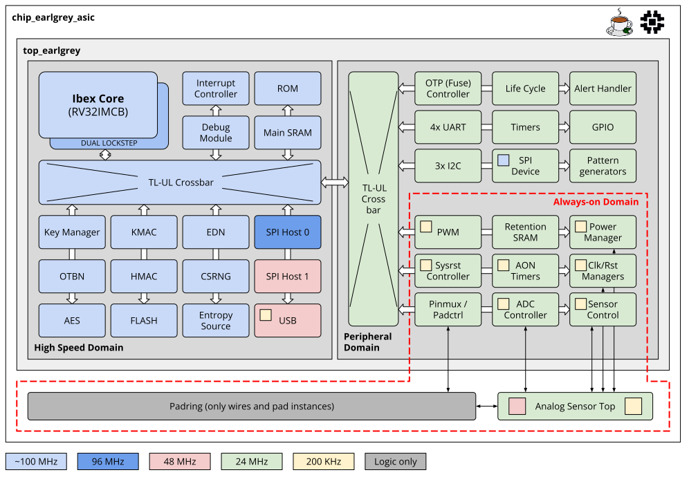

# Product Architecture

## [Security](./security/README.md)

OpenTitan’s mission is to create a trustworthy, vendor-agnostic open source silicon Root of Trust (RoT) widely adopted across the industry.
We do this by implementing strong logical security integrity guarantees in the hardware and firmware components, and restricting licensing of the OpenTitan trademark to those implementations conforming to OpenTitan standards.

## [IP blocks](../hw/ip/README.md)

OpenTitan IP is available as individual IP blocks, each conforming to the framework of lowRISC ecosystem IP, suitable for inclusion in compliant designs.
For more details, refer to an outline of the [quality expectations](./contributing/hw/comportability/README.md) of lowRISC IP.

## OpenTitan [Earl Grey](../hw/top_earlgrey/doc/datasheet.md)

The OpenTitan Earl Grey chip is a low-power secure microcontroller that is designed for several use cases requiring hardware security.
The block diagram is shown above and shows the system configuration, including the Ibex processor and all of the memories and comportable IPs.

## OpenTitan [Darjeeling](../hw/top_darjeeling/doc/datasheet.md)

OpenTitan Darjeeling is a system-on-a-chip Secure Execution Environment, capable of serving as a root of trust (RoT) for measurement and attestation among other applications, for instantiation within a larger system.
It can serve as the SoC root of trust, a platform root of trust, or even be integrated and leveraged for individual chiplet RoTs.

