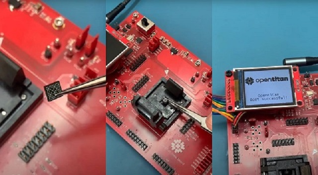

# OpenTitan History

## Introduction

Google launched the OpenTitan project together with lowRISC and its partners in 2018 with the goal to make a completely transparent and trustworthy secure silicon platform.
It is the world’s first open-source secure chip to include commercial-grade design verification, top-level testing and continuous integration.

With Google’s support, the project took off from its first year, setting it on a trajectory to make it the most active and successful open-source silicon project in history.
Throughout its lifetime, the OpenTitan coalition thrived as an open silicon ecosystem, consistently following a well-defined roadmap from discrete to integrated secure silicon designs.
The project partners are deeply engaged in this process, ensuring that the final designs are adaptable to many applications.
OpenTitan also has a large and growing community of contributors beyond its formal partners.
As a whole, the community resolves hundreds of pull requests and issues monthly.

  Date | Milestone | Description
 ----- | --------- | -----------
 **2025** | |
 October  | [Darjeeling tapeout](https://www.rivosinc.com/resources/blog/rivos-collaborates-to-complete-secure-provisioning-of-integrated-opentitan-root-of-trust-during-soc-production) | Rivos Inc announces the successful secure provisioning of Darjeeling based Root of Trust
 February | [Production begins](https://lowrisc.org/news/the-worlds-first-open-source-security-chip-hits-production-with-google/) | Fabrication started on production OpenTitan silicon based on the Earl Grey top level design by Nuvoton Technology Corporation
 **2024** | |
 May | [OpenTitan to be in Chromebooks](https://lowrisc.org/news/nuvoton-develops-opentitan-based-security-chip-as-next-gen-security-solution-for-chromebooks/) | Nuvoton Technology Corporation announces plans to use the first commercial chip built on the OpenTitan® open source secure silicon design.
 February | [Validated silicon](https://lowrisc.org/news/opentitan-commercial-availability/) | OpenTitan becomes the first open-source silicon project to reach commercial availability with validated chips.
 **2023** | |
 November | [Earl Grey tapeout](https://lowrisc.org/news/opentitan-partnership-announces-first-public-secure-execution-environment-for-integrated/) | The early release of the first SoC secure execution environment, including root of trust (RoT) functionality.
 June | [Earl Grey RTL freeze](https://lowrisc.org/news/opentitans-rtl-freeze-leveraging-transparency-to-create-trustworthy-computing/) | RTL Freeze for the Earl Grey discrete, the first OpenTitan chip tapeout.
 **2019** | |
 November | [Start of OpenTitan](https://lowrisc.org/news/announcing-opentitan-the-first-transparent-silicon-root-of-trust/) | OpenTitan, the First Transparent Silicon Root of Trust, announced.
