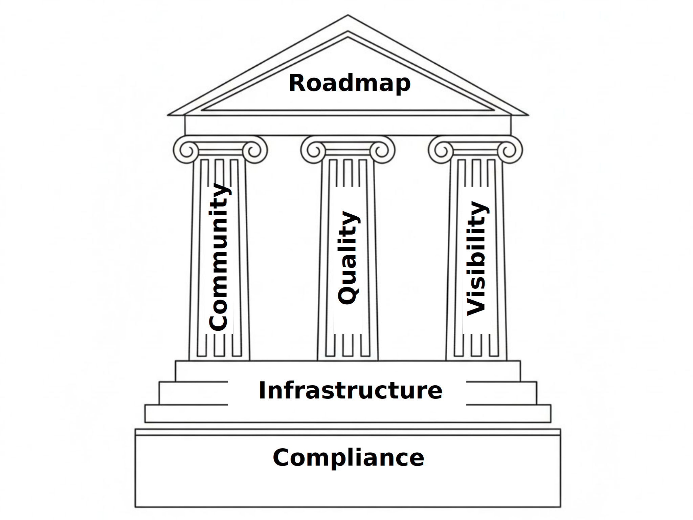

# OpenTitan membership

OpenTitan is a collaborative hardware and software development program with contributors from many organizations.

If you are interested in joining the OpenTitan Project, please contact get-involved@opentitan.org

## Why join as a member?

Members have a range of benefits, including:
- To contribute to, and influence the direction of the project
- Early visibility into roadmaps and vulnerabilities
- Marketing benefits and demonstrate leadership in security
- Demonstrating compliance with the project/product - e.g. by using the trademark

**And helping ensure that the OpenTitan project has a strong future**

## Gold members

OpenTitan gold members are primarily organizations who are designing a security hardened chip integrating the whole of OpenTitan and/or want to have strong influence in the direction of the project.

**Key benefits:**
- One seat on each of the [Governing Board](./governing_board.md) and [Technical Committee](./technical_committee.md) to steer roadmap and technical direction.
- Use of [OpenTitan certification and trademark](./trademark.md).
- Advance visibility of OpenTitan security issues ahead of fixes being implemented (subject to agreeing an additional NDA).
- Ability to propose and/or work on new top-levels
- Access to security hardening and trademark certification services from [lowRISC CIC](./lowRISC.md)

**Key Deliverables:**
- Tapeout checklist

**[Member individual accounts](./useraccounts.md):**
- Gold members are allowed up to 100 x individual accounts.

In addition Gold members gain all benefits available to Silver members

## Silver members

OpenTitan silver members are Organizations who want to integrate OpenTitan IP in their chips (rather than making hardened discrete chips based on Earl Grey), and do not feel the need to lead the direction of the project.

**Key benefits:**
- One seat on the [Technical Committee](./technical_committee.md) to steer technical direction.
- Access to agenda and minutes for the [Governing Board](./governing_board.md) and ability to propose topics.
- Advanced visibility of the OpenTitan internal roadmaps
- Ability to vote on roadmap and RFCs through [Technical Committee](./technical_committee.md) membership
- Early access to major new features under development
- Ability to have individuals function as [committers](./committers.md) once sufficient experience has been built.
- Access to integration and certification services from [lowRISC CIC](./lowRISC.md)

**Key Deliverables:**
- Settings for CDC/RDC, CWE checking and AI Agent tools
- Integration documentation and tooling
- Coverage gap analysis for latest release of each IP
- Integration checklist
- Pre-silicon FI verification
- Information (from lowRISC) necessary for Common Criteria certification

**[Member individual accounts](./useraccounts.md):**
- Silver members are allowed 10 x individual accounts and may purchase more.

In addition Silver members gain all benefits available to Bronze members

## Bronze members

OpenTitan bronze members are organisations who wish to support the project and enable members of their team to contribute.
They may wish to use the IP in their devices, want to fix bugs or contribute IP to ensure future compatibility.

**Key Benefits:**
- Members have their company logo on OpenTitan collateral and involvement in co-marketing
- Employees are allowed to join [Working Groups](./working_group.md) to contribute to technical direction.
- Membership allows individual employees to contribute

**Key Deliverables:**
- Full test and coverage reports linked from the DV dashboard

**[Member individual accounts](./useraccounts.md)**
- Bronze members are allowed 1 x individual account and may purchase more.

## Tools members

OpenTitan tools members are typically EDA tools organisations who wish to support reference designs for their tools.

**Key Benefits:**
- Members have their company logo on OpenTitan collateral and involvement in co-marketing
- Members' tools are integrated in the OpenTitan CI and regression testing flows.
- Tools members are informed of results from regression testing, including any observed issues.

**[Member individual accounts](./useraccounts.md):**
- Tools members are allowed 1 x individual account to address integration issues and may purchase more.

## Academic / NGO / Public Organization members

OpenTitan academic members are academic, NGO or public organisations who wish to be involved in OpenTitan for research or to promote the project.
Flexible benefits to academic members can be negotiated with lowRISC depending on the expected contribution from the academic member.

**Key Benefits:**
- Members have their company logo on OpenTitan collateral and involvement in co-marketing
- Academic members are allowed to join [Working Groups](./working_group.md)
- Academic members can contribute to technical direction.

**[Member individual accounts](./useraccounts.md):**
- Academic members are allowed 5 x individual accounts and may purchase more.

## Individual collaborator

OpenTitan individual collaborators are individuals (e.g. academics) with rights to their own submissions.

Note that where individuals are working within organisations, these organisations should become members to ensure an [organisational contributor license](https://github.com/lowRISC/opentitan/blob/master/CONTRIBUTING.md) is available to cover IP rights.

**Key Benefits:**
- Individual collaborators may contribute and join [Working Groups](./working_group.md) to contribute to technical direction.

## Summary

| Level   | GB  |  TC  |  WG  | Accounts | Key Benefits |
| -----   | ---- | ---- | ---- | -----    | -------- |
| Gold    |  1   |  1   |  Y   |  100     | Steer roadmap and technical direction. OpenTitan certification and trademark. Advance visibility of security issues. |
| Silver  |      |  1   |  Y   |   10     | Steer technical direction. OpenTitan internal roadmaps. Early access to new features. Individuals as committers. |
| Bronze  |      |      |  Y   |    1     | Company logo on OpenTitan collateral. Join Working Groups. Contributor license. |

Membership benefits and deliverables are subject to change at the sole discretion of lowRISC CIC.

# How are membership fees used?

Member fees are used to fund work on OpenTitan.
They ensure a strong foundation to the project.

Member fees are applied in the priority shown below.
The level of funding for later functions in the list depends on the funds available and the amount consumed by the critical items earlier in the list.

1. **Compliance and Governance** - Ensuring that the OpenTitan project is well run and compliant to legal requirements, and that all material is accurate, maintained and legal.
Handling security vulnerabilities in OpenTitan-certified chips.
2. **Infrastructure** - Purchasing, managing and maintaining the hardware and tools required to run OpenTitan.
3. **Community** - Supporting the OpenTitan community, managing communication, running meetings, reviewing submitted code.
4. **Quality** - Maintaining and improving the quality of the OpenTitan project, addressing newer tools versions, improving verification and reducing technical debt.
Research into new threats and security mechanisms.
5. **Visibility** - Increasing the visibility of OpenTitan and Open Source Silicon, publishing relevant papers, maintaining discussion and promoting the project at conferences.
6. **Roadmap** - Progressing and supporting the OpenTitan roadmap
