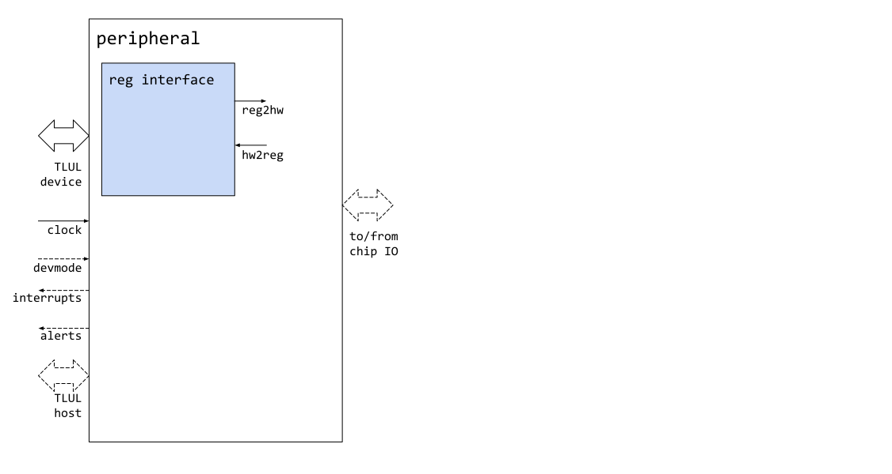
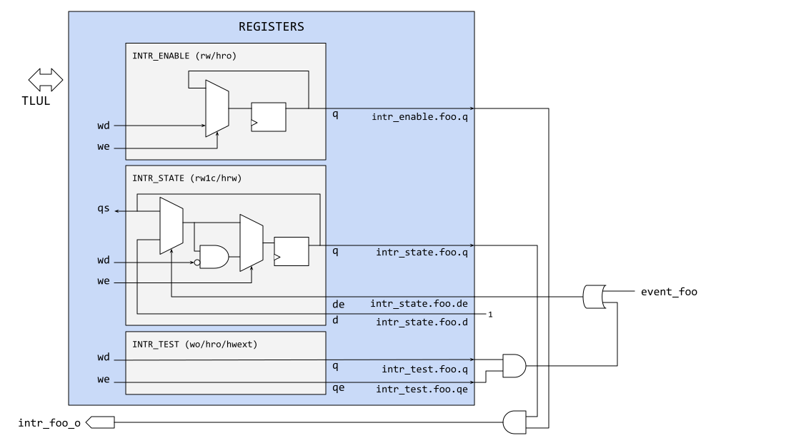

## Document Goals

This document is aimed at laying out the definition of a *Comportable IP design*, i.e. one that is ported to conform to the framework of lowRISC ecosystem IP, suitable for inclusion in compliant designs.
This is primarily a technical discussion and specification of interface compliance within the framework.
Separate documents contain or will contain critical elements like coding style, verification, and documentation, but are not the purview of this specification.

A good definition of Comportable can be found in
[Johnson's Dictionary of the English Language](https://en.wikipedia.org/wiki/A_Dictionary_of_the_English_Language).
The 1808 miniature edition gives
["Comportable, a. consistent, suitable, fit"](https://books.google.co.uk/books?id=JwC-GInMrW4C&dq=%22comportable%22&pg=PA45&ci=31%2C225%2C415%2C42&source=bookclip)


## Definitions

The table below lists some keywords used in this specification.

| Keyword | Definition |
| --- | --- |
| alerts      | Interrupt-type outputs of IP designs that are classified as security critical. These have special handling in the outer chip framework. |
| comportable | A definition of compliance on the part of IP that is able to plug and play with other IP to form the full chip framework. |
| CSRs        | Control and Status Registers; loosely the collection of registers within a peripheral which are addressable by the (local) host processor via a chip-wide address map.  Special care is dedicated to the definition and handling of CSRs to maximize software uniformity and re-use, as well as documentation consistency. |
| framework   | this project concerns itself not only with compliant IP, but also provides a full chip framework suitable for FPGA implementation, and prepared to be the foundation for a full silicon implementation. This could roughly be translated as Top Level Netlist. |
| interrupts  | Non-security critical signals from peripheral devices to the local host processor within the framework SOC. |
| MIO         | Multiplexable IO; a pad at the top chip level which can be connected to one of the peripherals' MIO-ready inputs or outputs. |
| peripheral  | Any comportable IP that is part of the library, outside of the local host processor. |

## Non-Technical Comportability Requirements

All comportable IP must adhere to a few requirements, briefly discussed here.

### License and copyright

All files should include a comment with a copyright message.
This is normally "lowRISC contributors".
The style is to not include a year in the notice.
Files adapted from other sources should retain any copyright messages and include details of the upstream location.

The Apache License, Version 2.0 is the default for all files in the repository.
Use of other licenses must be noted (and care is needed to ensure compatibility with the rest of the code).
All files should include a comment line with the SPDX-License-Identifier: tag and the Identifier from the [License List](https://spdx.org/licenses/).
An additional "Licensed under" line may be used to give a more human readable version.
If the file is not covered by a SPDX license then the "Licensed under" line is required (note that such files are unlikely to be permitted in the main open source repository).

All files that use the default copyright and license should therefore include the following header (change the comment character as appropriate):

```
// Copyright lowRISC contributors.
// Licensed under the Apache License, Version 2.0, see LICENSE for details.
// SPDX-License-Identifier: Apache-2.0
```

The project has adopted [Hjson](https://hjson.org) for JSON files, extending JSON to allow comments.
Thus the Hjson files can include the header above.
If pure JSON must be used for some reason, the "SPDX-License-Identifier:" can be added as the first key after the opening "{".
Tools developed by the project should accept and ignore this key.

### Coding Style

All IP must follow the [lowRISC Verilog Coding Style Guide](https://github.com/lowRISC/style-guides/blob/master/VerilogCodingStyle.md).
This style guide sets the definition of agreed-upon SystemVerilog style, requirements and preferences.
See that document for details.
It is the goal of lowRISC to create technical collateral to inform when an IP does not conform, as well as assist in the formating of Verilog to this style.
The methods and details for this collateral have not been agreed upon yet.

### Documentation

All lowRISC IP must conform to a common specification and documentation format.
lowRISC will release a template for IP specifications in a separate document for reference.
It is notable that register tooling auto-creates documentation material for register definitions, address maps, hardware interfaces, etc.
The hardware interfaces of this process is discussed later in this document.

## Comportable Peripheral Definition

All comportable IP peripherals must adhere to a minimum set of functionality in order to be compliant with the framework that is going to be set around it.
(An example framework is the [earlgrey top level design](../../hw/top_earlgrey/doc/top_earlgrey.md).)
This includes several mandatory features as well as several optional ones.
It is notable that the framework contains designs that are neither the local host processor nor peripherals \- for example the power management unit, clock generators.
These are handled as special case designs with their own specifications.
Similarly the memory domain is handled separately and in its own specification.

Examples of peripherals that are expected to be in this category include ones with primary inputs and outputs (SPI, I2C, etc);
offload and specialty units (crypto, TRNG, key manager); timers; analog designs (temperature sensor); as well as bus hosts<sup>1</sup> (DMA).

<sup>1</sup>lowRISC is avoiding the fraught terms master/slave and defaulting to host/device where applicable.

### Feature List

All comportable designs must specify and conform to a list of mandatory features, and can optionally specify and conform to a list of optional features.
These are briefly summarized in the table below, and are covered individually in the sections that follow.
For most of these, the definition of the feature is in the form of a configuration file.
This file is specified later within this document.

| Feature | Mand/Opt | Description |
| ---     | ---      | --- |
| Clocking     | mandatory | Each peripheral must specify what its primary functional clock is, and any other clocks needed.  The primary clock is the one driving the bus the peripheral is receiving.  The clocking section lists the available clocks. Other clocks can be designated as needed. |
| Bus Device   | mandatory | All peripherals are assumed to have registers, and are thus required to be a device on the chip bus.  More details in the bus definition section. |
| Bus Host     | optional  | Peripherals can act as a bus host on some occasion, though for full chip simplicity the preferred model is for the processor to be primary host. An example would be a DMA unit.  More details are available in the bus definition section. |
| Available IO | optional  | Peripherals can optionally make connections to dedicated or multiplexed IO pins; the chip peripheral needs to indicate its module inputs and outputs that are available for this purpose. Details are available in the peripheral IO section below. |
| Registers    | mandatory | Each peripheral must define its collection of registers in the specified register format.  The registers are automatically generated in the form of hardware, software, and documentation collateral. Details are available in the register section. |
| Interrupts   | optional  | Peripherals have the option of generating signals that can be used to interrupt the primary processor.  These are designated as a list of signals, and each results in a single wire or bundled output that is sent to the processor to be gathered as part of its interrupt vector input.  Details can be found in the interrupt and alert section. |
| Alerts       | optional  | Peripherals have the option of generating signals that indicate a potential security threat. These are designated as a list of signals, and each results in a complementary signal pair that is sent to the alert handling module.  Details are found in the interrupt and alert section. |
| Inter Signal | optional  | Peripherals have the option of struct signals that connect from/to other peripherals, which are called as Inter-Module Signals in OpenTitan. Details are found in the inter module section.
| (more)       |           | More will come later, including special handling for testability, power management, device entropy, etc. |



**Figure 1**: Typical peripheral communication channels within full chip framework.

In this diagram the auto-generated register submodule is shown within the peripheral IP, communicating with the rest of the chip framework using the TL-UL (see below) bus protocol.
This register block communicates with the rest of the peripheral logic to manage configuration and status communication with software.
Also shown is the mandatory clock, and the optional bus (TL-UL) host, interrupts, alerts, and chip IO.

Additionally an optional input `devmode` is shown which represents an indication to the peripheral what mode the SOC is operating in.
For now this includes only two modes: development (`devmode = 1`) and production (`devmode = 0`).
This is the beginning of a security feature that will convey the full life cycle mode status to the peripheral.
In its current form, only the distinction of development mode vs. production mode is required in order to determine how to handle software errors (see the [Register Tooling]() documentation for details).
The full definition of life cycle modes will come upon further refinement of the security properties of the SOC.

## Peripheral Feature Details

### Configuration File

Each peripheral contains a configuration file that describes the peripheral features that are mandatory and optional in the above comportability feature list.
The configuration file format is given below.

### Clocking

Each peripheral must define at least one clock: the primary clock.
This is defined as `clock_primary` in the configuration file, and must be equal to one of the known clock names.
This primary clock is defined as the one used to clock the bus device, indicating to the top level if asynchronous handling of the bus interface is needed.

Optionally the peripheral can request other clocks that it needs for internal use.
These would create asynchronous clock domains within the IP that are handled by the design.
They are defined under `other_clock_list` in the configuration file.

### Reset

At this time, no additional information is required to indicate the reset scheme for the peripheral IP.
It is assumed that each clock comes with its related reset pins targeted for that clock domain.
Resets within the design are **asynchronous active low** (see below).
Special care will be required for security sensitive storage elements.
Further instructions on the handling of these storage elements will come at a later date.

#### Details and rationale for asynchronous active low reset strategy

Resets within the design are asynchronous active low, where the assertion of the reset is asynchronous to any clock, but deassertion is synchronized to the clock of the associated storage element.
The selection of asynchronous active low (as opposed to say synchronous active high) was made based upon a survey of existing design IP, comfort level of project team members, and through security analysis.
The conclusion roughly was the following:

1. Security storage elements might "leak" sensitive state content, and should be handled with care regardless of reset methodology.
By "care" an example would be to reset their value synchronously at a time after chip-wide reset, to a value that is randomized so that the Hamming distance between the register value and all zeros cannot produce information available to an attacker.
2. For control path and other storage elements, the selection of asynchronous active low vs. synchronous active high is often a "religious" topic, with both presenting pros and cons.
3. Asynchronous active low incurs slightly more area and requires more hand-holding, but is more common.
4. Synchronous active high is slightly more efficient, but requires the existence of a clock edge to take effect.

Based upon this and the fact that much of the team history was with asynchronous active low reset, we chose that methodology with added requirements that special care be applied for security state, the details of which will come at a later date.

### Bus Device

All peripheral devices use TileLink-UL (TileLink-Uncached-Lite, aka TL-UL) as their interface to the framework.
As of this writing, there are no other options, but the configuration file designates the protocol with the `bus_device` keyword.
The only acceptable value at this time is `tlul`.

The address map for peripheral devices is not determined by the peripheral itself, or its configuration file.
A higher level full-chip configuration file distributes address ranges to all of the included bus peripheral devices.

The TileLink-UL protocol and its usage within lowRISC devices is given in the
[TileLink-UL Bus Specification]().

### Bus Host

Peripherals have the option of declaring themselves as bus hosts.
This is done in the configuration file with `bus_host` keyword.
This is optional, or the configuration can indicate none (via an empty string), or else the bus host protocol name (only `tlul` allowed at this time).
All bus hosts must use the same clock as the defined primary host clock.

Each bus host is provided a 4-bit host ID to distinguish hosts within the system.
This is done by the framework in order to ensure uniqueness.
The use of the ID within the bus fabric is discussed in the bus specification.

### Available IO

Each peripheral has the option of designating signals (inputs, outputs, or inouts) available to be used for chip IO.
The framework determines for each signal if it goes directly to a dedicated chip pin or is multiplexed with signal(s) from other peripherals before reaching a pin.

Designation of available IO is given with the configuration file entries of `available_input_list`, `available_output_list`, and `available_inout_list`.
These can be skipped, or contain an empty list `[]`, or a comma-separated list of signal names.
Items on the input list of the form `name` incur a module input of the form `cio_name_i`.
Items on the output list of the form `name` incur a module output of the form `cio_name_o` as well as an output enable `cio_name_en_o`.
Items on the inout list of the form `name` incur all three.

#### Multiplexing Feature and Pad Control

In the top level chip framework there is a [pin multiplexing unit (`pinmux`)]() which provides flexible assignment to/from peripheral IO and chip pin IO.
Comportable peripherals do not designate whether their available IO are hardwired to chip IO, or available for multiplexing.
That is done at the top level with an Hjson configuration file.
See the top level specification for information about that configuration file.

In addition, full pad control is not done by the peripheral logic, but is done by the [`padctrl`]() module.
The `padctrl` module provides software configuration control over pad drive strength, pin mapping, pad type (push/pull, open drain, etc).

### Interrupts

Each peripheral has the option of designating output signals as interrupts destined for the local host processor.
These are non-security-critical signals sent to the processor for it to handle with its interrupt service routines.
The peripheral lists its collection of interrupts with the `interrupt_list` attribute in the configuration file.
Each item of the form `name` in the interrupt list expects a module output named `intr_name_o`.

See the section on [Interrupt Handling](#interrupt-handling) below, which defines details on register, hardware, and software uniformity for interrupts within the project.

### Alerts

Each peripheral has the option of designating output signals as security critical alerts destined for the hardware [alert handler module]().
These are differential signals (to avoid single point of failure) sent to the alert handler for it to send to the processor for first-line defense handling, or hardware security response if the processor does not act.
The peripheral lists its collection of alerts with the `alert_list` attribute in the configuration file.
For each alert in the full system, a corresponding set of signals will be generated in the alert handler to carry out this communication between alert sender and handler.

See the section on [Alert Handling](#alert-handling) below, which defines details on register, hardware, and software uniformity for alerts within the project.

### Inter-module signal

The peripherals in OpenTitan have optional signals connecting between the peripherals other than the interrupts and alerts.
The peripheral lists its collection of inter-module signals with the `inter_signal_list` attribute in the configuration file.
The peripheral defines the type of inter-module signals.
The connection between the modules are defined in the top-level configuration file.

See the section on [Inter Signal Handling](#inter-signal-handling) below for detailed data structure in the configuration file.

## Register Handling

The definition and handling of registers is a topic all on its own, and is specified in its [own document]().
All lowRISC peripheral designs must conform to this register specification.

## Configuration description Hjson

The description of the IP block and its registers is done in an Hjson file that is specified in the
[Register Tool document]().
All lowRISC peripheral designs must conform to this configuration and register specification.

A description of Hjson (a variant of json) and the recommended style is in the [Hjson Usage and Style Guide]().

### Configuration information in the file

The configuration part of the file has the following elements, with a comment as to if required or optional.
In this example, the IP name is `uart`, though the other configuration fields are contrived and not in-line with the expected functionality of a UART but are shown for edification.

```hjson
  {
    name: "uart",
    clock_primary: "clk_fixed",      // optional; default "clk"
    other_clock_list: [ "clk", "clk_lowpower" ], // optional; default []
    bus_device: "tlul",
    bus_host: "",                    // optional; default undefined
    available_input_list: [          // optional; default []
      { name: "rx", desc: "Receive bit" }
    ],
    available_output_list: [         // optional; default []
      { name: "tx", desc: "Transmit bit" }
    ],
    available_inout_list: [],        // optional; default []
    interrupt_list: [                // optional; default []
      { name: "tx_watermark",  desc: "raised if the transmit FIFO..."}
      { name: "rx_watermark",  desc: "raised if the receive FIFO..."}
      { name: "tx_overflow",   desc: "raised if the transmit FIFO..."}
      { name: "rx_overflow",   desc: "raised if the receive FIFO..."}
      { name: "rx_frame_err",  desc: "raised if a framing error..."}
      { name: "rx_break_err",  desc: "raised if break condition..."}
      { name: "rx_timeout",    desc: "raised if the receiver..."}
      { name: "rx_parity_err", desc: "raised if the receiver..."}
    ],
    alert_list: [                    // optional; default []
      { name: "fatal_uart_breach", desc: "Someone has attacked the ..."}
      { name: "recov_uart_frozen", desc: "The UART lines are frozen..." }
    ],
    inter_signal_list: [
      { name: "msg_fifo",
        struct: "fifo",
        package: "msg_fifo_pkg",
        type: "req_rsp",
        act: "req",
        width: 1
      }
      { name: "suspend",
        struct: "logic",
        package: "",
        type: "uni",
        act: "rcv",
        width: 1
      }
    ]
    regwidth: "32", // standard register width
    register: [
      // Register information...
    ]
  }
```

### Documentation Output

The following shows the expected documentation format for this example.

*Primary Clock:* `clk_fixed`

*Other clocks:* `clk, clk_lowpower`

*Bus Device Interface:* `tlul`

*Bus Host Interface: none*

*Peripheral Pins available for chip-level IO:*

| Pin name | direction | Description |
| --- | --- | --- |
| tx | output | Transmit bit |
| rx | input | Receive bit |

*Interrupts:*

| Intr Name | Description |
| --- | --- |
| `tx_watermark`  | Raised if the transmit FIFO is past the high water mark |
| `rx_watermark`  | Raised if the receive FIFO is past the high water mark |
| `tx_overflow`   | Raised if the transmit FIFO has overflowed |
| `rx_overflow`   | Raised if the receive FIFO has overflowed |
| `rx_frame_err`  | Raised if a framing error has been detected on receive |
| `rx_break_err`  | Raised if a break condition is detected on receive |
| `rx_timeout`    | Raised if the receiver has not received any characters programmable time period |
| `rx_parity_err` | Raised if the receiver has detected a parity error |

*Security alerts:*

| Alert name | Description |
| --- | --- |
| `fatal_uart_breach` | Someone has attacked the UART module |
| `recov_uart_frozen` | The UART lines are frozen and might be under attack |

## Interrupt Handling

Interrupts are critical and common enough to attempt to standardize across the project.
Where possible (exceptions for inherited IP that is too tricky to convert) all interrupts shall have common naming, hardware interface, and software interface.
These are described in this section.

Interrupts are latched indications of defined peripheral events that have occurred and not yet been addressed by the local processor.
All interrupts are sent to the processor as active-high level (as opposed to edge) interrupts.
Events themselves can be edge or level, active high or low, as defined by the associated peripheral.
For instance, the GPIO module might detect the rising or falling edge of one its input bits as an interrupt event.

The latching of the event is done by the auto-generated register file as described below.
The clearing of the event is done by a processor write when the handling of the event is completed.
The waveform below shows the timing of the event occurrence, its latched value, and the clearing by the processor.
More details follow.


{
  signal: [
    { name: 'Clock',             wave: 'p.............' },
    { name: 'event',             wave: '0..10.........' },
    { name: 'INTR_ENABLE',       wave: '1.............' },
    { name: 'INTR_STATE',        wave: '0...1....0....' },
    { name: 'intr_o',            wave: '0...1....0....' },
    { name: 'SW write to clear', wave: '0.......10....' },
  ],
  head: {
    text: 'Interrupt Latching and Clearing',
  },
  foot: {
    text: 'event signaled at cycle 3, state bit cleared in cycle 8',
    tock: 0
  },
}


### Interrupts per module

A peripheral generates a separate interrupt for each event and sends them all as bundle to the local processor's interrupt module.
"Disambiguation", or the determining of which interrupt has woken the processor, is done at the processor in its handler (to be specified eventually in the core processor specification).
This is as distinct from a model in which each peripheral would send only one interrupt, and the processor would disambiguate by querying the peripheral to figure out which interrupt was triggered.

### Defining Interrupts

The configuration file defined above specifies all that needs to be known about the interrupts in the standard case.
The following sections specify what comes out of various tools based upon the simple list defined in the above example.

### Register Creation

For every peripheral, by default, three registers are **automatically** created to manage each of the interrupts for that peripheral (as defined in the `interrupt_list` portion of the Hjson file).
Every interrupt has one field bit for each of three registers.
(It is an error condition if there are more than 32 interrupts per peripheral.)
The three registers are the `INTR_STATE` register, the `INTR_ENABLE` register, and the `INTR_TEST` register.
They are placed at the top of the peripheral's address map in that order automatically by the `reggen` tool.

The `INTR_ENABLE` register is readable and writeable by the CPU (`rw`), with one bit per interrupt which, when true, enables the interrupt of the module to be reported to the output to the processor.
The `INTR_STATE` register is readable by the CPU and each bit may be written with `1` to clear it (`rw1c`), so that a read of the register indicates the current state of all latched interrupts, and a write of `1` to any field clears the state of the corresponding interrupt.
`INTR_TEST` is a write-only (`wo`) register that allows software to test the reporting of the interrupt, simulating a trigger of the original event, the setting of the `INTR_STATE` register, and the raised level of the interrupt output to the processor (modulo the effect of `INTR_ENABLE`).
No modifications to other portions of the hardware (eg. clearing of FIFO pointers) occurs.
See the next section for the hardware implementation.

The contents of the `INTR_STATE` register do **not** take into consideration the enable value, but rather show the raw state of all latched hardware interrupt events.
The output interrupt to the processor ANDs the interrupt state with the interrupt enable register before sending to the processor for consideration.

### Interrupt Hardware Implementation

All interrupts as sent to the processor are active-high level interrupts of equal severity<sup>2</sup>.
Taking an interrupt `foo` as an example, the block diagram below shows the hardware implementation.
The assumption is that there is an internal signal (call it `event_foo`) that indicates the detection of the event that is to trigger the interrupt.
The block diagram shows the interaction between that event, the three defining software-facing registers, and the output interrupt `intr_foo_o`.

<sup>2</sup> Higher priority interrupts in the form of a Non-Maskable Interrupt (NMI) are expected to be overlaid in the future.



**Figure 2**: Example interrupt `foo` with its three registers and associated HW

In this figure the event is shown coming in from another part of the peripheral hardware.
The assumption is this event `foo` is one of multiple interrupt events in the design.
Within the register file, the event triggers the setting of the associated bit in the `INTR_STATE` register to `1`.
Additionally, a write of `1` of the associated `foo` bit of the `INTR_TEST` register can set the corresponding `INTR_STATE` bit.
The output of the `INTR_STATE` register becomes the outgoing interrupt to the processor after masking (ANDing) with the value of `INTR_ENABLE`.

Note that the handling of the `ro/rw1c` functionality of the `INTR_STATE` register allows software to control the clearing of the `INTR_STATE` content.
A write of `1` to the corresponding bit of `INTR_STATE` clears the latched value, but if the event itself is still active, the `INTR_STATE` register will return to true.
The hardware does not have the ability to clear the latched interrupt state, only software does.

Interrupts sent to the processor are handled by its interrupt controller.
Within that logic there may be another level of control for enabling, prioritizing, and enumeration.
Specification of this control is defined in the [interrupt handler document]().

## Alert Handling

Alerts are another critical and common implementation to standardize for all peripherals.
Unlike interrupts, there is no software component to alerts at the peripheral, though there is at the hardware alert handler.
See that [specification]() for full details.
A general description of the handling of alerts at the hardware level is given here.

### Alerts per Module

Alerts are sent as a bundled output from a peripheral to the hardware alert handler.
Each peripheral can send zero or more alerts, where each is a distinguishable security threat.
Each alert originates in some internal event, and must be specially handled within the peripheral, and then within the alert handler module.

Alerts of comportable IPs in the system must be in either of the following two categories:

1. *Recoverable*, one-time triggered alerts.
This category is for regular alerts that are due to recoverable error conditions.
The alert sender transmits one single alert event when the corresponding error condition is asserted.

2. *Fatal* alerts that are continuously triggered until reset.
This category is for highly critical alerts that are due to terminal error conditions.
The alert sender continuously transmits alert events until the system is reset.

It is recommended that fatal alerts also trigger local security countermeasures, if they exist.
For example, a redundantly encoded FSM that is glitched into an invalid state is typically considered to be a fatal error condition.
In this case, a local countermeasure could be to move the FSM into a terminal error state in order to render the FSM inoperable until the next reset.

The table below lists a few common error conditions and the recommended alert type for each of those errors.

Error Event                                                             | Regular IRQ | Recoverable Alert | Fatal Alert
------------------------------------------------------------------------|-------------|-------------------|-------------
ECC correctable in NVM (OTP, Flash)                                     | (x)         | x                 |
ECC uncorrectable in Flash                                              | (x)         | x                 |
ECC uncorrectable in OTP                                                | (x)         |                   | x
Any ECC / Parity error in SRAMs or register files                       | (x)         |                   | x
Glitch detectors (e.g., invalid FSM encoding)                           | (x)         |                   | x
Incorrect usage of security IP (e.g., shadowed control register in AES) | (x)         | x                 |
Incorrect usage of regular IP                                           | x           |                   |

(x): optional

The column "Regular IRQ" indicates whether the corresponding error condition should also send out a regular IRQ.
A peripheral may optionally send out an IRQ for any alert event, depending on whether this is needed by the programming model to make forward progress.
Note that while alerts may eventually lead to a system wide reset, this is not guaranteed since the alert response depends on the alert handler configuration.

### Defining Alerts

The Hjson configuration file defined above specifies all that needs to be known about the alerts in the standard case.
The following sections specify what comes out of various tools based upon the simple list defined in the above example.

In terms of naming convention, alerts shall be given a meaningful name that is indicative of its cause.
Recoverable alerts must be prefixed with `recov_*`, whereas fatal alerts must be prefixed with `fatal_*`.
For instance, an uncorrectable parity error in SRAM could be named `fatal_parity_error`.

In cases where many diverse alert sources are bundled into one alert event (see [Alert Hardware Implementation]()), it may sometimes be difficult to assign the alert event a meaningful and descriptive name.
In such cases, it is permissible to default the alert names to just `recov` and/or `fatal`.
Note that this implies that the peripheral does not expose more than one alert for that type.

### Test Alert Register Creation

For every peripheral, by default, one register named `ALERT_TEST` is **automatically** created.

`ALERT_TEST` is a write-only (`wo`) register that allows software to test the reporting of alerts in the alert handler.
Every alert of a peripheral has one field bit inside the `ALERT_TEST` register, and each field bit is meant to be connected to the test input of the corresponding `prim_alert_sender` (see next subsection).

### Alert Hardware Implementation

Internal events are sent active-high to a piece of IP within the peripheral called the `prim_alert_sender`.
One `prim_alert_sender` must be instantiated per distinct alert event, and the `IsFatal` parameter of the alert sender must be set to 1 for fatal alerts (this causes the alert sender to latch the alert until the next system reset).

It is up to the peripheral owner to determine what are distinct alert events;
multiple ones can be bundled depending upon the distinction required within the module (i.e.  high priority threat vs. low level threat).
As a general guideline, it is recommended that each peripheral bundles alert sources into one or two distinct alerts, for example one fatal and one recoverable alert.
This helps to keep the total number of alerts (and their physical impact) low at the system level.

It is recommended that comportable IPs with multiple bundled alerts expose a cause register for disambiguation, which is useful for debugging and crash dumps.
Cause registers for recoverable alerts must either be clearable by SW, or the HW must provide an automatic mechanism to clear them (e.g., upon starting a new transaction initiated by SW).
Cause registers for fatal alerts must not be clearable in any way and must hence be read-only.

The `prim_alert_sender` converts the event into a differentially encoded signal pair to be routed to the hardware alert handler, as dictated by the details in the
[alert handler specification]().
The alert handler module is automatically generated to have enough alert ports to represent each alert declared in the different included peripheral IP configuration files.

## Inter Signal Handling

Inter-module signal is a term that describes bundled signals connecting instances in the top.
A few peripherals can be stand-alone such as GPIO and UART peripherals.
They don't need to talk with other modules other than reporting the interrupts to the main processor.
By contrast, many peripherals and the main processing unit in OpenTitan communicate between the modules.
For example, `flash_ctrl` sends requests to the flash macro for read/ program/ erase operations.

Inter-module signal aims to handle the connection by the tool [topgen]()

### Defining the inter-module signal

The example configuaration file above specifies two cases of inter-module signals, `msg_fifo` and `suspend`.

| Attribute | Mand/Opt  | Description |
| --------- | --------- | ----------- |
| name      | mandatory | `name` attribute specifies the port name of the inter-module signal. If the type is `req_rsp`, it indicates the peripheral has `name`_req , `name`_rsp ports (with `_i` and `_o` suffix) |
| struct    | mandatory | The `struct` field defines the signal's data structure. The inter-module signal is generally bundled into `struct packed` type. This `struct` is used with `package` for topgen tool to define the signal. If the inter-module signal is `logic` type, `package` field can be omitted. |
| package   | optional  |             |
| type      | mandatory | There are two types of inter-module signal. `req_rsp` is a connection that a module sends requests and the other module returns with responses. `uni` is one-way signal, which can be used as a broadcasting signal or signals that don't need the response. |
| act       | mandatory | `act` attribute pairs with the `type`. It specifies the input/output of the signal in the peripheral. `req_rsp` type can have `req`(requester) or `rsp`(responder) in `act` field. `uni` type can have `req` or `rcv`(receiver) in `act`. |
| width     | optional  | If `width` is not 1 or undefined, the port is defined as a vector of struct. It, then, can be connected to multiple peripherals. Currently, `logic` doesn't support the connection to multiple modules if `width` is not 1. |
