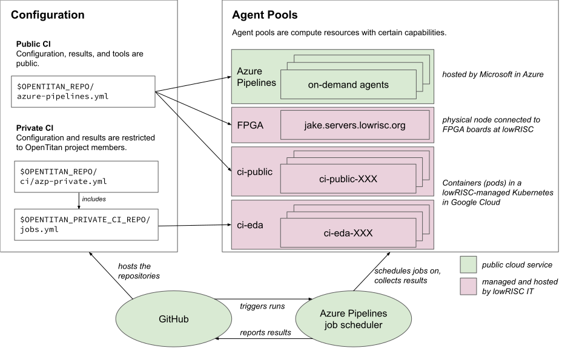

All changes to the OpenTitan source code are tested thoroughly in a continuous integration system.
Tests run automatically when changes are proposed for inclusion by submitting a pull request, and on the `master` branch after changes are merged.
This ensures that the OpenTitan source code meets certain quality criteria at all points in time, as defined by the tests which are executed.

Read on to learn more about the types of tests, and the infrastructure that runs these tests.

## How to report CI problems

If you detect CI failures which look like they might not be related to the tested code, but the test infrastructure, please file an [issue on GitHub](https://github.com/lowRISC/opentitan/issues).
In urgent cases also reach out on Slack and send an email to lowRISC IT at [internal-tech@lowrisc.org](mailto:internal-tech@lowrisc.org).
Note that lowRISC is based in the UK and most active during European business hours.

## Overview

<!--
Source: https://docs.google.com/drawings/d/1-Zjm3k2S0TNmne3F9z3rpTFJfLJJvvmrBAsfx_HG5lk/edit

Download the SVG from Google Draw, open it in Inkscape once and save it without changes to add width/height information to the image.
-->

OpenTitan uses [Azure Pipelines](https://azure.microsoft.com/en-gb/services/devops/pipelines/) as continuous integration provider: test jobs are described in an Azure Pipelines-specific way, and then executed on compute resources, some of which are provided by Azure Pipelines, and others of which are provided by lowRISC.

Two things are special in the way OpenTitan does continuous integration: private CI, and testing on FPGA boards.

"Private CI" is a term we use for a subset of test jobs which require tighter access control.
The primary use case for private CI are tests using proprietary EDA tools, where the license agreement prevents us from testing arbitrary code with it, from showing the configuration or the output in public, etc.
We run such test jobs in a separate environment where only OpenTitan project members have access.
The test result (pass/fail) is still shared publicly to enable outside contributors to at least get some feedback if their pull request passed our tests.

To test OpenTitan (both the hardware and the software) on FPGAs we have various FPGA boards connected to a machine at lowRISC.
Azure Pipelines is configured to schedule test jobs on this machine when FPGA testing is required.
The results and logs of these test runs are shown publicly.

## Azure Pipelines projects

OpenTitan CI uses two Azure DevOps projects (which Azure Pipelines is a part of):

* https://dev.azure.com/lowrisc/opentitan/ for public CI.
* https://dev.azure.com/lowrisc/opentitan-private/ for private CI.

## Test descriptions

All tests are described in a Azure Pipelines-specific YAML syntax.
`$REPO_TOP/azure-pipelines.yml` is the main configuration file for all public CI jobs.
The private CI jobs are described in a separate private repository, [lowrisc/opentitan-private-ci](https://github.com/lowRISC/opentitan-private-ci), to keep the job descriptions internal for legal reasons.

The [YAML schema](https://docs.microsoft.com/en-us/azure/devops/pipelines/yaml-schema) is part of the Azure Pipelines documentation.

## Compute resources: agent pools and agents

Each test in the YAML file also specifies which type of compute resource it wants to run on.
Identical compute resources are grouped into *agent pools*, and an individual compute resource is called an *agent*.

For OpenTitan, we have the following agent pools available, which can also be seen in the [Azure Pipelines UI](https://dev.azure.com/lowrisc/opentitan/_settings/agentqueues):
* The *Azure Pipelines* pool is a Microsoft-provided pool of VMs which are free of charge for us.
  They are described in more detail in the [Azure Pipelines documentation](https://docs.microsoft.com/en-us/azure/devops/pipelines/agents/hosted).
* The *ci-public* pool has a lowRISC-specific setup with tools such as Xilinx Vivado installed, but has no access to tools with special license restrictions.
* The *ci-eda* pool has proprietary EDA tools installed and access to the respective licenses.
* The *FPGA* pool currently consists of a single machine with our FPGA boards connected to it.

All pools except for the *Azure Pipelines* pool are managed by lowRISC IT.

All agents provide ephemeral test environments: the test environment is initialized at the start of a test job and completely destroyed at the end.
This is achieved by running tests in Docker containers which are recreated after each run.
The base image used for all lowRISC-hosted agent pools is available [as lowrisc/container-ci-eda on DockerHub](https://hub.docker.com/r/lowrisc/container-ci-eda).
(The build rules/Dockerfile for this image are lowRISC-internal.)

lowRISC-provided agents run in a Kubernetes cluster on Google Cloud (GCP), where we also define the resources allocated for the individual agents.
The agent pools are static in size, i.e. the number of agents doesn't increase and decrease depending on the number of scheduled jobs.

## Job scheduling, build triggers and status reporting

Builds are triggered by GitHub, which sends notifications to Azure Pipelines on a range of events, e.g. the creation of new pull requests, the merge of code into a branch, etc.

The Azure Pipelines scheduler consumes these events and compares them with the configured pipeline triggers in the `azure-pipelines.yml` file.
It then processes the pipeline description and adds test jobs to the respective agent pool queues, taking test dependencies into account.

After the agent has completed a test job it reports back the result to the Azure Pipelines scheduler, which makes this information (build artifacts and logs) available to users through the web UI.

Azure Pipelines also reports the test status back to GitHub, where it is displayed below a pull request, as marks next to commits, and in various other places.
