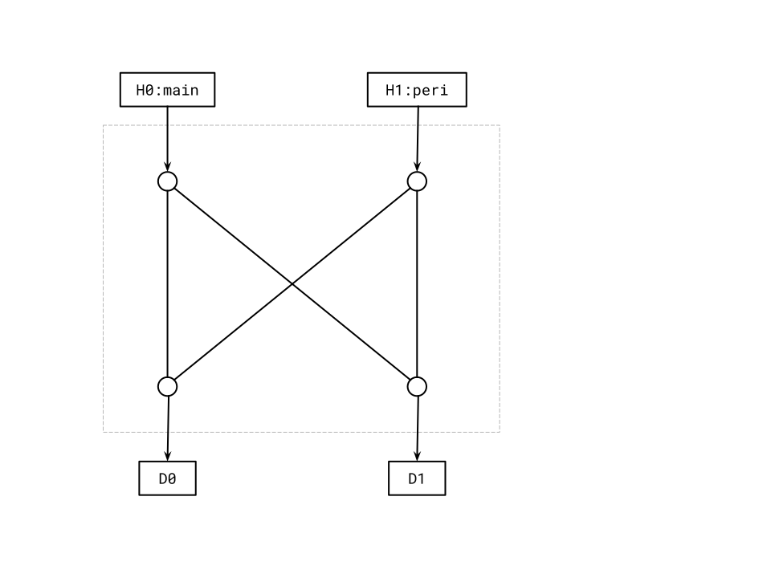
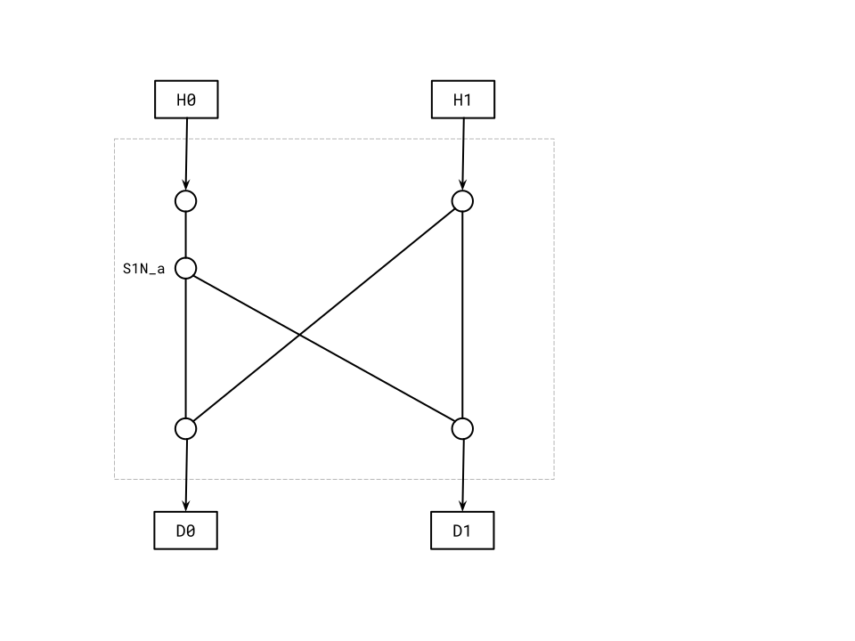
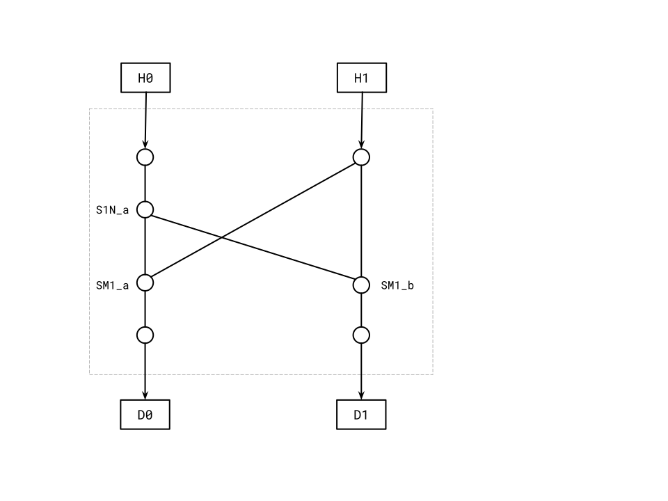
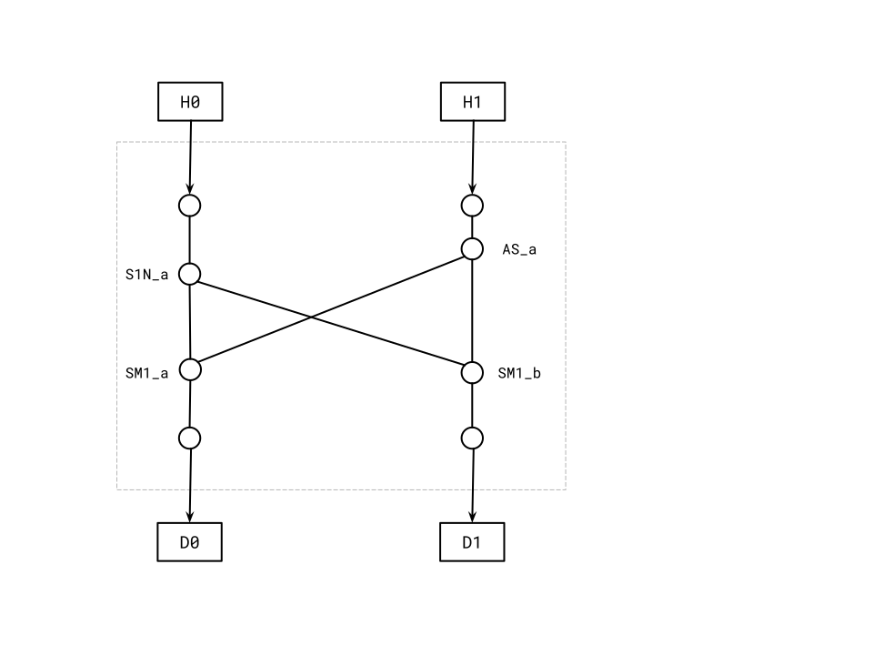

The crossbar tool `tlgen.py` is used to build the TL-UL crossbar RTL.
It can be used standalone or invoked as part of top module generation process (details of top generation forthcoming).
The RTL files found `hw/top_earlgrey/ip/xbar/rtl/autogen` are generated with the crossbar tool.
This document does not specify the details of the internal blocks.
See the [bus specification]() for details on the protocol and the components used in the crossbar.

## Standalone tlgen.py

The standalone utility `tlgen.py` is a Python script to read a crossbar Hjson configuration file and generate a crossbar package, crossbar RTL, and DV test collateral for checking the connectivity.

The `--help` flag is provided for details on how to run the tool.

### Example and Results

An example of the crossbar Hjson is given in `util/example/tlgen/xbar_main.hjson`.

The package file and RTL can be created by the command below:

```console
    $ util/tlgen.py -t util/example/tlgen/xbar_main.hjson -o /tmp/
```

This creates files in `/tmp/{rtl|dv}`.
While generating the RTL, the tool adds detailed connection information in the form of comments to the RTL header.

## Configuration File Format

The `tlgen` script reads an Hjson file containing the crossbar connections and the host and device information.
It describes a generic Directed Acyclic Graph (DAG) with some additional clock information and steering information.

If the tool is used in the process of top generation (`topgen.py`, details forthcoming), a few fields are derived from the top Hjson configuration module structure.

A description of Hjson and the recommended style is in the [Hjson Usage and Style Guide]().

The tables below describe the keys for each context.
The tool raises an error if *Required* keys are missing.
*Optional* keys may be provided in the input files.
The tool also may insert the optional keys with default value.

{}

## Fabrication process

The tool fabricates a sparse crossbar from the given Hjson configuration file.
In the first step, the tool creates Vertices (Nodes) and Edges.
Then it creates internal building blocks such as Asynchronous FIFO, Socket `1:N`, or Socket `M:1` at the elaboration stage.
Please refer to `util/tlgen/elaborate.py` for details.

### Traversing DAG

The tool, after building Nodes and Edges, traverses downstream from every Host node downstream during elaboration.
In the process of traversal, it adds internal blocks as necessary.
Once all Nodes are visited, the tool completes traversing then moves to RTL generation stage.

1. Generates Nodes and Edges from the Hjson.
   Start node should be Host and end node should be Device.
2. (`for loop`) Visit every host
3. If a node has different clock from main clock and not Async FIFO:
    1. (New Node) Create Async FIFO Node.
    2. If the Node is host, revise every edge from the node to have start node in Async FIFO.
      (New Edge) Create an Edge from the Node to Async FIFO.
       Then go to Step 3 with Async FIFO Node.
       Eventually, the connection is changed to `host -> async_fifo -> downstream` from `host -> downstream`.
    3. Revise every Edge to the Node to have Async FIFO as a downstream port.
       (New Edge) Create an Edge from the Async FIFO to the Node.
    4. If it is not Device, raise Error.
       If it is, repeat from Step 2 with next item.
4. If a Node has multiple Edges pointing to it as a downstream port, set `nodes -> this node` and create Socket `M:1`,
    1. (New Node) Create Socket `M:1`.
    2. Revise every Edge to the Node to point to this Socket `M:1` as a downstream port
    3. (New Edge) Create an Edge from Socket `M:1` to the Node.
       The new connection appears as `nodes -> socket_m1 -> this node`.
    4. Repeat from Step 3 with the Node.
5. If a Node has multiple Edges and is not already a Socket `1:N`,
    1. (New Node) Create Socket `1:N` Node.
    2. Revise every Edge from the Node to point to Socket `1:N` as an upstream port
    3. (New Edge) Create an Edge from the Node to Socket `1:N`.
    4. (for loop) Repeat from Step 3 with Socket `1:N`'s downstream Nodes.

Below shows an example of 2 Hosts and 2 Devices connectivity.



Each circle represents a Node and an arrow represents an Edge that has downward direction.
The tool starts from `H0` Node.
As the Node has two downstream Edges and not Socket `1:N`, the tool creates Socket `1:N` based on the condition #5 above.
Then repeat the process from Socket `1:N` Node's children Nodes, `D0` and `D1`.



For `D0`, the tool creates Socket `M:1` based on the condition #4.
It then visit its downstream Node, `D0` again.
In this case, it doesn't create an Async FIFO as the clock is same as main clock.
So it reached the terminal Node.
Then it visits `D1`.
It repeats the same step (condition #4) as `D0`, which creates another Socket `M:1`.



As all Nodes from `H0` have been visited, the tool repeats all steps from `H1`.
It applies condition #3 above as `H1` has a peripheral clock rather than main clock.
So the tool creates an Async FIFO and moves the pointer to the Node and repeats.



The tool applies rule #5 as Async FIFO has multiple downstream Nodes (Edges) and it is not Socket `1:N`.
The tool creates a Socket `1:N` and visits every downstream Node.


Both Nodes have been processed, so no condition is hit.
The tool completes traversing.

### Numbering

After the traversing is completed, Hosts and Devices only have one Edge and internal Sockets have multiple Edges.
The tool assigns increasing numbers to each Edge starting from 0.
This helps the tool to connect between Nodes.

### Propagating the steering information (Address)

After the numbering is done, the tool propagates the steering information, addressing every Device Node to the upstream node until it hits a Socket `1:N`.
Socket `1:N` is the only module that requires `base_addr` and `size_bytes` information.

It is determined that at most one Socket `1:N` exists on the path from a Host to a Device within a crossbar.
If any SoC requires a multi-tiered crossbar design, it should create multiple crossbars to communicate with each other.
This condition does not exist in the current design.

### Connection information

The tool creates DAG connections when it creates RTL to help understanding the fabric.
The information is put as a comment in the header of the RTL.
For instance, with the above 2x2 example, the following information is created.

```console
    $ util/tlgen.py -t util/example/tlgen/xbar_2x2.hjson -o /tmp/
    $ cat /tmp/rtl/xbar_2x2.sv
// ...
// Interconnect
// h0
//   -> s1n_4
//     -> sm1_5
//       -> d0
//     -> sm1_6
//       -> d1
// h1
//   -> asf_7
//     -> s1n_8
//       -> sm1_5
//         -> d0
//       -> sm1_6
//         -> d1
// ...
```
