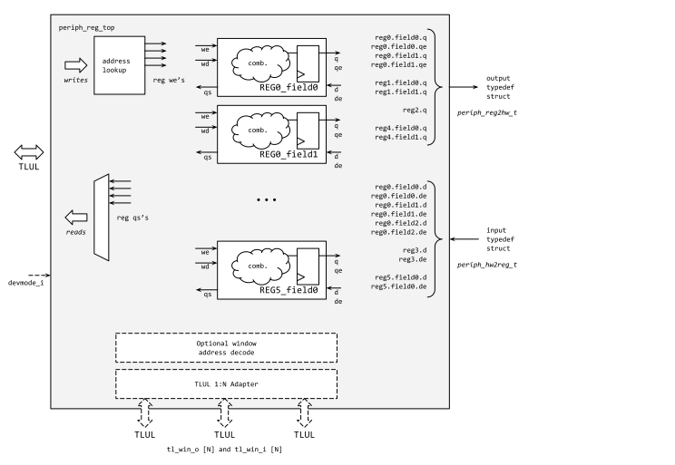
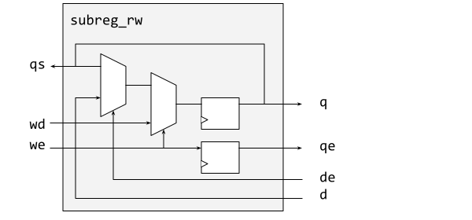
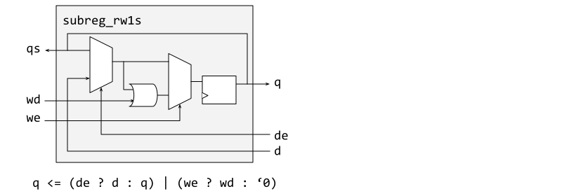
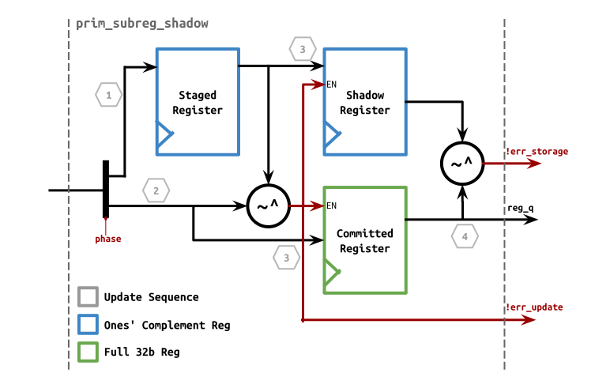

The register tool is used to construct register documentation, register RTL and header files.
It is either used stand-alone or by being invoked as part of Markdown processing.


## Running standalone regtool.py

The standalone `regtool.py` is a Python 3 tool to read configuration and register descriptions in Hjson and generate various output formats.
Currently it can output HTML documentation, standard JSON, compact standard JSON (whitespace removed), Hjson, Verilog RTL and various forms of C header files.

The standard `--help` and `--version` command line flags are supported to print the usage and version information.
Because the version includes information on libraries (which may be different between systems) reporting the version output is sometimes useful when issues are reported.

### Setup and Examples

Setup and examples of the tool are given in the README.md file in the `util/reggen` directory.

## Configuration and Register Definition File Format

The tool input is an Hjson file containing the Comportable description of the IP block and its registers.

A description of Hjson (a variant of JSON) and the recommended style is in the [Hjson Usage and Style Guide]().

The tables below describe valid keys for each context.
It is an error if *required* keys are missing from the input JSON.
*Optional* keys may be provided in the input file as needed, as noted in the tables the tool may insert them (with default or computed values) during validation so the output generators do not have to special case them.
Keys marked as "inserted by tool" should not be in the input JSON (they will be silently overwritten if they are there), they are derived by the tool during validation of the input and available to the output generators.

For more detail on the non-register entries of the Hjson configuration file, see [this section]() of the Comportability Specification.

{}

The tool will normally generate the register address offset by starting from 0 and allocating the registers in the order they are in the input file.
Between each register the offset is incremented by the number of bytes in the `regwidth` (4 bytes for the default 32-bit `regwidth`), so the registers end up packed into the smallest space.

Space may be held for future registers (or to match some other layout) by reserving register slots.
A group containing just the reserved key can be inserted in the list of registers to reserve space.
For example to reserve space for four registers between REGA and REGB (thus make REGB offset be REGA offset plus 5 times the size in bytes of a register):

```hjson
    { name: "REGA",
      ...register definition...
    }
    { reserved: "4" }
    { name: "REGB",
      ...register definition...
    }
```

In other cases, such as separating functional groups of registers, the absolute offset can be specified.
The next register will have the offset specified.
It is an error if the requested offset is less than the current offset.
For example to place ITCR at offset 0x100:

```hjson
    { skipto: "0x100" }
    { name: "ITCR",
      ...register definition...
    }

```

The tool can reserve an area of the memory space for something that is not a simple register, for example access to a buffer memory.
This is done with a `window` declaration.
The window size is specified as `items:` where each item is a `regwidth` wide word.
The size in bytes is thus `(items * (regwidth/8))` bytes.
If byte writes are supported the `byte-write: "True"` flag can be given.
The tool will normally increment the offset to align the region based on its size.

```hjson
    {window: {
         name: "win1"
         items: "64"
         swaccess: "rw"
         desc: '''
               A simple 256 byte window that will be aligned.
           '''
      }
    },

```

The tool will give a warning if the size is not a power of 2.
The tool will also give a warning if the window has software access other than read-only, write-only or read-write.
Both of these warnings are supressed if the description acknowledges there is something special about this window by setting `unusual: "True"` in the window declaration.

The tool will increment the offset to align the region based on its size.
The start address is aligned such that the base item in the window is at an address with all zeros in the low bits.
For instance, if the current offset is 0x104, and the window size in 32-bit words is between 0x11 and 0x20 (inclusive) (i.e. 65-128 bytes), the window base will be set to 0x180.
The next register will immedately follow the window, so will be at the window base address plus the window size in bytes.

Sometimes the window may need to map a structure that is not a full word wide (for example providing debug access to a the memory in a 12-bit wide FIFO).
In this case it may be convenient to have only the low bits of each word valid and use the word address directly as an index (rather than presenting a "packed" structure with the sub-word items packed into as few words as possible).
The window declaration can be annotated to document this.
For example debug access to a 64 entry 12-bit wide FIFO could use a window:

```hjson
    {window: {
         name: "fifodebug"
         items: "64"
         validbits: "12"
         swaccess: "ro"
         desc: '''
               The 64 entry FIFO is mapped into the low 12-bits
               of each regwidth bit wide word.
           '''
      }
    },

```

The tool can generate registers that follow a base pattern, for example when there are configuration fields for multiple instances.
The base pattern defines the bits (which need not be contiguous) used for the first instance and the tool uses this to pack the required number of instances into one or more registers.

For example a fancy GPIO interrupt configuration may have 4 bits per GPIO to allow generation on rising and falling edge and a two bit enum to determine the interrupt severity.
In this case the multireg can be used to build the multiple registers needed.
The description below shows the fields given for GPIO0 and requests generation of 32 instances.
If the registers are 32 bits wide then the tool will pack the four bit instances into four registers `INT_CTRL_0`, `INT_CTRL_1`, `INT_CTRL_2` and `INT_CTRL_3`.

```hjson
    { multireg: {
          name: "INT_CTRL",
      desc: "GPIO Interrupt control",
      count: "32",
      cname: "GPIO",
      swaccess: "rw",
      fields: [
          { bits: "0", name: "POS", resval: "0",
            desc: "Set to interrupt on rising edge"
          }
          { bits: "1", name: "NEG", resval: "0",
            desc: "Set to interrupt on falling edge"
          }
          { bits: "3:2", name: "TYPE", resval: "0",
            desc: "Type of interrupt to raise"
        enum: [
          {value: "0", name: "none", desc: "no interrupt, only log" },
          {value: "1", name: "low", desc: "low priotiry interrupt" },
          {value: "2", name: "high", desc: "high priotiry interrupt" },
          {value: "3", name: "nmi", desc: "non maskable interrupt" }
        ]
          }
      ]
      }
    },

```

Note that the definition bits for the base instance need not be contiguous.
In this case the tool will match the patten for the other instances.
For example the data bits and mask bits could be in the lower and upper parts of a register:

```hjson
    { multireg: {
          name: "WDATA",
      desc: "Write with mask to GPIO out register",
      count: "32",
      cname: "GPIO",
      swaccess: "rw",
      fields: [
          { bits: "0", name: "D", resval: "0",
            desc: "Data to write if mask bit is 1"
          }
          { bits: "16", name: "M", resval: "0",
            desc: "Mask, set to allow data write"
          }
      ]
      }
    }
```

In this case instance 1 will use bits 1 and 17, instance 2 will use 2 and 18 and so on.
Instance 16 does not fit, so will start a new register.

### Verification Tags Definition and Format

This section documents the usage of tags in the register Hjson file.
`Tags` is a list of strings that could add into a register, field, or memory.
It can store special information such as csr register/field exclusion, memory exclusion, reset test exclusion, etc.
Adding a tag follows the string format `"tag_name:item1:item2..."`.
For example:
```hjson
    tags: [// don't write to wdata - it affects several other csrs
             "excl:CsrNonInitTests:CsrExclWrite"]
```

Current `tags` supports:
* CSR tests exclusions:
  Simulation based verification will run four CSR tests (if applicable to the module) through automation.
  Detailed description of this methodology is documented in [CSR utilities]().
  The tag name is `excl`, and items are enum values for what CSR tests to exclude from, and what type of exclusions.
  The enum types for exclusion test are:
  ```systemverilog
  // csr test types
  typedef enum bit [NUM_CSR_TEST-1:0] {
    CsrNonTest        = 5'h0,
    // elementary test types
    CsrHwResetTest    = 5'h1,
    CsrRwTest         = 5'h2,
    CsrBitBashTest    = 5'h4,
    CsrAliasingTest   = 5'h8,
    // combinational test types (combinations of the above), used for exclusion tagging
    CsrNonInitTests   = 5'he, // all but HwReset test
    CsrAllTests       = 5'hf  // all tests
  } csr_test_type_e;
  ```
  The enum types for exclusion type are:
  ``` systemverilog
  typedef enum bit[2:0] {
    CsrNoExcl         = 3'b000, // no exclusions
    CsrExclInitCheck  = 3'b001, // exclude csr from init val check
    CsrExclWriteCheck = 3'b010, // exclude csr from write-read check
    CsrExclCheck      = 3'b011, // exclude csr from init or write-read check
    CsrExclWrite      = 3'b100, // exclude csr from write
    CsrExclAll        = 3'b111  // exclude csr from init or write or write-read check
  } csr_excl_type_e;
  ```

## Register Tool Hardware Generation

This section details the register generation for hardware instantiation.
The input to the tool for this generation is the same `.hjson` file described above.
The output is two Verilog files that can be instantiated by a peripheral that follows the [Comportability Guidelines]().

The register generation tool will generate the RTL if it is invoked with the `-r` flag.
The `-t <directory>` flag is used to specify the output directory where the two files will be written.
As an example the tool can be invoked to generate the uart registers with:

```console
$ cd hw/ip/uart/doc
$ ../../../../util/regtool.py -r -t ../rtl uart.hjson
```

The first created file (`name_reg_pkg.sv`, from `name.hjson`) contains a SystemVerilog package definition that includes type definitions for two packed structures that have details of the registers and fields (all names are converted to lowercase).
The `name_reg2hw_t` structure contains the signals that are driven from the register module to the rest of the hardware (this contains any required `.q, .qe`, and `.re` signals described below).
The `name_hw2reg_t` structure contains the signals that are driven from the rest of the hardware to the register module (this contains any required `.d` and `.de` signals described below).
The file also contains parameters giving the byte address offsets of the registers (these are prefixed with the peripheral `name` and converted to uppercase).

The second file (`name_reg_top.sv`) is a SystemVerilog file that contains a module (`name_reg_top`) that instantiates the registers.
This module connects to the TL-UL system bus interface and provides the register connections to the rest of the hardware.
If the register definition contains memory windows then there will be subordinate TL-UL bus connections for each window.
The module signature is:

```systemverilog
module name_reg_top (
  input clk_i,
  input rst_ni,

  // Below Regster interface can be changed
  input  tlul_pkg::tl_h2d_t tl_i,
  output tlul_pkg::tl_d2h_t tl_o,

  // This section is only provided if the definition includes
  // 1 or more "window" definitions and contains an array of
  // secondary TL-UL bus connectors for each window
  // Output port for window
  output tlul_pkg::tl_h2d_t tl_win_o  [1],
  input  tlul_pkg::tl_d2h_t tl_win_i  [1],

  // To HW
  output uart_reg_pkg::uart_reg2hw_t reg2hw, // Write
  input  uart_reg_pkg::uart_hw2reg_t hw2reg  // Read
);
```

The sections below describe the hardware functionality of each register type both in terms of the RTL created, and the wires in the structures that will come along with the register.

## Overall block diagram

The diagram below gives an overview of the register module, `name_reg_top`.



In this diagram, the TL-UL bus is shown on the left.
Logic then breaks down individual write requests and read requests based upon the assigned address of the bus requests.
Writes that match an address create an internal write enable to an individual register (or collection of registers in the case of a field), and return a successful write response.
Reads that match an address return the associated data content for that register.
See the section below on requests that don't match any register address.

In the middle are the collections of registers, which are a function of the `hjson` input, and a definition of the functionality of each register (read-only, read-write, etc), detailed below.
These are instantiations of the primitives `prim_subreg`, `prim_subreg_ext` and `prim_subreg_shadow` found in the lowRISC primitive library (lowrisc:prim:all).
These take as inputs the write requests from the bus as well as the hardware struct inputs associated with that register.
They create as output the current state of the register and a potential write enable.
The `prim_subreg` module takes a parameter `SWACCESS` that is used to adjust the implementation to the access type required.

On the right are the typedef structs that gather the `q` and `qe`s into one output bundle, and receive the bundled `d` and `de` inputs.

The addess decode and TL-UL 1:N adapter shown at the bottom are created only if the register definition includes one or more `window:` descriptions.
Each window is given its own TL-UL connection and the implementation must provide a device interface.

It is notable that in the current definition, each field of a register has its own register instantiation.
This is required because the definitions allow unique `swaccess` and `hwaccess` values per field, but could be done at the register level otherwise.
The individual bundled wires are associated with the fields rather than the full register, so the designer of the rest of the peripheral does not need to know the bit range association of the individual fields.

### Error responses

Writes and reads that target addresses that are not represented within the register list typically return an error.
However, for security modules (Comportability definition forthcoming), this is under the control of a register module input signal `devmode_i`.
This signal indicates whether the whole SOC device is in development or production mode.
For security peripherals in production mode, it is desired to **not** send an error response, so write misses silently fail, and read misses silently fail, but return either random data (TBD) or all `1`s for response data (i.e. `0xFFFFFFFF` for a 32b register).
For non-security peripherals, or when in development mode (`devmode_i == 1`) these writes and reads to undefined addresses will return with TL-UL error response.

Other error responses (always sent, regardless of `devmode_i`) include for the following reasons:

* TL-UL `a_opcode` illegal value
* TL-UL writes of size smaller than register size
  * I.e. writes of size 8b to registers > 8b will cause error (explicitly: if it has field bits within `[31:08]`)
  * I.e. writes of size 16b to registers > 16b will cause error (explicitly: if it has field bits within `[31:16]`)
* TL-UL writes of size smaller than 32b that are not word-aligned
  * I.e. writes of size 8b or 16b that are not to an address that is 4B aligned return in error.

Reads of size smaller than full word (32b) return the full register content and do not signal error.
Reads response data is always in its byte-channel, i.e. a one-byte read to `address 0x3` will return the full word with the correct MSB in bits `[31:24]` on the TL-UL response bus (as well as the not-asked-for bytes 2:0 in `[23:0]`).

Note with the windowing option, a new TL-UL bus (or more) is spawned and managed outside of this register module.
Any window that makes use of the byte masks will include the `byte-write: "true"` keyword in their definition.
Error handling by that TL-UL bus is **completely under the control of the logic that manages this bus.**
It is recommended to follow the above error rules (including `devmode_i` for address misses on security peripherals) based on the declared number of `validbits`: for the window, but there are some cases where this might be relaxed.
For example, if the termination of the TL-UL bus is a memory that handles byte and halfword writes via masking, errors do not need be returned for unaligned sub-word writes.

## Register definitions per type

The definition of what exactly is in each register type is described in this section.
As shown above, the maximally featured register has inputs and outputs to/from both the bus interface side of the design as well as the hardware interface side.
Some register types don't require all of these inputs and outputs.
For instance, a read-only register does not require write data from the bus interface (this is configured by the `SWACCESS` parameter to the `prim_subreg` module).
The maximally defined inputs to this register block (termed the `subreg` from here forward) are given in the table below.
Note that these are instantiated per field, not per register, so the width is the width of the field.
The direction is the Verilog signal definition of `subreg` for that type.

<table>
  <tr>
   <td><strong>name</strong>
   </td>
   <td><strong>direction</strong>
   </td>
   <td><strong>description</strong>
   </td>
  </tr>
  <tr>
   <td><code>we</code>
   </td>
   <td>input
   </td>
   <td>Write enable from the bus interface, scalar
   </td>
  </tr>
  <tr>
   <td><code>wd[]</code>
   </td>
   <td>input
   </td>
   <td>Write data from the bus interface, size == field size
   </td>
  </tr>
  <tr>
   <td><code>qs[]</code>
   </td>
   <td>output
   </td>
   <td>Output to read response data mux, size == field_size. This is typically the same as <code>q[]</code> except for <code>hwext</code> registers.
   </td>
  </tr>
  <tr>
   <td><code>de</code>
   </td>
   <td>input
   </td>
   <td>Hardware data enable from peripheral logic, scalar, should be set when the hardware wishes to update the register field
   </td>
  </tr>
  <tr>
   <td><code>d[]</code>
   </td>
   <td>input
   </td>
   <td>Hardware data from peripheral logic, size == field size
   </td>
  </tr>
  <tr>
   <td><code>qe</code>
   </td>
   <td>output
   </td>
   <td>Output register enable, scalar, true when bus interface writes to subreg
   </td>
  </tr>
  <tr>
   <td><code>q[]</code>
   </td>
   <td>output
   </td>
   <td>Output register content, size == field size. This output typically goes to both the hardware bundle output <code>q</code> as well as the software read response mux output <code>qs[]</code>.
   </td>
  </tr>
  <tr>
   <td><code>re</code>
   </td>
   <td>output
   </td>
   <td>Indicates to hwext registers that the bus is reading the register.
   </td>
  </tr>
</table>


### Type RW

The first register type is the read-write register, invoked with an `hjson` attribute `swaccess` type of `rw`.
There is a variant of this below, this is the default variant.
This uses the `prim_subreg` with the connections shown.
The connectivity to the hardware struct bundles are a function of the `hwaccess` and `hwqe` attributes, and will be discussed here as well.




In this diagram, the maximum connection for subreg_rw is shown.
Coming in from the left (bus) are the software write enable and write data, which has the highest priority in modifying the register contents.
These are present for all RW types.
The "final answer" for the register content is stored in the subreg module, and presented to the peripheral hardware as the output `q` and to bus reads as the output `qs`.
Optionally, if the `hwaccess` attribute allows writes from the hardware, the hardware can present updated values in the form of data enable (`de`) and update data (`d`).
If the data enable is true, the register content is updated with the update data.
If both software and hardware request an update in the same clock cycle (i.e. both `de` and `we` are true), the software updated value is used, as shown in the diagram.

The `hwaccess` attribute value does not change the contents of the subreg, but the connections are potentially modified.
The attribute `hwaccess` has four potential values, as shown earlier in the document: `hrw, hro, hwo, none`.
A `hwaccess` value of `hrw` means that the hardware wants the ability to update the register content (i.e. needs connection to `d` and `de`), as well as see the updated output (`q`).
`hwo` doesn't care about the output `q`, but wants to update the register value.
This is the default for registers marked for software read-only access.
`hro` conversely indicates the hardware doesn't need to update the content, but just wants to see the value written by software.
This is the default for fields where the software access is read-write or write-only.
Finally an attribute value of `none` asks for no interface to the hardware, and might be used for things like scratch registers or DV test registers where only software can modify the value, or informational registers like version numbers that are read-only by the software.

Another attribute in the register description `hwqe`, when true indicates that the hardware wants to see the software write enable exported to the peripheral logic.
This is just a registered version of the bus side write-enable `we` so that its rising edge aligns with the change in the `q` output.
There only needs to be one instantiated `qe` flop per register, but it is provided in the reg2hw structure for each field.

### Type RW HWExt

There is an attribute called `hwext` which indicates, when true, that the register value will be maintained **outside** the auto-generated logic.
It is up to the external logic to implement the correct functionality as indicated by the `swaccess` attribute.
In other words, **there is no guarantee** that the custom logic will correctly implement `rw`, or whichever attribute is included in the register definition.
It is expected that this functionality is only needed for custom features outside the scope of the list of supported swaccess features, such as masked writes or access to FIFOs.
Note that these could be done non-hwext as well, with `swaccess==rw` and `hwaccess=rw`, but could lose atomicity due to the register included within the autogenerated region.
The block diagram below shows the maximally functional `hwext` `RW` register, with some assumption of the implementation of the register on the outside.
This is implemented by the `prim_subreg_ext` module which is implemented with `assign` statements just as the wiring shown suggests.
In this diagram the `q` is the `q` output to the hardware, while the `qs` is the output to the read response mux on the software side.
The storage register is shown in the custom portion of the logic.
Finally, note that no `de` input is required from the rest of the peripheral hardware, only the `d` is added to the struct bundle.


Note the timing of `qe` is one cycle earlier in this model than in the non-hwext model.


### Type RO, with hwext and zero-gate options

Read-only type registers can be thought of as identical as `RW` types with no `wd` and `we` input.
They are implemented as `prim_subreg` with those inputs disabled.
Similarly `hwext RO` registers simply pass the d input from the outside world to the data mux for software read response.

There is one special case here [not yet implemented] where `swaccess` is `ro` and `hwaccess` is `none` or `hro` and `hwext` is true.
In this case, a hardwired value is returned for a software read equal to the default value assigned to the register this can be useful for auto-generated register values with no storage register required.

### Type RC

Registers of software access type `rc` are special cases of `RO`, but require an additional signal from the address decode logic.
This signal `re` indicates that this register is being read, in which case the contents should be set to zero.
Note this register is not recommended but might be required for backwards compatibility to other IP functionality.
At the moment `hwext` is not allowed to be true for `RC` since there is no exporting of the `re` signal.
If this is required, please add a feature request.

### Type WO

Write only registers are variants of `prim_subreg` where there is no output back to the software read response mux, so the `d` and `de` pins are tied off.
If there is no storage required, only an indication of the act of writing, then `hwext` should be set to true and the outside hardware can handle the write event.

### Type R0W1C, RW1S, RW1C and RW0C

Certain `RW` register types must be implemented with special configuration of `prim_subreg` since the act of writing causes the values to be set in unique ways.
These types are shown in the block diagrams below.
Type `R0W1C` not shown is just a special case of `RW1C` where the q output is not sent back to the software read response mux, but the value `0` is sent instead.
Note the `qe` is removed for readability but is available with the hwqe attribute.





#### Simultaneous SW and HW access

As shown in the module descriptions, the subreg needs to handle the case when both hardware and software attempt to write at the same time.
As is true with the RW type, the software has precedence, but it is more tricky here.
The goal for these types of registers is to have software clear or set certain bits at the same time hardware is clearing or setting other bits.
So in theory what software is clearing, hardware is setting, or vice-versa.
An example would be where hardware is setting interrupt status bits, and software is clearing them, using RW1C.
The logic for RW1C shows how this is implemented in the module:

```systemverilog
q <= (de ? d : q) & (we ? ~wd : '1)
```

In this description if the hardware is writing, its value is sent to the logic that potentially clears that value or the stored value.
So if the hardware accidentally clears fields that the software hasn't cleared yet, there is a risk that events will not be seen by software.
The recommendation is that the hardware feed the `q` value back into `d`, only setting bits with new events.
Then there will be no "collision" between hardware setting events and software clearing events.
The HW could have chosen to simply treat `d` and `de` as set-only, but the preference is to leave the `subreg` simple and allow the hardware to do either "the right thing" or whatever it feels is appropriate for its needs.
(Perhaps it is a feature to clear all events in the hardware.)

The one "conflict" that is common and worth mentioning is `RW1C` on an interrupt vector.
This is the typical scenario where hardware sets bits (representing an interrupt event), and software clears bits (indicating the event has been handled).
The assumption is that between the hardware setting and software clearing, **software has cleaned up whatever caused the event in the first place**.
But if the event is still true (the HW `d` input is still `1`) then the clear should still have effect for one cycle in order to create a new interrupt edge.
Since `d` is still `1` the `q` will return to `1` after one cycle, since the clean up was not successful.

#### HWExt RW1C etc.

It is legal to create `RW1C`, `RW1S`, etc. with `hwext` true.
In these cases the auto-generated hardware is simply the same as the hwext `RW` register shown earlier.
This causes all of the implementation to be done outside of the generated register block.
There is no way to guarantee that hardware is doing the right thing, but at least the `RW1C` conveys the notion to software the intended effect.

Similarly it is legal to set `hwqe` true for any of these register types if the clearing wants to be monitored by the hardware outside.

## Shadow Registers

If in the `.hjson` file the optional key `shadowed` is set to `true` for a particular register group, the register tool will implement the corresponding registers including all fields as shadow registers using the `prim_subreg_shadow` module.
The following section describes the concept in detail.

### Overview

For Comportable designs used in sensitive security environments, for example AES or HMAC peripherals, there may be a need to guard against fault injection attacks.
One of the surfaces under threat are critical configuration settings that may be used to control keys, region access control and system security configuration.
These registers do not typically contain secret values, but can be vulnerable to fault attacks if a fault can alter the state of a register to a specific state.

The fault attacks targeting these registers can come in a few forms:
- A fault attack directly on the storage element.
- A fault attack on peripheral logic (for example resets) that cause the registers to revert to a default state.
- A fault attack during the process of the write to disrupt the actual written value.

Shadow registers are a mechanism to guard sensitive registers against this specific type of attack.
They come at a cost of increased area, and a modified SW interaction, see below.
Usage of shadow registers should be evaluated with this impact in mind.

### Description

The diagram below visualizes the internals of the `prim_subreg_shadow` module used to implement shadow registers.



When compared to a normal register, the `prim_subreg_shadow` module is comprised of two additional storage components, giving three storage flops in total.
The **staged** register holds a written value before being committed.
The **shadow** register holds a second copy after being committed.
And the the standard storage register holds the **committed** value.

Under the hood, these registers are implemented using the `prim_subreg` module.
This means a shadow register can implement any of the types described in [this section]().

The general behavior of updating a shadow register is as follows:
1. Software performs a first write to the register.

   The staged register takes on the new value.
   The committed register is **not** updated, so the hardware still sees the old value.

1. Software performs a second write to the register (same address):

   - If the data of the second write matches the value in the staged register, **both** the shadow register and the committed register are updated.
   - If the data of the second write does **not** match the contents stored in the staged register, an update error is signaled to the hardware with a pulse on `err_update`.

   The phase is tracked internally to the module.
   If needed, software can put the shadow register back into the first phase by performing a read operation.
   If the register is of type `RO`, software cannot interfere with the update process and read operations do not clear the phase tracker.

1. If the value of the shadow register and the committed register are **ever** mismatched, a storage error is signaled to the hardware using the `err_storage` signal.

For added security, the staged and shadow registers store the ones' complement values of the write data (if the write data is `0x33`, `0xCC` is stored in the staged and shadow register).
This is done such that it is more difficult for a localized glitch to cause shadow and committed registers to become the same value.

### Programmer's model

The programmer needs to be aware of the functional behavior when dealing with shadow registers.
To this end, the naming of registers which contain a shadowed copy is suffixed by `_SHADOWED` in the generated collateral.
This is ensured by the register tool.

Software should ensure that shadow registers are always accessed exclusively.
If the two write operations required for an update are for some reason interleaved by a third write operation, this can trigger an update error depending on the written data.
Such situations can be avoided by using some form of mutex at the driver level for example.
Alternatively, software can enforce exclusive shadow register access by temporarily disabling interrupts with a sequence as follows:
1. Disable interrupt context.
1. Perform 1st write to shadow register.
1. Perform 2nd write to shadow register.
1. Read back the shadow register to ensure data matches the expected value.
   This step is not strictly required.
   It helps to identify update errors and can unveil potential fault attacks on the write data lines during process of the write.
1. Restore interrupt context.

By performing a read operation, software can at any time put the shadow register back into the first phase, thereby preventing that a subsequent write triggers an update error, and recovering from situations where it is not clear in which phase the register is.
However, if the register is of type `RO`, meaning if only the hardware can update the register, read operations do not clear the phase tracker.

In addition, error status registers can be added to inform software about update errors.

### Design integration

The following aspects need to be considered when integrating shadow registers into the system.

- Non-permissive reset values:

  A fault attack on the reset line can reset the staged, shadow and committed registers altogether and not generate an error.
  It may remain undetected by the system.
  It is thus **highly recommended** to use non-permissive reset values and use software for configuring more permissive values.

- Error hook-ups:
  - Storage errors signaled to the hardware in `err_storage` are fatal, and should be hooked up directly into the [alert system]().
  - Update errors signaled to the hardware in `err_update` may be software errors and do not affect the current committed value; thus they can be considered informational bugs that are collected into error status or interrupts, and optionally alerts.
    They do not generate error responses on the TL-UL system bus interface.

- Hardware and software cost:

  Shadow registers are costly as they imply considerable overheads in terms of circuit area as well as software complexity and performance.
  They should not be used lightly nor extensively.
  For example, if a register is reconfigured frequently, using restrictive reset values, possibly combined with parity bits and/or with verification of the register value after writing, might be more suitable.
  In contrast, for registers that are more static the performance overhead of shadow registers is negligible.
  Also, for some registers it is not possible to define restrictive reset values, e.g., due to process variation.
  The use of shadow registers is more justified in such cases.
  Example use cases for shadow registers are:
  - Main control registers of cryptographic accelerators such as AES and HMAC where fault attacks could enforce potentially less secure operating modes.
  - Critical and security-related infrastructure such as:
    - Alert escalation and sensor configuration registers, and
    - Countermeasure tuning and functional/bandgap calibration registers.

### DV shadow register alert test automation

In DV, the `shadow_reg_errors` automated test will check if shadow registers' update and storage errors trigger the correct alerts.
This alert automation test requires the user to add the following items in `.hjson` file under each shadow register:
- Update_err_alert: Alert triggered by a shadow register's update error
- Storage_err_alert: Alert triggered by a shadow register's storage error

### Future enhancements

The following features are currently not implemented but might be added in the future.

- Lightweight implementations:

  Depending on the use case and security requirements, lightweight shadow register implementations can be more suitable.
  Possible options include:
  - Storing only a hash value or parity bits in the staged and/or shadow register instead of the full data word.
    This can help to reduce circuit area overheads but may weaken security.
  - Removing the staged register and relying on software to verify the written value.
    This helps to reduce circuit area but increases software complexity.
    If lower security can be tolerated, avoiding the read back after a write can make this implementation transparent to software.
  - A combination of the two options.
    For example, removing the staged register and storing parity bits only in the shadow register may be suitable for physical memory protection (PMP) registers.

- Ones' complement inversion in software:

  The ones' complement inversion could be done in software.
  This means software would first write the ones' complement of the data and only the second write would be the real data.
  This may make following bus dumps easier because the data values will be different.

- Shadow resets:

  Staged and shadow registers could use a separate shadow reset from the committed register.
  This would imply that each module which contains shadow registers will receive two reset lines from the reset controller.
  The benefit is that a localized reset glitch attack will need to hit both reset lines, otherwise a storage error is triggered.

  Reset skew may need to be handled separately.
  Depending on the design, the reset propagation **may** be multi-cycle, and thus it is possible for the shadow register and committed register to not be reset at the same time when resets are asserted.
  This may manifest as an issue if the reset skews are **not** balanced, and may cause register outputs to change on the opposite sides of a clock edge for the receiving domain.
  It is thus important to ensure the skews of the committed and shadow reset lines to be roughly balanced and/or downstream logic to correctly ignore errors when this happens.
  Note that a module may need to be reset during operation of the system, i.e., when the [alert system]() is running.

  Software-controllable resets should be avoided.
  If a single reset bit drives both normal and shadow resets, then the problem is simply moved to a different place.
  If multiple reset bits drive the resets, then it becomes a question of what resets those reset bits, which may itself have the same issue.

## Generating C Header Files

The register tool can be used to generate C header files.
It is intended that there will be several generators to output different formats of header file.

### Simple hello_world test headers

The register generation tool will generate simple headers if it is invoked with the `-D` flag.
The `-o <file.h>` flag may be used to specify the output file.
As an example the tool can be invoked to generate the uart headers with:

```console
$ cd hw/ip/uart/doc
$ ../../../../util/regtool.py -D -o ~/src/uart.h uart.hjson
```

This format assumes that there is a base address `NAME`n`_BASE_ADDR` defined where n is an identifying number to allow for multiple instantiations of peripherals.
It provides a definition `NAME_REG(n)` that provides the address of the register in instantiation n.
Single-bit fields have a define with their bit offset.
Multi-bit fields have a define for the bit offset and an mask and may have defines giving the enumerated names and values.
For example:

```c
// UART control register
#define UART_CTRL(id)                    (UART ## id ## _BASE_ADDR  + 0x0)
# define UART_CTRL_TX                    0
# define UART_CTRL_RX                    1
# define UART_CTRL_NF                    2
# define UART_CTRL_SLPBK                 4
# define UART_CTRL_LLPBK                 5
# define UART_CTRL_PARITY_EN             6
# define UART_CTRL_PARITY_ODD            7
# define UART_CTRL_RXBLVL_MASK           0x3
# define UART_CTRL_RXBLVL_OFFSET         8
# define UART_CTRL_RXBLVL_BREAK2         0
# define UART_CTRL_RXBLVL_BREAK4         1
# define UART_CTRL_RXBLVL_BREAK8         2
# define UART_CTRL_RXBLVL_BREAK16        3
```

## Generating documentation

The register tool can be used standalone to generate HTML documentation of the registers.
However, this is normally done as part of the Markdown documentation using the special tags to include the register definition file and insert the configuration and register information.
