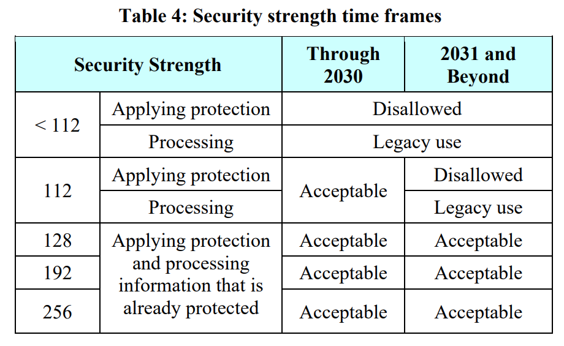

# OpenTitan Cryptography Library User Guide

This page is intended for users of the OpenTitan cryptographic library.
The library is written in C and uses OpenTitan's hardware blocks for accelerated cryptography.
It generally attempts to minimize code size and protect against side-channel and fault-injection attacks, including by physically present attackers.

**Note: at the time of writing, the crypto library is still under development, and not all algorithms described in this page are fully implemented and tested.**

This page:
- Lists a quick reference for [supported algorithms](#supported-algorithms)
- Enumerates all of the cryptolib's [data structures](#data-structures)
- Shows and explains the interfaces for:
  - [AES-based operations](#aes)
  - [Hash functions](#hash-functions)
  - [Message authentication](#message-authentication)
  - [RSA operations](#rsa)
  - [Elliptic curve cryptography](#elliptic-curve-cryptography)
  - [Deterministic random bit generation (DRBG)](#deterministic-random-bit-generation)
  - [Key derivation functions (KDF)](#key-derivation)
  - [Key import and export](#key-import-and-export)
- Explains how [asynchronous operations](#asynchronous-operations) work
- Lists the [security strength](#security-strength) of each algorithm
- Lists [references](#reference) for further reading

## Supported Algorithms

The following is a quick reference for algorithms and modes supported by the OT cryptolib.
For more details, see later sections (links in the "category" column).

| Category        | Supported schemes         |
|-----------------|---------------------------|
| [**AES**](#aes) | AES-{ECB,CBC,CFB,OFB,CTR} AES-KWP AES-GCM |
| [**Hash functions**](#hash-functions) | SHA2-{256,384,512} SHA3-{224,256,384,512} SHAKE{128,256} (XOF) cSHAKE{128,256} (XOF) |
| [**Message authentication**](#message-authentication) | HMAC-SHA256 KMAC{128,256} |
| [**RSA**](#rsa) | RSA-{2048,3072,4096} |
| [**Elliptic curve cryptography**](#elliptic-curve-cryptography) | ECDSA-{P256,P384} ECDH-{P256,P384} Ed25519 X25519 |
| [**Deterministic random bit generation**](#deterministic-random-bit-generation) | AES-CTR-DRBG |
| [**Key derivation**](#key-derivation) | HMAC-KDF-CTR KMAC-KDF-CTR |

## Data structures

These are the basic data structures used by the crypto library to communicate with the caller.
Note that in the OpenTitan cryptolib, memory allocation is left mostly to the caller.

### Status Codes

All functions in the OpenTitan cryptolib return `crypto_status_t`.
This design is compatible with OpenTitan's internal `status_t` datatype.

{{#header-snippet sw/device/lib/crypto/include/datatypes.h crypto_status_t }}

However, the cryptolib additionally guarantees that all status codes will be bit-compatible to the `crypto_status_value` enum.
Callers who do not wish to use `status_t` infrastructure may compare to these values.

{{#header-snippet sw/device/lib/crypto/include/datatypes.h crypto_status_value }}

### Data buffers

The cryptolib uses byte buffers for data that may not be 32-bit aligned, such as message inputs to hash functions.

{{#header-snippet sw/device/lib/crypto/include/datatypes.h crypto_byte_buf }}
{{#header-snippet sw/device/lib/crypto/include/datatypes.h crypto_const_byte_buf }}

The cryptolib uses word buffers to enforce alignment where either the data is guaranteed to be aligned or where it is especially helpful for implementation reasons.
Since most OpenTitan hardware interfaces expect aligned data, this is important sometimes for security and simplicity.
Word buffers can be safely interpreted as byte streams by the caller; the bytes are arranged so that on a little-endian processor like Ibex, they will read as the correct byte-stream even if the specification calls for big-endian.

{{#header-snippet sw/device/lib/crypto/include/datatypes.h crypto_word32_buf }}
{{#header-snippet sw/device/lib/crypto/include/datatypes.h crypto_const_word32_buf }}

### Key data structures

Keys receive extra protection from the cryptolib.
Public keys are represented in plain, "unblinded" form, but have a checksum to protect their integrity.
The checksum is implementation-specific and may change over time.
Therefore, the caller should not compute the checksum themselves; use the key import/export functions to construct unblinded keys.

{{#header-snippet sw/device/lib/crypto/include/datatypes.h crypto_unblinded_key }}

Secret keys are "blinded", meaning that keys are represented by at least two "shares" the same size as the key.
This helps protect against e.g. power side-channel attacks, because the code will never handle a bit of the "real" key, only the independent shares.
The choice of blinding method depends on the algorithm and is implementation-specific.
Callers should use key import/export functions to interpret blinded keys.

{{#header-snippet sw/device/lib/crypto/include/datatypes.h crypto_blinded_key }}

As shown above, all secret keys have a configuration value.
The configuration helps the cryptolib interpret how the key is represented and how it is permitted to be used.
Nothing in the configuration is typically secret.

{{#header-snippet sw/device/lib/crypto/include/datatypes.h crypto_key_config }}

In most cases, the caller needs to provide a configuration before calling algorithms which generate secret keys.

Callers may request keys from OpenTitan's [key manager block][keymgr] by setting `hw_backed` and `diversification_hw_backed` in the key configuration.
If the key is produced by the key manager, then the keyblob has length 0; the diversification information is enough to produce the key.

### Bookkeeping data structures

This versioning enum helps the cryptolib keep backwards-compatibility if the representation of opaque data-structures changes.
This way, a later version of the cryptolib can still recognize and interpret a data structure produced by an earlier version, for example a stored key.

{{#header-snippet sw/device/lib/crypto/include/datatypes.h crypto_lib_version }}

The required security level for the blinded key is chosen using the enum below.
At high security levels, the crypto library will prioritize protecting the key from sophisticated attacks, even at large performance costs. If the security level is low, the crypto library will still try to protect the key, but may forgo the most costly protections against it.

{{#header-snippet sw/device/lib/crypto/include/datatypes.h crypto_key_security_level }}

Data structures for key types and modes help the cryptolib recognize and prevent misuse of a key for the wrong algorithm or mode.

{{#header-snippet sw/device/lib/crypto/include/datatypes.h key_type }}
{{#header-snippet sw/device/lib/crypto/include/datatypes.h aes_key_mode }}
{{#header-snippet sw/device/lib/crypto/include/datatypes.h hmac_key_mode }}
{{#header-snippet sw/device/lib/crypto/include/datatypes.h kmac_key_mode }}
{{#header-snippet sw/device/lib/crypto/include/datatypes.h rsa_key_mode }}
{{#header-snippet sw/device/lib/crypto/include/datatypes.h ecc_key_mode }}
{{#header-snippet sw/device/lib/crypto/include/datatypes.h kdf_key_mode }}
{{#header-snippet sw/device/lib/crypto/include/datatypes.h key_mode }}

### Algorithm-specific data structures

#### AES data structures

{{#header-snippet sw/device/lib/crypto/include/aes.h block_cipher_mode }}
{{#header-snippet sw/device/lib/crypto/include/aes.h aes_operation }}
{{#header-snippet sw/device/lib/crypto/include/aes.h aes_padding }}
{{#header-snippet sw/device/lib/crypto/include/aes.h aead_gcm_tag_len }}

#### Elliptic curve data structures

{{#header-snippet sw/device/lib/crypto/include/ecc.h ecc_signature }}
{{#header-snippet sw/device/lib/crypto/include/ecc.h eddsa_sign_mode }}
{{#header-snippet sw/device/lib/crypto/include/ecc.h ecc_public_key }}
{{#header-snippet sw/device/lib/crypto/include/ecc.h ecc_domain }}
{{#header-snippet sw/device/lib/crypto/include/ecc.h ecc_curve_type }}
{{#header-snippet sw/device/lib/crypto/include/ecc.h ecc_curve }}

#### Hash data structures

{{#header-snippet sw/device/lib/crypto/include/datatypes.h hash_mode }}
{{#header-snippet sw/device/lib/crypto/include/datatypes.h hash_digest }}

#### Key derivation data structures

{{#header-snippet sw/device/lib/crypto/include/kdf.h kdf_type }}

#### Message authentication data structures

{{#header-snippet sw/device/lib/crypto/include/mac.h kmac_mode }}

#### RSA data structures

{{#header-snippet sw/device/lib/crypto/include/rsa.h rsa_padding }}
{{#header-snippet sw/device/lib/crypto/include/rsa.h rsa_private_key }}
{{#header-snippet sw/device/lib/crypto/include/rsa.h rsa_key_size }}
{{#header-snippet sw/device/lib/crypto/include/rsa.h rsa_public_key }}

### Private data structures

The following data structures are considered implementation specific.
The caller knows their size and must allocate space for them.
However, they are essentially scratchpad space for the underlying implementation and should not be modified directly.

{{#header-snippet sw/device/lib/crypto/include/hash.h hash_context }}
{{#header-snippet sw/device/lib/crypto/include/mac.h hmac_context }}
{{#header-snippet sw/device/lib/crypto/include/aes.h gcm_ghash_context }}

## AES

OpenTitan includes a hardware [AES block][aes].
The AES block supports five cipher modes (ECB, CBC, CFB, OFB, and CTR) with a key length of 128 bits, 192 bits and 256 bits.

The crypto library includes all five basic cipher modes supported by the hardware, as well as the AES-KWP key-wrapping scheme and AES-GCM authenticated encryption scheme.
Padding schemes are defined in the **aes\_padding\_t** structure from [this section](#aes-data-structures).

Because the crypto library uses the hardware AES block, it does not expose an init/update/final interface for AES, since this would risk locking up the block if an operation is not finalized.

### Block Cipher

A one-shot API initializes the required block cipher mode of operation (ECB, CBC, CFB, OFB or CTR) and performs the required encryption/decryption.

{{#header-snippet sw/device/lib/crypto/include/aes.h otcrypto_aes }}

### AES-GCM

AES-GCM (Galois/Counter Mode) is an authenticated encryption with associated data (AEAD) scheme.
It protects both the confidentiality and authenticity of the main input and the authenticity (but not confidentiality) of the associated data.

GCM is specified in [NIST SP800-38D][gcm-spec].
One important note for using AES-GCM is that shorter tags degrade authentication guarantees, so it is important to fully understand the implications before using shortened tags.

In addition, we expose the internal GHASH and GCTR operation that GCM relies upon (from [NIST SP800-38D][gcm-spec], section 6.4).
This allows flexibility for use-cases that need custom GCM constructs: for example, we do not provide AES-GCM in streaming mode here because it encourages decryption and processing of unauthenticated data, but some users may need it for compatibility purposes.
Additionally, the GHASH operation can be used to construct GCM with block ciphers other than AES.

#### GCM - Authenticated Encryption and Decryption

{{#header-snippet sw/device/lib/crypto/include/aes.h otcrypto_aes_encrypt_gcm }}
{{#header-snippet sw/device/lib/crypto/include/aes.h otcrypto_aes_decrypt_gcm }}

#### GCM - GHASH and GCTR

{{#header-snippet sw/device/lib/crypto/include/aes.h otcrypto_gcm_ghash_init }}
{{#header-snippet sw/device/lib/crypto/include/aes.h otcrypto_gcm_ghash_update }}
{{#header-snippet sw/device/lib/crypto/include/aes.h otcrypto_gcm_ghash_final }}
{{#header-snippet sw/device/lib/crypto/include/aes.h otcrypto_aes_gcm_gctr }}

### AES-KWP

Key Wrap with Padding (KWP) mode is used for the protection of cryptographic keys.
AES-KWP is specified in [NIST SP800-38F][kwp-spec].

{{#header-snippet sw/device/lib/crypto/include/aes.h otcrypto_aes_kwp_wrap }}
{{#header-snippet sw/device/lib/crypto/include/aes.h otcrypto_aes_kwp_unwrap }}

## Hash functions

OpenTitan's [KMAC block][kmac] supports the fixed digest length SHA3\[224, 256, 384, 512\] cryptographic hash functions, and the extendable-output functions of variable digest length SHAKE\[128, 256\] and cSHAKE\[128, 256\].

SHA-2 functions are supported by [OTBN][otbn], and one-shot SHA-256 is supported by the [HMAC block][hmac]
The OpenTitan cryptolib supports SHA2-256, SHA2-384, and SHA2-512.
For **SHA2 only**, the hash API supports both one-shot and streaming modes of operation.

Note that hardware support for one-shot SHA-256 means that the one-shot version will be significantly faster than streaming mode for that specific algorithm.

### One-shot mode

This mode is used when the entire data to be hashed is available upfront.

This is a generic hash API where the required digest type and length is passed as an input parameter.
The supported hash modes are SHA256, SHA384, SHA512, SHA3-224, SHA3-256, SHA3-384 and SHA3-512.

{{#header-snippet sw/device/lib/crypto/include/hash.h otcrypto_hash }}

The cryptolib supports the SHAKE and cSHAKE extendable-output functions, which can produce a varaible-sized digest.
To avoid locking up the KMAC block, only a one-shot mode is supported.

{{#header-snippet sw/device/lib/crypto/include/hash.h otcrypto_xof_shake }}
{{#header-snippet sw/device/lib/crypto/include/hash.h otcrypto_xof_cshake }}

### Streaming mode

The streaming mode API is used for incremental hashing, where the data to be hashed is split and passed in multiple blocks.
Streaming is supported **only for SHA2** hash modes (SHA256, SHA384, SHA512), because these hash functions are implemented in software and their state can therefore be saved without locking up hardware blocks.
Attempting to use the streaming API for SHA3 will result in an error.

{{#header-snippet sw/device/lib/crypto/include/hash.h otcrypto_hash_init }}
{{#header-snippet sw/device/lib/crypto/include/hash.h otcrypto_hash_update }}
{{#header-snippet sw/device/lib/crypto/include/hash.h otcrypto_hash_final }}

## Message Authentication

OpenTitan supports two kinds of message authentication codes (MACs):
- HMAC, a simple construction based on cryptographic hash functions
- KMAC, a Keccak-based MAC

OpenTitan's [HMAC block][hmac] supports HMAC-SHA256 with a key length of 256 bits.
The [KMAC block][kmac] supports KMAC128 and KMAC256, with a key length of 128, 192, 256, 384, or 512 bits.

### One-shot mode

{{#header-snippet sw/device/lib/crypto/include/mac.h otcrypto_hmac }}
{{#header-snippet sw/device/lib/crypto/include/mac.h otcrypto_kmac }}

### Streaming mode

The streaming mode API is used for incremental hashing use-case, where the data to be hashed is split and passed in multiple blocks.

To avoid locking up the KMAC hardware, the streaming mode is supported **only for HMAC**.

{{#header-snippet sw/device/lib/crypto/include/mac.h otcrypto_hmac_init }}
{{#header-snippet sw/device/lib/crypto/include/mac.h otcrypto_hmac_update }}
{{#header-snippet sw/device/lib/crypto/include/mac.h otcrypto_hmac_final }}

## RSA

RSA (Rivest-Shamir-Adleman) is a family of asymmetric cryptographic algorithms supporting signatures and encryption.
OpenTitan uses the [OpenTitan Big Number Accelerator][otbn] to speed up RSA operations.

OpenTitan supports RSA key generation, signature generation, and signature verification for modulus lengths of 2048, 3072, and 4096 bits.
Supported padding schemes are defined in the **rsa\_padding\_t** structure in [this section](#rsa-data-structures).

All RSA operations may be run [asynchronously](#asynchronous-operations) through a dedicated [asynchronous API](#rsa-asynchronous-api).

### Security considerations

RSA signatures use a hash function to compress the input message and a padding scheme to pad them to the length of the modulus.
The algorithm can theoretically accept virtually any hash function or padding scheme, but not all are safe to use.
In general, the hash function needs to have collision resistance that is at least as strong as the security strength of the RSA scheme.

[NIST SP800-57][nist-sp800-57] specifies security strength for RSA as follows (table 2):

| Security strength | RSA modulus length |
|-------------------|--------------------|
| <= 80 bits        | 1024               |
| 112 bits          | 2048               |
| 128 bits          | 3072               |
| 192 bits          | 7680               |

Hash function collision resistance strengths are in the same document (table 3).
Usually, the collision resistance of a hash function is half the length of its digest.
For example, SHA-256 has a 256-bit digest and 128-bit strength for collision resistance.

Supported hashing modes are defined in the **rsa\_hash\_t** structure in [this section](#rsa-data-structures).
The cryptolib will return an error if the hash function lacks enough collision resistance for the RSA length.

Padding schemes are frequently critical for RSA security, and using RSA without a well-established padding scheme is very risky.
Always ensure that you fully understand the security implications of the padding scheme you choose.

### RSA Synchronous API

{{#header-snippet sw/device/lib/crypto/include/rsa.h otcrypto_rsa_keygen }}
{{#header-snippet sw/device/lib/crypto/include/rsa.h otcrypto_rsa_sign }}
{{#header-snippet sw/device/lib/crypto/include/rsa.h otcrypto_rsa_verify }}

### RSA Asynchronous API

{{#header-snippet sw/device/lib/crypto/include/rsa.h otcrypto_rsa_keygen_async_start }}
{{#header-snippet sw/device/lib/crypto/include/rsa.h otcrypto_rsa_keygen_async_finalize }}
{{#header-snippet sw/device/lib/crypto/include/rsa.h otcrypto_rsa_sign_async_start }}
{{#header-snippet sw/device/lib/crypto/include/rsa.h otcrypto_rsa_sign_async_finalize }}
{{#header-snippet sw/device/lib/crypto/include/rsa.h otcrypto_rsa_verify_async_start }}
{{#header-snippet sw/device/lib/crypto/include/rsa.h otcrypto_rsa_verify_async_finalize }}

## Elliptic curve cryptography

Elliptic curve cryptography (ECC) refers to a wide range of asymmetric cryptography based on elliptic curve operations.
It is widely used for key agreement and signature schemes.
Compared to RSA, ECC uses much shorter key-lengths to provide equivalent security.
OpenTitan uses the [OpenTitan Big Number Accelerator][otbn] to speed up ECC operations.

Elliptic-curve public keys are curve points; coordinates (x,y) that satisfy a particular equation that defines the curve.
Elliptic curve private keys are scalar values, positive integers modulo the "curve order" (a large positive integer, usually denoted *n*).
The specific value of *n* depends on the underlying curve.

All ECC operations may be run [asynchronously](#asynchronous-operations) through a dedicated [asynchronous API](#ecc-asynchronous-api).

### Supported Curves

Elliptic curves of the short Weierstrass form, Montgomery form, and twisted Edward form are supported.
- For short Weierstrass form three predefined named curves are supported (NIST P-256, NIST P-384 and brainpool 256) along with support for user-defined generic curves.
- For the Montgomery form, only X25519 is supported.
- For twisted Edwards form only Ed25519 is supported.

### Security considerations

ECC signatures typically require a hash function.
To avoid degrading security, the collision resistance of the hash function should be at least as good as the security strength of the ECC scheme.

[NIST SP800-57][nist-sp800-57] specifies security strengths for ECC in table 2.
The phrasing in that document is a bit cryptic, but essentially the security of ECC depends on the curve order, *n*.
Usually the security is about *n/2*, but in some cases approximations are accepted.
For example, the order of the edwards25519 curve is 253 bits, not 256, but FIPS standards specifically accept it as having "about 128 bits of security".
Below are security strengths for the curves supported by the OpenTitan cryptolib, as well as sources for those values.

|   Curve      | Security strength |     Schemes           |              Citation                   |
|--------------|-------------------|-----------------------|-----------------------------------------|
| P-256        | 128 bits          | ECDSA-P256, ECDH-P256 | [NIST SP800-57][nist-sp800-57], table 2 |
| P-384        | 192 bits          | ECDSA-P384, ECDH-P384 | [NIST SP800-57][nist-sp800-57], table 2 |
| edwards25519 | ~128 bits         | Ed25519               | [FIPS 186-5][fips-186], section 7.1     |
| curve25519   | ~128 bits         | X25519                | same order as edwards25519              |

A note on understanding the table above: ECDSA signatures and ECDH key exchange can use the same underlying elliptic curve.
However, Ed25519 and X25519 operate on different underlying curves, because EdDSA (the generic framework underlying Ed25519) requires a "twisted Edwards" form curve and X25519 requires a "Montgomery" form curve.
The two curves are birationally equivalent, in mathematical terms, so it is possible (but not trivial) to convert points from one to the other.

### ECC Synchronous API

#### ECDSA

For ECDSA, the cryptography library supports keypair generation, signing, and signature verification.

{{#header-snippet sw/device/lib/crypto/include/ecc.h otcrypto_ecdsa_keygen }}
{{#header-snippet sw/device/lib/crypto/include/ecc.h otcrypto_ecdsa_sign }}
{{#header-snippet sw/device/lib/crypto/include/ecc.h otcrypto_ecdsa_verify }}

#### ECDH

For ECDH (elliptic-curve Diffie-Hellman) key exchange, the cryptography library supports keypair generation and shared-key generation.
Each party should generate a key pair, exchange public keys, and then generate the shared key using their own private key and the other party's public key.

{{#header-snippet sw/device/lib/crypto/include/ecc.h otcrypto_ecdh_keygen }}
{{#header-snippet sw/device/lib/crypto/include/ecc.h otcrypto_ecdh }}

#### Ed25519

For Ed25519 (a curve-specialized version of EdDSA, the Edwards curve digital signature algorithm), the cryptography library supports keypair generation, signature generation, and signature verification.
There is **no need to specify curve parameters for Ed25519**, since it operates on a specific curve already.

{{#header-snippet sw/device/lib/crypto/include/ecc.h otcrypto_ed25519_keygen }}
{{#header-snippet sw/device/lib/crypto/include/ecc.h otcrypto_ed25519_sign }}
{{#header-snippet sw/device/lib/crypto/include/ecc.h otcrypto_ed25519_verify }}

#### X25519

For x25519 key exchange, the cryptography library supports keypair generation and shared-key generation.
Each party should generate a key pair, exchange public keys, and then generate the shared key using their own private key and the other party's public key.

{{#header-snippet sw/device/lib/crypto/include/ecc.h otcrypto_x25519_keygen }}
{{#header-snippet sw/device/lib/crypto/include/ecc.h otcrypto_x25519 }}

### ECC Asynchronous API

#### ECDSA

{{#header-snippet sw/device/lib/crypto/include/ecc.h otcrypto_ecdsa_keygen_async_start }}
{{#header-snippet sw/device/lib/crypto/include/ecc.h otcrypto_ecdsa_keygen_async_finalize }}
{{#header-snippet sw/device/lib/crypto/include/ecc.h otcrypto_ecdsa_sign_async_start }}
{{#header-snippet sw/device/lib/crypto/include/ecc.h otcrypto_ecdsa_sign_async_finalize }}
{{#header-snippet sw/device/lib/crypto/include/ecc.h otcrypto_ecdsa_verify_async_start }}
{{#header-snippet sw/device/lib/crypto/include/ecc.h otcrypto_ecdsa_verify_async_finalize }}

#### ECDH

{{#header-snippet sw/device/lib/crypto/include/ecc.h otcrypto_ecdh_keygen_async_start }}
{{#header-snippet sw/device/lib/crypto/include/ecc.h otcrypto_ecdh_keygen_async_finalize }}
{{#header-snippet sw/device/lib/crypto/include/ecc.h otcrypto_ecdh_async_start }}
{{#header-snippet sw/device/lib/crypto/include/ecc.h otcrypto_ecdh_async_finalize }}

#### Ed25519

{{#header-snippet sw/device/lib/crypto/include/ecc.h otcrypto_ed25519_keygen_async_start }}
{{#header-snippet sw/device/lib/crypto/include/ecc.h otcrypto_ed25519_keygen_async_finalize }}
{{#header-snippet sw/device/lib/crypto/include/ecc.h otcrypto_ed25519_sign_async_start }}
{{#header-snippet sw/device/lib/crypto/include/ecc.h otcrypto_ed25519_sign_async_finalize }}
{{#header-snippet sw/device/lib/crypto/include/ecc.h otcrypto_ed25519_verify_async_start }}
{{#header-snippet sw/device/lib/crypto/include/ecc.h otcrypto_ed25519_verify_async_finalize }}

#### X25519

{{#header-snippet sw/device/lib/crypto/include/ecc.h otcrypto_x25519_keygen_async_start }}
{{#header-snippet sw/device/lib/crypto/include/ecc.h otcrypto_x25519_keygen_async_finalize }}
{{#header-snippet sw/device/lib/crypto/include/ecc.h otcrypto_x25519_async_start }}
{{#header-snippet sw/device/lib/crypto/include/ecc.h otcrypto_x25519_async_finalize }}

## Deterministic random bit generation

OpenTitan's random bit generator, [CSRNG][csrng] (Cryptographically Secure Random Number Generator) uses a block cipher based deterministic random bit generation (DRBG) mechanism (AES-CTR-DRBG) as specified in [NIST SP800-90A][nist-drbg-spec].
OpenTitan's RNG targets compliance with both [BSI AIS31 recommendations for Common Criteria][bsi-ais31], as well as [NIST SP800-90A][nist-drbg-spec] and [NIST SP800-90C (second draft)][nist-rng-spec].
The CSRNG operates at a 256-bit security strength.

### Seeding the DRBG

The DRBG can be seeded with new entropy from OpenTitan's hardware [entropy source][entropy-src], mixed with additional caller-provided entropy if desired.
It is also possible to instantiate or reseed the DRBG with *only* caller-provided entropy ("manual instantiate" and "manual reseed").
This is useful for testing, but undermines security guarantees and FIPS compliance until the DRBG is uninstantiated again, so it is best to use these operations with caution.

To learn more about DRBG details such as entropy requirements, seed construction, derivation functions and prediction resistance, please refer to the [NIST SP800-90A][nist-drbg-spec], [NIST SP800-90B][nist-entropy-spec], [NIST SP800-90C][nist-rng-spec], and [BSI AIS31][bsi-ais31] documents and the links in the [reference](#reference) section.

### DRBG API

{{#header-snippet sw/device/lib/crypto/include/drbg.h otcrypto_drbg_instantiate }}
{{#header-snippet sw/device/lib/crypto/include/drbg.h otcrypto_drbg_reseed }}
{{#header-snippet sw/device/lib/crypto/include/drbg.h otcrypto_drbg_generate }}
{{#header-snippet sw/device/lib/crypto/include/drbg.h otcrypto_drbg_uninstantiate }}

#### Manual Entropy Operations

{{#header-snippet sw/device/lib/crypto/include/drbg.h otcrypto_drbg_manual_instantiate }}
{{#header-snippet sw/device/lib/crypto/include/drbg.h otcrypto_drbg_manual_reseed }}

## Key derivation

Key derivation functions (KDFs) generate a new key from an existing key.

### Supported Modes

The OpenTitan key derivation function is based on the counter mode and uses a pseudorandom function (PRF) as a building block.
The PRF may be either HMAC or KMAC.

To learn more about PRFs, various key derivation mechanisms and security considerations, please refer to [NIST SP800-108][kdf-spec] and the links in the [reference](#reference) section.

### API

{{#header-snippet sw/device/lib/crypto/include/kdf.h otcrypto_kdf_ctr }}

## Key import and export

The following section defines the interface for importing keys to and exporting keys from the crypto library.

The crypto library typically represents private keys in blinded form, where the exact shape of the blinded key is opaque to the user.
Public keys are in unblinded form, and the user can easily extract the plain key data.
However, in some cases, a user might want to import a key generated elsewhere into the cryptolib, or might want to export a private key for use in a different piece of code.

### Supported Modes

The crypto library provides four functions for this purpose:
- Build an unblinded key from user-provided key data and mode
- Build a blinded key from user-provided key data and configuration
- Export an unblinded key to the user-provided key data
- Export a blinded key to the user-provided key data in shares

### Generate random keys

{{#header-snippet sw/device/lib/crypto/include/key_transport.h otcrypto_symmetric_keygen }}

### Package hardware-backed keys

{{#header-snippet sw/device/lib/crypto/include/key_transport.h otcrypto_hw_backed_key }}

### Import Keys

{{#header-snippet sw/device/lib/crypto/include/key_transport.h otcrypto_import_unblinded_key }}
{{#header-snippet sw/device/lib/crypto/include/key_transport.h otcrypto_import_blinded_key }}

### Export Keys

{{#header-snippet sw/device/lib/crypto/include/key_transport.h otcrypto_export_unblinded_key }}
{{#header-snippet sw/device/lib/crypto/include/key_transport.h otcrypto_export_blinded_key }}

## Asynchronous operations

For some functions, OpenTitan's cryptolib supports asynchronous calls.
All operations which take longer than 10ms should have an asychronous interface.
This is helpful for compatibility with TockOS, which has a low latency return call programming model.

The OpenTitan cryptolib does not implement any thread management.
Instead, it treats the OTBN coprocessor as a "separate thread" to achieve non-blocking operation with virtually zero overhead.
OTBN sends an interrupt when processing is complete.

All asynchronous operations have two functions:

- **\<algorithm\>\_async\_start**
    - Takes input arguments. Checks that OTBN is available and idle. If
      so: does any necessary synchronous preprocessing, initializes
      OTBN, and starts the OTBN routine.
- **\<algorithm\>\_async\_finalize**
    - Takes caller-allocated output buffers. Blocks until OTBN is done
      processing if needed, then checks whether it had errors. If not, does any
      necessary postprocessing and writes results to the buffers.

The caller should call the `start` function, wait for the interrupt, and then call `finalize`.

A few noteworthy aspects of this setup:
- While an asynchronous operation is running, OTBN will be unavailable and attempts to use it will return errors.
- Only one asynchronous operation may be in progress at any given time.
- The caller is responsible for properly managing asynchronous calls, including ensuring that the entity receiving the `finalize` results is the same as the one who called `start`.

The following operations can run asynchronously:

| Scheme   | Operations           |
|----------|----------------------|
| ECDSA    | keygen, sign, verify |
| ECDH     | keygen, key exchange |
| Ed25519  | keygen, sign, verify |
| X25519   | keygen, key exchange |
| RSA      | keygen, sign, verify |

## Security Strength

Security strength denotes the amount of work required to break a cryptographic algorithm.
The security strength of an algorithm is expressed in "bits" where n-bit security means that the attacker would have to perform 2^n^ operations in expectation to break the algorithm.

The table below summarizes the security strength for the supported [cryptographic algorithms](#supported-algorithms).

| **Family**     | **Algorithm**  | **Security Strength (bits)**     | **Comments**                                          |
|----------------|----------------|----------------------------------|-------------------------------------------------------|
| Block cipher   | AES128         | 128                              |                                                       |
| Block cipher   | AES192         | 192                              |                                                       |
| Block cipher   | AES256         | 256                              |                                                       |
| Hash function  | SHA256         | 128                              | 128 bits collision, 256 bits preimage                 |
| Hash function  | SHA384         | 192                              | 192 bits collision, 384 bits preimage                 |
| Hash function  | SHA512         | 256                              | 256 bits collision, 512 bits preimage                 |
| Hash function  | SHA3-224       | 112                              | 112 bits collision, 224 bits preimage                 |
| Hash function  | SHA3-256       | 128                              | 128 bits collision, 256 bits preimage                 |
| Hash function  | SHA3-384       | 192                              | 192 bits collision, 384 bits preimage                 |
| Hash function  | SHA3-512       | 256                              | 256 bits collision, 512 bits preimage                 |
| Hash-XOF       | SHAKE128       | `min(d/2, 128)`                  | `min(d/2, 128)` collision; preimage >= `min(d, 128)`  |
| Hash-XOF       | SHAKE256       | `min(d/2, 256)`                  | `min(d/2, 256)` collision; preimage >= `min(d, 256)`  |
| Hash-XOF       | cSHAKE128      | `min(d/2, 128)`                  | `min(d/2, 128)` collision; preimage >= `min(d, 128)`  |
| Hash-XOF       | cSHAKE256      | `min(d/2, 256)`                  | `min(d/2, 256)` collision; preimage >= `min(d, 256)`  |
| MAC            | HMAC-SHA256    | 256                              |                                                       |
| MAC            | KMAC128        | 128                              |                                                       |
| MAC            | KMAC256        | 256                              |                                                       |
| RSA            | RSA-2048       | 112                              |                                                       |
| RSA            | RSA-3072       | 128                              |                                                       |
| RSA            | RSA-4096       | \~144                            |                                                       |
| ECC            | NIST P-256     | 128                              |                                                       |
| ECC            | NIST P-384     | 192                              |                                                       |
| ECC            | X25519/Ed25519 | 128                              |                                                       |
| DRBG           | CTR_DRBG       | 256                              | Based on AES-CTR-256                                  |
| KDF            | KDF_CTR        | 128                              | With HMAC or KMAC as PRF                              |

Over time the cryptographic algorithms may become more vulnerable to successful attacks, requiring a transition to stronger algorithms or longer key lengths over time.
The table below is a recommendation from [NIST SP800-57 Part 1][nist-sp800-57] about concrete time frames for different security strengths.

## Reference

**AES**
1. [FIPS 197][aes-spec]: Announcing the Advanced Encryption Standard (AES)
2. [NIST SP800-38A][aes-basic-modes-spec]: Recommendation for Block Cipher Modes of Operation: Methods and Techniques
3. [NIST SP800-38D][gcm-spec]: Recommendation for Block Cipher Modes of Operation: Galois/Counter Mode (GCM) and GMAC
4. [NIST SP800-38F][kwp-spec]: Recommendation for Block Cipher Modes of Operation: Methods for Key wrapping

**Hash Functions**
1. [FIPS 180-4][sha2-spec]: Secure Hash Standard
2. [FIPS 202][sha3-spec]: SHA-3 Standard: Permutation-Based Hash and Extendable-Output Functions
3. [NIST SP800-185][sha3-derived-spec]: SHA-3 Derived Functions: cSHAKE, KMAC, TupleHash, and ParallelHash

**Message Authentication**
1. [IETF RFC 2104][hmac-rfc]: HMAC: Keyed-Hashing for Message Authentication
2. [IETF RFC 4231][hmac-testvectors-rfc]: Identifiers and Test Vectors for HMAC-SHA-224, HMAC-SHA-256, HMAC-SHA-384, and HMAC-SHA-512
3. [IETF RFC 4868][hmac-usage-rfc]: Using HMAC-SHA-256, HMAC-SHA-384, and HMAC-SHA-512
4. [NIST SP800-185][sha3-derived-spec]: SHA-3 Derived Functions: cSHAKE, KMAC, TupleHash, and ParallelHash

**RSA**
1. [IETF RFC 8017][rsa-rfc]: PKCS #1: RSA Cryptography Specifications Version 2.2
2. [FIPS 186-5][fips-186]: Digital Signature Standard

**Elliptic curve cryptography**
1. [SEC1][sec1]: Elliptic Curve Cryptography
2. [SEC2][sec2]: Recommended Elliptic Curve Domain Parameters
3. [FIPS 186-5][fips-186]: Digital Signature Standard
4. [NIST SP800-56A][ecdh-spec]: Recommendation for Pair-Wise Key-Establishment Schemes Using Discrete Logarithm Cryptography
5. [IETF RFC 5639][brainpool-rfc]: Elliptic Curve Cryptography (ECC) Brainpool Standard Curves and Curve Generation
6. [IETF RFC 4492][ecc-tls-rfc]: Elliptic Curve (ECC) Cipher Suites for Transport Layer Security (TLS)
7. [Safe curves][safe-curves]: Choosing safe curves for elliptic-curve cryptography
8. [IETF RFC 7448][ecc-rfc]: Elliptic Curves for Security
9. [IETF RFC 8032][eddsa-rfc]: Edwards-Curve Digital Signature Algorithm (EdDSA)
10. [NIST SP800-186][nist-ecc-domain-params]: Recommendations for Discrete Logarithm-Based Cryptography: Elliptic Curve Domain Parameters

**Deterministic random bit generation**
1. [NIST SP800-90A][nist-drbg-spec]: Recommendation for Random Number Generation Using Deterministic Random Bit Generators
2. [NIST SP800-90B][nist-entropy-spec]: Recommendation for the Entropy Sources Used for Random Bit Generation
3. [BSI-AIS31][bsi-ais31]: A proposal for: Functionality classes for random number generators
4. OpenTitan [CSRNG block][csrng] technical specification

**Key derivation**
1. [NIST SP800-108][kdf-spec]: Recommendation for Key Derivation using Pseudorandom Functions

**Key management and security strength**
1. [NIST SP800-131][nist-sp800-131a]: Transitioning the Use of Cryptographic Algorithms and Key Lengths
2. [NIST-SP800-57][nist-sp800-57]: Recommendation for Key Management (Part 1 General)

[aes]: ../../../hw/ip/aes/README.md
[aes-spec]: https://csrc.nist.gov/publications/detail/fips/197/final
[aes-basic-modes-spec]: https://csrc.nist.gov/publications/detail/sp/800-38a/final
[brainpool-rfc]: https://datatracker.ietf.org/doc/html/rfc5639
[bsi-ais31]: https://www.bsi.bund.de/SharedDocs/Downloads/EN/BSI/Certification/Interpretations/AIS_31_Functionality_classes_for_random_number_generators_e.html
[csrng]:  ../../../hw/ip/csrng/README.md
[ecc-rfc]: https://datatracker.ietf.org/doc/html/rfc7448
[ecc-tls-rfc]: https://datatracker.ietf.org/doc/html/rfc4492
[ecdh-spec]: https://csrc.nist.gov/publications/detail/sp/800-56a/rev-3/final
[eddsa-rfc]: https://datatracker.ietf.org/doc/html/rfc8032
[entropy-src]:  ../../../hw/ip/entropy_src/README.md
[fips-186]: https://csrc.nist.gov/publications/detail/fips/186/5/final
[gcm-spec]: https://csrc.nist.gov/publications/detail/sp/800-38d/final
[hmac]:  ../../../hw/ip/hmac/README.md
[hmac-rfc]: https://datatracker.ietf.org/doc/html/rfc2104
[hmac-testvectors-rfc]: https://datatracker.ietf.org/doc/html/rfc4231
[hmac-usage-rfc]: https://datatracker.ietf.org/doc/html/rfc4868
[kdf-spec]: https://csrc.nist.gov/publications/detail/sp/800-108/final
[keymgr]:  ../../../hw/ip/keymgr/README.md
[kmac]:  ../../../hw/ip/kmac/README.md
[kwp-spec]: https://csrc.nist.gov/publications/detail/sp/800-38f/final
[nist-drbg-spec]: https://csrc.nist.gov/publications/detail/sp/800-90a/rev-1/final
[nist-ecc-domain-params]: https://csrc.nist.gov/publications/detail/sp/800-186/final
[nist-entropy-spec]: https://csrc.nist.gov/publications/detail/sp/800-90b/final
[nist-rng-spec]: https://csrc.nist.gov/CSRC/media/Publications/sp/800-90c/draft/documents/sp800_90c_second_draft.pdf
[nist-sp800-131a]: https://csrc.nist.gov/publications/detail/sp/800-131a/rev-2/final
[nist-sp800-57]: https://csrc.nist.gov/publications/detail/sp/800-57-part-1/rev-5/final
[otbn]: ../../../hw/ip/otbn/README.md
[rsa-rfc]: https://datatracker.ietf.org/doc/html/rfc8017
[safe-curves]: https://safecurves.cr.yp.to/
[sec1]: https://www.secg.org/sec1-v2.pdf
[sec2]: https://www.secg.org/sec2-v2.pdf
[sha2-spec]: https://csrc.nist.gov/publications/detail/fips/180/4/final
[sha3-spec]: https://csrc.nist.gov/publications/detail/fips/202/final
[sha3-derived-spec]: https://csrc.nist.gov/publications/detail/sp/800-185/final
