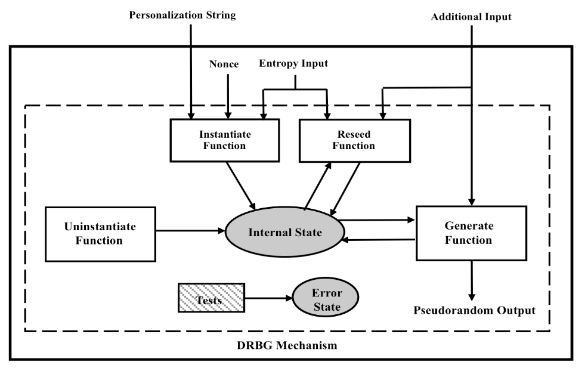

# OpenTitan Cryptography Library Specification

Status: **RFC Approved by TC: 2022-05-13**

## Objective

This document is intended for users of the OpenTitan crypto library.
It defines C interfaces (APIs) and data structures to support the OpenTitan defined cryptographic operations and lists implementation specific details that are opaque to a user.

The cryptographic API is defined for the following crypto modes:
- Symmetric ciphers (AES)
- Authenticated Encryption (AES-GCM, AES-KWP)
- Message digest (SHA2, SHA3)
- Keyed message digest (HMAC, KMAC)
- Signature generation and verification (RSA, ECC)
- Random number generation (DRBG)
- Key derivation (KDF)

Some of the crypto modes can operate on streaming data and several modes support asynchronous (non-blocking) modes of operation.
These are discussed in the later part of this specification.

## Symbols and Abbreviations

The following abbreviations are used in this specification:
- **AAD**: Additional Authenticated Data
- **AD**: Authenticated Decryption
- **AE**: Authenticated Encryption
- **AES**: Advanced Encryption Standard
- **CAVP**: Cryptographic Algorithm Validation Program
- **CFB**: Cipher Feedback mode
- **CMAC**: Cipher-based Message Authentication Code
- **CTR**: Counter mode
- **DH**: Diffie–Hellman algorithm
- **DRBG**: Deterministic Random Bit Generator
- **DSA**: Digital Signature Algorithm
- **ECB**: Electronic Codebook mode
- **ECC**: Elliptic Curve Cryptography
- **ECDH**: Elliptic Curve Diffie–Hellman
- **ECDSA**: Elliptic Curve Digital Signature Algorithm
- **FIPS**: Federal Information Processing Standard
- **GCM**: Galois Counter Mode
- **HMAC**: Keyed-Hash Message Authentication Code
- **ICV**: Integrity Check Value
- **IETF**: Internet Engineering Task Force
- **IV**: Initialization Vector
- **KDF**: Key Derivation Function
- **KEK**: Key-Encryption-Key
- **KMAC**: KECCAK Message Authentication Code
- **KWP**: AES Key Wrap with Padding
- **MAC**: Message Authentication Code
- **NIST**: National Institute of Standards and Technology
- **NRBG**: Non-deterministic Random Bit Generator
- **PKCS**: Public-Key Cryptography Standards
- **PRF**: Pseudorandom Function
- **PSS**: Probabilistic Signature Scheme
- **RSA**: Rivest–Shamir–Adleman, a public-key cryptosystem
- **RSASSA**: RSA Signature Schemes with Appendix
- **SHA**: Secure Hash Algorithm
- **XOF**: eXtendable-Output Function

## OpenTitan Supported crypto algorithms and modes

A list of crypto algorithms and modes for which an API will be defined are identified and is listed below.

**Symmetric crypto**
-   AES-ECB
-   AES-CBC
-   AES-CFB
-   AES-OFB
-   AES-CTR
-   AES-KWP

**Authenticated Encryption**
-   AES-GCM

**HASH**
-   SHA2-256
-   SHA2-384
-   SHA2-512
-   SHA3-224
-   SHA3-256
-   SHA3-384
-   SHA3-512

**HASH-XOF**
-   SHAKE128
-   SHAKE256
-   cSHAKE128
-   cSHAKE256

**MAC**
-   HMAC-SHA256
-   KMAC128
-   KMAC256

**Streaming mode**
-   HASH (SHA2 modes only)
-   HMAC (HMAC-SHA256 only)

**KeyGen**
-   AES Keygen (all modes)
-   HMAC Keygen
-   KMAC Keygen
-   RSA Keygen
-   ECDSA Keygen
-   ECDH Keygen
-   Ed25519 Keygen
-   X25519 Keygen

**Asymmetric crypto**
-   RSA (Signature, Verification)
-   ECDSA (Signature, Verification)
-   ECDH Key exchange
-   Ed25519 (Signature, Verification)
-   X25519 Key exchange

**Asynchronous Interfaces**
-   RSA (Keygen, Signature, Verification)
-   ECDSA (Keygen, Signature, Verification)
-   ECDH (Keygen, Key exchange)
-   Ed25519 (Keygen, Signature, Verification)
-   X25519 (Keygen, Key exchange)

**DRBG**
-   CTR-DRBG

**KDF**
- HMAC-KDF (CTR mode)
- KMAC-KDF (CTR mode)

**Key Transport**
- Build keys
- Blinding and unblinding keys

## Structs and Enums

This section defines the public and private data structures that are used with the API interfaces.

Private data structures are implementation specific, and are opaque to users of the API.

### Public data structures

Doxygen documentation for non-algorithm-specific data structures is [here](https://opentitan.org/gen/doxy/datatypes_8h.html).

{{#header-snippet sw/device/lib/crypto/include/datatypes.h crypto_status_t }}
{{#header-snippet sw/device/lib/crypto/include/datatypes.h crypto_status_value }}
{{#header-snippet sw/device/lib/crypto/include/datatypes.h key_type }}
{{#header-snippet sw/device/lib/crypto/include/datatypes.h aes_key_mode }}
{{#header-snippet sw/device/lib/crypto/include/datatypes.h hmac_key_mode }}
{{#header-snippet sw/device/lib/crypto/include/datatypes.h kmac_key_mode }}
{{#header-snippet sw/device/lib/crypto/include/datatypes.h rsa_key_mode }}
{{#header-snippet sw/device/lib/crypto/include/datatypes.h ecc_key_mode }}
{{#header-snippet sw/device/lib/crypto/include/datatypes.h kdf_key_mode }}
{{#header-snippet sw/device/lib/crypto/include/datatypes.h key_mode }}
{{#header-snippet sw/device/lib/crypto/include/datatypes.h crypto_key_security_level }}
{{#header-snippet sw/device/lib/crypto/include/datatypes.h crypto_lib_version }}
{{#header-snippet sw/device/lib/crypto/include/datatypes.h crypto_key_config }}
{{#header-snippet sw/device/lib/crypto/include/aes.h aead_gcm_tag_len }}
{{#header-snippet sw/device/lib/crypto/include/datatypes.h crypto_unblinded_key }}
{{#header-snippet sw/device/lib/crypto/include/datatypes.h crypto_uint8_buf }}
{{#header-snippet sw/device/lib/crypto/include/datatypes.h crypto_const_uint8_buf }}
{{#header-snippet sw/device/lib/crypto/include/aes.h block_cipher_mode }}
{{#header-snippet sw/device/lib/crypto/include/aes.h aes_operation }}
{{#header-snippet sw/device/lib/crypto/include/aes.h aes_padding }}
{{#header-snippet sw/device/lib/crypto/include/hash.h hash_mode }}
{{#header-snippet sw/device/lib/crypto/include/hash.h xof_mode }}
{{#header-snippet sw/device/lib/crypto/include/mac.h kmac_mode }}
{{#header-snippet sw/device/lib/crypto/include/rsa.h rsa_padding }}
{{#header-snippet sw/device/lib/crypto/include/rsa.h rsa_hash }}
{{#header-snippet sw/device/lib/crypto/include/rsa.h rsa_private_key }}
{{#header-snippet sw/device/lib/crypto/include/rsa.h rsa_key_size }}
{{#header-snippet sw/device/lib/crypto/include/rsa.h rsa_public_key }}
{{#header-snippet sw/device/lib/crypto/include/ecc.h ecc_signature }}
{{#header-snippet sw/device/lib/crypto/include/ecc.h eddsa_sign_mode }}
{{#header-snippet sw/device/lib/crypto/include/ecc.h ecc_public_key }}
{{#header-snippet sw/device/lib/crypto/include/ecc.h ecc_domain }}
{{#header-snippet sw/device/lib/crypto/include/ecc.h ecc_curve_type }}
{{#header-snippet sw/device/lib/crypto/include/ecc.h ecc_curve }}
{{#header-snippet sw/device/lib/crypto/include/kdf.h kdf_type }}

### Private data structures

The following data structures are considered implementation specific.

{{#header-snippet sw/device/lib/crypto/include/datatypes.h crypto_blinded_key }}
{{#header-snippet sw/device/lib/crypto/include/hash.h hash_context }}
{{#header-snippet sw/device/lib/crypto/include/mac.h hmac_context }}
{{#header-snippet sw/device/lib/crypto/include/aes.h gcm_ghash_context }}

## Streaming and Asynchronous modes of operation

OpenTitan supports additional API interfaces for several cryptographic modes to perform cryptographic operations on partial input data and to provide the capability to stop and resume cryptographic operations.
These supported API modes are detailed below.

### One shot and Streaming mode

Based on the input data availability, several cryptographic modes implement two types of APIs: One-shot APIs and streaming mode APIs.

A one-shot API is used when the entire data to be operated is available upfront.
The entire data is passed to the one-shot API as an input and the result is immediately available after the operation.

Streaming APIs are to support use-cases where the entire data to be transformed isn't available at the start of the operation and also in use-cases with limited memory availability.
Such streaming APIs operate iteratively over bytes of data, in blocks, as they are fed.
Partial inputs are buffered in the context until a full block is available to process.
The partial result from the block is stored in a context parameter and is used again in the subsequent rounds, until the final round.
Only in the final round is the result of the cryptographic operation available.

**Crypto modes that support streaming APIs:**
1.  HASH (SHA2 modes only)
2.  HMAC (HMAC-SHA256 only)

### Synchronous and Asynchronous mode

Synchronous mode of operation is when the crypto call does not return to the caller until the cryptographic operation is complete.
This mode blocks the CPU and no other process can utilize it until it returns, hence it is also known as blocking mode of operation.

OpenTitan maintains compatibility with TockOS, which has a low latency return call programming model where the CPU blocking should not be longer than (5-10ms).
Cryptographic modes which take longer time to complete their operation must implement an asynchronous mode to provide non-blocking mode of operation.

The asynchronous API for OpenTitan cryptolib defines a way to asynchronously run the long running cryptographic operations that use OTBN.
The OTBN accelerator itself is treated as a "separate thread" to achieve non-blocking operation with virtually zero overhead.
All asynchronous operations have two functions:

- **\<algorithm\>\_async\_start**
    - Takes input arguments. Checks that OTBN is available and idle. If
      so: does any necessary synchronous preprocessing, initializes
      OTBN, and starts the OTBN routine.
- **\<algorithm\>\_async\_finalize**
    - Takes caller-allocated output buffers. Blocks until OTBN is done
      processing if needed, then checks whether it had errors. If not, does any
      necessary postprocessing and writes results to the buffers.

A few noteworthy aspects of this setup:
- While an asynchronous operation is running, OTBN will be unavailable and attempts to use it will return errors.
- Only one asynchronous operation may be in progress at any given time.
- The caller is responsible for properly managing asynchronous calls, including ensuring that the entity receiving the `finalize` results is the same as the one who called `start`.

**Crypto modes that support asynchronous modes:**
1.  RSA Keygen
2.  RSA Signature
3.  RSA Verification
4.  ECDSA Keygen
5.  ECDSA Signature
6.  ECDSA Verification
7.  ECDH Keygen
8.  ECDH Key exchange
9.  Ed25519 Keygen
10. Ed25519 Signature
11. Ed25519 Verification
12. X25519 Keygen
13. X25519 Key exchange

## AES

Advanced Encryption Standard (AES) is the symmetric block cipher for encryption and decryption.

OpenTitan's [AES block][aes] unit is a cryptographic accelerator, implemented in hardware, to perform encryption and decryption on 16-byte blocks of data.
OpenTitan AES IP supports five cipher modes with a key length of 128 bits, 192 bits and 256 bits.

### Supported Modes

APIs are defined to support the following modes: Five confidentiality modes of operation: AES-\[ECB, CBC, CFB, OFB and CTR\] and two authenticated encryption modes AES-\[GCM, KWP\].
Padding schemes are defined in the **aes\_padding\_t** structure from [this section](#structs-and-enums).

Kindly refer to the links in the [reference](#reference) section for more information on AES and the block cipher modes of operation.

Doxygen documentation for AES-based algorithms is [here](https://opentitan.org/gen/doxy/include_2aes_8h.html).

### Key generation

{{#header-snippet sw/device/lib/crypto/include/aes.h otcrypto_aes_keygen }}

### Block Cipher

A one-shot API initializes the required block cipher mode of operation (ECB, CBC, CFB, OFB or CTR) and performs the required encryption/decryption.

{{#header-snippet sw/device/lib/crypto/include/aes.h otcrypto_aes }}

### AES-GCM

AES-GCM (Galois/Counter Mode) is used for authenticated encryption of the associated data and provides both confidentiality and authenticity of data.
Confidentiality using a variation of the AES counter mode and authenticity of the confidential data using a universal hash function that is defined over a binary Galois field.
GCM can also provide authentication assurance for additional data that is not encrypted.

Kindly refer to the [block cipher GCM specification][gcm-spec] and the links in the [reference](#reference) section for more information on AES-GCM mode and its construction.

AES-GCM consists of two related functions:
- an authenticated encryption function to generate a ciphertext and an authentication tag from the plaintext, and
- an authenticated decryption function to verify the tag and to recover the plaintext from the ciphertext.

In addition, we expose the internal GHASH and GCTR operation that GCM relies upon (from [NIST SP800-38D][gcm-spec], section 6.4).
This allows flexibility for use-cases that need custom GCM constructs: for example, we do not provide AES-GCM in streaming mode here because it encourages decryption and processing of unauthenticated data, but some users may need it for compatibility purposes.
Additionally, the GHASH operation can be used to construct GCM with block ciphers other than AES.

#### GCM - Authenticated Encryption and Decryption

{{#header-snippet sw/device/lib/crypto/include/aes.h otcrypto_aes_encrypt_gcm }}
{{#header-snippet sw/device/lib/crypto/include/aes.h otcrypto_aes_decrypt_gcm }}

#### GCM - GHASH and GCTR

{{#header-snippet sw/device/lib/crypto/include/aes.h otcrypto_gcm_ghash_init }}
{{#header-snippet sw/device/lib/crypto/include/aes.h otcrypto_gcm_ghash_update }}
{{#header-snippet sw/device/lib/crypto/include/aes.h otcrypto_gcm_ghash_final }}
{{#header-snippet sw/device/lib/crypto/include/aes.h otcrypto_aes_gcm_gctr }}

### AES-KWP

AES Key Wrap (KW) is a deterministic authenticated-encryption mode of operation of the AES algorithm.
AES-KW is designed to protect the confidentiality and the authenticity/integrity of cryptographic keys.
A variant of the Key-wrap algorithm with an internal padding scheme called Key-wrap with padding (KWP) is defined for interoperability.

Kindly refer to the [block cipher key-wrapping specification][kwp-spec] and the links in the [reference](#reference) section for more information on AES-KWP mode and its construction.

AES KWP mode comprises two related functions, authenticated encryption and authenticated decryption.

#### KWP - Authenticated Encryption and Decryption

{{#header-snippet sw/device/lib/crypto/include/aes.h otcrypto_aes_kwp_encrypt }}
{{#header-snippet sw/device/lib/crypto/include/aes.h otcrypto_aes_kwp_decrypt }}

## HASH

A cryptographic hash (HASH) function is a deterministic one-way function that maps an arbitrary length message to a fixed length digest.
Hash algorithms are used to verify the integrity of the message, i.e. any change to the message will, with a very high probability, result in a different message digest.

OpenTitan's [KMAC block][kmac] supports the fixed digest length SHA3\[224, 256, 384, 512\] cryptographic hash functions, and the extendable-output functions of variable digest length SHAKE\[128, 256\] and cSHAKE\[128, 256\].
SHA-2 functions are supported by [OTBN][otbn] and SHA-256 is supported by the [HMAC block][hmac]

### Supported Modes

APIs are defined to support the following modes: SHA2\[256, 384, 512\], SHA3\[224, 256, 384, 512\], SHAKE\[128, 256\] and cSHAKE\[128,256\].

For **SHA2 only**, the hash API supports both one-shot and streaming modes of operation.

Kindly refer to the links in the [reference](#reference) section for more information on HASH construction and supported modes.

Digest length for SHA2 and SHA3 hash modes:

| **Hash Mode** | **Digest Length (bytes)** |
| ------------- | ------------------------- |
| SHA-256       | 32                        |
| SHA-384       | 48                        |
| SHA-512       | 64                        |
| SHA3-224      | 28                        |
| SHA3-256      | 32                        |
| SHA3-384      | 48                        |
| SHA3-512      | 64                        |

### One-shot Hash API

This mode is used when the entire data to be hashed is available upfront.

This is a generic hash API where the required digest type and length is passed as an input parameter.
The supported hash modes are SHA256, SHA384, SHA512, SHA3-224, SHA3-256, SHA3-384 and SHA3-512.

{{#header-snippet sw/device/lib/crypto/include/hash.h otcrypto_hash }}

### HASH-XOF

Two separate APIs (SHAKE, CSHAKE) are defined for the Extendable-Output Functions (XOF) based on SHA3.
The supported XOF modes for SHAKE are SHAKE128 and  SHAKE256; and for CSHAKE are cSHAKE128 and cSHAKE256.

<!-- TODO: fix header to have shake/cshake! -->
{{#header-snippet sw/device/lib/crypto/include/hash.h otcrypto_xof }}

### Streaming Hash API

The streaming mode API is used for incremental hashing use-case, where the data to be hashed is split and passed in multiple blocks.

The streaming mode is supported **only for SHA2** hash modes (SHA256, SHA384, SHA512).

It is implemented using the INIT/UPDATE/FINAL structure:
- **INIT** initializes the context parameter.
- **UPDATE** is called repeatedly with message bytes to be hashed. The intermediate digest is stored in the context.
- **FINAL** computes the final digest, copies the result to the output buffer, and clears context.

{{#header-snippet sw/device/lib/crypto/include/hash.h otcrypto_hash_init }}
{{#header-snippet sw/device/lib/crypto/include/hash.h otcrypto_hash_update }}
{{#header-snippet sw/device/lib/crypto/include/hash.h otcrypto_hash_final }}

## MAC

A message authentication code provides integrity and authentication checks using a secret key shared between two parties.
OpenTitan supports two kinds of MACS:
- HMAC, a simple construction based on cryptographic hash functions
- KMAC, a Keccak-based MAC

OpenTitan's [HMAC block][hmac] supports HMAC-SHA256 mode of operation with a key length of 256 bits.
The [KMAC block][kmac] supports KMAC128 and KMAC 256, with a key length of \[128, 192, 256, 384, 512\] bits.

### Supported Modes

APIs are defined to support the following modes: MAC key generation, HMAC-SHA256, KMAC128 and KMAC256.
Key sizes supported are 256 bits for HMAC and \[128, 192, 256, 384, 512\] bits for KMAC.

The HMAC API supports both one-shot and streaming modes of operation.

Kindly refer to the links in the [reference](#reference) section for more information on the HMAC and the KMAC constructions and supported modes.

### Key Generation

{{#header-snippet sw/device/lib/crypto/include/mac.h otcrypto_mac_keygen }}

### One-shot API

This mode is used when the entire data to be authenticated is available upfront.

{{#header-snippet sw/device/lib/crypto/include/mac.h otcrypto_hmac }}
{{#header-snippet sw/device/lib/crypto/include/mac.h otcrypto_kmac }}

### Streaming API

The streaming mode API is used for incremental hashing use-case, where the data to be hashed is split and passed in multiple blocks.

The streaming mode is supported **only for HMAC-SHA256**.

It is implemented using the INIT/UPDATE/FINAL structure:
- **INIT** initializes the context parameter.
- **UPDATE** is called repeatedly with message bytes. The intermediate digest is stored in the context.
- **FINAL** computes the final tag, copies the result to the output buffer, and clears context.

{{#header-snippet sw/device/lib/crypto/include/mac.h otcrypto_hmac_init }}
{{#header-snippet sw/device/lib/crypto/include/mac.h otcrypto_hmac_update }}
{{#header-snippet sw/device/lib/crypto/include/mac.h otcrypto_hmac_final }}

## RSA

RSA (Rivest-Shamir-Adleman) is an asymmetric cryptographic algorithm used for authentication and data confidentiality.

### RSA Key Pair

RSA schemes employ two key types: RSA public key (known to everyone) and RSA private key (sensitive).
Together they form an RSA key pair.

The RSA *public key* is denoted by (n, e), where:
- n is the RSA modulus, a positive integer
- e is the RSA public exponent, a positive integer

The RSA *private key* is denoted by the pair (n, d), where
- n is the RSA modulus, a positive integer
- d is the RSA private exponent, a positive integer

### RSA Supported Modes

OpenTitan uses the [OpenTitan Big Number Accelerator][otbn], to speed up the underlying RSA operations.

APIs are defined to support the following modes: RSA Key generation, RSA digital signature generation and verification for the key lengths of \[2048, 3072, 4096\] bits.
Two PKCS signature schemes are supported: (RSASSA-PSS, RSASSA-PKCS1-v1_5).
Supported padding schemes are defined in the **rsa\_padding\_t** structure in [this section](#structs-and-enums).

The RSA schemes offer support for [asynchronous](#synchronous-and-asynchronous-mode) mode of operation through dedicated [APIs](#rsa-asynchronous-api).

Kindly refer to the links in the [reference](#reference) section for more information on RSA.

### Hash Function for RSA Signatures

An approved hash function is used during the generation of digital signatures.
The length in bits of the hash function output block must meet or exceed the security strength associated with the bit length of the modulus n in order to uphold RSA's security guarantees.

It is recommended that the security strength of the modulus and the security strength of the hash function be the same unless an agreement has been made between participating entities to use a stronger hash function.

Supported hashing modes are defined in the **rsa\_hash\_t** structure in [this section](#structs-and-enums).

### RSA Synchronous (Blocking Mode) API

{{#header-snippet sw/device/lib/crypto/include/rsa.h otcrypto_rsa_keygen }}
{{#header-snippet sw/device/lib/crypto/include/rsa.h otcrypto_rsa_sign }}
{{#header-snippet sw/device/lib/crypto/include/rsa.h otcrypto_rsa_verify }}

### RSA Asynchronous API

{{#header-snippet sw/device/lib/crypto/include/rsa.h otcrypto_rsa_keygen_async_start }}
{{#header-snippet sw/device/lib/crypto/include/rsa.h otcrypto_rsa_keygen_async_finalize }}
{{#header-snippet sw/device/lib/crypto/include/rsa.h otcrypto_rsa_sign_async_start }}
{{#header-snippet sw/device/lib/crypto/include/rsa.h otcrypto_rsa_sign_async_finalize }}
{{#header-snippet sw/device/lib/crypto/include/rsa.h otcrypto_rsa_verify_async_start }}
{{#header-snippet sw/device/lib/crypto/include/rsa.h otcrypto_rsa_verify_async_finalize }}

## ECC

Elliptic curve cryptography (ECC) is a public-key cryptography based on elliptic curves over finite fields and is widely used for key agreement and signature schemes.
ECC has an advantage over other similar public-key crypto systems as it uses shorter key-lengths to provide equivalent security.

Two key types are employed in the ECC primitive: ECC public key (Q) and ECC private key (d).
The public key can be known to everyone, and is used in key agreement and to verify messages.
The private key is sensitive, known only to the user and is used to sign messages.

### ECC Key Pair

An ECC *private key* is denoted by `d`, where `d` is a positive integer between `{1,...n−1}`.
Here, `n` is the order of the curve subgroup, part of the domain parameters for a given curve.
It is the same for all private keys on the curve, and is not secret.

An ECC *public key* is denoted by `Q`, and `Q = dG`, where:
- `d` is the private key
- `G` is the public base-point of the subgroup (part of the domain parameters)

### Supported Modes

OpenTitan uses the [OpenTitan Big Number Accelerator][otbn], to speed up the underlying ECC operations.
Elliptic curves of the short Weierstrass form, Montgomery form, and twisted Edward form are supported.
- For short Weierstrass form three predefined named curves are supported (NIST P-256, NIST P-384 and brainpool 256) along with support for user-defined generic curves.
- For the Montgomery form, only X25519 is supported.
- For twisted Edwards form only Ed25519 is supported.

APIs are defined for key generation, key agreement and signature schemes for Weierstrass curves and X25519/Ed25519.

The ECC schemes offer support for [asynchronous](#synchronous-and-asynchronous-mode) mode of operation through dedicated [APIs](#ecc-asynchronous-api).

Kindly refer to the links in the [reference](#reference) section for more information on ECC construction and curve types, NIST and brainpool named curves, key generation and agreement, ECDSA and EdDSA.

### ECC Synchronous (Blocking Mode) API

#### ECDSA

For ECDSA, the cryptography library supports keypair generation, signing, and signature verification.

{{#header-snippet sw/device/lib/crypto/include/ecc.h otcrypto_ecdsa_keygen }}
{{#header-snippet sw/device/lib/crypto/include/ecc.h otcrypto_ecdsa_sign }}
{{#header-snippet sw/device/lib/crypto/include/ecc.h otcrypto_ecdsa_verify }}

#### ECDH

For ECDH (elliptic-curve Diffie-Hellman) key exchange, the cryptography library supports keypair generation and shared-key generation.
Each party should generate a key pair, exchange public keys, and then generate the shared key using their own private key and the other party's public key.

{{#header-snippet sw/device/lib/crypto/include/ecc.h otcrypto_ecdh_keygen }}
{{#header-snippet sw/device/lib/crypto/include/ecc.h otcrypto_ecdh }}

#### Ed25519

For Ed25519 (a curve-specialized version of EdDSA, the Edwards curve digital signature algorithm), the cryptography library supports keypair generation, signature generation, and signature verification.
There is **no need to specify curve parameters for Ed25519**, since it operates on a specific curve already.

{{#header-snippet sw/device/lib/crypto/include/ecc.h otcrypto_ed25519_keygen }}
{{#header-snippet sw/device/lib/crypto/include/ecc.h otcrypto_ed25519_sign }}
{{#header-snippet sw/device/lib/crypto/include/ecc.h otcrypto_ed25519_verify }}

#### X25519

For x25519 key exchange, the cryptography library supports keypair generation and shared-key generation.
Each party should generate a key pair, exchange public keys, and then generate the shared key using their own private key and the other party's public key.

{{#header-snippet sw/device/lib/crypto/include/ecc.h otcrypto_x25519_keygen }}
{{#header-snippet sw/device/lib/crypto/include/ecc.h otcrypto_x25519 }}

### ECC Asynchronous API

#### ECDSA

{{#header-snippet sw/device/lib/crypto/include/ecc.h otcrypto_ecdsa_keygen_async_start }}
{{#header-snippet sw/device/lib/crypto/include/ecc.h otcrypto_ecdsa_keygen_async_finalize }}
{{#header-snippet sw/device/lib/crypto/include/ecc.h otcrypto_ecdsa_sign_async_start }}
{{#header-snippet sw/device/lib/crypto/include/ecc.h otcrypto_ecdsa_sign_async_finalize }}
{{#header-snippet sw/device/lib/crypto/include/ecc.h otcrypto_ecdsa_verify_async_start }}
{{#header-snippet sw/device/lib/crypto/include/ecc.h otcrypto_ecdsa_verify_async_finalize }}

#### ECDH

{{#header-snippet sw/device/lib/crypto/include/ecc.h otcrypto_ecdh_keygen_async_start }}
{{#header-snippet sw/device/lib/crypto/include/ecc.h otcrypto_ecdh_keygen_async_finalize }}
{{#header-snippet sw/device/lib/crypto/include/ecc.h otcrypto_ecdh_async_start }}
{{#header-snippet sw/device/lib/crypto/include/ecc.h otcrypto_ecdh_async_finalize }}

#### Ed25519

{{#header-snippet sw/device/lib/crypto/include/ecc.h otcrypto_ed25519_keygen_async_start }}
{{#header-snippet sw/device/lib/crypto/include/ecc.h otcrypto_ed25519_keygen_async_finalize }}
{{#header-snippet sw/device/lib/crypto/include/ecc.h otcrypto_ed25519_sign_async_start }}
{{#header-snippet sw/device/lib/crypto/include/ecc.h otcrypto_ed25519_sign_async_finalize }}
{{#header-snippet sw/device/lib/crypto/include/ecc.h otcrypto_ed25519_verify_async_start }}
{{#header-snippet sw/device/lib/crypto/include/ecc.h otcrypto_ed25519_verify_async_finalize }}

#### X25519

{{#header-snippet sw/device/lib/crypto/include/ecc.h otcrypto_x25519_keygen_async_start }}
{{#header-snippet sw/device/lib/crypto/include/ecc.h otcrypto_x25519_keygen_async_finalize }}
{{#header-snippet sw/device/lib/crypto/include/ecc.h otcrypto_x25519_async_start }}
{{#header-snippet sw/device/lib/crypto/include/ecc.h otcrypto_x25519_async_finalize }}

## DRBG

Random bit generators (RBG) are used to generate cryptographically secure random bits.They can be nondeterministic (NRBG) or deterministic (DRBG).
The DRBG module generates (deterministic) pseudo-random bits from an input seed (entropy) value, using an underlying algorithm such as HASH, HMAC or AES.
These random bits are then used directly or after processing, by the application in need of random values.

OpenTitan's random bit generator, [CSRNG][csrng] (Cryptographically Secure Random Number Generator) uses a block cipher based DRBG mechanism (AES_CTR_DRBG) as specified in [NIST SP800-90A][nist-drbg-spec].
OpenTitan's RNG targets compliance with both [BSI AIS31 recommendations for Common Criteria][bsi-ais31], as well as [NIST SP800-90A][nist-drbg-spec] and [NIST SP800-90C (second draft)][nist-rng-spec].
The CSRNG operates at a 256-bit security strength.

### Supported Modes

APIs are defined to support the DRBG Instantiate, Reseed, Generate, Uninstantiate, Manual Instantiate, and Manual Reseed functions.

The Instantiate and Reseed operations fetch new entropy from OpenTitan's [ENTROPY_SRC][entropy-src].
The Manual Instantiate and Manual Reseed operations, however, get their entropy from the user as an input parameter.
These can be used to provide entropy from a different source, but users should be careful to ensure that the entropy is high-quality enough for their application.

**Notes:**
1.  The \`drbg_entropy_mode\` context parameter is used to disallow
    mixing of DRBG operations with auto entropy and (user-provided)
    manual entropy
2.  Entropy length - **The accepted entropy length is 384bits**. The API
    will reject the user provided entropy if the length is not 384-bits
    (24 bytes).

The picture below shows an example of a functional model of a DRBG.

### DRBG Functional Model

A DRBG mechanism takes several parameters as input, depending on its operating mode:
- entropy
- nonce
- personalization string
- additional input

To learn more about these input parameters and other DRBG details such as entropy requirements, seed construction, derivation functions and prediction resistance, kindly refer to the [NIST SP800-90A][nist-drbg-spec], [NIST SP800-90B][nist-entropy-spec], [NIST SP800-90C][nist-rng-spec], and [BSI AIS31][bsi-ais31] documents and the links in the [reference](#reference) section.

### DRBG API

{{#header-snippet sw/device/lib/crypto/include/drbg.h otcrypto_drbg_instantiate }}
{{#header-snippet sw/device/lib/crypto/include/drbg.h otcrypto_drbg_reseed }}
{{#header-snippet sw/device/lib/crypto/include/drbg.h otcrypto_drbg_generate }}
{{#header-snippet sw/device/lib/crypto/include/drbg.h otcrypto_drbg_uninstantiate }}

#### Manual Entropy Operations

{{#header-snippet sw/device/lib/crypto/include/drbg.h otcrypto_drbg_manual_instantiate }}
{{#header-snippet sw/device/lib/crypto/include/drbg.h otcrypto_drbg_manual_reseed }}

## KDF

OpenTitan Key derivation functions (KDF) provide key-expansion capability.
Key derivation functions can be used to derive additional keys from a cryptographic key that has been established through an automated key-establishment scheme or from a pre-shared key.

### Supported Modes

The OpenTitan key derivation function is based on the counter mode and uses a pseudorandom function (PRF) as a building block.
OpenTitan KDF functions support a user-selectable PRF as the engine (i.e. either HMAC or a KMAC).

To learn more about PRFs, various key derivation mechanisms and security considerations, kindly refer to [NIST SP800-108][kdf-spec] and the links in the [reference](#reference) section.

### API

{{#header-snippet sw/device/lib/crypto/include/kdf.h otcrypto_kdf_ctr }}

## Key Transport

The following section defines the interface for importing keys to and exporting keys from the crypto library.

The crypto library typically represents private keys in blinded form, where the exact shape of the blinded key is opaque to the user.
Public keys are in unblinded form, and the user can easily extract the plain key data.
However, in some cases, a user might want to import a key generated elsewhere into the cryptolib, or might want to export a private key for use in a different piece of code.

### Supported Modes

The crypto library provides four functions for this purpose:
- Build unblinded key from user-provided key data and mode
- Build blinded key from user-provided key data and configuration
- Convert blinded key to unblinded key
- Convert unblinded key to blinded key

To import a private key generated elsewhere, for example, the user can call `otcrypto_build_blinded_key`.
To export a blinded key, the user can convert it to an unblinded key, at which point the plain data is accessible.

### Build Keys

{{#header-snippet sw/device/lib/crypto/include/key_transport.h otcrypto_build_unblinded_key }}
{{#header-snippet sw/device/lib/crypto/include/key_transport.h otcrypto_build_blinded_key }}

### Blinding and Unblinding Keys

{{#header-snippet sw/device/lib/crypto/include/key_transport.h otcrypto_blinded_to_unblinded_key }}
{{#header-snippet sw/device/lib/crypto/include/key_transport.h otcrypto_unblinded_to_blinded_key }}

## Security Strength

Security strength in simple terms denotes the amount of work required to
break a cryptographic algorithm. Security strength of an algorithm with
key length 'k'is expressed in "bits" where n-bit security means that the
attacker would have to perform 2^n^ operations to break the algorithm.

The table below summarizes the security strength for the supported [cryptographic algorithms](#openTitan-supported-crypto-algorithms-and-modes).

| **Family**     | **Algorithm**  | **Security Strength (bits)**     | **Comments**                                          |
|----------------|----------------|----------------------------------|-------------------------------------------------------|
| Block cipher   | AES128         | 128                              |                                                       |
| Block cipher   | AES192         | 192                              |                                                       |
| Block cipher   | AES256         | 256                              |                                                       |
| Hash function  | SHA256         | 128                              | 128 bits collision, 256 bits preimage                 |
| Hash function  | SHA384         | 192                              | 192 bits collision, 384 bits preimage                 |
| Hash function  | SHA512         | 256                              | 256 bits collision, 512 bits preimage                 |
| Hash function  | SHA3-224       | 112                              | 112 bits collision, 224 bits preimage                 |
| Hash function  | SHA3-256       | 128                              | 128 bits collision, 256 bits preimage                 |
| Hash function  | SHA3-384       | 192                              | 192 bits collision, 384 bits preimage                 |
| Hash function  | SHA3-512       | 256                              | 256 bits collision, 512 bits preimage                 |
| Hash-XOF       | SHAKE128       | `min(d/2, 128)`                  | `min(d/2, 128)` collision; preimage >= `min(d, 128)`  |
| Hash-XOF       | SHAKE256       | `min(d/2, 256)`                  | `min(d/2, 256)` collision; preimage >= `min(d, 256)`  |
| Hash-XOF       | cSHAKE128      | `min(d/2, 128)`                  | `min(d/2, 128)` collision; preimage >= `min(d, 128)`  |
| Hash-XOF       | cSHAKE256      | `min(d/2, 256)`                  | `min(d/2, 256)` collision; preimage >= `min(d, 256)`  |
| MAC            | HMAC-SHA256    | 256                              |                                                       |
| MAC            | KMAC128        | 128                              |                                                       |
| MAC            | KMAC256        | 256                              |                                                       |
| RSA            | RSA-2048       | 112                              |                                                       |
| RSA            | RSA-3072       | 128                              |                                                       |
| RSA            | RSA-4096       | \~144                            |                                                       |
| ECC            | NIST P-256     | 128                              |                                                       |
| ECC            | NIST P-384     | 192                              |                                                       |
| ECC            | X25519/Ed25519 | 128                              |                                                       |
| DRBG           | CTR_DRBG       | 256                              | Based on AES-CTR-256                                  |
| KDF            | KDF_CTR        | 128                              | With HMAC or KMAC as PRF                              |

Over time the cryptographic algorithms may become more vulnerable to successful attacks, requiring a transition to stronger algorithms or longer key lengths over time.
The table below is a recommendation from [NIST SP800-57 Part 1][nist-sp800-57] about concrete time frames for different security strengths.

Kindly refer to the security strength links in the [reference](#reference) section for more information on cryptographic algorithms, key sizes and related security strength and transition recommendations.

## Reference

**AES**
1. [FIPS 197][aes-spec]: Announcing the Advanced Encryption Standard (AES)
2. [NIST SP800-38A][aes-basic-modes-spec]: Recommendation for Block Cipher Modes of Operation: Methods and Techniques
3. [NIST SP800-38D][gcm-spec]: Recommendation for Block Cipher Modes of Operation: Galois/Counter Mode (GCM) and GMAC
4. [NIST SP800-38F][kwp-spec]: Recommendation for Block Cipher Modes of Operation: Methods for Key wrapping

**HASH**
1. [FIPS 180-4][sha2-spec]: Secure Hash Standard
2. [FIPS 202][sha3-spec]: SHA-3 Standard: Permutation-Based Hash and Extendable-Output Functions
3. [NIST SP800-185][sha3-derived-spec]: SHA-3 Derived Functions: cSHAKE, KMAC, TupleHash, and ParallelHash

**MAC**
1. [IETF RFC 2104][hmac-rfc]: HMAC: Keyed-Hashing for Message Authentication
2. [IETF RFC 4231][hmac-testvectors-rfc]: Identifiers and Test Vectors for HMAC-SHA-224, HMAC-SHA-256, HMAC-SHA-384, and HMAC-SHA-512
3. [IETF RFC 4868][hmac-usage-rfc]: Using HMAC-SHA-256, HMAC-SHA-384, and HMAC-SHA-512
4. [NIST SP800-185][sha3-derived-spec]: SHA-3 Derived Functions: cSHAKE, KMAC, TupleHash, and ParallelHash

**RSA**
1. [IETF RFC 8017][rsa-rfc]: PKCS #1: RSA Cryptography Specifications Version 2.2
2. [FIPS 186-5][fips-186]: Digital Signature Standard

**ECC**
1. [SEC1][sec1]: Elliptic Curve Cryptography
2. [SEC2][sec2]: Recommended Elliptic Curve Domain Parameters
3. [FIPS 186-5][fips-186]: Digital Signature Standard
4. [NIST SP800-56A][ecdh-spec]: Recommendation for Pair-Wise Key-Establishment Schemes Using Discrete Logarithm Cryptography
5. [IETF RFC 5639][brainpool-rfc]: Elliptic Curve Cryptography (ECC) Brainpool Standard Curves and Curve Generation
6. [IETF RFC 4492][ecc-tls-rfc]: Elliptic Curve (ECC) Cipher Suites for Transport Layer Security (TLS)
7. [Safe curves][safe-curves]: Choosing safe curves for elliptic-curve cryptography
8. [IETF RFC 7448][ecc-rfc]: Elliptic Curves for Security
9. [IETF RFC 8032][eddsa-rfc]: Edwards-Curve Digital Signature Algorithm (EdDSA)
10. [NIST SP800-186][nist-ecc-domain-params]: Recommendations for Discrete Logarithm-Based Cryptography: Elliptic Curve Domain Parameters

**DRBG**
1. [NIST SP800-90A][nist-drbg-spec]: Recommendation for Random Number Generation Using Deterministic Random Bit Generators
2. [NIST SP800-90B][nist-entropy-spec]: Recommendation for the Entropy Sources Used for Random Bit Generation
3. [BSI-AIS31][bsi-ais31]: A proposal for: Functionality classes for random number generators
4. OpenTitan [CSRNG block][csrng] technical specification

**Key Derivation**
1. [NIST SP800-108][kdf-spec]: Recommendation for Key Derivation using Pseudorandom Functions

**Key Management, Security Strength**
1. [NIST SP800-131][nist-sp800-131a]: Transitioning the Use of Cryptographic Algorithms and Key Lengths
2. [NIST-SP800-57][nist-sp800-57]: Recommendation for Key Management (Part 1 General)

[aes]: ../../../hw/ip/aes/README.md
[aes-spec]: https://csrc.nist.gov/publications/detail/fips/197/final
[aes-basic-modes-spec]: https://csrc.nist.gov/publications/detail/sp/800-38a/final
[brainpool-rfc]: https://datatracker.ietf.org/doc/html/rfc5639
[bsi-ais31]: https://www.bsi.bund.de/SharedDocs/Downloads/EN/BSI/Certification/Interpretations/AIS_31_Functionality_classes_for_random_number_generators_e.html
[csrng]:  ../../../hw/ip/csrng/README.md
[ecc-rfc]: https://datatracker.ietf.org/doc/html/rfc7448
[ecc-tls-rfc]: https://datatracker.ietf.org/doc/html/rfc4492
[ecdh-spec]: https://csrc.nist.gov/publications/detail/sp/800-56a/rev-3/final
[eddsa-rfc]: https://datatracker.ietf.org/doc/html/rfc8032
[entropy-src]:  ../../../hw/ip/entropy_src/README.md
[fips-186]: https://csrc.nist.gov/publications/detail/fips/186/5/final
[gcm-spec]: https://csrc.nist.gov/publications/detail/sp/800-38d/final
[hmac-rfc]: https://datatracker.ietf.org/doc/html/rfc2104
[hmac-testvectors-rfc]: https://datatracker.ietf.org/doc/html/rfc4231
[hmac-usage-rfc]: https://datatracker.ietf.org/doc/html/rfc4868
[kdf-spec]: https://csrc.nist.gov/publications/detail/sp/800-108/final
[kmac]:  ../../../hw/ip/kmac/README.md
[kwp-spec]: https://csrc.nist.gov/publications/detail/sp/800-38f/final
[nist-drbg-spec]: https://csrc.nist.gov/publications/detail/sp/800-90a/rev-1/final
[nist-ecc-domain-params]: https://csrc.nist.gov/publications/detail/sp/800-186/final
[nist-entropy-spec]: https://csrc.nist.gov/publications/detail/sp/800-90b/final
[nist-rng-spec]: https://csrc.nist.gov/CSRC/media/Publications/sp/800-90c/draft/documents/sp800_90c_second_draft.pdf
[nist-sp800-131a]: https://csrc.nist.gov/publications/detail/sp/800-131a/rev-2/final
[nist-sp800-57]: https://csrc.nist.gov/publications/detail/sp/800-57-part-1/rev-5/final
[otbn]: ../../../hw/ip/otbn/README.md
[rsa-rfc]: https://datatracker.ietf.org/doc/html/rfc8017
[safe-curves]: https://safecurves.cr.yp.to/
[sec1]: https://www.secg.org/sec1-v2.pdf
[sec2]: https://www.secg.org/sec2-v2.pdf
[sha2-spec]: https://csrc.nist.gov/publications/detail/fips/180/4/final
[sha3-spec]: https://csrc.nist.gov/publications/detail/fips/202/final
[sha3-derived-spec]: https://csrc.nist.gov/publications/detail/sp/800-185/final
