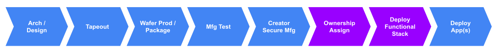
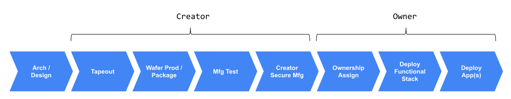
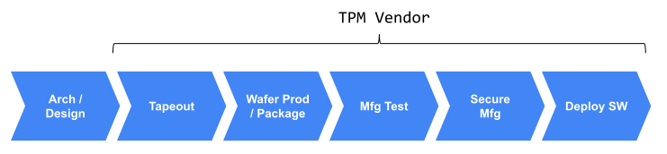
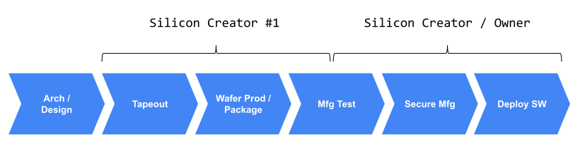
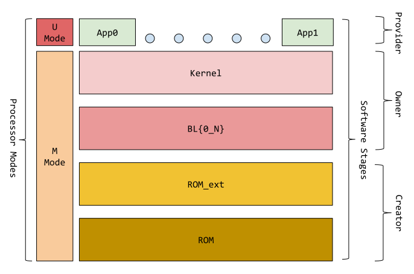
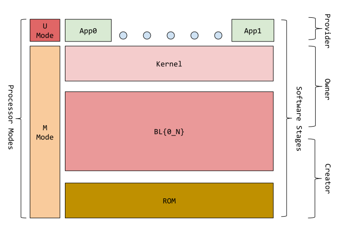
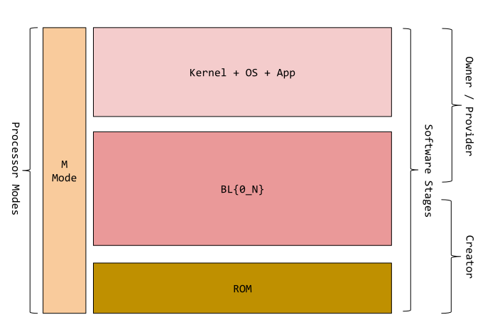
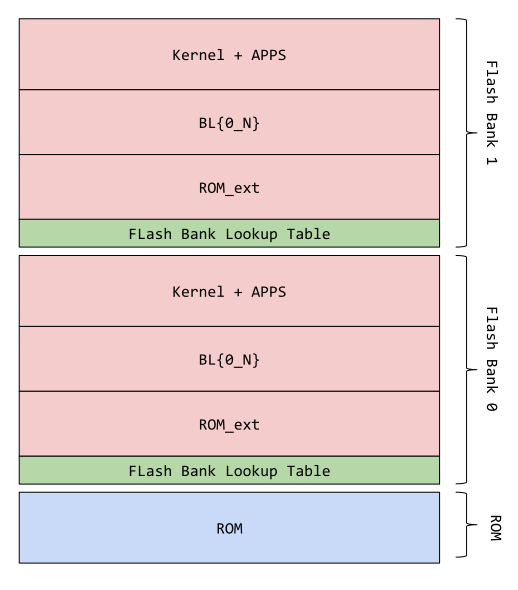

## Overview

This document explains the overall OpenTitan logical security model as it relates to secure provisioning and run-time operations.
Due to the open source nature of OpenTitan, this document articulates fundamental requirements to be considered OpenTitan-compliant.

## Logical Entities

At a high level, the OpenTitan logical security model is composed of 4 entities - Silicon Creator, Silicon Owner, Application Provider and the End User.
This document focuses on the first 3 entities.
These entities are directly involved in creating a fully trademark compliant OpenTitan.

Depending on the use case, these entities are not required to be distinct.

### Silicon Creator

The Silicon Creator is the **logical entity**, or **logical collection of entities** that manufactures, packages, tests and provisions the chip with its first identity.
This **"Creator Identity"** is a cryptographically produced unique seed that proves the chip has been properly manufactured, tested, provisioned and is thus authentic.

The creator may be a collection of different entities.
For example:
* Fabless semiconductors companies that design a chip and prepare a GDSII for silicon foundries
* A silicon foundry which manufactures and wafer-tests the chip
* An OSAT (see glossary) which packages and performs final tests
* A provisioning entity that manages the chip's provisioning process

A creator may also be a single, vertically integrated entity that performs all the above functions.

The steps in **Green** below represent the stages for which the Silicon Creator is responsible.

### Silicon Owner

The Silicon Owner is the **current logical entity** that has ownership of the chip.
It is responsible for two primary functions, **ownership assignment** and **functional provisioning**.
The ownership assignment process provisions a unique and attestable identity separate from the Creator Identity; while the functional provisioning process deploys a functional software stack to the silicon.

The steps in **Purple** below represent stages for which the Silicon Owner is responsible.
Detailed descriptions are given in the following sections.

#### Owner Assignment

A potential owner validates the chip through a **Transport Creator Certificate** tied to the **"Creator Identity"**.
After the Creator Identity is validated, the Silicon Owner assigns a second unique identity known as the **"Owner Identity"**.
This identity is unique to the chip and owner combination,  optionally including the major version of the owner software stack, and is separate from the previous **"Creator Identity"**.
It is the cryptographically produced unique seed that is owned by a specific owner for a given hardware and owner software configuration.

The two identities (Owner and Creator) form a trusted chain analogous to certificate chaining which can be traced back to the root.

In specific use cases, the owner of the chip is allowed to change in a process known as **Ownership Transfer**.
During this process, the existing owner relinquishes the provisioned Owner Identity, wipes any stored secrets and transfers the chip to a new owner.
The new owner will not be able to access the previous identity.
The new owner must then provision a new **Owner Identity** by following the same owner assignment procedure.

#### Functional Provisioning

In addition to assigning the chip an **Owner Identity**, the Silicon Owner is responsible for supplying a functional software stack.
This can range from a full kernel / operating system to a bare-metal environment depending on application needs.

In order to support secure boot without including verification keys directly in the silicon design, the owner creates an **"Owner Assignment Blob"** which is endorsed by the creator.
This blob is loaded into the device as a part of ownership assignment and contains public keys used to verify the owner's initial boot stage.

#### Overlap between Silicon Owner and Silicon Creator

The prior sections describe a case where the Silicon Creator and Silicon Owner are completely distinct.
The Silicon Creator could be a vertically integrated silicon entity (design & fabrication & manufacturing), while the Silicon Owner could be an entity that builds systems out of such components.
This relationship follows the conventional silicon supplier / consumer model.
The supplier creates trusted silicon and the consumer validates this trust and provisions an Owner Identity that is unknown to the creator.
In this scenario, there are **two distinct identities**, Creator then Owner.
See the diagram below.

The Silicon Creator and owner however, are not required to be separate entities.
There can be significant overlap.

In the fully overlapping case, a single entity would be solely responsible for creating the silicon and provisioning its identity and software.
This is analogous to the TPM model where downstream consumers cannot alter the chip or its software contents.
In this case there is only a single identity instead of two (Creator and Owner).
This is represented by the diagram below.

Alternatively,  an overlapping number of legal and logical entities may participate in the Silicon Creator and Silicon Owner processes.
For example, A SIM card provisioner may sit at both the tail-end of the creator process and function as the owner.
There is assumed trust between the creator and the owner, making a distinct identity for the owner unnecessary.
Again there is only one silicon identity, even though the line between the creator and the owner is different than the example above.
See diagram below.

### Application Provider

The Application Provider refers to the **logical entity**, or **logical collection of entities** who supply applications that operate on the Silicon Owner-supplied software stack.
There may be more than one Application Provider.

Applications can request a unique cryptographic identity derived from the Silicon Owner Identity.
Identity isolation guarantees are implemented and enforced in the Silicon Owner software stack.
The Silicon Owner is discouraged from exposing its root identity at the application layer since this could potentially compromise isolation between applications, and isolation between the Silicon Owner and Application Provider.

It is important to note that the application identity or versioning does not impact either the Creator Identity or the Owner Identity.
An update to an application does not cause the Owner Identity to change, but it can cause the application identity to change.

#### Overlap With Silicon Owner
The Silicon Owner and Application Provider may not be separate entities.
In fact there is a gradient of overlap expected.

The owner can supply something similar to a runtime environment, while the Application Providers supply applications that run on top.
In these scenarios, there may be complete separation between owner and providers.

Alternatively, the system may have only one primary function authored by the owner (such as TPM).
In these scenarios, it is not necessary to have separation between owner and Application Providers.

### Summary of Logical Entities

An OpenTitan chip may interact with up to 3 distinct logical entities or logical collection of entities over the course of its lifecycle.
The End User (not discussed in this document), is not expected to impact the identities and stages described in this document.
The model and underlying hardware are flexible enough to support distinct or overlapping entities.
It is expected that most use cases will have some overlap between phases; between Silicon Creator and owner, or owner and Application Provider.
Above all, consumers of OpenTitan have the ability to map the security model to their use case.

## Software Stage Mapping

Since OpenTitan software can contain components authored by up to 3 entities, this section describes the software mapping in the most generic case when all 3 entities are distinct.
Further examples on how different stages might merge are shown below.
The overall construction is shown below.

The software stack is assumed to be constructed in stages.
Each entity "owns" specific stages and thus has a certain amount of trust granted.
Below, a description is given for each entity and its associated stage.
Ownership here is defined as control of the signing key associated to a specific stage of software.

### Silicon Creator Software

The Silicon Creator owns the **ROM** and **ROM_ext**.
**ROM** is **R**ead **O**nly **M**emory and cannot be modified after silicon is manufactured.
**ROM_ext** is **R**ead **O**nly **M**emory extensions, which represent modifiable code that extends the functionality of the ROM.

The ROM is responsible for initial bootstrap, secure boot and certain security configuration of the silicon.
It is understood that security configuration during ROM can be risky, so only the most critical security settings are expected to be allocated to ROM.

The ROM_ext has multiple distinct functions
* Apply patches to correct any fundamental and critical HW issues
* Apply critical security settings that are too risky to apply in ROM
* Perform Silicon Creator Identity provisioning
* Provide Creator Identity attestation functions and assist in ownership assignment and ownership functional provisioning.

As ROM and ROM_ext execute, they shall lock out portions of the chip that are not required by later software stages.
Lock out is defined here as the process of making a specific silicon resource unmodifiable, unreadable or both.
Once ROM / ROM_ext are completed, they **SHALL NOT** execute again until the next system reset.

Creator software is always inspectable by the Silicon Owner, and a measurement of the code is used as a component of the Creator Identity.
This provides strong transparency guarantees during Ownership Transfer.
Once ownership transfer is complete, the Silicon Owner becomes the entity in charge of managing software updates.

It is assumed that creator software operates in **Machine Mode** and has full visibility into the memory map unless it chooses to lock out certain regions.
Machine mode is the highest privilege state of a RISC-V processor.

### Silicon Owner Software

The Silicon Owner owns the various boot loader stages (BL{N}) and kernel.
The boot loader stages continue the secure boot process and lock out any privilege not needed by later stages of software.

The kernel provides central services to downstream applications such as key management, non-volatile storage program / erase and general chip control.
Unlike the previous stages, owner and subsequent application stages are  expected to jump between owner and downstream user code.
Therefore privilege lock down at this stage is done dynamically via the physical memory protection function.

The kernel is also responsible for the verification and sandboxing of application software if required.

It is assumed that owner software operates in **Machine Mode** and has full visibility into the memory map except regions locked out by previous boot stages or kernel configuration code.
Machine mode is the highest privilege state of a RISC-V processor.

### Application Provider Software

Application Provider software is the highest layer and least privileged software.
It is generally not expected for software at this stage to have direct access to silicon peripherals.
Instead, it is a pure software implementation that calls into kernel for specific services and functions.

It is assumed that provider's software operates in **User Mode** and has only visibility to unlocked memory granted by the owner and creator software.
User mode is the lowest privilege state of a RISC-V processor.
Multiple applications may be resident at once and may have different memory access permissions.
The owner software shall be responsible for ensuring the isolation between multiple applications.

### Logical Entity Overlap

As discussed [previously](#summary-of-logical-entities), it is expected, based on use case, for the logical entities to have some overlap.
When stages overlap, the software stages can be simplified.
For example, in the SIM card provisioning scenario, where parts of the creator flow overlaps with the owner flow, it may be expected for ROM_ext and BL{N} to merge into a single simplified stage.

It may also be possible for the owner and Application Provider to become one entity for chips that support only first party functions.
In this case, the kernel and application may merge to become one entity.
For example, a typical laptop embedded controller may operate under this model.
See diagram below.

## Execution Assumptions

This document makes a few assumptions on how the software is executed.
Since these assumptions have security implications, they are enumerated here.
These must remain true no matter how the above model is simplified and how stages / entities are merged.

* Beginning from ROM, through various software stages until the kernel (or other functional equivalent), the execution is **ONE WAY**.
  This means each software stage completes its task and irreversibly jumps to the next stage.
  There is no planned ability to jump back to earlier stage software or execute code from earlier stage.

* Once in kernel (or other functional equivalent), the behavior can **OPTIONALLY** become dynamic and no longer one way.
  Execution can switch between the kernel (controlled by the Silicon Owner) and the Application Provider Software.
  Since the Silicon Owner software runs in machine mode and the Application Provider in user, this also implies changing privilege levels when the execution switches.
  As a result, verification and sandboxing of application software will be particularly important if the Silicon Owner and Application Provider are distinct logical entities.

## Firmware Update Considerations

The software stage mapping section describes the various software components supported by the system, without making any assumptions on the physical layout in memory.
This section discusses some considerations to support A/B firmware update schemes.

Non-volatile memory may be split into two or more banks of equal size and used to store software and application data.
If the banks are divided into two equal partitions, each would hold an instance of the ROM_ext as well as the boot loader stages, kernel and application software.

In some implementations, the ROM_ext and boot loader stages may be required to have a fixed size to simplify the lookup of components during boot; in other cases,  a fixed lookup table may be implemented at the beginning of each non-volatile partition.

Each boot stage is expected to try to launch the newest available version of the next boot stage upon successful signature verification.
Newest is defined software with a more recent build timestamp or larger versioning value.
The following diagram presents a reference software layout with support for A/B updates using two physical flash banks:

## Glossary

| Term            | Definition
| --------------  | ----------
| GDSII           | Graphic database systems streaming format.  This refers to the common format used for silicon manufacturing services.
| OSAT            | Outsourced Silicon Assembly and Test.
| ROM             | Read only memory.
| ROM_ext         | Read only memory extension.
| BL              | Boot loader.
