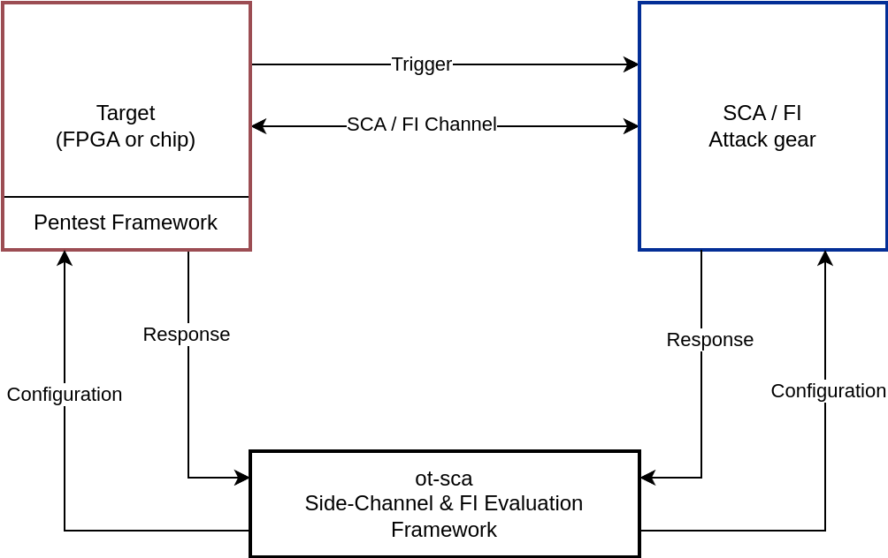

# Penetration Testing Framework

The OpenTitan Penetration Testing Framework is designed for conducting side-channel analysis (SCA) and fault injection (FI) attacks on both FPGA and chip implementations of OpenTitan.



As depicted in the block diagram, the framework operates on the target device.
It receives configuration commands for SCA and FI attacks from either the [ot-sca](https://github.com/lowRISC/ot-sca) framework or the Python scripts available in `//sw/host/penetrationtests/python`.
The Python directory includes communication drivers, host-side examples, and test scripts with expected chip responses.

## Getting Started

To run penetration tests on either the FPGA or the chip, please refer to the comprehensive instructions in the [ot-sca](https://github.com/lowRISC/ot-sca) repository.
The Python scripts for interfacing with the penetration testing framework are located in `//sw/host/penetrationtests/python`.

## Contributing

If you wish to contribute to the penetration testing framework, please follow the automated testing procedures outlined below.

### Building Firmware Images

Due to memory constraints, the firmware for both the chip and the FPGA is divided into separate binaries for SCA, general FI, Ibex FI, and OTBN FI.
To build these binaries for the chip, one can use for example:

```console
./bazelisk.sh build --//signing:token=//signing/tokens:cloud_kms_sival //sw/device/tests/penetrationtests/firmware:pen_test_sca_silicon_owner_sival_rom_ext
```

The compiled binaries can be found in the `bazel-bin/sw/device/tests/penetrationtests/firmware/` directory.

## Automated Testing

The framework includes an automated testing mechanism that verifies the responses from the penetration testing frameworks against reference test vectors.

The hardware penetration tests cover a range of fault injection and side-channel analysis attacks on various hardware components, including Ibex, OTP, and the lifecycle controller.
To run all of these tests, execute the following command:

```console
cd $REPO_TOP
./bazelisk.sh test //sw/device/tests/penetrationtests:pentest_hw_tests
```

The crypto library penetration tests are a focused suite of tests that target the cryptographic library, including both symmetric and asymmetric crypto implementations.
To run all of these tests, execute the following command:

```console
cd $REPO_TOP
./bazelisk.sh test //sw/device/tests/penetrationtests:pentest_cryptolib_tests
```

## GDB Testing (FiSim)

The crypto library is tested on a debug-enabled CW340 FPGA by tracing relevant cryptographic calls and applying fault models, such as instruction skips.
These tests require the device to be in the RMA lifecycle state to enable debugging.

To run a GDB test, locate the "gdb_test" targets in the `BUILD` file at `//sw/device/tests/penetrationtests`.
For example:
```console
./bazelisk.sh run //sw/device/tests/penetrationtests:fi_sym_cryptolib_python_gdb_test_fpga_cw340_rom_ext
```

These tests run in the `rom_ext` environment, which corresponds to a ROM version in the RMA lifecycle with debugging enabled.
The test builds and runs OpenOCD in the background, opening the default port 3333 for GDB.
The `//sw/host/penetrationtests/python/util` directory contains classes for communicating with the FPGA, OpenOCD, and GDB.

Testing is performed on the flashed penetration testing framework, which provides an interface to the crypto library at `//sw/device/lib/crypto`.
The targeted functions are identified by parsing the `.dis` file, with the parser located in `//sw/host/penetrationtests/python/util`.

All test outputs are stored in the `bazel-testlogs/sw/device/tests/penetrationtests` directory in OpenTitan.
Note that terminal output is redirected to a campaign file in this directory, which should be consulted for the test results, as each subtest can take several hours to complete.

## Secure Code Guidelines and Fault CI Tests

Secure coding guidelines are documented in `//sw/device/tests/penetrationtests/firmware/firmware_gdb.c`, which includes examples of how to write secure code for the crypto library.
These guidelines are also tested using fault simulation.
These tests also serve as CI tests for the fault simulation tools, ensuring they remain up-to-date and functional, as the regular tests can be time-consuming.

## Versioning

The current version of the penetration testing framework is defined by the `PENTEST_VERSION` value in `//sw/device/tests/penetrationtests/firmware/lib/pentest_lib.h`.

The versioning scheme follows the format: `vX.Y.Z` (epoch.major.minor).

-   **Z** is incremented for minor changes, such as patches, bug fixes, and functionality adjustments.
-   **Y** is incremented for major, breaking changes.
-   **X** represents the hardware epoch.
