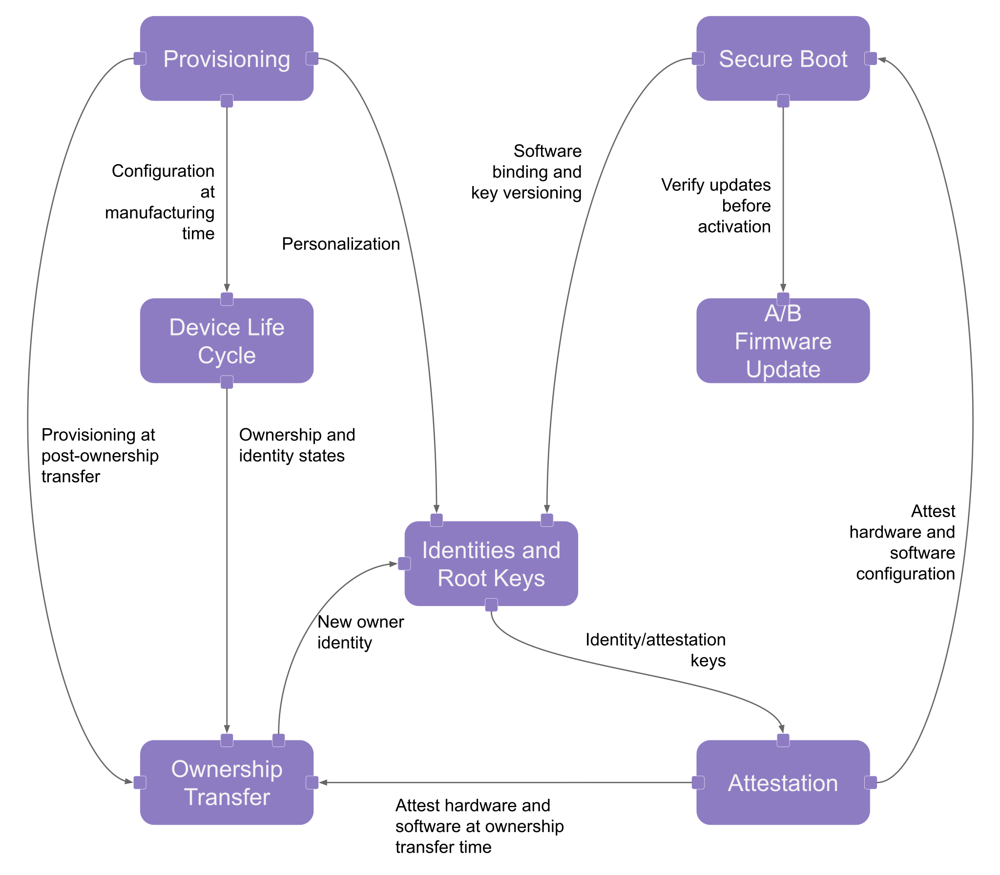

The current version of the security model targets discrete silicon
implementations of OpenTitan. The architecture for an integrated IP solution
will be covered in a future release of this specification.

The following diagram shows the interaction between the different specification
components.

## [Device Life Cycle][device_life_cycle]

OpenTitan supports a set of operational states configured via One Time
Programmable (OTP) memory, allowing the [Silicon Creator][silicon_creator] to
manage the state of the device as it is being manufactured and provisioned for
shipment.

An additional set of life cycle states are also available to encapsulate the
device ownership state. A device that has been personalized with a unique
[Creator Identity][creator_identity] can be provisioned with
[Silicon Owner][silicon_owner] credentials. This enables the
[Silicon Owner][silicon_owner] to run signed code on the device.

## [Secure Boot][secure_boot]

OpenTitan supports a secure boot implementation anchored in the silicon mask
ROM. The mask ROM contains a set of public keys used to verify the first boot
stage stored in flash.  

Each boot stage is in charge of verifying the signature of the next stage and
locking out portions of the chip that are not required by later stages. Once the
boot flow reaches kernel execution, the implementation may opt to implement
dynamic isolation between applications using the available
[Physical Memory Protection][pmp] (PMP) unit.

## [Firmware Update][firmware_update]

OpenTitan supports a firmware layout with two flash partitions, supporting
active and non-active instances of each software component. This enables a
firmware update implementation in which the active partition flashes the new
software into the non-active region with minimal downtime. Secure boot ensures
the integrity and stability of the new software before marking it as active.

## [Identities and Root Keys][identities_and_root_keys]

This document describes the composition of the Silicon Creator and Silicon Owner
cryptographic identities, as well as the device’s key derivation scheme. This
scheme is based on a symmetric key manager with support for software binding and
key versioning.

## [Attestation][attestation]

Covers the mechanism in which software verifies the authenticity and integrity
of OpenTitan's hardware and software configuration.

## [Ownership Transfer][ownership_transfer]

The owner of the silicon is allowed to change in a process known as Ownership
Transfer. During this process, a new party can take ownership of the device and
provision its own identity. This allows the new owner to run its own signed code
and configure its attestation chain.

## [Provisioning][provisioning]

Describes manufacturing and post-ownership transfer provisioning flows. Secrets
required to personalize the identity of the device and initialize security
countermeasures are provisioned at manufacturing time. Silicon owners have the
option of provisioning additional secrets after taking ownership of the device.

[attestation]: 
[creator_identity]: 
[device_life_cycle]: 
[firmware_update]: 
[identities_and_root_keys]: 
[ownership_transfer]: 
[pmp]: https://ibex-core.readthedocs.io/en/latest/03_reference/pmp.html
[provisioning]: 
[secure_boot]: 
[silicon_creator]: 
[silicon_owner]: 
