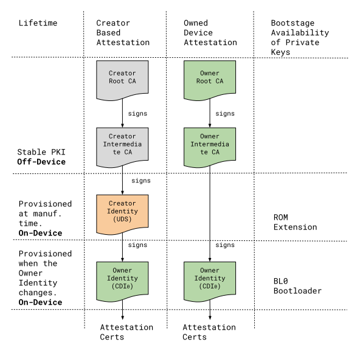
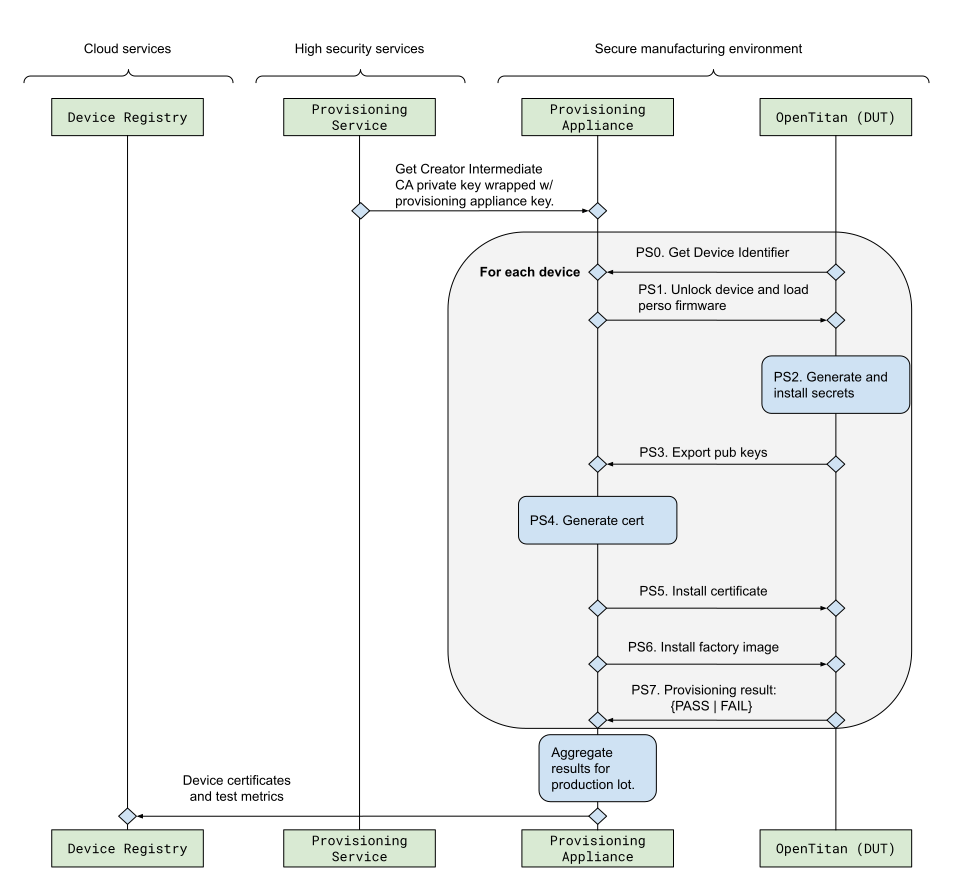
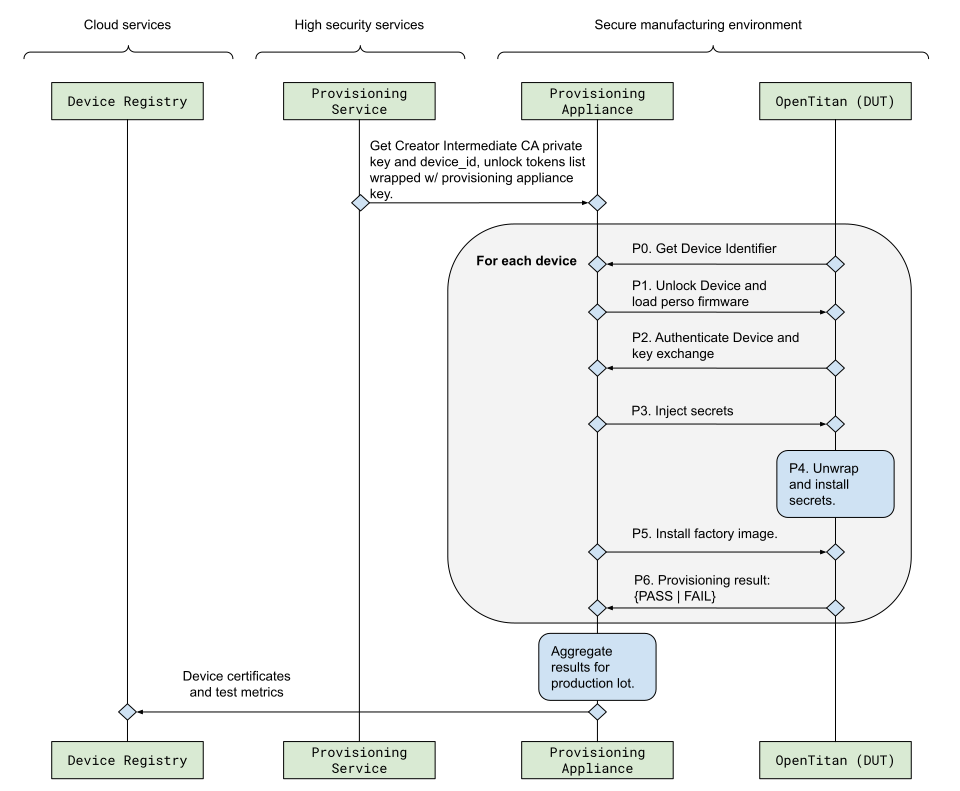

## Overview

Attestation is the mechanism in which software verifies the authenticity and
integrity of the hardware and software of a device. OpenTitan supports the
following attestation mechanisms:

_Creator Based Attestation (Creator Identity Certificate)_

It is used to attest the authenticity of the hardware, the configuration of the
first two firmware boot stages, as well as the unique device key known as the
Creator Identity. The attestation is captured in a certificate signed with a
Silicon Creator intermediate Certificate Authority (CA) key, which can be
validated using Public Key Infrastructure (PKI). Alternatively, the certificate
can be self-signed and verified against the Creator Identity public key and a
trustworthy device registry.

_Owned Device Attestation (Owner Identity Certificate)_

It is used to attest ownership of the device, the BL0 configuration, as well as
the Owner Identity key which is used as a root attestation key managed by the
Silicon Owner. The attestation certificate is signed with the device's Creator
Identity key, forming an attestation chain to the Creator Identity certificate.

A Silicon Owner can endorse the Owner Identity Certificate with its own
intermediate CA key as soon as it takes ownership of the device. This way device
attestation can be verified against the Silicon Owners' PKI of choice.

## Terminology

Boot stages:

*   `ROM`: Metal mask ROM, sometimes known as Boot ROM.
*   `ROM_EXT`: ROM Extension. Stored in flash and signed by the Silicon Creator.
*   Owner boot stages. This document uses two stages as an example. The Silicon
    Owner is free to choose other boot configurations.
    *   `BL0`: Bootloader. Signed by the Silicon Owner.
    *   `KERNEL`: Signed by the Silicon Owner.

## Attestation Flows

Device attestation is rooted in two asymmetric keys named Creator Identity and
Owner Identity. The [Asymmetric Keys](#asymmetric-keys) section provides details
on the cryptographic properties of these keys.

<!-- TODO: Link to Identities and Root Keys doc -->

The **[Creator Identity](#)** is generated at manufacturing time and it is
endorsed by the Silicon Creator PKI. This key is used to sign certificates
endorsing the authenticity of the physical device, the ROM and ROM\_EXT
configuration (see [Creator custom Extension](#creator-custom-extension) for
more details), as well as the Owner Identity public key.

<!-- TODO: Link to Identities and Root Keys doc -->

The **[Owner Identity](#)** is generated at ownership transfer time, or whenever
there is a change to the BL0 software binding tag. The Owner Identity is used to
attest the owner and BL0 configuration, as well as an attestation key used by
the Kernel. This key is endorsed by the Creator Identity, but can also be
endorsed by the Silicon Owner PKI. Endorsement of the Owner Identity with the
Owner's PKI, is covered in detail in the [Owner Personalization](#) process
described in the provisioning specification.

When using a Silicon Owner PKI, the Owner is expected to maintain a device
registry with Creator Identity to Owner Identity certificate mappings to handle
certificate revocations issued by the Silicon Creator.

Application specific attestation keys are expected to be endorsed by the Owner
Identity and managed by the Kernel. The format of the attestation certificate is
outside the scope of this document.

### Certificate Chains

There are two possible attestation chains. Creator based attestation provides a
chain to the Creator PKI, which is useful when testing the authenticity of the
device. After ownership transfer, the Silicon Owner may opt to switch to its own
PKI by endorsing the Owner Identity. On-Device certificates are stored in a
flash region accessible to all boot stages including the kernel stage.
Additional storage is required to store the Owner Identity certificate endorsed
by the Silicon Owner PKI.

The kernel may opt to extend the attestation chain based on application level
requirements. See also the [Privacy Considerations](#privacy-considerations)
section for specific cases in which extending the attestation chain is
recommended.

<table>
  <tr>
    <td>
      
    </td>
  </tr>
  <tr>
    <td>Figure: PKI and Device Certificates</td>
  </tr>
</table>

#### Creator Intermediate CA versus Self-Signed Creator Identity Certificates

The Silicon Creator may opt to implement a self-signed Creator Identity
certificate, which must be verified against a device registry. Self-signed
certificates can be revoked at a finer level of granularity, and allow for
in-field certificate rotation as a result of break-glass ROM_EXT updates[^1].

The Silicon Owner only needs to trust the registry during Creator Based
attestation. This is no different than having to trust the Silicon Creator PKI.
As a result, the following requirements are imposed on the device registry:

*   The device registry must ensure that only authenticated entities are
    authorized to insert certificates into the certificate list.
*   There must be a mechanism for the Silicon Owner to authenticate the device
    registry and establish a secure connection to query certificates associated
    with devices transferred to its ownership.

### Attestation Updates

Updates to the attestation chain can be handled via an explicit command during
the boot sequence, or via an implicit update-after-check mechanism.

#### Attestation command

In this case, attestation updates are handled by a command encoded in a scratch
register that lives outside of the CPU reset domain. The following table
describes the sequence of operations required to update the certificate
attestation chain, which may require generation of new attestation keys.

The attestation command requires a `BOOT_SERVICE_REQUEST` reset to allow the
`ROM_EXT` component to sign the new attestation chain. This is because
OpenTitan's isolation model does not provide a way for the `ROM_EXT` to maintain
its secrets isolated from `BL0` or the kernel layers. Once the `ROM_EXT` is done
using its secrets, it must wipe them from memory before handing over execution
to later stages.

<table>
  <tr>
    <td><strong>Boot Stage</strong></td>
    <td><strong>Step</strong></td>
  </tr>
  <tr>
    <td rowspan="2" ><strong>Kernel</strong></td>
    <td>Queue attestation update command via scratch register write.</td>
  </tr>
  <tr>
    <td>Issue reset with cause `BOOT_SERVICE_REQUEST`.</td>
  </tr>
  <tr>
    <td colspan="2" >System Reset</td>
  </tr>
  <tr>
    <td rowspan="2" ><strong>ROM</strong></td>
    <td>Verify ROM_EXT and configure key manager ROM stage inputs.</td>
  </tr>
  <tr>
    <td>Jump to ROM_EXT</td>
  </tr>
  <tr>
    <td rowspan="5" ><strong>ROM_EXT</strong></td>
    <td>Verify BL0 and configure key manager ROM_EXT stage inputs.</td>
  </tr>
  <tr>
    <td>
Keygen new Owner Identity asymmetric key pair if needed (see
<a href="#key-generation">Key Generation</a> section).

Note: The Creator Identity key is not derived on regular boot flows. It is only
derived as a result of the execution of the attestation command.
    </td>
  </tr>
  <tr>
    <td>
Issue a new Owner Identity certificate to endorse the Owner Identity key (see
<a href="#owner-identity-certificate">Owner Identity Certificate</a> section).
    </td>
  </tr>
  <tr>
    <td>
The Creator Identity key pair is cleared from memory so that it is not available
to later boot stages.
    </td>
  </tr>
  <tr>
    <td>
Jump to BL0 and promote the attestation update request by updating the scratch
pad register.
    </td>
  </tr>
  <tr>
    <td rowspan="5" ><strong>BL0</strong></td>
    <td>Verify Kernel and configure key manager BL0 stage inputs.</td>
  </tr>
  <tr>
    <td>Keygen new attestation asymmetric key pair.</td>
  </tr>
  <tr>
    <td>
Issue an attestation certificate to endorse the new attestation key. The
certificate is signed with the Owner Identity key.

Note: The format of the attestation certificate is controlled by the owner and
outside of the scope of this specification.
    </td>
  </tr>
  <tr>
    <td>
The Owner Identity key pair is cleared from memory so that it is not available
to later boot stages.
    </td>
  </tr>
  <tr>
    <td>
Jump to Kernel and promote the attestation update request by updating the
scratch pad register.
    </td>
  </tr>
  <tr>
    <td rowspan="2" ><strong>Kernel</strong></td>
    <td>Configure key manager state inputs to unwrap attestation key.</td>
  </tr>
  <tr>
    <td>
Verify attestation chain against attestation key and complete attestation update
request by clearing the scratch register.
    </td>
  </tr>
</table>

#### Update after check

The `ROM_EXT` may trigger automatic attestation updates by performing an Owner
Identity attestation check at boot time:

```
measurement = MAC(KM_VersionedKey,
  OwnerIdentityCertificate ||
  OwnerIdentitySeed ||
  FixedInfo)

update_cert = measurement XOR cached_measurement
```

The Owner Identity certificate needs to be updated if `update_cert` evaluates to
a non-zero value. The `measurement` is a MAC operation with the following
components:

*   `KM_VersionedKey`: Symmetric versioned key extracted from key manager used
    as MAC key.
*   `MAC` message is a concatenation of the following data:
    *   Owner Identity Certificate.
    *   Owner Identity Seed: Output from the key manager.
    *   FixedInfo: Data associated with the Owner Identity keygen operation.

### Modes of Operation

OpenTitan supports various modes of operation. The mode of operation is
encapsulated in the Owner Identity certificate; thus, any given attestation
chain is only valid for a single mode of operation. Secure boot makes sure that
the attestation chain is only available if the device state matches the expected
configuration.

In addition to this, the key manager outputs used to generate the
[key identifiers](#key-identifiers) depend on system level measurements that
reflect the mode of operation of the device. The following definitions are
compatible with the OpenTitan device life cycle definitions.

<table>
  <tr>
    <td><strong>Name</strong></td>
    <td><strong>Value</strong></td>
    <td><strong>Description</strong></td>
  </tr>
  <tr>
    <td>Not Configured</td>
    <td>0</td>
    <td>
Use when the security mechanisms of the device have not been fully configured.
    </td>
  </tr>
  <tr>
    <td>Normal</td>
    <td>1</td>
    <td>
Device in PROD lifecycle stage running production software.

*   Secure boot enabled.
*   Debug functionality in hardware and software are disabled.
    </td>
  </tr>
  <tr>
    <td>Debug</td>
    <td>2</td>
    <td>
Device in operational state but not fully meeting the criteria of Normal mode of
operation.
    </td>
  </tr>
</table>

## Provisioning - Key Manager Configuration

The key manager provides identity values which are used to generate both the
Creator and the Owner identity key pairs. The following sections describe the
key manager provisioning requirements.

### Creator Secrets and Device Identifier

The Silicon Creator is in charge of provisioning the device root secrets used to
generate the Creator Identity[^2].

<!-- TODO: Add link to Identities and Root Keys doc -->

The root secrets are defined as [RootKey](#) and [DiversificationKey](#), which
are generated by an entropy source with a security strength equivalent to the
one provided by the key manager. Random number generation shall follow the
recommendations from
[NIST 800-90A](https://nvlpubs.nist.gov/nistpubs/SpecialPublications/NIST.SP.800-90Ar1.pdf).
The number of bits required for each secret is dependent on the key manager
implementation details.

<!-- TODO: Add link to Identities and Root Keys doc -->

In addition to this, the Silicon Creator is also responsible for configuring a
statistically unique non-cryptographic [Device Identifier](#) used to track the
device throughout its lifecycle.

#### Manufacturing Flow

Provisioning is performed in a process referred to as personalization, which
occurs at manufacturing time. Personalization is performed in a secure facility
that meets the security assurance requirements of the SKU being produced.

<!-- Add link to provisioning doc -->

There are two alternative methods for personalization described in the sequence
diagrams below. Implementation details are outside the scope of this document.
See the [Device Provisioning](#) specification for more details.

<table>
  <tr>
    <td style="text-align:center">
      
    </td>
  </tr>
  <tr>
    <td style="text-align:center">
<strong>Self-Generation</strong>: Secrets are generated inside the device under test and
never leave the device. The public portion of the Creator Identity is exported
so that it can be endorsed by the Silicon Creator.
    </td>
  </tr>
</table>

<table>
  <tr>
    <td>
      
    </td>
  </tr>
  <tr>
    <td style="text-align:center">
<strong>Injection</strong>: This method employs a provisioning appliance, usually built with
a certified HSM, capable of generating high-quality secrets at a much faster
rate compared to an OpenTitan device. In this method, the secrets and Creator
Identity certificate are injected into the device under test.
    </td>
  </tr>
</table>

### Owner Secrets

<!-- TODO: Add link to the Identities and Root Keys doc -->

The ROM Extension is in charge of resetting the [OwnerRootSecret](#) during
ownership transfer or updates to the BL0 software binding tag. The new value
shall be generated by an entropy source with a security strength equivalent to
the one supported by the key manager. The triggering mechanism for updating the
value is covered in the [Attestation Updates](#attestation-updates) section.

## Asymmetric Keys {#asymmetric-keys}

OpenTitan uses ECDSA attestation keys conformant to
[FIPS 186-4](https://nvlpubs.nist.gov/nistpubs/FIPS/NIST.FIPS.186-4.pdf). Future
revisions of this specification may add support for other signature schemes.

### Key Identifiers

Key identifiers are defined as follows, where `SALT_CKI`and `SALT_OKI` are 256b
values defined in `ROM_EXT` and `BL0` respectively.

```
CreatorKeyIdentifier = MAC(SALT_CKI, CreatorIdentitySeed)
OwnerKeyIdentifier = MAC(SALT_OKI, OwnerIdentitySeed)
```

### Key Generation

The following keygen mechanism employs a DRBG instantiated with a fixed entropy
pool.

```
// Seed length compliant with NIST 800-90A section 10.
// For CTR_DRBG with AES-256 the minimum seed length is 384.
FIXED_ENTROPY_SEED = least 384b stored in flash

// This mode of operation in hardware is being tracked via a feature
// request: https://github.com/lowRISC/opentitan/issues/2652
// The implementation may opt for supporting this in a software
// based DRBG, as long as performance requirements are met.
drbg_ctx = DRBG_init(FIXED_ENTROPY_SEED, key_identifier)
do:
  c = DRBG_generate(drbg_ctx)
while c > curve_order - 2

private_key = c + 1
public_key = private_key * G
```

Requirements:

*   Key pair generation is based on
    [FIPS 186-4](https://nvlpubs.nist.gov/nistpubs/FIPS/NIST.FIPS.186-4.pdf)
    appendix B.4. The example above follows the test candidate key generation
    method.
*   The key size shall provide a security strength as recommended by
    [NIST 800-57](https://nvlpubs.nist.gov/nistpubs/SpecialPublications/NIST.SP.800-57pt1r4.pdf)
    part 1, for example:

**Security Strength** | **ECDSA**
--------------------- | ---------
128                   | NIST_P256
196                   | NIST_P384
256                   | NIST_P521

*   The DRBG shall be initialized with a security strength equivalent to the one
    supported by the asymmetric key conformant to
    [NIST 800-133](https://nvlpubs.nist.gov/nistpubs/SpecialPublications/NIST.SP.800-133r1.pdf)
    section 4.
*   `key_identifier` is set to the output of the key manager. See the table
    below for more details.
*   `FIXED_ENTROPY_SEED` is extracted from the DRBG and stored in flash. The
    software shall ensure isolation of this value to enforce the visibility
    settings described in the table below.

<table>
  <tr>
    <td>Key</td>
    <td>Visibility</td>
    <td>Key Identifier<br><code>key_identifier</code></td>
    <td>Entropy Generation Time<br><code>FIXED_ENTROPY_SEED</code></td>
  </tr>
  <tr>
    <td>Creator Identity<br>(UDS)</td>
    <td>ROM_EXT</td>
    <!-- TODO: Add link to Identities and Root keys doc -->
    <td><a href="#">CreatorKeyIdentifier</a></td>
    <td>personalization (Factory)</td>
  </tr>
  <tr>
    <td>Owner Identity<br>(CDI0)</td>
    <td>BL0</td>
    <!-- TODO: Add link to Identities and Root keys doc -->
    <td><a href="#">OwnerKeyIdentifier</a></td>
    <td>Ownership Transfer</td>
  </tr>
</table>

#### Alternative Key Generation Flow

To avoid the need for a `FIXED_ENTROPY_SEED`, the attestation keys may be
generated directly from a true entropy source fed into the DRBG. Once the key is
generated, it has to be wrapped for storage with a key extracted from the key
manager. In this approach, the `key_identifier parameter` does not need to be
provided by the key manager.

```
// Initialize DRBG with True RNG source.
drbg_ctx = DRBG_init(personalization_string=key_identifier)
do:
  c = DRBG_generate(drbg_ctx)
while c > curve_order - 2

private_key = c + 1
public_key = private_key * G

// Initialize the key manager to extract a storage key.
kmgr = keymgr_init()

// Advance to required key manager stage (one-way state change)
keymgr_advance_state(kmgr)

// Generate versioned key used to wrap the |private_key|. The
// |wrapping_key| may have to be split into shares before loading
// into AES. The wrapping key is bound to the key manager software
// binding and max key version configuration.
wrapping_key = keymgr_generate_vk(kmgr, key_version, key_id)

// The wrapping key shall be stored with additional metadata to
// facilitate unwrapping.
wrapped_key = AES_256_CTR(wrapping_key, iv, private_key)
```

## Certificate Format

Certificates stored in the device adhere to standard X.509 format, meeting the
profile specification requirements from
[RFC 5280](https://tools.ietf.org/html/rfc5280), and the Google DICE profile
specification.

### Public Key Identifiers

The following key identifiers are generated using a MAC based one-step key
derivation function as specified in
[NIST 800-56C](https://nvlpubs.nist.gov/nistpubs/SpecialPublications/NIST.SP.800-56Cr1.pdf).
The `SALT_ID` parameter is configured by software.

<table>
  <tr>
   <td><strong>Label</strong></td>
    <td><strong>Description</strong></td>
  </tr>
  <tr>
    <td>Creator PubKey ID<br>(UDS_ID)</td>
    <td>
MAC_KDM(SALT_ID, CreatorIdentityPubKey, outlength=20, info="ID")
    </td>
  </tr>
  <tr>
    <td>Owner PubKeyID<br>(CDI_ID)</td>
    <td>
MAC_KDM(SALT_ID, OwnerIdentityPubKey, outlength=20, info="ID")
    </td>
  </tr>
</table>

### Creator Identity Certificate

The TBSCertificate field contains the subject of the certificate and the CA
issue information. The following fields are required:

<table>
  <tr>
    <td><strong>Field</strong></td>
    <td><strong>Value</strong></td>
  </tr>
  <tr>
    <td>Version</td>
    <td>3</td>
  </tr>
  <tr>
    <td>Serial Number</td>
    <td>
Creator public key identifier in ASN.1 INTEGER format.

The result value shall be a positive integer upto 20 octets in size.
    </td>
  </tr>
  <tr>
    <td>Signature</td>
    <td>
One of the following identifiers matching the signature and digest format.


[rfc5758](https://tools.ietf.org/html/rfc5758#section-3.2):

*   ecdsa-with-SHA256
*   ecdsa-with-SHA384
*   ecdsa-with-SHA512

[rfc8692](https://tools.ietf.org/html/rfc8692#section-3):

*   id-ecdsa-with-shake256

Note: There are no identifiers available for SHA3-{256|512}.
    </td>
  </tr>
  <tr>
    <td>Issuer</td>
    <td>
X520SerialNumber: id

Where id is set to the creator public key identifier in hex encoded format.
    </td>
  </tr>
  <tr>
    <td>Validity</td>
    <td>

Not Before: personalization time in
[GeneralizedTime](https://tools.ietf.org/html/rfc5280#section-4.1.2.5.2) format.

Not After : 99991231235959Z from
[rfc5280](https://tools.ietf.org/html/rfc5280#section-4.1.2.5) (no expiration
time).
    </td>
  </tr>
  <tr>
    <td>Subject</td>
    <td>
X520SerialNumber: id

Where id is set to the creator public key identifier in hex encoded format.
    </td>
  </tr>
  <tr>
    <td>Subject Public Key Info</td>
    <td>

Subject public key information fields associated with ECDSA signature algorithm
as defined in [rfc5480](https://tools.ietf.org/html/rfc5480#section-2).
    </td>
  </tr>
  <tr>
    <td>Unique Identifiers</td>
    <td>These fields are omitted.</td>
  </tr>
  <tr>
    <td>Extensions</td>
    <td>
Extensions for compatibility with Google DICE profile:

*   `subjectKeyIdentifier` (non-critical). Used to identify certificates that
    contain a particular public key. Set to the creator public key identifier
    value.
*   `keyUsage`> (critical). Describes the purpose of the public key contained in
    the certificate. Contains only `keyCertSign`.
*   `basicConstraints` (critical). Identifies whether the subject of the
    certificate is a CA and the maximum depth of valid certification paths.
    *   `cA` is set to TRUE
    *   `pathLenConstraint` not included.

OpenTitan Creator Identity custom extension:

*   `extnID`: TBD. Need to determine if we need an OID for OpenTitan, or if we
    can allocate a new ID under the Google certificate extension domain
    1.3.6.1.4.1.11129.2.1.
*   `critical`: FALSE
*   `extnValue`: See [creator custom extension](#creator-custom-extension)
    section.
    </td>
  </tr>
</table>

#### Creator custom Extension {#creator-custom-extension}

This extension is formatted as an ASN.1 SEQUENCE containing device identifiable
information. See [Privacy Considerations](#privacy-considerations) for
additional details on how to handle privacy concerns.

<table>
  <tr>
    <td><strong>Seq. No.</strong></td>
    <td><strong>Name</strong></td>
    <td><strong>Encoding</strong></td>
    <td><strong>Description</strong></td>
  </tr>
  <tr>
    <td>0</td>
    <td>Operational Mode</td>
    <td>INTEGER</td>
    <td>

[Operational mode](#operational-mode) of the device.
    </td>
  </tr>
  <tr>
    <td>1</td>
    <td>Device Identifier</td>
    <td>OCTET STR</td>
    <td>

<!-- Add Link to Identities and Root Keys doc. -->
[Device Identifier](#).
    </td>
  </tr>
  <tr>
    <td>2</td>
    <td>HASH Type</td>
    <td>OCTET STR</td>
    <td>HASH type used in measurements.</td>
  </tr>
  <tr>
    <td>3</td>
    <td>ROM Hash</td>
    <td>OCTET STR</td>
    <td>ROM contents hash.</td>
  </tr>
  <tr>
    <td>4</td>
    <td>ROM EXT Hash</td>
    <td>OCTET STR</td>
    <td>ROM EXT contents hash. Includes code manifest.</td>
  </tr>
  <tr>
    <td>5</td>
    <td>Code Descriptor</td>
    <td>OCTET STR</td>
    <td>ROM/ROM_EXT versioning information.</td>
  </tr>
</table>

### Owner Identity Certificate

The TBSCertificate field contains the subject of the certificate and the CA
issue information. The following fields are required:

<table>
  <tr>
    <td><strong>Field</strong></td>
    <td><strong>Value</strong></td>
  </tr>
  <tr>
    <td>Version</td>
    <td>3</td>
  </tr>
  <tr>
    <td>Serial Number</td>
    <td>
Owner public key identifier in ASN.1 INTEGER format.

The result value shall be a positive integer upto 20 octets in size.
    </td>
  </tr>
  <tr>
    <td>Signature</td>
    <td>
One of the following identifiers matching the signature and digest format.


[rfc5758](https://tools.ietf.org/html/rfc5758#section-3.2):

*   ecdsa-with-SHA256
*   ecdsa-with-SHA384
*   ecdsa-with-SHA512

[rfc8692](https://tools.ietf.org/html/rfc8692#section-3):

*   id-ecdsa-with-shake256
    </td>
  </tr>
  <tr>
    <td>Issuer</td>
    <td>
X520SerialNumber:  id

Where id is set to the creator public key identifier in hex encoded format.
    </td>
  </tr>
  <tr>
    <td>Validity</td>
    <td>

Not Before: personalization time in
[GeneralizedTime](https://tools.ietf.org/html/rfc5280#section-4.1.2.5.2) format.

Not After : 99991231235959Z from
[rfc5280](https://tools.ietf.org/html/rfc5280#section-4.1.2.5) (no expiration
time).
    </td>
  </tr>
  <tr>
    <td>Subject</td>
    <td>
X520SerialNumber:  id

Where id is set to the owner public key identifier in hex encoded format.
    </td>
  </tr>
  <tr>
    <td>Subject Public Key Info</td>
    <td>

Subject public key information fields associated with ECDSA signature algorithm
as defined in [rfc5480](https://tools.ietf.org/html/rfc5480#section-2).
    </td>
  </tr>
  <tr>
    <td>Unique Identifiers</td>
    <td>These fields are omitted.</td>
  </tr>
  <tr>
    <td>Extensions</td>
    <td>
Extensions for compatibility with Google DICE profile:

*   `authorityKeyIdentifier` (non-critical). Used to identify certificates that
    contain a particular public key.
    *   `keyIdentifier` set to the creator public key identifier value. This is
         the only field needed.
*   `subjectKeyIdentifier` (non-critical). Used to identify certificates that
    contain a particular public key. Set to the owner public key identifier
    value.
*   `keyUsage` (critical). Describes the purpose of the public key contained in
    the certificate. Contains only `keyCertSign`.
*   `basicConstraints` (critical). Identifies whether the subject of the
    certificate of the is a CA and the maximum depth of valid certification
    paths.
    *   `CA` is set to TRUE
    *   `pathLenConstraint` not included.

OpenTitan Owner Identity custom extension:

*   `extnID`: TBD. Need to determine if we need an OID for OpenTitan, or if we
    can allocate a new ID under the Google certificate extension domain
    1.3.6.1.4.1.11129.2.1.
*   `critical`: FALSE
*   `extnValue`: See [owner custom extension](#owner-custom-extension) section.

This certificate may also contain the
[creator custom extension](#creator-custom-extension) if the Owner decides to
endorse this certificate with its own PKI.
    </td>
  </tr>
</table>

#### Owner Custom Extension

ASN.1 SEQUENCE containing the following fields. The owner can extend this as
needed.

<table>
  <tr>
    <td><strong>Seq. No.</strong></td>
    <td><strong>Name</strong></td>
    <td><strong>Encoding</strong></td>
    <td><strong>Description</strong></td>
  </tr>
  <tr>
    <td>0</td>
    <td>Code Descriptor</td>
    <td>OCTET STR</td>
    <td>BL0 version and key manager software binding tag information.</td>
  </tr>
</table>

## Lightweight Certificate Format

The Silicon Creator may opt to implement attestation signatures over a binary
manifest containing the endorsed key as well as the measurements described in
the [creator](#creator-custom-extension) and [owner](#owner-custom-extension)
custom extensions.

The binary manifest format must be standardized at the OpenTitan project level
to ensure interoperability between silicon and software layers.

## Privacy Considerations {#privacy-considerations}

The Silicon Owner software must address any privacy concerns associated with the
use of device identifiable information.

The Silicon Owner certificate, for example, is meant to be used exclusively with
the Silicon Owner's infrastructure. Use cases requiring multiple identities or
attestation services for multiple backends are required to derive
<span style="text-decoration:underline;">application level identities and
certificates</span>. Such application level identities must fulfill the privacy
requirements of their use cases.

OpenTitan's key manager provides a mechanism to derive multiple application
level keys with lineage to the Owner Identity, without making them
distinguishable from any random key. These properties allow the software
implementation to bind the OpenTitan attestation to any application level
attestation flows without precluding the implementation of additional privacy
measures at the application level.


<!-- Footnotes themselves at the bottom. -->
## Notes

[^1]: In-field ROM_EXT updates performed by a Silicon Owner may invalidate the
Creator Identity and its associated certificate. Without a federated device
registry, new silicon owners are left to trust the Creator Identity certificate
provided by the current owner to verify the authenticity of the device.

[^2]: The Creator Identity is referred to as the Unique Device Secret (UDS) in
DICE terminology.
