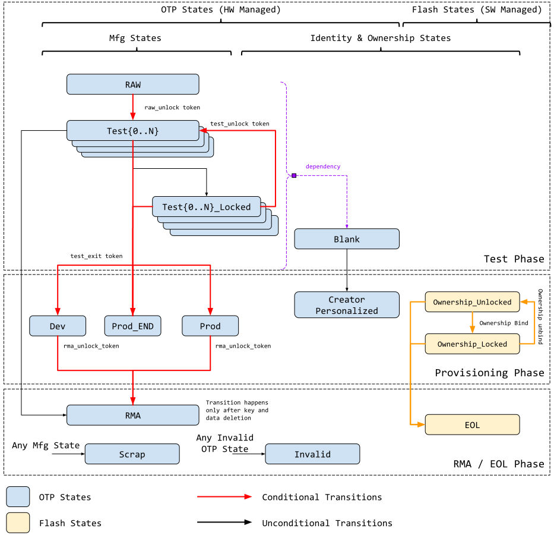

## Overview

This document describes the OpenTitan device operational states supported for
manufacturing, provisioning, regular operation and RMA[^1].

Provisioning refers to the process in which a device creates a unique and
trusted identity.

Manufacturing refers to the process in which a device is tested and prepared for
silicon correctness prior to production.

The technical specification of the corresponding life cycle controller IP can be found [here]().

## Background

First see [here]() for
OpenTitan's logical entity breakdowns.

OpenTitan implements standard device life cycle manufacturing states which are
configured via OTP[^2] memory. These states allow the **Silicon Creator** to
manage the state of the device as it is being manufactured and provisioned for
shipment.

An additional set of life cycle states are used to encode the device ownership
state. A device that has been personalized with a unique Silicon Creator
Identity, can be provisioned with a Silicon Owner Identity and Credentials. This
enables the Silicon Owner to run signed code on the device. The process of
assigning a Silicon Owner to a device is referred to as Ownership Transfer.
Depending on the product SKU configuration, a device may support a single and
permanent ownership transfer or multiple ones. The multiple ownership transfer
use case has additional state control requirements which are described in more
detail in later sections.

## Architecture

Life cycle states are defined by a combination of OTP and flash. OTP state
transitions cannot be reverted, while flash defined states are meant to be
'flexible', especially when ownership transfer is required. This implies that
when OTP states are transitioned from A to B, we cannot go back to A from B.
However, it is still possible to transition from B to C, assuming such a
transition is legal and allowed by the life cycle definition.

See the table below for more details.

In the diagram above,

*   **BLACK** arcs represent unconditional OTP transitions. Specifically, this
    means that the state will transition as long as it was requested; no
    additional authorization is necessary.
*   **ORANGE** arcs represent conditional flash transitions. Specifically, the
    transition requires either specific value patterns or device specific values
    to be programmed. Since flash states are managed by software, this is not
    further covered in this specification.
*   **RED** arcs represent conditional transitions. These transitions require
    the user to supply specific device-unique values and meet specific
    conditions. These transitions cannot be reversed.

Device life cycle is split into two domains.

*   Manufacturing state
*   Identity & Ownership state

Manufacturing state largely refers to the presence of debug functions and
liveness of the device. This is closely connected to manufacturing testing
status as well as desired debug visibility during development and production.

Identity & Ownership state refers to the state of provisioned identities as
defined by the provisioning flow.

The life cycle management system splits the states into two because there are
attributes defined by each that are not strictly related most of the time. By
decoupling a single definition into two, more flexibility is allowed in the
system.

In addition, while certain states are defined by OTP (thus hard), other states
are defined by flash. This gives the latter more flexibility in changing values
to support the provisioning flow ownership transfer model.

For example, transitions into the DEV / PROD / RMA manufacturing states affect
OTP states and therefore cannot be reversed once completed.

OWNED / UNOWNED identity states are defined in flash and thus can be reversed
under the right circumstances.

Below, each state is described in detail.

### Manufacturing States

<table>
  <tr>
    <td><strong>Name</strong></td>
    <td><strong>Encoding</strong></td>
    <td><strong>Description</strong></td>
  </tr>
  <tr>
    <td>RAW</td>
    <td>OTP</td>
    <td>

This is the default state of the OTP.

During this state, no functions other than transition to TEST_UNLOCKED0 are
available.

The token authorizing the transition from RAW to TEST_UNLOCKED0 is a value that
is secret global to all devices.  This is known as the RAW_UNLOCK token.
    </td>
  </tr>
  <tr>
    <td>TEST_LOCKED{N}</td>
    <td>OTP</td>
    <td>

TEST_LOCKED{N} states have identical functionality to RAW state and serve as a
way for the Silicon Creator to protect devices in transit.

It is not possible to provision OTP root secrets during this state.  This
is enforced by hardware and is implementation defined.

To progress from a TEST_LOCKED state to another TEST_UNLOCKED state, a TEST_UNLOCK
token is required.
    </td>
  </tr>
  <tr>
    <td>TEST_UNLOCKED{N}</td>
    <td>OTP</td>
    <td>

Transition from RAW state using OTP write.

This state is used for <strong>manufacturing and production testing.</strong>

During this state:

  *   CPU execution is enabled
  *   NVM backdoor functions are enabled
  *   Debug functions are enabled
  *   DFT functions are enabled

Note: during this state it is not possible to provision specific OTP root
secrets. This will be enforced by hardware.

It is expected that during TEST_UNLOCKED0 the TEST_UNLOCK and TEST_EXIT tokens will be
provisioned into OTP.

Once provisioned, these tokens are no longer readable by software.
    </td>
  </tr>
  <tr>
    <td>PROD</td>
    <td>OTP</td>
    <td>

Transition from TEST_UNLOCKED state via OTP write. This is a mutually exclusive state to
DEV and PROD_END.

To enter this state, a TEST_EXIT token is required.

This state is used both for provisioning and mission mode.

During this state:

  *   CPU execution is enabled
  *   NVM backdoor functions are disabled
  *   Debug functions are disabled
  *   DFT functions are disabled
    </td>
  </tr>
  <tr>
    <td>PROD_END</td>
    <td>OTP</td>
    <td>

This state is identical in functionality to PROD, except the device is never
allowed to transition to RMA state.

To enter this state, a TEST_EXIT token is required.
   </td>
  </tr>
  <tr>
   <td>DEV</td>
   <td>OTP</td>
   <td>

Transition from TEST_UNLOCKED state via OTP write. This is a mutually exclusive state to
PROD and PROD_END.

To enter this state, a TEST_EXIT token is required.

This state is used for developing provisioning and mission mode software.

During this state

  *   CPU execution is enabled
  *   NVM backdoor functions are disabled
  *   Debug functions are enabled
  *   DFT functions are disabled
    </td>
  </tr>
  <tr>
    <td>RMA</td>
    <td>OTP</td>
    <td>

Transition from TEST_UNLOCKED / PROD / DEV via OTP write. It is not possible to reach
this state from PROD_END.

When transitioning from PROD or DEV, an RMA_UNLOCK token is required.

When transitioning from TEST_UNLOCKED, no RMA_UNLOCK token is required.

A hardware-backed mechanism will erase all owner flash content before RMA
transition is allowed. This includes the isolation owner flash partitions as
well as any owner code. Once erasure is confirmed and verified, RMA transition
will proceed.

During this state

  *   CPU execution is enabled
  *   NVM backdoor is enabled
  *   Debug functions are enabled
  *   DFT functions are enabled
    </td>
  </tr>
  <tr>
    <td>SCRAP</td>
    <td>OTP</td>
    <td>

Transition from any manufacturing state via OTP write.

During SCRAP state the device is completely dead.  All functions, including CPU
execution are disabled.

No owner consent is required to transition to SCRAP.

Note also, SCRAP is meant as an EOL manufacturing state.  Transition to this
state is always purposeful and persistent, it is NOT part of the device's
native security countermeasure to transition to this state.
    </td>
  </tr>
  <tr>
    <td>INVALID</td>
    <td>OTP</td>
    <td>

Invalid is any combination of OTP values that do not fall in the categories
above.  It is the "default" state of life cycle when no other conditions match.

Functionally, INVALID is identical to SCRAP in that no functions are allowed
and no transitions are allowed.

A user is not able to explicitly transition into INVALID (unlike SCRAP),
instead, INVALID is meant to cover in-field corruptions, failures or active
attacks.
    </td>
  </tr>
</table>

The various functionalities controlled by life cycle states can be broken into
the following categories:

*   DFT Functionality
    *   Refers to the ability to run any DFT function. (In this context, DFT
        functions include scan-based manufacturing testing, etc., as opposed to
        JTAG-based CPU debug.)
*   NVM backdoor access
    *   Certain NVM modules can be backdoor accessed from alternate paths
        *   For example, there may be a functional bit-banging path that
            bypasses the normal protection controls.
        *   For example, there may be a pin connected path used to debug the NVM
            modules meant only for critical debug.
    *   If these paths are DFT-based, they are absorbed into the category above
*   Debug
    *   Refers to both invasive CPU debug (JTAG) and non-invasive system debug
        (debug output bus or analog test points)
*   CPU Functionality
    *   Refers to the ability to run ROM or any custom code

In addition, the life cycle states are mixed into the key manager, ensuring that
each state will diversify into a different key tree.

The table below summarizes the availability of various functions in each state.
A `"Y"` mark means the function is directly enabled by hardware during that
state. A `"grey"` box means a particular function is not available during that
state.

<table style="text-align:center">
  <tr>
    <td style="text-align:left"><strong>Functions</strong></td>
    <td><strong>DFT_EN</strong></td>
    <td><strong>NVM_DEBUG_EN</strong></td>
    <td><strong>HW_DEBUG_EN</strong></td>
    <td><strong>CPU_EN</strong></td>
    <td><strong>Change State</strong></td>
  </tr>
  <tr>
    <td style="text-align:left">RAW</td>
    <td colspan="4" style="background:#dadce0"> </td>
    <td rowspan="7" >See table below</td>
  </tr>
  <tr>
   <td style="text-align:left">TEST_LOCKED</td>
   <td colspan="4" style="background:#dadce0"> </td>
  </tr>
  <tr>
    <td style="text-align:left">TEST_UNLOCKED</td>
    <td>Y</td><td>Y</td><td>Y</td><td>Y</td>
  </tr>
  <tr>
    <td style="text-align:left">DEV</td>
    <td colspan="2" style="background:#dadce0"> </td><td>Y</td><td>Y</td>
  </tr>
  <tr>
    <td style="text-align:left">PROD</td>
    <td colspan="3" style="background:#dadce0"> </td><td>Y</td>
  </tr>
  <tr>
    <td style="text-align:left">PROD_END</td>
    <td colspan="3" style="background:#dadce0"> </td><td>Y</td>
  </tr>
  <tr>
    <td style="text-align:left">RMA</td>
    <td>Y</td><td>Y</td><td>Y</td><td>Y</td>
  </tr>
  <tr>
    <td style="text-align:left">SCRAP</td>
    <td colspan="5" style="background:#dadce0"> </td>
  </tr>
  <tr>
    <td style="text-align:left">INVALID</td>
    <td colspan="5" style="background:#dadce0"> </td>
  </tr>
</table>

The following table shows the allowed state transitions in each state. INVALID
state is not an explicit transition destination, therefore it is not listed as
one of the target states. The `"C"` marks represent conditional transitions
qualified by the token table that follows.

<table style="text-align:center">
  <tr>
    <td style="text-align:left"><strong>States</strong></td>
    <td><strong>RAW</strong></td>
    <td><strong>TEST LOCKED</strong></td>
    <td><strong>TEST_UNLOCKED</strong></td>
    <td><strong>DEV</strong></td>
    <td><strong>PROD</strong></td>
    <td><strong>PROD_END</strong></td>
    <td><strong>RMA</strong></td>
    <td><strong>SCRAP</strong></td>
  </tr>
  <tr>
    <td style="text-align:left">RAW</td>
    <td colspan="2" style="background:#dadce0"> </td><td>C</td><td colspan="4" style="background:#dadce0"> </td><td>Y</td>
  </tr>
  <tr>
    <td style="text-align:left">TEST_LOCKED</td>
    <td colspan="2" style="background:#dadce0"> </td><td>C</td><td>C</td><td>C</td><td>C</td><td style="background:#dadce0"> </td><td>Y</td>
  </tr>
  <tr>
    <td style="text-align:left">TEST_UNLOCKED</td>
    <td style="background:#dadce0"> </td><td>Y</td><td style="background:#dadce0"> </td><td>C</td><td>C</td><td>C</td><td>Y</td><td>Y</td>
  </tr>
  <tr>
    <td style="text-align:left">DEV</td>
    <td colspan="6" style="background:#dadce0"> </td><td>C</td><td>Y</td>
  </tr>
  <tr>
    <td style="text-align:left">PROD</td>
    <td colspan="6" style="background:#dadce0"> </td><td>C</td><td>Y</td>
  </tr>
  <tr>
    <td style="text-align:left">PROD_END</td>
    <td colspan="7" style="background:#dadce0"> </td><td>Y</td>
  </tr>
  <tr>
    <td style="text-align:left">RMA</td>
    <td colspan="7" style="background:#dadce0"> </td><td>Y</td>
  </tr>
  <tr>
    <td style="text-align:left">SCRAP</td>
    <td colspan="8" style="background:#dadce0"> </td>
  </tr>
  <tr>
    <td style="text-align:left">INVALID</td>
    <td colspan="8" style="background:#dadce0"> </td>
  </tr>
</table>

The following table enumerates the tokens and their properties. The storage
format is implementation specific.

<table style="text-align:center">
  <tr>
    <td><strong style="text-align:left">Token</strong></td>
    <td><strong>Storage</strong></td>
    <td><strong>Device Unique?</strong></td>
    <td><strong>Usage</strong></td>
  </tr>
  <tr>
    <td style="text-align:left">RAW_UNLOCK</td>
    <td>RTL</td>
    <td>No</td>
    <td>From RAW->TEST_UNLOCKED0</td>
  </tr>
  <tr>
    <td style="text-align:left">TEST_UNLOCK</td>
    <td>OTP</td>
    <td>Silicon creator choice</td>
    <td>From TEST_LOCKED{N} to TEST_UNLOCKED{N}</td>
  </tr>
  <tr>
    <td style="text-align:left">TEST_EXIT</td>
    <td>OTP</td>
    <td>Silicon creator choice</td>
    <td>From any TEST_UNLOCKED state to DEV, PROD_END or PROD</td>
  </tr>
  <tr>
    <td style="text-align:left">RMA_UNLOCK</td>
    <td>OTP</td>
    <td>Yes</td>
    <td>From PROD/DEV to RMA</td>
  </tr>
</table>

#### RMA Unlock

When in either PROD or DEV state, the device can be transitioned into RMA state
to re-enable full debug functionality.

A device unique RMA token is required to enter RMA. This RMA token is under the
control of the Silicon Creator. To prevent abuse of this authority, the current
manufacturing state is mixed by hardware directly into the key manager. This
ensures that the Silicon Creator cannot arbitrarily put a device into RMA mode
and impersonate a victim silicon owner. It also ensures that the Silicon Creator
cannot accidentally leak any content wrapped by the owner under key manager, as
the keys can never be re-created.

Further, before transitioning to RMA, a hardware backed mechanism will erase all
existing owner content in flash. In addition to the key manager mixing above,
this wipe further limits the Creator's ability to abuse the existing device.

### Identity & Ownership States

<table>
  <tr>
    <td><strong>Name</strong></td>
    <td><strong>Encoding</strong></td>
    <td><strong>Description</strong></td>
  </tr>
  <tr>
    <td>BLANK</td>
    <td>OTP</td>
    <td>

Initial identity and ownership state.  There is no hardware identity or
ownership provisioned
    </td>
  </tr>
  <tr>
   <td>CREATOR PERSONALIZED</td>
   <td>OTP</td>
   <td>

The hardware relevant information has been provisioned.  This includes:

  *   RMA_UNLOCK Token
  *   Creator Root Key
  *   Creator Diversification Key

Once the identity state advances to CREATOR_PERSONALIZED, creator provisioned
secrets (see Identity flow) are no longer accessible to software and are
directly consumed by hardware.
    </td>
  </tr>
  <tr>
    <td>UNOWNED</td>
    <td>Flash</td>
    <td>

This state represents a device which contains a Creator Identity but does not
yet have a Silicon Owner provisioned.

Since this state is software managed, software is free to define a different
state.
    </td>
  </tr>
  <tr>
    <td>OWNED</td>
    <td>Flash</td>
    <td>

This state represents a device which contains both a Creator Identity and a
Silicon Owner.

A device in the OWNED state can transition back to UNOWNED when it is explicitly
unbound. The unbinding process is described separately.

Since this state is software managed, software is free to define a different
state.
    </td>
  </tr>
  <tr>
    <td>EOL</td>
   <td>Flash</td>
   <td>

This state represents a device that has reached its identity EOL.

Since this state is software managed, software is free to define a different
state.
    </td>
  </tr>
</table>

### States and Isolation Properties

The manufacturing state is used as part of the key generation and derivation
process. (Please see key manager and life cycle implementation for more
details). By doing this, the device ensures that states with invasive debug
capabilities, typically used for debug, manufacturing testing and RMA, cannot be
used to expose device secrets during mission mode.

The identity states are not used as part of the key generation process. Instead
they are used as metadata to control software accessibility to the OTP
partitions used to hold device unique secrets provisioned during manufacturing.

*   When identity state is BLANK, software can access the relevant OTP
    partitions
*   When identity state is PERSONALIZED, software can no longer access the
    relevant OTP partitions

Please see life cycle and OTP implementation for more details

### State Conditionals

Entry into RMA should be conditioned upon application of the RMA\_UNLOCK token.

Entry into TERMINATED / SCRAP is unconditional. If the correct command is
presented, the transition shall not be stopped.

### State Dependencies

There is one manufacturing and identity state dependency.

*   When the manufacturing state is **RAW** or **TEST_UNLOCKED**, the provisioning of
    creator entropy is disabled and identity state SHALL be **BLANK.**
*   Once manufacturing state transitions to **DEV / PROD / PROD\_END**,
    provisioning is then enabled and the identity state is allowed to transition
    from **BLANK**.

## Functionality not Supported

#### PROD Volatile Debug Unlock

There will be no debug unlock after the device enters production states. To
properly implement volatile debug unlock, the debug period must be both time
bound and power cycle bound. This means that in ROM or ROM\_ext, we are required
to setup functionality in non-volatile storage to track how many times the
device has been rebooted and a locked timer to check how long the device has
been alive. Additionally, in order to ensure that the same debug payload is not
replayed, it must be signed through a challenge-response scheme where the device
must first provide a nonce and then verify the signed payload.

Lastly, when debug unlock is granted, the device can be hijacked by an external
entity without the processor being aware; this makes it too dangerous a
functionality to exist in PROD.

## Compatibility with Standards and Protection Profiles

### Security IC Platform Protection Profile with Augmentation Packages

OpenTitan's Device Life Cycle design may support the PP084 TOE[^3] life cycle
phase requirements including the composite product life cycle phases.

The list of TOE life cycle phases is available here for reference, See
[BSI-CC-PP-0084-2014 section 1.2.3](https://www.commoncriteriaportal.org/files/ppfiles/pp0084b_pdf.pdf)
for more details.

<table>
  <tr>
    <td><strong>TOE Manufacturer</strong></td>
    <td><strong>Composite</strong> <strong>Manufacturer</strong></td>
    <td><strong>Life Cycle Phase</strong></td>
    <td><strong>Entity</strong></td>
  </tr>
  <tr>
    <td> </td>
    <td style="text-align:center">Y</td>
    <td>1: Embedded Software Development</td>
    <td>IC Embedded Software Developer</td>
  </tr>
  <tr>
    <td style="text-align:center">Y</td>
    <td> </td>
    <td>2: IC Development</td>
    <td>IC Developer</td>
  </tr>
  <tr>
    <td style="text-align:center">Y</td>
    <td> </td>
    <td>3: IC Manufacturing</td>
   <td>IC Manufacturer</td>
  </tr>
  <tr>
    <td colspan="2" style="text-align:center">Y</td>
    <td>4: IC Packaging</td>
    <td>IC Packaging Manufacturer</td>
  </tr>
  <tr>
    <td> </td>
    <td style="text-align:center">Y</td>
    <td>5: Composite Product Integration</td>
    <td>Composite Product Integrator</td>
  </tr>
  <tr>
    <td> </td>
    <td style="text-align:center">Y</td>
    <td>6: Personalisation</td>
    <td>Personaliser</td>
  </tr>
  <tr>
    <td> </td>
    <td style="text-align:center">Y</td>
    <td> </td>
    <td>Composite Product Issuer</td>
  </tr>
  <tr>
    <td> </td>
    <td> </td>
    <td>7: Operational Usage </td>
    <td>Consumer of Composite Product (End-consumer)</td>
  </tr>
</table>

<!-- Footnotes themselves at the bottom. -->

## Notes

[^1]: RMA ("Return Material Authorization") refers to the process in which a
    device is returned to the Silicon Creator for more triage and debugging.
    It represents a terminal state of the device, as it cannot be returned to
    production afterwards.

[^2]: One Time Programmable Memory

[^3]: "Security IC Platform Protection Profile with Augmentation Packages
    (BSI-CC-PP-0084-2014)"
    https://www.commoncriteriaportal.org/files/ppfiles/pp0084b_pdf.pdf.
