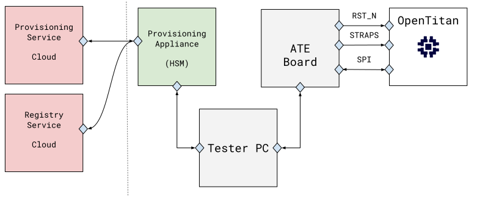
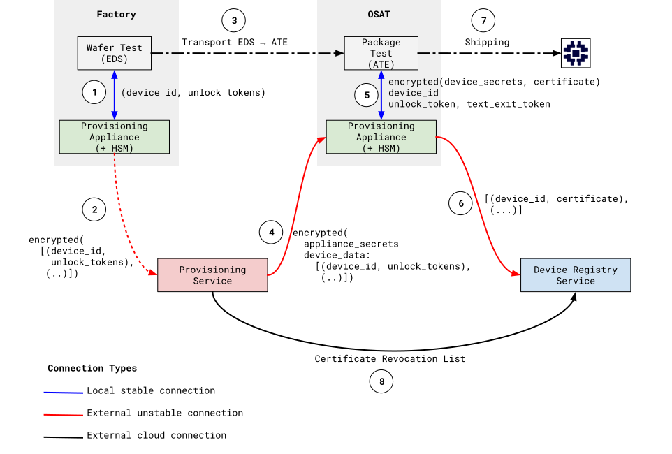
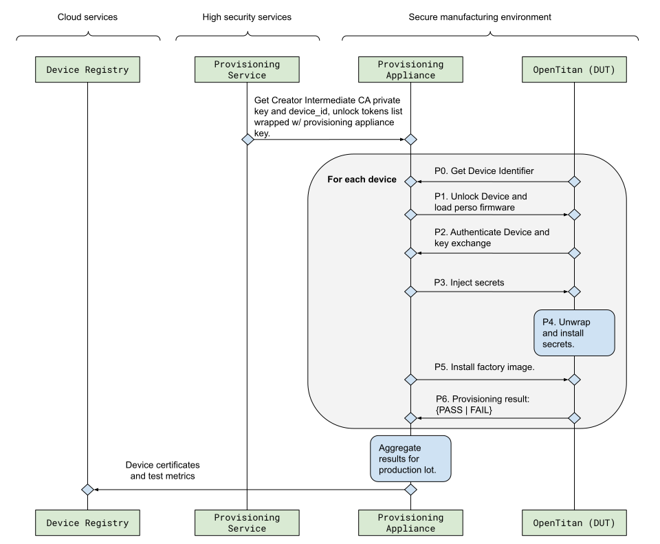
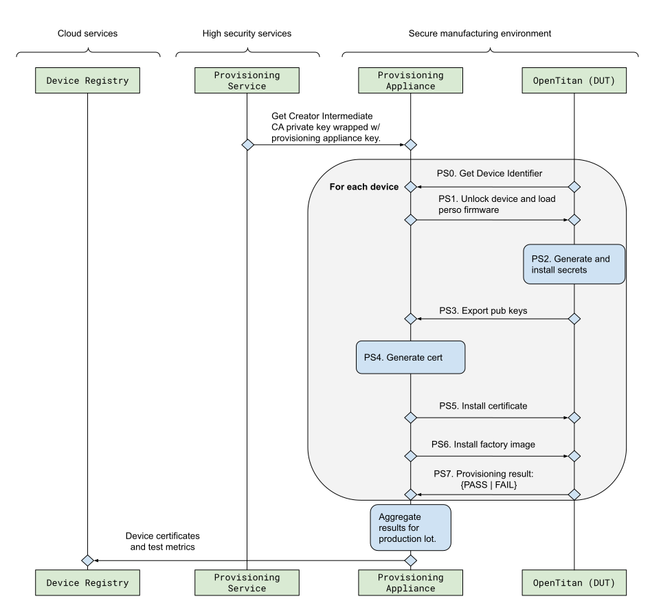
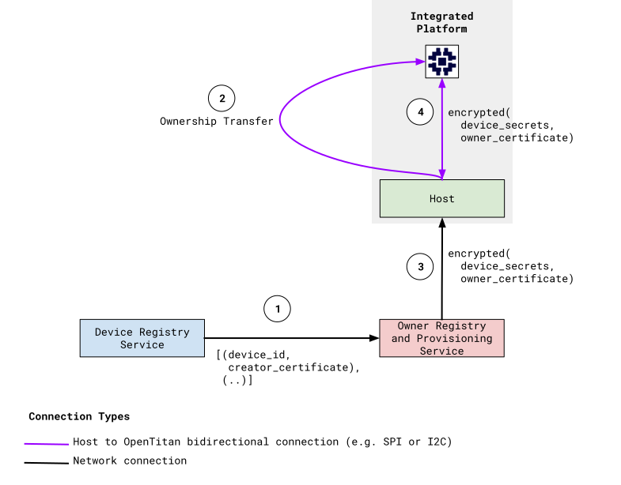
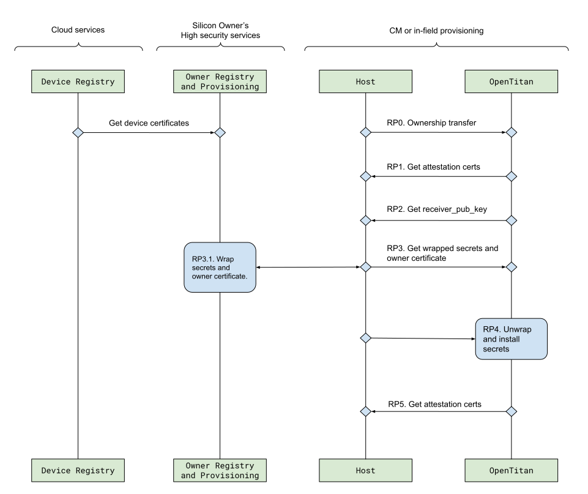
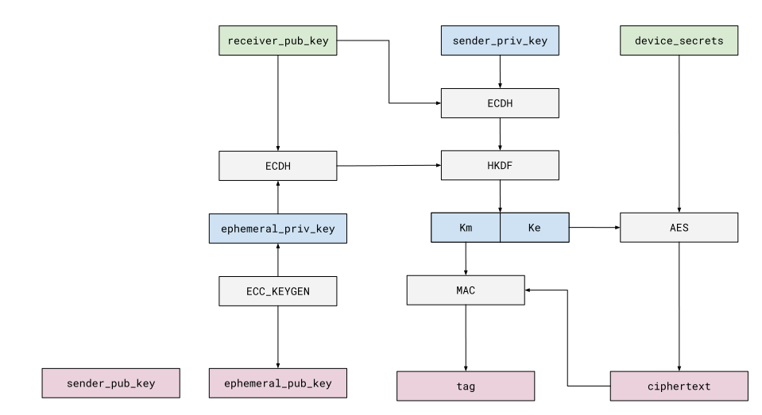
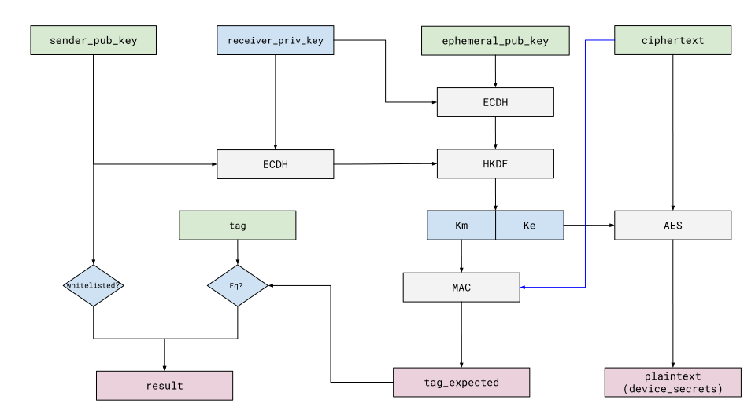

<p style="color: red; text-align: right;">
  Status: Pre-RFC
</p>


## Overview

This document describes the OpenTitan provisioning flow which is divided into
two stages:

*   [Personalization](#personalization): Covers initialization of the device
    with an unique cryptographic identity known as the
    [Creator Identity][creator_identity], its endorsement certificate, as well
    as additional secrets required to configure defensive mechanisms. This
    occurs only at manufacturing time.
*   [Owner Personalization](#owner_personalization): Covers provisioning of
    owner secrets and endorsement of the Owner Identity by the Silicon Owner.
    This may occur either at manufacturing time or as part of a later in-field
    ownership transfer.

## Security Scope

The security scope is derived from the threats against the assets handled by the
provisioning infrastructure.

### Assets

The wafer foundry and OSAT are untrusted to maintain the secrecy of the
following assets:

*   Device secrets
*   Provisioning appliance secrets (e.g. certificate endorsement signing keys).

### Security Model

The security model of the provisioning infrastructure is based on the following
requirements:

*   There is a provisioning appliance connected to an HSM in the manufacturing
    floor. This device is the only component trusted with secrets other than
    the Device Under Test (DUT).
*   There is a pre-personalization device authentication function that can be
    implemented by trusted components.
*   The wafer foundry does not collude with the OSAT to attack the device
    authentication function, although some mitigations are considered.

## Device Lifecycle and Personalization Stages

### Unlock Tokens {#unlock_tokens}

OpenTitan provides a set of lock/unlock tokens to control the state of the
device in early manufacturing stages. See
[device lifecycle specification][device_lifecycle] for more details.

*   `RAW_UNLOCK`
*   `TEST_UNLOCK`
*   `TEST_EXIT`
*   `RMA_UNLOCK`

Test unlock tokens are used as part of the process to logically disable the
devices so that they can be safely transported between manufacturing stages.
Unlock operations do not require CPU intervention. A test exit token is used to
gate the device transition from TEST state into one of the final operational
states (`DEV`, `PROD_END`, `PROD`).

### Pre-Personalization

The following steps illustrate the set of operations required prior to
personalization.

#### Wafer Test - Electrical Die Sorting (EDS)

*   `RAW_UNLOCK`: Unlock TEST mode by providing unlock token via TAP interface.
*   `ANALOG TRIM & TEST (EDS)`: Regular analog test, scan, calibration, trimming
    and functional testing (EDS stage).
*   `SET DEVICE_ID`: Program the device identifier fuses. `DEVICE_ID` export may
    be required depending on the provisioning flow.
*   `LOCK DEVICE`: (Optional) Program the TEST_UNLOCK (optional) and/or
    TEST_EXIT tokens depending on the test flow configuration.

    Optional: If required by the manufacturing flow, lock the device for safe
    transport into the next test stage.

#### Package Test (TEST MODE) - Automated Test Equipment (ATE)

*   `TEST_UNLOCK`: Unlock TEST mode by providing TEST_UNLOCK token via TAP
    interface.
*   `ANALOG TRIM & TEST (OSAT)`: Regular analog test, scan, calibration,
    trimming and functional testing (EDS stage).
*   `LOG DEVICE_ID`: Record DEVICE_ID and test results.
*   `LOCK DEVICE`: Program the TEST_UNLOCK (optional) and/or TEST_EXIT tokens
    depending on test configuration.

    Optional: If required by the manufacturing flow, lock the device for safe
    transport into the next test stage.

#### Package Test (DEV or PROD MODE) - Automated Test Equipment (ATE)

*   `TEST_EXIT`: Unlock device and transition from TEST to one of the following
    operational states: DEV, PROD_END, or PROD.
*   `SKU SETTINGS`: SKU dependent fuse and info flash configuration.
*   `PERSONALIZATION`: See [Personalization](#personalization) section for more
*   `LOAD FW IMAGE`: Load factory image payload.

## Personalization {#personalization}

### Test Setup

The following diagram shows the physical connections between test components.

<table>
  <tr>
     <td>
        
     </td>
  </tr>
  <tr><td style="text-align:center;">Figure: FT Connectivity</td></tr>
</table>

#### Components

*   **Device Under Test**: An OpenTitan device being tested as part of its
    manufacturing process.
*   **ATE**: Automatic Test Equipment (ATE), used to perform tests on the
    devices as part of the manufacturing process.
*   **Provisioning Appliance**: A network connected local server with an
    attached HSM. The server implements an OpenTitan compliant secure boot
    implementation, and runs signed applications used to communicate with ATE
    and cloud services.
*   **Provisioning Service**: Cloud service used to authenticate and initialize
    provisioning appliances.

    The provisioning service is used to provide initialization data to the
    provisioning appliance once it has been authenticated.

*   **Registry Service**: A cloud service used to host a device registry
    containing certificates and Certificate Revocations Lists (CRLs).

#### Connectivity

ATE - OpenTitan (DUT)

*   `RST_N`: OpenTitan reset pin.
*   `STRAPS`: Pins used to control hardware and software test functionality. On
    the hardware side, strap pins are used to configure TEST modes and select
    TAP interfaces. On the software side, straps used to enable the SPI flash
    bootstrap mode in ROM, as well as manufacturing test modes. Some strap
    functionality is only available before entering DEV or PROD states. There is
    also additional functionality that is disabled when the device reaches the
    end of manufacturing.
*   `SPI`: Bidirectional interface used to exchange payloads and status with the
    device.

Provisioning Appliance - ATE

*   Local network interface.

Provisioning/Registry Services - Provisioning Appliance

*   External network interface. Connectivity between endpoints is authenticated
    and encrypted. The Provisioning appliance uses service accounts to identify
    itself. The Provisioning and Registration Services are authenticated via
    TLS. The interface has to support unstable connections. The Provisioning
    Appliance has to be able to buffer messages to be able to recover from
    network disruptions.

### Overview

The following diagram captures the life of a device throughout the manufacturing
flow with emphasis on the personalization process.

<table>
  <tr>
    <td>
      
    </td>
  </tr>
  <tr>
    <td style="text-align:center;">Figure: Device personalization (high level)</td>
  </tr>
</table>

Steps:

1.  [Device identifiers][device_id] (`device_id`) and
    [unlock tokens](#unlock_tokens) are programmed into the device's One Time
    Programmable (OTP) memory. The unlock tokens are delivered in cleartext form
    to each OpenTitan die.
2.  (Optional) A provisioning appliance collects all device identifiers and
    unlock tokens and sends them in encrypted form to a provisioning service
    hosted in the cloud.
3.  Wafers are transported from wafer test (EDS) to the package test (ATE)
    location. Devices are transported in `TEST_LOCKED` lifecycle state.
4.  The provisioning service authenticates the provisioning appliance(s) and
    sends `appliance_secrets, and identifiers (device_ids)` in encrypted form.
5.  Devices are tested and switched to PROD or DEV mode before personalization.
    The ATE test setup actuates the personalization flow in collaboration with
    the provisioning appliance.
    1.  There are two personalization approaches supported by OpenTitan.
        1.  [Injection Process](#injection_process): The provisioning appliance
            generates `device_secrets` (in the injection case) and endorsement
            certificates. `appliance_secrets` are used to enable signing on
            endorsement certificates with Silicon Creator intermediate CA keys.
        2.  [Self-Generated Process](#self_generated_process): The device
            generates its own `device_secrets` and the provisioning appliance is
            used to sign the endorsement certificate.
6.  At the end of a successful provisioning flow, the provisioning appliance
    sends the device certificates to a device registry. Silicon Owners can use
    the registry as part of identity ingestion flows.
7.  The devices are shipped with a factory image and a Silicon Creator
    endorsement certificate. The Silicon Creator may also provide
    [Owner Personalization](#owner_personalization) services. All shipped
    devices have secure boot enabled, which provides a logical locking mechanism
    to restrict the use of open samples.
8.  The Silicon Creator may issue a Certificate Revocation List (CRL) to the
    device registry. The registry is in charge of serving the CRL to downstream
    consumers (Silicon Owners).

### Secure Boot

Secure boot is always enforced by the mask ROM and cannot be disabled.
Personalization and factory software payloads are signed, and boot verification
is used to anchor the mechanism in which the device authenticates the
provisioning appliance during personalization.

### Injection Process

This section describes the personalization injection mode in detail.



**P0. Get device identifier**

The DEVICE is initially in LOCKED state before the start of production test. The
TESTER gets the Device ID via TAP interface. The provisioning appliance returns
unlock tokens associated with the Device ID.

Note 1: The Device ID read requirement applies only if unlock tokens are unique
per device.

Note 2: The manufacturer must document the unlock token usage plan, including
the proposed rotation plan.

**P1. Unlock device and load personalization software**

P1.1. The TESTER unlocks the DEVICE by sending the `TEST_UNLOCK` and `TEST_EXIT`
tokens via TAP interface.

P1.2. The TESTER loads personalization software on the DEVICE using the SPI
bootstrap interface. The DEVICE verifies the personalization software
signature against one of the public keys stored in the ROM via secure boot.

**P2. Device authentication and key exchange**

P2.1 Authentication function

The authentication function relies on the following assumptions:

*   The provisioning appliance (HSM) is the only component trusted with secrets
    other than the Device Under Test (DUT) in the manufacturing floor.
*   The authentication function can only be implemented by trusted components.
*   The wafer manufacturer does not collude with the OSAT to attack the
    authentication function, although some mitigations are considered.

```
# Shared secret key between provisioning appliance and the DEVICE.
# The parameters of the authentication function are outside the
# classification scope of this document.
key_auth = authentication_function()
```

P2.2. DEVICE sends authentication data to TESTER

**The DEVICE will fail to generate an authentication payload if the device is
not in `PROD`, `PROD_END` or `DEV` state.**

The DEVICE sends an authentication payload to the TESTER including:

*   Device ID (`device_id`).
*   Static key (`receiver_pub_key`) used to derive session keys[^1]; and,
*   MAC tag covering the authentication payload.

The DEVICE sends the payload to the TESTER via SPI, repeating the message
continuously to simplify timing adjustments in the test sequence.

Payload generation:

```
// ECC key pair generation compliant to FIPS 186-4 appendix B.4.
// Curves under consideration: NIST_P256 and NIST_P386.
receiver_priv_key, receiver_pub_key = ECC_KDF(DRBG_context)

key_auth = authentication_function()

// data_size includes the size of the data + tag.
data = "OTAU" || receiver_pub_key || device_id || data_size
tag = MAC(key_auth, data)

// Continuously broadcast via SPI device port.
return data || tag
```

P2.3 TESTER verifies authentication data

The TESTER calls the provisioning appliance to verify the tag attached to the
DEVICE authentication payload using the authentication key function from P2.1.
The TESTER aborts personalization on failure.

Verification function:

```
key_auth = authentication_function()

data || tag = authentication_data
calculated_tag = MAC(key_auth, data)
RETURN_ERROR_IF(calculated_tag != tag)
```

**P3: Inject secrets**

P3.1 Get wrapped personalization payload from provisioning appliance

The TESTER gets a personalization payload from the provisioning appliance. The
provisioning appliance is in charge of generating the device secrets. The
payload is associated with the Device ID and is wrapped with a key derived from
the `receiver_pub_key`extracted in step P2.

Transport wrapping. See [ECIES Encryption](#ecies_encryption) for more details
on the `ECIES_ENC` input and output parameters. Some parameters are omitted for
simplicity.

```
// OPEN: ctx_id in this case is set to a portion of the device_id.
// The manufacturer shall incorporate a monotonically incrementing counter
// into ctx_id.
ephemeral_pub_key || tag || ctx_id || sender_pub_key ||
  data_size || data_enc =
  ECIES_ENC(key=sender_priv_key, receiver_pub_key,
            data=(device_secrets || creator_certificate))

personalization_payload =  "OTPL" || tag || ctx_id ||
   sender_pub_key || data_size || data_enc
```

P3.2 TESTER sends personalization payload to DEVICE

The personalization payload is sent to the device via SPI in 1KB frame chunks.
The payload is transferred from the DEVICE SPI RX FIFO into SRAM.

**P4. DEVICE unwrap and install secrets**

P4.1 DEVICE unwraps secrets and creator certificate

Unwrap process. See [ECIES Decryption](#ecies_decryption) for more details on
the `ECIES_DEC` input and output parameters. Some parameters are omitted for
simplicity.

```
// The following operation will verify the integrity of the encrypted
// blob. The sender_pub_key is verified against a whitelist stored
// in the personalization software.
device_secrets, creator_cerficate =
    ECIES_DEC(key=receiver_priv_key,
              ephemeral_pub_key, sender_key_pub, data=enc_payload)
```

P4.2 Install secrets

Secrets are installed in OTP and in Flash. See Device Secrets for a breakdown of
Silicon Creator level secrets.

P4.3 Report install status

Report install status to tester via SPI interface. The status code is repeated
continuously on the SPI interface to simplify the test implementation.

**P5. Install factory image**

The factory image is the software loaded on the device before shipping. It is
not expected to change frequently once the manufacturing flow is deployed for a
given SKU configuration. At a minimum, the factory image will contain a ROM
Extension (`ROM_EXT`) component.

The TESTER programs the factory image on the DEVICE via SPI bootstrap interface
The hash of the `ROM_EXT` must match the value used to calculate the Creator
Identity as described in the
[Identities and Root Keys][identities_and_root_keys] document.

**P6. Provisioning result**

The DEVICE boots in identity UNOWNED state and in manufacturing mode. The
conditions used to trigger manufacturing mode are TBD.

P6.1 Test Creator Identity

The `ROM_EXT` uses the key manager to obtain the Creator Identity key. See the
[Asymmetric Keys section in the Attestation specification][attestation_keys] for
more details.

The public portion of the Creator Identity is tested against the Creator
Certificate. The result is reported to the TESTER via SPI.

### Self-Generated Process {#self_generated_process}

This section describes the personalization self-generate mode in detail. In this
mode, The device generates its own device secrets and the provisioning appliance
is used to sign the endorsement certificate.



**PS0. Get device identifier**

The DEVICE is initially in LOCKED state. The TESTER gets the Device ID via TAP
interface. The provisioning appliance returns unlock tokens associated with the
Device ID.

**PS1. Unlock device and load perso firmware**

PS1.1. The TESTER unlocks the DEVICE by sending the `TEST_UNLOCK` and
`TEST_EXIT` tokens via TAP interface.

PS1.2. The TESTER loads personalization software on the DEVICE using the SPI
bootstrap interface. The DEVICE verifies the personalization software signature
against one of the public keys stored in the ROM via secure boot.

**PS2. Generate and install secrets**

The device uses the available on-device entropy source to generate all the
device secrets.

Secrets are installed in OTP and in Flash. Fuse locks are set as described in
the OTP specification.

**PS3. Export public key**

The device exports the Creator Identity public key via SPI. The authentication
function from P2.1 is used to generate an integrity digest over the exported
data.

Payload with integrity tag:

```
// Shared between device and provisioning appliance.
key_auth = authentication_function()

// data_size includes the size of the data + tag.
data = "OTAU" || data_size || device_id || creator_identity_pub_key
tag = MAC(key_auth, data)

// Continuously broadcast via SPI device port.
return data || tag
```

**PS4. Generate certificate**

PS4.1. Verify received data

The provisioning appliance verifies the integrity of the received payload. The
verification of the payload is used to authenticate the device, since the key
used to calculate the digest tag is only known to the device and the
provisioning appliance.

Verification function:

```
key_auth = authentication_function()

data || tag = authentication_data
calculated_tag = MAC(key_auth, data)
RETURN_ERROR_IF(calculated_tag != tag)
```

PS4.2. Generate certificate

The provisioning appliance generates an endorsement certificate as defined in
the [Certificate Format][attestation_certificate] section of the Attestation
specification.

PS4.3. Send certificate

The certificate is sent to the device via SPI in 1KB frames. An integrity tag is
added to the message using the same mechanism as in PS3.

Provisioning service to device certificate payload.

```
// Shared between device and provisioning appliance.
key_auth = authentication_function()

// data_size includes the size of the data + tag.
data = "OTCI" || data_size || device_id || creator_identity_cert
tag = MAC(key_auth, data)

// Continuously broadcast via SPI device port.
return data || tag
```

**PS5. Install certificate**

The device verifies the certificate payload sent by the provisioning appliance
and installs it in a flash block.

**PS6. Install factory image**

The factory image is the software loaded on the device before shipping. It is
not expected to change frequently once the manufacturing flow is deployed for a
given SKU configuration. At a minimum, the factory image will contain a ROM
Extension (`ROM_EXT`) component.

The TESTER programs the factory image on the DEVICE via SPI bootstrap interface.
The hash of the `ROM_EXT` must match the value used to calculate the Creator
Identity as described in the
[Identities and Root Keys][identities_and_root_keys] document.

**PS7. Provisioning result.**

The `ROM_EXT` uses the key manager to obtain the Creator Identity key. See the
[Asymmetric Keys section in the Attestation specification][attestation_keys] for
more details.

The public portion of the Creator Identity is tested against the Creator
Certificate. The result is reported to the TESTER via SPI.

## Owner Personalization {#owner_personalization}

OpenTitan provides a mechanism to enable provisioning of Silicon Owner secrets
and endorsement certificates in manufacturing and post-manufacturing stages.
Owners are encouraged to create an implementation plan to perform
post-manufacturing provisioning to take full advantage of ownership transfer.

Provisioning post-ownership transfer assumes that the OpenTitan device is
integrated into a system, and there is a HOST capable of communicating
synchronously or asynchronously with the DEVICE (OpenTitan) and a remote
registry and provisioning service.

The physical transport layer between the DEVICE and the HOST is use-case
specific and managed at the OpenTitan SKU configuration level (e.g. different
`ROM_EXT` implementation per SKU).

### Overview

The following diagram captures the Silicon Owner provisioning flow. Device
attestation requires the device to have a valid Creator Identity endorsed by the
Silicon Creator as described in the [Personalization](#personalization) section.

The process can be implemented during manufacturing or post-manufacturing. If
implemented during manufacturing, the ATE and provisioning appliance fulfill the
role of the HOST.

<table>
  <tr>
    <td>
      
    </td>
  </tr>
  <tr>
    <td style="text-align:center;">Figure: Owner personalization</td>
  </tr>
</table>

Steps:

1.  [Device identifiers][device_id] (`device_id)` and Silicon [Creator
    Certificates][attestation_certificate] are imported into the Silicon Owners
    internal device registry.
2.  Ownership transfer is performed on the device to provision code verification
    keys used as part of secure boot. Software signed by the Silicon Owner is
    programmed on the device.
3.  The host verifies the attestation chain provided by the device and requests
    a provisioning payload from the Silicon Owner's provisioning service. Data
    in transit is encrypted with a key negotiated between the OpenTitan device
    and the provisioning service. Provisioning data is divided into:
    1.  Owner Certificate endorsed by the Silicon Owner. The owner can also
        implement endorsement of additional certificates as part of the process.
    2.  Additional Owner secrets required to provision application level
        secrets.
4.  The host sends the provisioning payload to the device. The device unwraps
    the secrets and installs them.

### Injection Process

<table>
  <tr>
    <td>
      
    </td>
  </tr>
  <tr>
    <td style="text-align:center;">Figure: Provisioning post-ownership transfer</td>
  </tr>
</table>

**RP0. Ownership transfer**

The DEVICE is initially in UNOWNED state. The Silicon Owner triggers ownership
transfer and loads new software. Ownership transfer details are covered in a
separate document.

See [Ownership Transfer][ownership_transfer] document for more details.

**RP1. Get attestation certificates**

The HOST requests attestation certificates from the DEVICE. A device that has
been transferred to a new owner has its attestation chain rooted in the Creator
Identity. See the [Attestation][attestation] documentation for more information.

**RP2. Get `receiver_pub_key`**

The DEVICE generates a `receiver` key pair and shares the `receiver_pub_key`
with the HOST.

Additional data required to generate a new owner certificate and/or device
secrets is added to the payload. The payload is signed with the
`owner_identity_key` which can be verified against the DEVICE attestation chain
obtained in RP1.

```
// ECC key pair generation compliant to FIPS 186-4 appendix B.4.
// Curves under consideration: NIST_P256 and NIST_P386.
receiver_priv_key, receiver_pub_key = ECC_KDF(DRBG_context)

data = any additional data required to generate the owner cert.
hdr = ctx_id || receiver_pub_key || data

// owner_identity_key is an ECC key as described in the Asymmetric
// Keys section of the Attestation document.
signature = ASYM_SIGN(key=owner_identity_priv_key, data=hdr)

payload = hdr || signature
```

**RP3. Get wrapped secrets and owner certificate**

RP3.1. The provisioning service verifies the `receiver_pub_key` against the
attestation chain obtained in RP1 and the internal device registry.

The provisioning service then generates a new `owner_certificate` with the
additional data provided by the DEVICE. The certificate is signed with a key
managed by the Silicon Owner (e.g. `owner_intermediate_ca_key`). The new
`owner_certificate` will be used as the root certificate in Attestation flows as
described in the [Attestation][attestation] document.

RP3.2. The provisioning service performs ECIES encryption using the following
parameters:

*   `sender_priv_key`: Provisioning service private key. The public portion is
    known to the DEVICE firmware.
*   `receiver_pub_key`: DEVICE public key obtained in step RP2.
*   `ctx_id`: Context ID provided by the device in step RP2.
*   `owner_certificate`: New owner certificate generated in step RP3.1.
*   `device_secrets`: Additional secrets bound to the device. May be generated
    offline or as part of step RP3.1.

```
payload =
ECIES_ENC(key=sender_priv_key, pub_key=receiver_pub_key,
            data=(device_secrets | ctx_id))
| owner_certificate
```

RP3.3. The wrapped payload is sent to the DEVICE.

**RP4. Unwrap and install secrets and owner certificate**

Device performs ECIES decryption to unwrap the payload and install the new
`owner_certificate` and `device_secrets`. The owner has access to info flash
pages for storage of secrets.

The `server_key_pub` and `ephemeral_pub_key` values are sent with the wrapped
payload. The public server key (`server_key_pub`) is also known to the software
running in the DEVICE.

```
device_secrets || owner_certificate =
    ECIES_DEC(key=receiver_priv_key, server_key_pub,
              ephemeral_pub_key, data=enc_payload)
```

**RP5: Get attestation certificates**

The HOST issues a new attestation command to the DEVICE. The DEVICE responds
with an attestation chain rooted on the new `owner_certificate`. An additional
test command can be supported to test any functionality associated with the
`device_secrets`.

## ECIES Operations

**Key Establishment**

Key exchange is based on [NIST 800-56Ar3][nist_800_56r3] 6.2.1.2 Cofactor
One-Pass Unified Model Scheme, employing one ephemeral key, two secret keys and
ECC CDH. Both sender and receiver authentication are performed via public
crypto, thus one secret key is associated with the receiver, while the other one
is associated with the sender.

**AEAD Modes of Operation**

The following authenticated encryption schemes are supported by this
architecture:

*   AES-CTR-HMAC-12B-IV-32B-Tag (FIPS OK)
*   AES-CTR-HMAC-16B-IV-32B-Tag (FIPS OK)
*   AES-GCM (FIPS OK)

### Encryption

<table>
  <tr>
    <td>
      
    </td>
  </tr>
  <tr>
    <td style="text-align:center;">Figure: ECIES Encryption, simplified diagram</td>
  </tr>
</table>

Inputs:

*   `receiver_pub_key`: ECC public key provided by the receiver point (e.g.
    NIST_P256, NIST_P386
*   `sender_priv_key`: Sender ECC private key.
*   `ctx_id`: Context identifier provided by the device. Used to control forward
    secrecy of the protocol. For personalization this value is set to a portion
    of the device identifier (`device_id`).
*   `data`, `data_size`: Data to be encrypted and its size
*   `ecies_key_length`: Target ECIES key length. Used as a configuration
    parameter.

Outputs:

*   `ephemeral_pub_key`: Ephemeral ECC shared key, required to perform
    decryption.
*   `tag`: MAC over payload.
*   `ctx_id`: Context identifier provided by the device.
*   `sender_pub_key`: Sender ECC public key.
*   `data_enc`, `data_size`: Encrypted data and its size.

Algorithm:

```
// NIST 800-56Ar3 6.2.1.2 One-Pass Unified Model. This requires
// the creation of two shared secrets: shared_ephemeral and
// shared_static.
ephemeral_priv_key = GenerateEphemeralKey()
shared_ephemeral =
    ECDH_compute_key(key_len,
                     EC_POINT(receiver_pub_key), ephemeral_priv_key)
shared_static =
    ECDH_compute_key(key_len,
                     EC_POINT(receiver_pub_key), sender_priv_key)

// Key derivation function used to calculate K and IV.
K, IV = key_and_iv_generaration(
   ctx_id, data_size, shared_ephemeral, shared_static,
   receiver_pub_key, sender_pub_key)

// The following authenticated encryption approach follows encrypt
// then MAC approach.
// See also Alternative Authenticated Encryption Scheme

// Ke length should be one of 128, 192, 256.
// Km length should be one of 256, 384, 512.
// K should have an entropy with a security strength equivalent to
// the one provided by Ke and Km when used with AES_CTR and MAC
// respectively.
[Ke || Km] = K

data_enc = AES_CTR_ENC(Ke, IV, data)
tag = MAC(Km, ctx_id || sender_pub_key || data_size || data_enc)

return [
  ephemeral_pub_key || tag || ctx_id || sender_pub_key ||
  data_size || data_enc]
```

#### Alternative Authenticated Encryption Scheme

The following implementation uses AES in GCM mode to obtain the ciphertext and
integrity tag.

```
// The following authenticated encryption approach removes the need
// for separately calling a MAC function. In this case there is no
// need to split the key K into Ke and Km components.

// All the parameters are taken from the main encryption pseudo-code
// block above. The following call replaces the AES_CTR and MAC
// calls.
data_enc, tag =
   AES_GCM_ENC(K, IV, ctx_id || sender_pub_key || data_size || data)
```

### Decryption

<table>
  <tr>
    <td>
      
    </td>
  </tr>
  <tr>
    <td style="text-align:center;">Figure: ECIES Decryption, simplified diagram</td>
  </tr>
</table>

Inputs:

*   `receiver_priv_key`: Receiver ECC private key. Generated by the device and
    associated with the context identifier (`ctx_id`).
*   `ephemeral_pub_key`: Ephemeral ECC shared key generated by the sender.
*   `sender_pub_key`: Sender ECC public key. Embedded in payload sent to the
    device.
*   `ctx_id`: Context identifier provided by the device.
*   `data`, `data_size`: Encrypted data and its size.
*   `ecies_key_length`: Target ECIES key length. Used as a configuration
    parameter.

Outputs:

The algorithm implementation currently includes authentication and integrity
checks, thus plaintext is the only documented output parameter.

*   `plaintext`, `size`: Plaintext data and its size.

Algorithm:

```
[ephemeral_pub_key || tag || ctx_id ||
 sender_pub_key || data_size || ciphertext ] = data

// Check sender_pub_key against whitelist stored in device software.
check_sender_key(sender_pub_key)

// NIST 800-56Ar3 6.2.1.2 One-Pass Unified Model. This requires
// the creation of two shared secrets: shared_ephemeral and
// shared_static.
ephemeral_key = GenerateEphemeralKey()
shared_ephemeral =
    ECDH_compute_key(key_len,
                     EC_POINT(ephemeral_pub_key), ephemeral_priv_key)
shared_static =
    ECDH_compute_key(key_len,
                     EC_POINT(sender_pub_key), ephemeral_priv_key)

// Key derivation function used to calculate K and IV.
K, IV = key_and_iv_generaration(
   ctx_id, data_size, shared_ephemeral, shared_static,
   receiver_pub_key, sender_pub_key)

// The following authenticated encryption approach follows encrypt
// then MAC approach.
// See also

// Ke length should be one of 128, 192, 256.
// Km length should be one of 256, 384, 512.
// K should have an entropy with a security strength equivalent to
// the one provided by Ke and Km when used with AES_CTR and MAC
// respectively.
Ke || Km = K

tag_expected =
   MAC(Ke, ctx_id || sender_pub_key || data_size || data_enc)

RETURN_ERROR_IF(tag != tag_expected)
RETURN_ERROR_IF(ctx_id != ctx_id_expected)

plaintext = AES_CTR_DEC(Km, IV, data=ciphertext)

return [plaintext]
```

### Key and IV Derivation

Inputs:

*   `shared_ephemeral`: Derived ephemeral key. See Encryption and Decryption
    algorithms for more details.
*   `shared_static`: Derived static key.
*   `ctx_id`: Context identifier provided by the device.
*   `data_size`: Size of input data.
*   `ecies_key_length`: Target ECIES key length. Used as a configuration
    parameter.

Outputs:

*   `K`: ECIES key of size equal to `ecies_key_length`.
*   `IV`: `IV` parameter derived to use as AES decrypt parameter.

Algorithm:

```
shared_secret = shared_ephemeral || shared_static
salt = "shared_tag" || ctx_id || 00's padding

// KDF based on NIST 800-56C 2-step key derivation. The extract and
// expand operations can be implemented via HMAC-SHA2. For SHA3 see
// Alternative KDF 1-step KMAC.
KDK = HKDF_extract(salt=salt, secret=shared_secret)

L = ecies_key_length
label = "ot_encrypt"
context = receiver_pub_key || sender_pub_key
fixed_info = label || context || STRING(L)

K = HKDF_expand(KDK, L, fixed_info)

# IV generation using additional HKDF_expand
fixed_info_iv = "ot_iv" || context || STRING(12)
IV = HKDF_expand(KDK, 12, fixed_info_iv)

return K, IV
```

##### Alternative KDF 1-step KMAC

The following implementation uses a one-step key derivation function based on a
KMAC implementation (e.g. KMAC256).

```
// KDF based on NIST 800-56C section 4.1 1-step key derivation.
// Using KMAC256 as specified in section 4.1 option 3.
L = ecies_key_length
label = "ot_encrypt"
context = receiver_pub_key || sender_pub_key
fixed_info = label || context || STRING(L)

salt =
   "shared_tag" || ctx_id || 00's padding up to key size

other_input = salt || fixed_info
K = HKDF(secret=shared_secret, L, other_intput)


fixed_info_iv = "ot_iv" || context || STRING(12)
IV = HKDF(secret=shared_secret, 12,
          other_input=salt || fixed_info_iv)

return K, IV
```

<!-- Footnotes themselves at the bottom. -->

## Notes


[^1]: This is a static key within the context of a personalization run. The key
    is erased after personalization is complete.


[attestation]: 
[attestation_keys]: #asymmetric-keys
[attestation_certificate]: #certificate-format
[creator_identity]: #creator-identity
[device_lifecycle]: 
[device_id]: #device-identifier
[identities_and_root_keys]: 
[nist_800_56r3]: https://nvlpubs.nist.gov/nistpubs/SpecialPublications/NIST.SP.800-56Ar3.pdf
[ownership_transfer]: 
