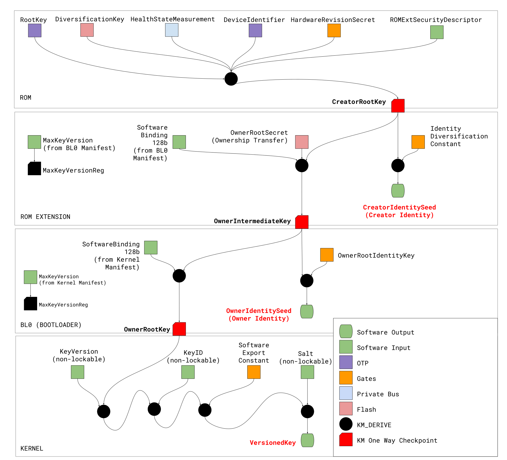
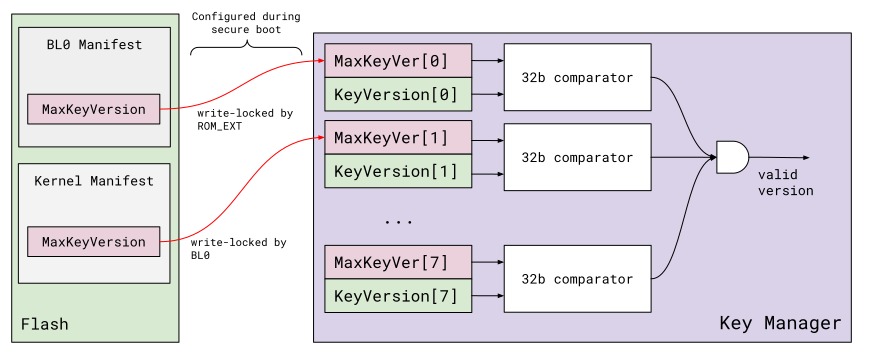
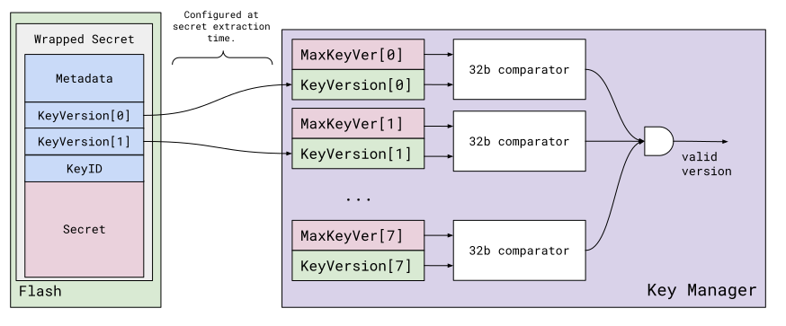
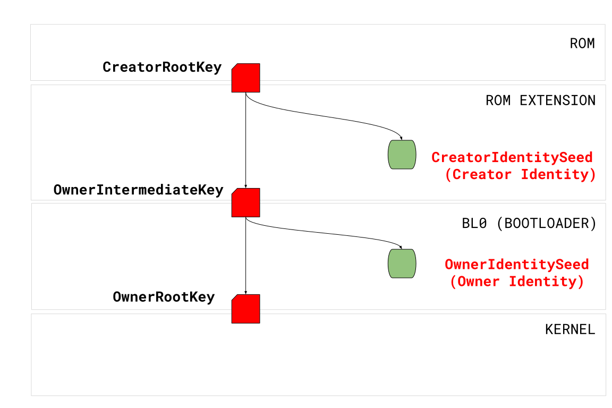
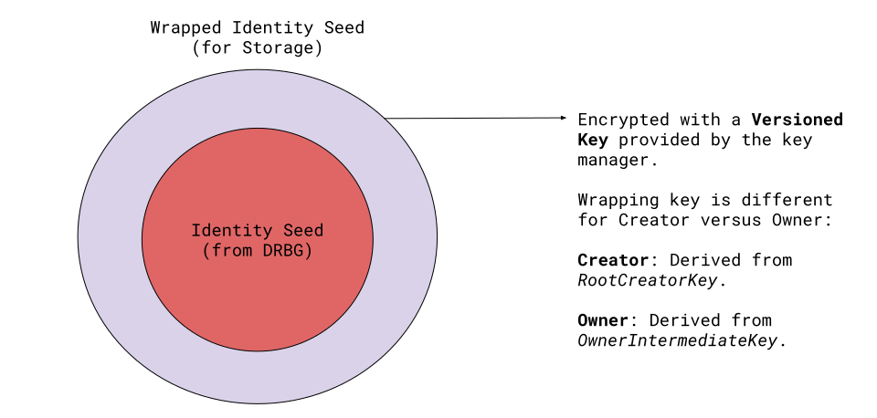

## Overview

This document describes the composition of the Silicon Creator and Silicon Owner
cryptographic identities and the Silicon Owner root key derivation scheme. This
scheme is based on a symmetric key manager with support for software binding and
key versioning.

This document also defines a non-cryptographic **Device Identifier** to
facilitate silicon tracking during manufacturing flows. The Device Identifier is
also mixed into the Creator Identity.



## Terminology

Boot stages:

*   `ROM`: Metal mask ROM, sometimes known as Boot ROM.
*   `ROM_EXT`: ROM Extension. Stored in flash and signed by the Silicon
    Creator[^1].
*   `BL0`: Bootloader. Signed by the Silicon Owner.
*   `Kernel`: Signed by the Silicon Owner.

Key manager operations:

*   `KM_DERIVE`: Key manager one-way function used to derive a new symmetric
    key.

Memory state operations:

*   `CLEAR_BEFORE_NEXT_BOOT_STAGE`: Clear key material before moving to the next
    boot stage.
*   `CLEAR_AFTER_USE`: Clear immediately after use.

## Device Identifier

The device identifier is a globally unique 256b value provisioned on each
device's OTP memory in early manufacturing stages (e.g. wafer test). It is used
to facilitate device tracking during manufacturing and provisioning. This value
is also used as a component in the generation of the device's Silicon Creator
Identity, a cryptographically unique identity.

The 256b value is split into two halves. The first contains hardware origin
information following a global standard format, while the second one is defined
by the device SKU provisioning requirements.

**128b Hardware origin information**

<table>
  <tr>
    <td><strong>No. Bits</strong></td>
    <td><strong>Description</strong></td>
  </tr>
  <tr>
    <td>16</td>
    <td>Silicon Creator identifier. Assigned by the OpenTitan project.</td>
  </tr>
  <tr>
    <td>16</td>
    <td>
Product identifier. Assigned by the Silicon Creator. Used to identify a class of
devices.
    </td>
  </tr>
  <tr>
    <td>64</td>
    <td>
Individual device identification number. Assigned by the Silicon Creator. For
example, the wafer lot number and die's X,Y coordinates may be encoded here to
simplify manufacturing tracking. Another option is to use a non cryptographic
hash function with collision checks to guarantee global uniqueness.
    </td>
  </tr>
  <tr>
    <td>32</td>
    <td>CRC-32 IEEE 802.3. covering the previous bytes.</td>
  </tr>
</table>

**128b SKU specific device information**

The device provisioner information varies for each provisioning use case. Each
use case must have a specification defining the allocation of these bits. See
the
[UICC EID Specification](https://www.gsma.com/newsroom/wp-content/uploads/SGP.02-v4.0.pdf)
as an example.

## Creator Root Key (`CreatorRootKey`) {#creator-root-key}

The following sequence describes the creation of the `CreatorRootKey`. All
inputs into the key manager can be locked down during mask ROM execution.

The size of the inputs is dependent on the security strength and masking
configuration of the implementation. Depending on the KM\_DERIVE intrinsic
function, one of the following two mixing operations is acceptable:

Cascading:

```
Key0 = KM_DERIVE(RootKey, DiversificationKey)
Key1 = KM_DERIVE(Key0, HealthStateMeasurement)
Key2 = KM_DERIVE(Key1, DeviceIdentifier)
Key3 = KM_DERIVE(Key2, ROMExtSecurityDescriptor)

CreatorRootKey = KM_DERIVE(Key3, HardwareRevisionSecret)
```

Collapsed:

The concatenation function must be injective. This can be achieved by fixing the
width of all the operands.

```
CreatorRootKey = KM_DERIVE(RootKey,
    DiversificationKey | HealthStateMeasurement | DeviceIdentifier |
    ROMExtSecurityDescriptor | HardwareRevisionSecret)
```

<table>
  <tr>
    <td><strong>Name</strong></td>
    <td><strong>Encoding</strong></td>
    <td><strong>Description</strong></td>
  </tr>
  <tr>
    <td>RootKey</td>
    <td>OTP</td>
    <td>
Device root key. Provisioned at manufacturing time by the Silicon Creator.

Hidden from software once personalization is complete.
    </td>
  </tr>
  <tr>
    <td>DiversificationKey</td>
    <td>Flash</td>
    <td>
Additional diversification key stored in flash. Provisioned at
manufacturing time by the Silicon Creator.

Hidden from software once provisioned.
    </td>
  </tr>
  <tr>
    <td>ROMExtSecurityDescriptor</td>
    <td>SW register</td>
    <td>
The implementation may choose one of the following options:

1. Hash of the ROM extension. Changes in the ROM extension code will trigger an
   update of the Creator Identity.
2. Use a software binding tag stored in the ROM_EXT manifest. This is to
   retain the Creator Identity across validated updates of the ROM_EXT.
   The implementation may opt to use the software binding interface
   described in later sections to fulfill this property.
    </td>
  </tr>
  <tr>
    <td>DeviceIdentifier</td>
    <td>OTP</td>
    <td>
Provisioned at manufacturing time. Readable from software and JTAG interface.
    </td>
  </tr>
  <tr>
    <td>HardwareRevisionSecret</td>
    <td>Gates</td>
    <td>
Encoded in gates. Provisioned by Silicon Creator before tapeout. Hidden from
software.
    </td>
  </tr>
  <tr>
    <td>Health State Measurement</td>
    <td>Register (ROM stage)</td>
    <td>
Comprises the following measurements:

* Device life cycle state.
* Debug mode state.
* ROM Hash.

Some values are read from the device life cycle controller. The device life
cycle state should be consumed by the ROM stage.

The debug mode shall be used as well if there are multiple debug configurations
supported by a single life cycle state.
    </td>
  </tr>
</table>

The CreatorRootKey can be used to generate the Creator Identity key and the
OwnerIntermediateKey described in the following sections.

## Creator Identity

The Creator Identity is an asymmetric key derived from the `CreatorRootKey`. It
is used as a cryptographic identifier bound to the device and the Silicon
Creator. It is used to attest to the authenticity of the physical device and the
ROM and ROM\_EXT configuration.

The Creator Identity is generated as follows:

```
CreatorIdentitySeed =
  KM_DERIVE(CreatorRootKey, IdentityDiversificationConstant)

// ASYM_KDF is a KDF function compliant to the Asymmetric Key
// requirements defined in the Attestation specification document.
CreatorIdentity_Private = ASYM_KDF(CreatorIdentitySeed)
CLEAR_BEFORE_NEXT_BOOT_STAGE(CreatorIdentitySeed, CreatorIdentity_Private)
```

<table>
  <tr>
    <td><strong>Name</strong></td>
    <td><strong>Encoding</strong></td>
    <td><strong>Description</strong>
    </td>
  </tr>
  <tr>
    <td>IdentityDiversificationConstant</td>
    <td>Gates</td>
    <td>
A constant defined in gates. Used to derive the CreatorIdentitySeed from the
CreatorRootKey.

Hidden from software.
    </td>
  </tr>
  <tr>
    <td>CreatorIdentitySeed</td>
    <td>SW Register Output</td>
    <td>Seed used to generate the CreatorIdentity asymmetric key.</td>
  </tr>
</table>

The `CreatorIdentitySeed` and the private portion of the Creator Identity shall
be cleared before the ROM Extension hands over execution to the Silicon Owner
first boot stage.

## OwnerIntermediateKey {#owner-intermediate-key}

The `OwnerIntermediateKey` is used as a root component of the Silicon Owner key
hierarchy. It is used to establish a cryptographic link to the root secrets
provisioned at manufacturing time.

**Visibility**

The `OwnerIntermediateKey` shall be kept hidden from software to mitigate owner
impersonation attacks.

The `OwnerIntermediateKey` is generated as follows:

```
OwnerIntermediateKey =
   KM_DERIVE(CreatorRootKey, OwnerRootSecret | SoftwareBindingValue)
```

<table>
  <tr>
    <td><strong>Name</strong></td>
    <td><strong>Encoding</strong></td>
    <td><strong>Description</strong></td>
  </tr>
  <tr>
    <td>OwnerRootSecret</td>
    <td>Flash</td>
    <td>
Used as a diversification constant with acceptable entropy. Provisioned at
Ownership Transfer time by the Silicon Creator.

The OwnerRootSecret has different visibility options depending on the level of
isolation provided in hardware:

*   The value should be hidden from software after provisioning.
*   The value is visible to ROM and ROM Extension, but hidden from all Silicon
    Owner software. The ROM Extension implements this property.
    </td>
  </tr>
  <tr>
    <td>SoftwareBindingValue</td>
    <td>SW Register<br>Lockable Input</td>
    <td>
Software binding value configured during secure boot. See
<a href="#software-binding">Software Binding</a> for more details.
    </td>
  </tr>
</table>

## Owner Identity

The Owner Identity is used as a cryptographic identifier bound to the device and
the Silicon Owner. It is used in Attestation flows. The Owner Identity is not
expected to change during the lifetime of the device ownership assignment.

```
OwnerIdentitySeed =
  KM_DERIVE(OwnerIntermediateKey, OwnerRootIdentityKey)

// ASYM_KDF is a KDF function compliant to the Asymmetric Key
// requirements defined in the Attestation specification document.
OwnerIdentity_Private = ASYM_KDF(OwnerIdentitySeed)
CLEAR_BEFORE_NEXT_BOOT_STAGE(OwnerRootSeed, OwnerIdentity_Private)
```

<table>
  <tr>
    <td><strong>Name</strong></td>
    <td><strong>Encoding</strong></td>
    <td><strong>Description</strong></td>
  </tr>
  <tr>
    <td>Owner Root Identity Key</td>
    <td>Gates</td>
    <td>
The OwnerRootIdentityKey is a diversification constant with acceptable entropy
provisioned in gates.

Visibility: Hidden from software.
    </td>
  </tr>
  <tr>
    <td>Owner Identity Seed</td>
    <td>SW Register Output</td>
    <td>Seed used to generate the OwnerIdentity asymmetric key.</td>
  </tr>
</table>

The `OwnerIdentitySeed` and the private portion of the Owner Identity shall be
cleared before the bootloader (BL0) hands over execution to the kernel.

## Owner Root Key and Versioned Keys {#owner-root-key}

The key manager supports the generation of versioned keys with lineage to the
`OwnerRootKey` for software consumption and sideload operations.

```
OwnerRootKey =
   KM_DERIVE(OwnerIntermediateKey, SoftwareBindingValue)

Key0 = KM_DERIVE(OwnerRootKey, KeyVersion)
Key1 = KM_DERIVE(Key0, KeyID)
Key2 = KM_DERIVE(Key1, Salt)
VersionedKey = KM_DERIVE(Key2, SoftwareExportConstant)

CLEAR_AFTER_USE(VersionedKey)
```

If the implementation allows it, the generation of the version key can be
collapsed as follows:

```
OwnerRootKey =
   KM_DERIVE(OwnerIntermediateKey, SoftwareBindingValue)

VersionedKey = KM_DERIVE(OwnerRootKey,
    KeyVersion | KeyID | Salt | SoftwareExportConstant)
```

The concatenation function must be injective. This can be achieved by fixing the
width of all the operands.

<table>
  <tr>
    <td><strong>Name</strong></td>
    <td><strong>Encoding</strong></td>
    <td><strong>Description</strong></td>
  </tr>
  <tr>
    <td>OwnerRootKey</td>
    <td>Internal RAM</td>
    <td>
Owner Root Key bound to the software stack.

Visibility: Hidden from software.
    </td>
  </tr>
  <tr>
    <td>SoftwareBindingValue</td>
    <td>SW Register<br>Lockable Input</td>
    <td>
Software binding value configured during secure boot. See
<a href="#software-binding">Software Binding</a> for more details.
    </td>
  </tr>
  <tr>
    <td>KeyVersion</td>
    <td>SW Register Input</td>
    <td>
Key version. The value provided by software may be mixed with a gate constant
before key derivation steps.

The value should also pass the version comparison criteria configured during
secure boot. See
<a href="#key-versioning">Key Versioning</a> for more details.
    </td>
  </tr>
  <tr>
    <td>KeyID</td>
    <td>SW Register Input</td>
    <td>
Key identifier. Used to derive a VersionedKey from VersionedRootKey. Processing
of this field should provide countermeasures against key recovery attacks.
    </td>
  </tr>
  <tr>
    <td>SoftwareExportConstant</td>
    <td>Gates</td>
    <td>
The SoftwareExportConstant is a diversification constant with acceptable entropy
provisioned in gates. It is used to mitigate key recovery attacks on software
inputs.

Visibility: Hidden from software.
    </td>
  </tr>
  <tr>
    <td>Salt</td>
    <td>SW Register Input</td>
    <td>Salt input controlled by software.</td>
  </tr>
  <tr>
    <td>VersionedKey</td>
    <td>SW Register Output</td>
    <td>
Output key derived from VersionedRootKey and KeyID. Support for sideloading may
require additional support in the key manager, otherwise the software will be in
charge of enforcing isolation.
    </td>
  </tr>
</table>

### Software Binding {#software-binding}

Software binding is used to ensure that the key derivation scheme is only
reproducible for a trusted software configuration. This is achieved by having
the secure boot implementation configure runtime-irrevocable binding tags in the
key derivation scheme. Such tags are usually delivered inside the signed
manifest of each code partition.

OpenTitan shall support software binding for at least two Silicon Owner code
stages (_e.g._ bootloader and kernel). It is expected that the kernel will
implement binding with the application layer exclusively in software.

Each key manager binding stage shall provide at least 128b of data.

### Key Versioning {#key-versioning}

Key versioning is the mechanism by which software implements key rotation
triggered by security updates. Since there may be more than one updatable code
partition in the system, the key versioning scheme has to implement at least 8
32b version comparators with lockable controls, which will be configured as part
of the secure boot process.

#### Configuration

The next figure shows an example on how to configure the maximum key version
constraints in the key manager. The ROM\_EXT software verifies the BL0 manifest,
and configures one of the maximum key version registers with the maximum
allowable version stored in the BL0 manifest. In the same way, the BL0 software
verifies the Kernel manifest and configures a separate key version register. The
software implementation is free to allocate more than one maximum key version
register per boot stage.

<table>
  <tr>
    <td>
      
    </td>
  </tr>
  <tr>
    <td style="text-align:center">
Figure: Maximum allowable versions configured as part of the secure boot

Note: The diagram is overly simplified and does not take into account security
hardening.
    </td>
  </tr>
</table>

#### Key Consumption

Secrets wrapped with versioned keys shall have additional metadata including Key
Version, Key ID and salt information.

The versioned key generation is gated on the version comparison check enforced
by the key manager implementation. The following set of operations will only
succeed if the key version set by software is valid.

<table>
  <tr>
    <td>
      
    </td>
  </tr>
  <tr>
    <td>
Figure: Key version is set during key configuration

Note: The diagram is overly simplified and does not take into account security
hardening.
    </td>
  </tr>
</table>

## Recommendations for Programming Model Abstraction

### High Level Key Manager States {#high-level-key-manager-states}

The hardware may opt to implement a software interface with higher level one-way
step functions to advance the internal state of the key manager. The following
are the minimum set of steps required:

1   [CreatorRootKey](#creator-root-key)
2   [OwnerIntermediateKey](#owner-intermediate-key)
3   [OwnerRootKey](#owner-root-key)

<table>
  <tr>
    <td>
      
    </td>
  </tr>
  <tr>
    <td>Figure: Minimum set of high level one-way step functions.</td>
  </tr>
</table>

Instantiations of the key manager can be conditioned to start at the current
internal state of the key manager, for example, kernel-level instantiations may
always start at the `OwnerRootKey` level, assuming the previous boot stages
advanced the state of the key manager.

The following code block presents a simplified version of an API implemented on
hardware with support for high level step functions.

```
typedef enum kmgr_state {
  kKMgrUninitialized = 0,
  kKMgrCreatorRootKey,
  kKMgrOwnerIntermediateKey,
  kKMgrOwnerRootKey,
  kKMgrDisabled,
} kmgr_state_t;

/**
 * Initialise an instance of the Key Manager
 *
 * @param base_addr Base address of an instance of the Key Manager
 * @param kmgr Key Manager state data.
 * @return true if the function was successful, false otherwise
 */
bool keymgr_init(mmio_region_t base_addr, kmgr_t* kmgr);

/**
 * Advance Key Manager state
 *
 * Advances internal state of Key Manager. All state transitions
 * persist until the next system reset.
 *
 * The hardware supports the following transitions:
 * Uninitialized --> CreatorRootKey -->
 * OwnerIntermediateKey --> OwnerRootKey
 *
 * Defensive measures may trigger a state transition to Disabled.
 *
 * @param kmgr Key Manager state data.
 * @return true if the function was successful, false otherwise.
 */
bool keymgr_advance_state(const kmgr_t* kmgr);

/**
 * @return Current Key Manager state associated with |kmgr|
 * instance
 */
kmgr_state_t keymgr_get_state(const kmgr_t* kmgr);
```

### Versioned Keys

The following high level software interface may be supported by hardware to
generate versioned keys. The hardware may opt to implement versioned key
functionality at each of the
[high level key manager states](#high-level-key-manager-states).


```
/**
 * Generate versioned key for a given |key_id|.
 *
 * Generates a versioned key rooted in the current state of the
 * key manager. Requires the key manager to be in one of the
 * following states:
 *    CreatorRootKey, OwnerIntermediateKey, OwnerRootKey
 *
 * @param kmgr Key Manager state data.
 * @param key_version Key version. Each version 32b word shall
 *  be less than its associated max version value. Requires the
 *  maximum version registers to be configured before calling this
 *  function
 * @param key_id Key identifier.
 * @param versioned_key Key output.
 * @return true if the function was successful, false otherwise.
 */
bool keymgr_generate_vk(const kmgr_t *kmgr,
                        const uint32_t key_version[8],
                        const uint32_t key_id[8]
                        uint32_t *versioned_key[8]);
```

## Alternatives Considered

### Collapse Creator and Owner Identities

The Silicon Creator and Silicon Owner identities may be collapsed, leaving the
Silicon Creator identity as the sole identity supported by the platform. This
would require the Ownership Transfer flow to support a Certificate Signing
Request (CSR) command to be able to endorse the identity by the owner PKI.

The current approach enforces a separate
[OwnerRootSecret](#owner-root-secret) provisioned at Ownership Transfer
time to provide isolation between device owners.

### Support Identities Outside of the Key Manager

The identities can be generated outside the key manager and be completely
managed by software. The key manager in this case can be used to generate
storage wrapping keys for the identity seeds.



The current design includes support for identity states which forces the mixing
of class level constants (i.e. `IdentityDiversificationConstant`,
`OwnerRootIdentityKey`) for each identity seed. This ensures lineage to the
RootKey and the Device Identifier. Additional provisioning requirements would
have to be considered if the Identity Seeds are not derived from the Root Key.

### Alternatives Considered for Software Binding

The hardware may be required to support more than 256b of software binding data.
Additional bits may be added in 256b increments to support more complex software
binding schemes.

## Requirements

_KM\_DERIVE function and security strength claims_

Key Manager derive functions should support at least 256b of security strength.

Note on standards: The key derivation function (`KM_DERIVE`), when instantiated
with a Pseudorandom Function (PRF), shall be compatible with
[NIST SP 800-133r2](https://nvlpubs.nist.gov/nistpubs/SpecialPublications/NIST.SP.800-133r2.pdf)[^2]
_section 6.3: Symmetric Keys Produced by Combining (Multiple) Keys and Other
Data_. This imposes provisioning requirements for the root keys, which are
covered in the Provisioning specification.

Security strength for the `KM_DERIVE` function based on a Pseudorandom Function
(PRF)[^3]:

<table>
  <tr>
    <td><strong>PRF</strong></td>
    <td><strong>Security Strength</strong></td>
    <td><strong>Notes</strong></td>
  </tr>
  <tr>
    <td>CMAC-AES-256</td>
    <td>128</td>
    <td>
Security strength limited to AES block size.

SCA countermeasures for AES are more widely available in literature.
    </td>
  </tr>
  <tr>
    <td>HMAC-SHA2-256</td>
    <td>256</td>
    <td>
There are no plans for hardening the OpenTitan HMAC hardware implementation due
to complexity.

No planned support for HMAC-SHA3.
    </td>
  </tr>
  <tr>
    <td>KMAC256</td>
    <td>256</td>
    <td>
Security hardening is under consideration for the OpenTitan KMAC hardware
implementation.

Need to verify with a lab that the claim for 800-133r2 section 6.3 compliance
holds.

Certification using a KMAC construction is challenged by the following issues.

Common Criteria:

1.   Even though SHA-3 is an approved SOG-IS algorithm, KMAC is not[^4].

FIPS - NIST specs:

1.   NIST 800-56Cr1 lists KMAC as an approved one-step KDF, although the spec is
     focused on key establishment applications; but,
2.   NIST 800-108, which focuses on PRF key derivation functions, does not list
     KMAC as a primitive. Note however that the document is pretty old.
    </td>
  </tr>
</table>

Security strength for the KM\_DERIVE function based on a Deterministic RNG
(DRNG):

<table>
  <tr>
    <td><strong>PRF</strong></td>
    <td><strong>Security Strength</strong></td>
    <td><strong>Notes</strong></td>
  </tr>
  <tr>
    <td>CTR-DRBG</td>
    <td>256</td>
    <td>
Additional requirements:

1.   Factory time provisioned entropy (seed).
2.   Hash function required to compress additional data into DRBG
     (additional_data or perso_string).
3.   Global counter to keep track of key derivations (requires device lifetime
     key manager keygen counter, which can be implemented in software? This can
     be very difficult since the key derivation paths change per ownership
     transfer).

Compliant to NIST 800-133r2 section 4 (Need to verify claim with a lab).
    </td>
  </tr>
</table>

_Key recovery attacks on user inputs_

The hardware shall support countermeasures against key recovery attacks for all
software controlled inputs.

_Version comparison registers_

The hardware shall support at least 8 32b write-lockable version comparison
registers to provide key versioning functionality.

_Software-Hardware binding registers_

The hardware shall support at least 256b of software write-lockable registers to
implement software-hardware key manager binding as part of the secure boot
implementation.

_Support for key IDs (key handles or salt value)_

The hardware shall support [versioned key](#versioned-key) derivations for
software provided key IDs. A key ID is defined as a 256b value used as a key
handle.

_Root secrets isolation from software_

The hardware shall isolate the `RootKey` and other provisioned secrets from
software after completion of personalization at manufacturing time.

_Isolation between boot stages_

Later boot stages shall have no access to secrets maintained by previous boot
stages.

_Lockable inputs_

The software shall configure runtime lockable inputs as part of the secure boot
implementation to fix the construction of identities and root keys in the key
manager.

_Integrity and confidentiality of secret values_

Hardware secrets stored in OTP and flash shall be scrambled to increase the
difficulty of physical attacks.

_Silicon Creator identity invalidation (optional)_

ROM Extension updates may invalidate the Silicon Owner and Silicon Creator
identities as well as the root keys.

_Fallback support_

The implementation should consider a software based backup mechanism to mitigate
security and/or certification issues with the main implementation. The backup
mechanism shall not rely on secrets from the main implementation.

<!-- Footnotes themselves at the bottom. -->

## Notes

[^1]: The Silicon Creator is the logical entity, or logical collection of
    entities that manufactures, packages, tests and provisions the chip with
    its first identity.

[^2]: [Recommendation for Cryptographic Key Generation](https://nvlpubs.nist.gov/nistpubs/SpecialPublications/NIST.SP.800-133r2.pdf)
    (NIST SP 800-133r2).

[^3]: Security strengths for PRF functions as documented in:
    [Recommendation for Key-Derivation Methods in Key-Establishment Schemes](https://nvlpubs.nist.gov/nistpubs/SpecialPublications/NIST.SP.800-56Cr1.pdf)
    (NIST 800-56Cr1)

[^4]: <a href="https://www.sogis.eu/documents/cc/crypto/SOGIS-Agreed-Cryptographic-Mechanisms-1.1.pdf">SOG-IS
    Crypto Working Group SOG-IS Crypto Evaluation Scheme Agreed Cryptographic Mechanisms</a>
