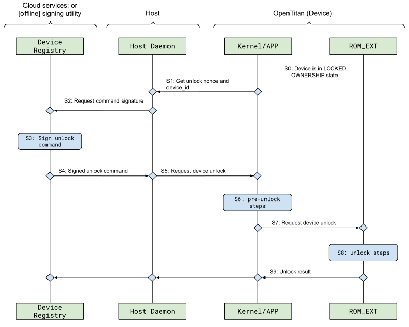

# Ownership Transfer

## Overview

The Silicon Owner is defined as a logical entity or entities allowed to sign
code for execution, as well as to sign ownership management commands[^1].
OpenTitan supports the following device life cycle states to manage the
ownership state of the device:

*   _UNLOCKED_OWNERSHIP_: The device is ready to be assigned to a new owner.
*   _LOCKED_OWNERSHIP_: The device is assigned to an owner and in operational mode.

The following steps describe the ownership transfer process in detail.

1. The current owner of the device wipes any secret information they may have on it, and boots the device with an "unlock ownership" boot service request and a signature authenticating the request.
At this point the device switches from a `LOCKED_OWNERSHIP` to an `UNLOCKED_OWNERSHIP` state, and the current owner will now be referred to as the "previous owner".
    *  The device attestation process will specify that the device is in an unlocked state rather than attesting to any specific owner.
Key derivations will also correspond to the unlocked state rather than the previous owner.
    * The previous owner's public keys are still stored after ownership is unlocked.
1. The new owner creates a set of keys by any means they wish (doesn't have to be on an OpenTitan device).
These keys must include an RSA-3072 key pair for secure boot, an ECDSA-P256 key pair for unlocking ownership, and another ECDSA-P256 key pair for endorsing the next owner (see [Owner Keys](#owner-keys)).
    * The number of redundant keys stored is configurable up to around 2kiB of total key material.
The new owner may choose, for example, to generate several RSA public/private key pairs.
1. The new owner gives their public keys to the previous owner (which may be the manufacturer), who endorses them with a cryptographic signature.
The Silicon Creator can also endorse new owners, although this will not happen often in practice.
The endorser then creates an "ownership transfer payload", which includes the new owner’s public keys and their own ECDSA-P256 signature to authenticate the keys.
1. The device should now be booted with a "transfer ownership" boot service request and with the ownership transfer payload to a special region of memory.
During boot (specifically during the `ROM_EXT` stage), the device will check the signature on the payload against the endorser's public key.
    * If the endorser is the previous owner, the device checks against the inactive public keys in the Silicon Owner slot.
    * If the endorser is the Silicon Creator, the device checks against public keys which have been injected during manufacturing.
1. If the signature is valid, then `ROM_EXT` will set up the new owner as the current owner by randomly generating a new Silicon Owner "root secret" (which is used to derive the Silicon Owner identity key for attestation) and writing the new owner's public keys to one of the two slots described in [Key Provisioning](#key-provisioning).
    * The previous owner's public keys are still on the device and it is still in `UNLOCKED_OWNERSHIP` until the new owner's code successfully boots.
This is a protection in case there is a problem with the new owner's keys or they have been tampered with in transit.
1. At this point, the device should be restarted with the new owner's code.
The device will attempt to verify the code's cryptographic signature with the new owner's stored keys.
If successful, the device will disable the previous owner's keys and move to the `LOCKED_OWNERSHIP` state.
It will now boot any code signed by the new owner, and generate attestation certificates associated with the new owner's identity.

### Examples

By design, ownership transfer has a lot of flexibility.
To help explain the process, here are a few concrete examples of how ownership transfer could work in practice.
This is just for illustration, and is by no means an exhaustive list.

**Scenario 1:** Immediately after manufacturing the device, the Silicon Creator assigns ownership to a known first Silicon Owner who has commissioned the device and prepared an ownership transfer payload in advance.

**Scenario 2:** A Silicon Owner wants to sell their device to someone else.
The buyer sends the seller an ownership transfer payload with their public keys.
The seller signs the payload and sends the buyer a) their signature and b) the physical device in an `UNLOCKED_OWNERSHIP` state.
The buyer can now complete the ownership transfer procedure to become the new owner.

**Scenario 3:** A Silicon Owner wants to send their device back to the Silicon Creator for resale.
They send it back in an `UNLOCKED_OWNERSHIP` state.
(This unlocking step is vital, although the Silicon Creator can endorse a new owner, they cannot unlock ownership for a device that is in a `LOCKED_OWNERSHIP` state.)
The Silicon Creator can later endorse the ownership transfer payload of whoever buys the device, without further involvement from the previous owner.

## Owner Keys

The following keys are provisioned as part of this flow.

### CODE_SIGN

*   **Description**: Used to verify the Silicon Owner first bootloader stage.
*   **Key Type**: RSA-3072 public key with exponent F4.

### UNLOCK

*   **Description**: Used to authenticate the Unlock Ownership payload.
*   **Key Type**: ECC NIST-P256 Curve.

### NEXT_OWNER

*   **Description**: Used to authenticate the Ownership Transfer payload.
*   **Key Type**: ECC NIST-P256 Curve.

The `UNLOCK` and `NEXT_OWNER` keys are required to ensure ownership state
transitions are only triggered by authenticated and authorized commands.
Authorization is implemented via key identification (`UNLOCK` versus
`NEXT_OWNER`).

<!-- TODO: Add link to Identities and Root Keys doc -->

Transition into `LOCKED_OWNERSHIP` stage results in a new device [Owner Identity](#), used
in attestation and post-ownership-transfer application provisioning flows.

There are three modes of ownership transfer supported:

*   **Silicon Creator endorses Next Owner**: The Silicon Creator signs the set
    of public keys associated with the next owner as part of the ownership
    transfer flow.
*   **Current Owner endorses Next Owner**: The Current Owner signs the set of
    keys associated with the next owner as part of the ownership transfer flow.
*   **Fixed Owner**: In this case a single owner is provisioned on the device
    and ownership transfer is disabled via manufacturing SKU configuration.

## Terminology

Boot stages:

*   `ROM`: Metal ROM, sometimes known as Boot ROM.
*   `ROM_EXT`: ROM Extension. Stored in flash and signed by the Silicon Creator.
*   Owner boot stages. This document uses two stages as an example. The Silicon
    Owner is free to choose other boot configurations.
    *   `BL0`: Bootloader. Signed by the Silicon Owner.
    *   `KERNEL`: Signed by the Silicon Owner.

## Key Provisioning

As part of the Ownership Transfer flow, the Silicon Owner keys are endorsed
either by the Silicon Creator or by the Current Owner of the device. This is
done to ensure that only authenticated and authorized entities are able to take
ownership of the device.

### Key Endorsement Format

Key endorsement is implemented as a signed manifest. The rest of the document
refers to this as the Key Endorsement Manifest, or manifest for simplicity. The
following fields must be supported by the manifest implementation:

#### signature

Signature covering the manifest.

#### signature_algorithm

Signature algorithm. For this version of the specification it is always set
to `ECDSA-sha256`.

#### public_key

Public key to verify the signature with. The number of bytes depends on the
`signature_algorithm` field. Depending on the ownership transfer model, the
public key must match one of the following requirements:

 Endorsing Entity | Public Key Requirement
 ---------------- | --------------------------------------------------------
 Silicon Creator  | The public key must be stored in the ROM_EXT and  integrity protected by the ROM_EXT signature.
 Previous Owner   | The public key must be stored in the previous owner slot and labeled as the `NEXT_OWNER` in the policy field. See `owner_keys` for more details.

#### owner_keys (array)

List of public keys endorsed by the manifest. See [Owner Keys](#owner-keys) for
more details.

#### Optional Parameters

The following parameters are required in the secure boot manifest
implementation, but are left as optional in the key endorsement manifest. The
Silicon Creator or previous Silicon Owner may want to implement these parameters
to restrict the deployment of the endorsed keys.

Note: If implemented, the restrictions imposed by these fields cannot be revoked
by ownership transfer once provisioned. This is to simplify the implementation
of an open samples policy.

##### otp_settings

Minimum list of fuses that must match the device configuration before committing
the endorsed keys to flash. The hash of the list of targeted fuse values is
hashed with the endorsement manifest before signing.

Note: The device identifier fuses can be added to the `otp_settings` to restrict
the keys to be used with a single device. This mode of operation is referred to
as node-locked secure boot configuration.

### Device Key Provisioning Flow

The following figure shows the sequence of operations to commit the new set of
keys once the key endorsement manifest has been verified.

Definitions:

*   `slot`: Owner slot. This implementation assumes that there are only 2 owner
    slots, so the only valid values are 0 and 1.
*   `id`: The owner assignment identifier. It is implemented as a monotonically
    increasing counter. The new owner id is equivalent to N + 1 for a previous
    owner id of N.
*   `pub_keys`: List of keys associated with the owner slot. Includes key policy
    information.
*   `digest`: Integrity of the owner slot record calculated as `MAC(Kn,
    slot|id|pub_keys)`. The key (`Kn`) requirements are described later in more
    detail.

<table>
  <tr>
    <td>
    <!--
    svgs are made in google docs, and can be found here:
    https://docs.google.com/drawings/d/1hnC2EgkYpkxhVJ6I0prxdoQbglstqfwxvBYh_JIt8TA/edit?usp=sharing
    -->
      
    </td>
  </tr>
  <tr>
    <td>Figure: Provisioning sequence versus owner slots.</td>
  </tr>
</table>

Detailed description:

**Step 1 (S1) Initial State**

The current owner is stored in slot 0 and the device is in unlocked ownership
state. A key stored in the current owner slot (0) is used to validate the key
endorsement manifest for the next owner.

**Step 2 (S2) Intermediate State**

The new owner keys are written into the available owner slot - in this case slot
one. The `pub_keys` and `digest` parameters are written before the `id`. Once the
`id`is written into flash, the new owner slot entry is considered to be valid.

The `id` parameter must be strictly greater than the previous owner `id`.

**Step 3 (S3) Final State**

An additional integrity check over the new owner slot is performed before
completing provisioning of the new owner keys. Upon successful verification, the
new owner is marked as the current owner by deleting the `id` of the previous
owner. The `pub_keys` of the previous owner may be deleted as well as part of
this step.

#### Integrity Key (Kn, Kn+1)

Integrity keys are used to implement integrity checks for each owner slot. The
integrity key has the following requirements:

*   IK_REQ1: The key shall be unique per owner slot and ownership configuration.
*   IK_REQ2: The key can only be computed by a trusted `ROM_EXT` boot
    configuration.
*   IK_REQ3: The key only available to the `ROM`/`ROM_EXT`.

These requirements can be achieved by a combination of physical security and
cryptographic guarantees. The following example demonstrates how to derive the
Integrity Key from a symmetric key stored in OTP and only available to
`ROM`/`ROM_EXT` software.

##### Key Step Function - MAC

This approach relies on a symmetric secret (`K`) managed by the `ROM`/`ROM_EXT`
software. It is intended to mitigate boot time issues associated with consuming
`K` directly from the key manager.

Parameters:

*   `K`: Device integrity secret provisioned at manufacturing time. Only visible
    to ROM and ROM_EXT software. Stored in OTP.
*   `slot`: Owner slot. This implementation assumes that there are only 2 owner
    slots, so the only valid values are 0 and 1. This parameter is used to make
    sure the key cannot be reused to verify the other slot.
*   `n`: The owner assignment identifier. It is implemented as a monotonically
    increasing counter. It is used here to bind the key to the owner identifier.
*   `prev_owner_digest`: (Under consideration) Digest of the previous owner
    (e.g. `id = n - 1`). Used to bind the key to the custody chain (chain of
    owners).

Function: `MAC` is an OpenTitan approved MAC function.

```
Kn = MAC(K, "OwnerSlot" | slot | n | prev_owner_digest)
```

The slot and n values are used to fulfill the IK_REQ1 requirement. The
availability of `K` is enforced by software to fulfill IK_REQ2 and IK_REQ3.
`prev_owner_digest` is under consideration to bind the key to the custody chain
(chain of ownership).

#### Additional Requirements

**Key Manager Availability**

The `ROM_EXT` is required to disable the key manager before handing over
execution to the next boot stage when the device is in device
`UNLOCKED_OWNERSHIP`
ownership state.

**Manufacturing Requirements**

Determine if the `prev_owner_digest` field must be initialized with non-zero
value at manufacturing time.

## OpenTitan Device Mode

A host can send unlock ownership and ownership transfer commands to OpenTitan
via any physical interface supported by the `ROM_EXT`. The details of the
command transport layer protocol, as well as the list of supported physical
devices are left to the reference software implementation.

However, there must be at least one mechanism available to perform ownership
transfer at manufacturing time using an implementation compatible with ATE[^2]
infrastructure.

### Unlock Ownership

This flow implements transition from `LOCKED_OWNERSHIP` to `UNLOCKED_OWNERSHIP` states. It
is used by the Silicon Owner to relinquish ownership of the device and enable
ownership transfer functionality. The device must be in `UNLOCKED_OWNERSHIP` state before
it can be assigned to a new owner.

The unlock operation is implemented as a signed command sent from the
Kernel/Application layer to the `ROM_EXT`. The signature is required to allow
the current owner to only allow authenticated and authorized users access to the
unlock ownership flow.

The following fields must be supported by the command:

#### signature

Signature covering the command structure. The signature is verified using the
`UNLOCK` key stored in the active owner slot.

#### unlock_nonce

Ownership-unlock nonce value, which is generated at the time the current owner
first took ownership of the device.

*   The nonce is expected to be unique per device and ownership assignment.
*   The nonce is stored to make the unlock command re-triable (and fault
    tolerant).
*   The nonce may be readable from any boot stage to simplify the unlock
    operation.

#### flags

Additional flags passed to the `ROM_EXT` to configure unlock flow settings:

*   `WIPE_FLASH`: Erase owner flash contents on successful unlock operation.

<strong>Example</strong>

The following sequence diagram shows a reference implementation of the unlock
flow. Error handling is omitted for simplicity.

<table>
  <tr>
    <td>
      
    </td>
  </tr>
  <tr>
    <td>Figure: Device unlock</td>
  </tr>
</table>

Detailed description:

**Step 1 (S1) Get unlock nonce and device id**: The Host queries the device
identifier and unlock nonce from the device.

**Steps 2-4 (S2, S3, S4) Request unlock command signature**: The Host requests
the Device Registry service to sign the unlock ownership command for the device
id with provided nonce. The Device Registry requests a cloud key manager service
to sign the command with a key associated with the device identifier. The
signature must be verifiable with the `UNLOCK` key stored in the active owner
slot.

**Step 5 (S5) Request device unlock**: The Host sends the unlock ownership
command to the Device. The command is first handled by the Kernel/APP layer.

**Step 6 (S6) Pre-unlock steps**: The Kernel/APP layer may verify the unlock
command and execute any pre-unlock steps, including erasing owner level secrets.

**Step 7 (S7) Request device unlock**: The Kernel copies the unlock command to a
boot services memory region shared with the `ROM_EXT`, and performs a reset to
trigger the unlock operation on the next boot.

**Step 8 (S8) Unlock steps**: The `ROM_EXT` verifies the unlock command and
updates the device state to `UNLOCKED_OWNERSHIP` state. The Device proceeds with the boot
flow and reports the unlock result to the kernel via shared memory.

**Step 9 (S9) Unlock result**: The unlock result is first propagated to the
Device Kernel/APP layer. The Kernel may opt to execute any post-unlock steps
before propagating the result to the Host. The Host propagates the unlock result
to the Device Registry. The Device Registry may opt to remove the device from
its allow-list.

### Ownership Transfer

An ownership transfer command sent by a host to OpenTitan, is serviced by the
ROM extension (`ROM_EXT`) allowing the Silicon Owner to take ownership of the
device at silicon manufacture, Contract Manufacturing (CM) stage or in the
field.

<table>
  <tr>
    <td>
      
    </td>
  </tr>
  <tr>
    <td>Figure: Ownership Transfer supported by ROM_EXT</td>
  </tr>
</table>

<table>
  <tr>
    <td><strong>Step</strong></td>
    <td><strong>Description</strong></td>
  </tr>
  <tr>
    <td>UNLOCKED_OWNERSHIP state</td>
    <td>

Entry into the ownership transfer flow is conditional to the device being in
`UNLOCKED_OWNERSHIP` state. See [Unlock Flow](#unlock-ownership) for more details on how
to transition from LOCKED_OWNERSHIP to UNLOCKED_OWNERSHIP states.
    </td>
  </tr>
  <tr>
    <td>Verify payload header</td>
    <td>

The ownership transfer payload header including the key endorsement manifest is
verified by the ROM extension. The *header shall fit within available SRAM* and
be signed by an approved key as described in the
[Key Provisioning](#key-provisioning) section.
    </td>
  </tr>
  <tr>
    <td>Flash erase</td>
    <td>

Code, data and info pages available to the Silicon Owner are erased. Erase
checks are performed.
   </td>
  </tr>
  <tr>
    <td>Reset secrets</td>
    <td>
    <!-- TODO: Link to Identities and Root Keys document -->

The [OwnerRootSecret](#) is reset with a value extracted from a DRBG configured
with a security strength equivalent to one supported by the key manager.
    </td>
  </tr>
  <tr>
    <td>Rotate unlock nonce</td>
    <td>

A 64bit random value is extracted from the DRBG to be used as an unlock nonce.
See [Unlock Flow](#unlock-flow) for more details.
    </td>
  </tr>
  <tr>
    <td>Provision owner keys</td>
    <td>

Owner keys are provisioned into the device as defined in the
[Key Provisioning](#key-provisioning) section.
    </td>
  </tr>
  <tr>
    <td>Flash image</td>
    <td>Owner software is written into one of the flash partitions.</td>
  </tr>
  <tr>
    <td>Activate owner</td>
    <td>

Owner software sends a command to the `ROM_EXT` to complete ownership transfer,
which effectively sets the new owner as the current owner.
    </td>
  </tr>
</table>

## OpenTitan Host Mode

Some of the OpenTitan use cases require support for self updates in which
OpenTitan is used in host mode to scan an external device interface for update
payloads. This section describes Ownership Transfer layered on top of such self
update mechanism.

An OpenTitan implementation may support this ownership transfer model at the SKU
level.

### Unlock Ownership

The Device is initially in `LOCKED_OWNERSHIP` state and configured with a stack signed by
the current owner. The following steps must be implemented in a fault tolerant
way:

1.  The Device is updated to a stack able to support the ownership transfer
    implementation as described in the next section. The owner may opt for
    clearing any device secrets as part of this step.
2.  Ownership unlock is performed as described in the OpenTitan device mode
    [Unlock Flow](#unlock-flow) section.

### Ownership Transfer

In this section, SPI EEPROM is used as the target device. However, the
implementation may opt for supporting other targets.

The Device is initially in `UNLOCKED_OWNERSHIP` state and configured with a stack (Kernel +
APPs) able to scan an external SPI EEPROM and trigger the ownership transfer
flow. The following procedure also assumes that the Device storage follows the
internal [flash layout](#flash-layout) guidelines.

The process must be implemented in a fault tolerant manner to be able to restart
the process to recover from a failed attempt.

Detailed steps:

1.  The current owner endorses the next owner keys as described in the
    [Key Endorsement](#key-endorsement) section.
2.  The next owner writes the key endorsement manifest to the external EEPROM
    followed by an update payload. The update payload includes all the silicon
    owner boot stages.
3.  The Device kernel module or application in charge of performing ownership
    transfer, referred to as _the application_, is activated upon detecting the
    `UNLOCKED_OWNERSHIP` state at Device boot time.
4.  The application scans the external EEPROM for a valid key endorsement
    manifest and update payload. The key endorsement manifest is validated with
    the current owner’s `NEXT_OWNER` key. The update payload is validated with
    one of the `CODE_SIGN` keys embedded in the key endorsement manifest.
5.  The application writes the inactive embedded flash code partitions with the
    ones included in the update payload.
    *   Note: In order to avoid a BL0 (bootloader) fixed flash size allocation
        across all owners, the implementation may opt to support the following:
        1.  The boot flow will give preference to the next boot stage residing
            in the same flash bank if both A and B versions are the same.
        2.  The A/B flash layout may contain two identical copies of the stack
            at the start of the process to make sure it is possible to boot from
            a single flash bank.
6.  The application loads the key endorsement manifest into the boot services
    shared memory region and triggers a reset to perform ownership transfer on
    the next boot cycle.
7.  The `ROM_EXT` executes the ownership transfer flow described in the
    [Ownership Transfer](#ownership-transfer) section with the following
    differences:
    1.  Flash erase and flash image stages are not executed.
    2.  The activate owner stage may be delayed and executed later depending on
        the implementation.
8.  The `ROM_EXT` attempts to boot the new owner image with the new owner
    configuration.
9.  On the first boot, the new owner image queues an activate owner command,
    which is then executed by the `ROM_EXT` on the next boot. The new owner
    becomes the current owner.
10. The previous owner code partitions can be erased at this point.
11. Device attestation can be performed after this point.

## Ownership Transfer Disabled

Ownership Transfer can be disabled at the SKU level. In this case secure boot is
implemented by storing the Silicon Owner BL0 verification keys in the `ROM_EXT`.
The `ROM_EXT` is thus not required to implement ownership transfer in this
configuration.

## Flash Layout

To simplify the implementation, the flash layout implements fixed offset and
size allocations for the `ROM_EXT` and the certificate storage regions. This
allows the flash erase and write operations to be performed at deterministic
address ranges.

The implementation may opt to store the certificates in info regions to save
data partition space.

<table>
  <tr>
    <td>
      
    </td>
  </tr>
  <tr>
    <td>Figure: Flash layout</td>
  </tr>
</table>

`owner_slot_0` and `owner_slot_1` are used to store the Silicon Owner keys as
described in the [Key Provisioning](#key-provisioning) section.

## Attestation Update

<!-- TODO: Link to Attestation specification document -->

Regular attestation updates as described in the [Attestation](#) specification
are available when the device has an active owner. Devices in
`UNLOCKED_OWNERSHIP` state may have restricted attestation capabilities, for example,
restricted to only end-to-end attestation.

## Ownership Transfer During Manufacturing

Manufacturing shall not preclude the implementation of the following default
stack configurations:

<!-- TODO: Update links to device life cycle specification doc.  -->

*   [`LOCKED_OWNERSHIP`](#) state with default factory image.
*   [`UNLOCKED_OWNERSHIP`](#) state with default factory image.
*   [`LOCKED_OWNERSHIP`](#) state with default factory image and Ownership Transfer
    disabled.

Factory software may be used to configure the ownership slots before injecting
the factory image.

<!-- Footnotes themselves at the bottom. -->

## Notes

[^1]: https://docs.opentitan.org/doc/security/logical_security_model/#silicon-owner

[^2]: Automatic Test Equipment used at package level testing.
