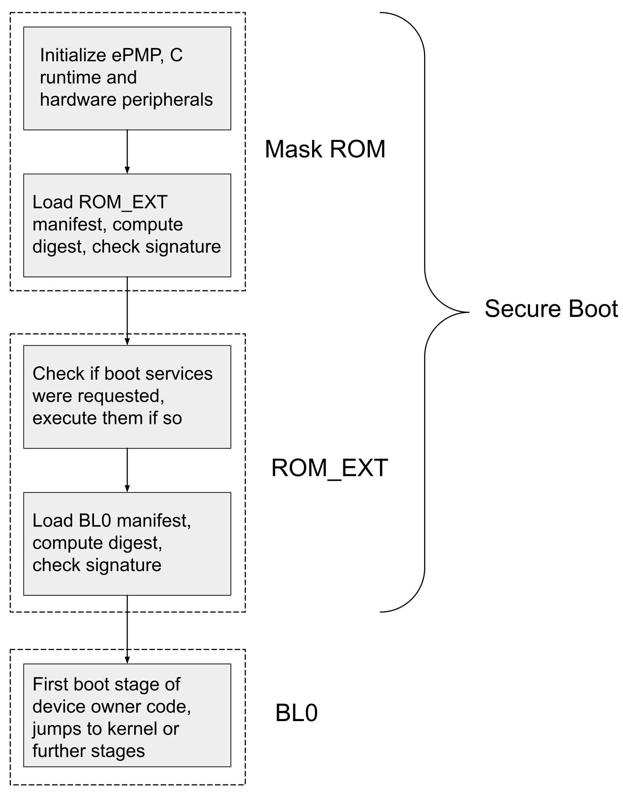

# Secure Boot

  Status: Pre-RFC

The following overview gives a brief, high-level explanation of OpenTitan's secure boot process.
The basic guarantee of secure boot is that *no unauthorized code will be executed before the boot process reaches the device owner's code*.
All executed code must be cryptographically signed by either the owner of the OpenTitan device or the (trusted) entity that originally set up the device at manufacturing time (the "Silicon Creator").

Additionally, the secure boot procedure restricts certain stages to the Silicon Creator, so that even the current device owner can't change them.
Therefore, if the device changes owners, the new owner only has to trust the Silicon Creator, *not* the previous owner(s).

The diagram below summarizes the specific steps involved in the secure boot process:

## ROM

The first stage of secure boot is called "ROM".
ROM is a region of read-only memory that cannot be updated at all after an OpenTitan device is manufactured.
For that reason, the ROM is kept as simple as possible; it does some minimal setup, authenticates the next stage (`ROM_EXT`), and jumps there.

The ROM contains non-updateable public keys, which it uses to authenticate the `ROM_EXT` signature.
These public keys correspond to what OpenTitan calls the "Silicon Creator": the entity who was initially involved in the manufacturing of the device.
It's important to distinguish between the unchanging Silicon Creator and the changeable "Silicon Owner", the entity that owns the device at a given time.

On startup, hardware settings use a feature called ["enhanced Physical Memory Protection" (ePMP)][ibex-epmp] to ensure that only the ROM code itself is executable.
For details about how the ROM configures ePMP, see [Memory Protection Module][rom-epmp].
Flash and MMIO memory regions are unlocked for read/write (for signature verification and configuring peripherals) but are not executable at this stage.

On boot, the ROM code does the following:
1. Initialize any additional ePMP settings beyond what is set by hardware at startup, plus initialize the C runtime and hardware peripherals (e.g. pinmux, UART).
2. Load the "manifest" for `ROM_EXT`, which includes the start and end address of `ROM_EXT` code, a cryptographic signature, a public key modulus, and "selector bits" for hardware information.
    * The manifest's modulus field identifies which of the stored [Silicon Creator keys][silicon-creator-keys] should be used for signature verification. If there is no matching stored key, or the matching key is not suitable for the device's lifecycle state, then the boot fails.
    * There are two slots for `ROM_EXT` implementations; the ROM will first try the one with the newest security version. If the signature verification for that slot fails, the ROM will attempt to boot from the other slot.
3. Read usage constraints from hardware according to the selector bits from the manifest.
    * The selector bits can choose all or part of the device ID, and/or information about the state of the device. Because the selected constraints are included in the digest, this means the signer of a `ROM_EXT` image can restrict their signature to only certain devices/states.
4. Compute the SHA2-256 digest of the selected usage constraints concatenated with the contents of memory between the `ROM_EXT` start and end address given in the manifest.
5. Check the signature from the manifest against the digest and the selected Silicon Creator public key.
    * Unlock flash execution, configure ePMP so that the `ROM_EXT` region is executable, and jump to the start of `ROM_EXT`.

## `ROM_EXT`

The `ROM_EXT` ("ROM extension") stage is another region of read-only memory that is controlled by the Silicon Creator.
However, unlike the ROM, it *can* be updated after the device is manufactured, as long as the new version is signed by the Silicon Creator.

Like the ROM, the `ROM_EXT` must check the signature of the next boot stage (this time against the Silicon Owner's keys, rather than the Silicon Creator’s).
In addition, the `ROM_EXT` initializes Silicon Creator and then Silicon Owner keys using the key manager and performs “boot services”, which are a small set of specific operations that require access to the Silicon Creator's keys (for instance, providing an [attestation of device state][attestation] or [transferring the device to a new owner][ownership-transfer]).
These services must happen during boot and not afterwards, because after boot we don't have access to the Silicon Creator keys.

The general procedure for the `ROM_EXT` looks something like this:
1. Load the manifest for BL0 (which has the same format as the `ROM_EXT` manifest described in the ROM procedure).
2. Read usage constraints from hardware according to the selector bits from the manifest.
3. Compute the SHA2-256 digest of the selected usage constraints concatenated with the contents of BL0, as ROM does for `ROM_EXT`.
4. Check the signature from the manifest against the digest and a public code-signing key from the current Silicon Owner (RSA-3072 with the F4 exponent).
    * Like the Silicon Creator, the Silicon Owner may have multiple public code-signing keys. How many keys exactly is configurable by the Owner.
    * The number of retries in case verification fails might differ from ROM, and can differ between `ROM_EXT` implementations.
5. Step the key manager device in order to obtain the Silicon Creator "root key".
    * The root key mixes secret values provisioned by the Silicon Creator at manufacturing time with information about the specific device, the device health state, and `ROM_EXT`. It will differ between devices and between `ROM_EXT` images.
    * The actual value of the root key is locked inside the [key manager][key-manager] and hidden from software. The key manager starts with the Silicon Creator's secret values (which are also hidden from all software) and advances its state to a new value with each additional piece of information.
    * See the [identities and root keys][identities-keys] page for more details about the intermediate, identity, and root keys.
6. From the Silicon Creator root key, use the key manager interface to derive the Silicon Creator "identity" key (an ECDSA-P256 key used for [attestation][attestation]) and the Silicon Owner "intermediate key" (a new key manager state which can later be used to derive the Silicon Owner's "identity" key).
    * To create the intermediate key, the key manager starts with the Silicon Creator root key from the ROM stage, and software steps the key manager state by mixing in owner secrets (provisioned by the owner at the time they take ownership of the device) and certain BL0 configuration information.
    * In between getting the Silicon Creator identity key and the Silicon Owner intermediate key, check if the boot purpose was "attestation"; if so, generate an attestation certificate for the software/hardware state, sign it with the Silicon Creator identity key, and write it to a special region of memory.
7. Unlock flash execution, configure ePMP so that the Silicon Creator controlled regions of memory are not writable and the BL0 region is executable, and then jump to the start of BL0.

Once the code has jumped into the Silicon Owner code at BL0, secure boot in its simplest form is complete.
The Silicon Owner may choose to extend the secure boot process with multiple boot stages of their own; this will differ between device owners, while the stages described here are guaranteed by the Silicon Creator and will be shared by all OpenTitan implementations.
If any signature verification in the above process fails, or there is any kind of unexpected error, the device will fail to boot.

# Silicon Creator Keys

The Silicon Creator has multiple public keys.
This redundancy partially protects against the scenario in which one of the keys is compromised; any OpenTitan devices produced after the key is known to be compromised can mark the compromised key invalid, without requiring a full new ROM implementation.
Devices produced before the key is known to be compromised are not protected by this strategy.

Additionally, each key is restricted to one of three "roles", which determine in which device states the key can be used.
The roles are:
* `dev`: development, only for devices in the `DEV` lifecycle state.
* `test`: manufacturing and testing, only for devices in the `TEST_UNLOCK` and `RMA` lifecycle states.
* `prod`: production, intended for `PROD` or `PROD_END` lifecycle states but can be used in all states.

The following table summarizes which role can be used in which lifecycle state:

| Key Type | LC_TEST | LC_RMA | LC_DEV | LC_PROD |
|----------|:-------:|:------:|:------:|:-------:|
| `test`   | X       | X      |        |         |
| `dev`    |         |        | X      |         |
| `prod`   | X       | X      | X      | X       |

If the key indicated in the manifest has a role that doesn't match the lifecycle state of the device, the boot fails.
All of these keys are 3072-bit RSA public keys with exponent e=65537 (the “F4 exponent”).

The `ROM` has `N` key slots (the exact number depends on the `ROM`) numbered from `0` to `N-1`.
The `CREATOR_SW_CFG_SIGVERIFY_RSA_KEY_EN` item in the OTP can be used to invalidate a key at
manufacturing time. This item consists of several little-endian 32-bit words. Each word contains four 8-bit hardened booleans
(see `hardened_byte_bool_t` in `hardened.h`) that specifies whether the key is valid (`kHardenedByteBoolTrue`)
or invalid (any value other that `kHardenedByteBoolTrue`). In order to verify that the key slot `i` contains
a valid key, the `ROM` will:

* read the `floor(i / 4)`-th word in `CREATOR_SW_CFG_SIGVERIFY_RSA_KEY_EN`,
* extract the `(i % 4)`-th boolean from that word (the lower 8 bits correspond to the 0-th boolean and so on),
* compare it to `kHardenedByteBoolTrue`.

# Terminology Quick Reference

## OpenTitan Logical Entities

*   **Silicon Creator:** The owner of the public keys injected into the OpenTitan device at manufacturing time.
    Signs the `ROM` and `ROM_EXT` boot stages.
*   **Silicon Owner:** The individual or group who has taken ownership of the OpenTitan device by adding their public keys during an ownership transfer.
    Signs all boot stages after `ROM_EXT`.

The Silicon Creator and the Silicon Owner may be the same individual or group, but are not necessarily so.
The Silicon Owner can change during the lifetime of the device, but the Silicon Creator cannot.

## RISC-V Concepts:

*   **ePMP:** Enhanced Physical Memory Protection unit:
    [Ibex Physical Memory Protection][ibex-epmp].
    Can be configured to allow or prevent read (R), write (W) and/or execute (X)
    access to regions of memory.

## Boot stages:

*   `ROM`: Metal ROM, sometimes known as ROM or Boot ROM.
*   `ROM_EXT`: ROM Extension. Stored in flash and signed by the Silicon Creator.
*   `BL0`: Bootloader. Signed by the Silicon Owner.
*   `Kernel`: Post-bootloader code. Signed by the Silicon Owner.

# Boot Policy

In order to provide a flexible boot mechanism the Boot Info page will store a
structure called the Boot Policy. The boot policy dictates the boot flow,
including storing boot attempts and successes for a given `ROM_EXT`, allowing
the ROM code to decide when to mark a `ROM_EXT` good or bad. The boot policy
also contains directions to `ROM_EXT` about which slot it loads silicon owner
code from. TODO(gdk): Expand on policy.

# Memory Layout

Memory on OpenTitan can be considered as split into three separate regions: ROM,
Flash Info, and addressable flash. The addressable flash is further divided into
two equally-sized regions called Flash Bank 0 and Flash Bank 1. The beginning
addresses for Flash Bank 0 and Flash Bank 1 are the only fixed points of
reference that the system is opinionated about, as they correspond to the
beginning of each physical flash bank. It is expected that a Silicon Owner might
arbitrarily reserve space at the end of each flash bank to use as additional
storage.

# Boot Services

Boot Services refers to the functionality stored inside of `ROM`/`ROM_EXT` that
can be controlled via specific messages passed between from Silicon Owner code
in retention SRAM. Since ROM/`ROM_EXT` is responsible for the boot process and
is the only software on the device which can manipulate identities belonging to
the Silicon Owner, these services are required to perform actions such as
attestation of device identity and firmware update.

## Entering Boot Services

Boot services are invoked by placing a request structure at the beginning of
retention SRAM and resetting the system with the cause `BOOT_SERVICE_REQUEST`.

## Commands

*   `UNLOCK_OWNERSHIP`: As per [Ownership Transfer][ownership-transfer]'s
    [Unlock Flow][ot-unlock-flow], relinquish ownership of the device.
*   `TRANSFER_OWNERSHIP`: Initiate processing of an ownership transfer blob.
*   `REFRESH_ATTESTATION`: See [Attestation][attestation]. Causes the `ROM_EXT`
    to regenerate the attestation chain as per the
    [attestation command][attestation-command] section.
*   `UPDATE_FIRMWARE`: Instructs the active `ROM_EXT` to begin the firmware
    update process. This process allows for attempting to boot from a new
    `ROM_EXT` or silicon owner code with a programmable attempt count that must
    be satisfied before committing to the new code. This is done by updating the
    boot policy block. When a kernel wishes to update the other slot in the
    device it writes the firmware there and then issues an `UPDATE_FIRMWARE`
    command to instruct the next boot of `ROM_EXT` to attempt to load from that
    slot.

# Manifest Requirements

This document does not prescribe an exact data structure for the `ROM_EXT` manifest as seen by the ROM.
For that information, see the [manifest format page][manifest-format].
However, these are the requirements that the manifest format is required to support:

*   **Hash scheme selection.** The manifest must specify the hashing scheme that
    covers the `ROM_EXT` slot.
*   **Signature scheme selection**. The manifest must specify the signature
    scheme that covers the `ROM_EXT` slot.
*   **Key derivation constants**. As specified in the
    [Identities and Root Keys][identities-keys] document, the manifest header
    must include constants used to derive the next key generation.
*   **Header version.** The version of the `ROM_EXT`. This version field is used
    as part of the measurements for key derivations, and can be used as a
    constraint for the boot policy.
*   **Rollback protection.** A generation marker that is used by `ROM_EXT` to
    determine if this version is bootable or is considered a rollback.
*   **Entrypoint.** The executable entrypoint for this `ROM_EXT` slot.

<!-- TODO: Update with published documents when available. -->
[attestation]: ../attestation/README.md
[attestation-command]: ../attestation/README.md#attestation-command
[ibex-epmp]: https://ibex-core.readthedocs.io/en/latest/03_reference/pmp.html
[identities-keys]: ../identities_and_root_keys/README.md
[key-manager]: ../../../../hw/ip/keymgr/README.md
[manifest-format]: ../../../../sw/device/silicon_creator/rom_ext/doc/manifest.md
[rom-epmp]: ../../../../sw/device/silicon_creator/rom/doc/memory_protection.md
[otp-mmap]: ../../../../hw/ip/otp_ctrl/README.md#direct-access-memory-map
[ot-flash]: #
[ot-unlock-flow]: #
[ownership-transfer]: ../ownership_transfer/README.md
[rv-isa-priv]: https://riscv.org/technical/specifications/
[silicon-creator-keys]: #silicon-creator-keys
