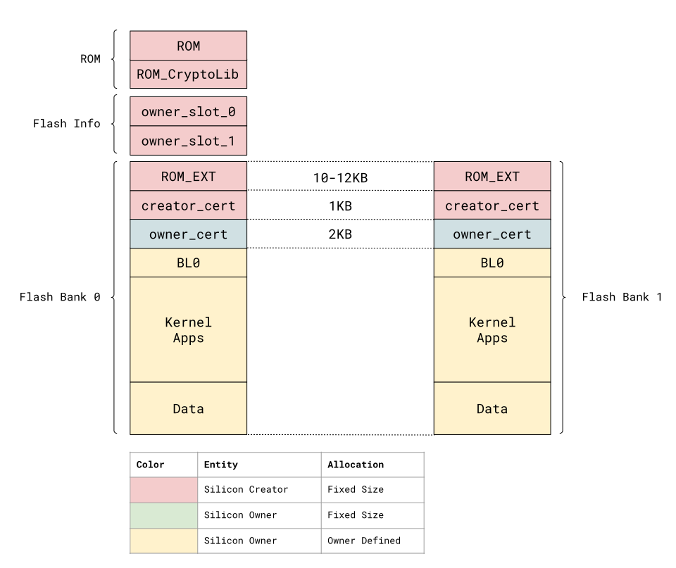

  Status: Pre-RFC

# Overview

The purpose of secure boot is to ensure that only payloads which have been
verified are executed as the system boots. This document describes the process
by which OpenTitan aims to ensure this property holds, as well as the services
that the secure boot chain provides to software, such as attestation and
firmware upgrade support.

# References

*   [Attestation][attestation]
*   [Ownership Transfer][ownership-transfer]
*   [OpenTitan Secure Boot HW Support][secure-boot-hw-support]
*   [OpenTitan Flash][ot-flash]

# Terminology

## RISC-V Concepts:

*   **PMP:** Physical Memory Protection unit from the
    [RISC-V ISA Volume II: Privileged Architecture][rv-isa-priv] specification.
    Allows defining properties (RWX) for regions of physical memory. **Note
    that the use of ePMP is currently being considered and that this
    specification will change to accomodate it.**

## Boot stages:

*   `ROM`: Metal mask ROM, sometimes known as Boot ROM.
*   `ROM_EXT`: ROM Extension. Stored in flash and signed by the Silicon Creator.
*   `BL0`: Bootloader. Signed by the Silicon Owner.
*   `Kernel`: Signed by the Silicon Owner.

# Boot Process Overview

The boot process flows as follows:

1.  Power on.
    1.  Execution is restricted to the ROM region via
        [OpenTitan Secure Boot HW Support][secure-boot-hw-support].
    2.  The last PMP region (region #15) is configured by reset logic to cover
        the entire flash region, with only the R and L bits set (that is, the
        region is **R**ead-only and **L**ocked, meaning the region is respected
        in Machine mode and cannot be unlocked unless by a system reset).
2.  Execution enters ROM stage.
    1.  All SRAM except for retention SRAM is cleared.
    2.  The active boot slot is loaded from the flash Boot Info. This value is
        called the Active `ROM_EXT` Slot.
    3.  Starting with the Active `ROM_EXT` Slot, the ROM code performs the
        following:
        1.  Determine if the slot is empty by testing for presence of the header
            magic value.
            1.  If present, continue validation. If missing, enter boot failure
                logic.
        2.  Using the Silicon Creator public key stored in ROM, verify the
            signature of the payload digest, using the process outlined in
            [OpenTitan Secure Boot HW Support][secure-boot-hw-support].
            1.  If signature validation fails, enter boot failure logic.
        3.  Perform system state measurements and derive the CreatorRootKey
            identity (see [Identities and Root Keys][identities-keys]), which
            will reside in the [key manager][key-manager], as an intermediate
            state.
        4.  Write PMP region #0: Read, Execute, Locked, covering the entirety of
            the `ROM_EXT` image from the active slot.
        5.  Transfer execution to the entry point specified in the `ROM_EXT`
            manifest for the active slot.
    4.  If the Active `ROM_EXT` Slot fails to boot, look up the boot failure
        policy from the ownership blob and act upon it.
3.  Execution enters `ROM_EXT` stage.
    1.  If the device reset cause is a boot services request then begin
        processing requests from persistent SRAM.
        1.  See [Boot Services](#boot-services) for details.
    2.  `ROM_EXT` reads the Boot Info page to determine which BL0/Kernel image
        it should be booting.
    3.  `ROM_EXT` computes the digest of the Silicon Owner image, and compares
        it with the digest present in the manifest.
        1.  If mismatched, abort boot.
    4.  `ROM_EXT` verifies the digest signature from the manifest with Silicon
        Owner key stored in the Boot Info page.
        1.  If verification fails, abort boot.
    5.  Derive OwnerIntermediateKey (see
        [Identities and Root Keys][identities-keys])
        1.  Includes writing Software Binding Value from the Silicon Owner image
            before deriving.
    6.  Construct the boot information structure at the beginning of SRAM.
        1.  The boot information structure contains information about the boot
            process, such as which `ROM_EXT` and silicon owner boot slot was
            used.
    7.  Load PMP region #1: Read, Execute, Locked, covering the executable
        region of the Silicon Owner code as described in the Silicon Owner code
        manifest.
    8.  Transfer execution to the entry point of the Silicon Owner code.
4.  Execution enters Silicon Owner code.
    1.  Silicon Owner code execution is beyond the scope of this document.

# Boot Policy {#boot-policy}

In order to provide a flexible boot mechanism the Boot Info page will store a
structure called the Boot Policy. The boot policy dictates the boot flow,
including storing boot attempts and successes for a given `ROM_EXT`, allowing
the ROM code to decide when to mark a `ROM_EXT` good or bad. The boot policy
also contains directions to `ROM_EXT` about which slot it loads silicon owner
code from. TODO(gdk): Expand on policy.

# Isolation {#isolation}

The OpenTitan Secure Boot implementation uses two mechanisms to attempt to
prevent glitching attacks from moving the program counter ahead into
user-controllable code without validation: the first being
[OpenTitan Secure Boot HW Support][secure-boot-hw-support]. This mechanism
ensures that execution cannot leave the ROM stage without going through a
hardened comparator path that ensures the active `ROM_EXT` has been verified.
The second isolation mechanism is the PMP. By default, the PMP is configured
with a single region that covers flash and only grants read access to the core.
Each stage must explicitly add a new region that allows execution in the region
that it has verified. The PMP configuration is documented here:
[Secure Boot PMP][secure-boot-pmp].

The first mechanism ensures that we can enter `ROM_EXT` with an extremely high
level of confidence in the code there, and the second ensures that the barrier
to execution for each successive stage remains high.

# Memory Layout {#memory-layout}

Memory on OpenTitan can be considered as split into three separate regions: ROM,
Flash Info, and addressable flash. The addressable flash is further divided into
two equally-sized regions called Flash Bank 0 and Flash Bank 1. The beginning
addresses for Flash Bank 0 and Flash Bank 1 are the only fixed points of
reference that the system is opinionated about, as they correspond to the
beginning of each physical flash bank. It is expected that a Silicon Owner might
arbitrarily reserve space at the end of each flash bank to use as additional
storage.

# Boot Services {#boot-services}

Boot Services refers to the functionality stored inside of `ROM`/`ROM_EXT` that
can be controlled via specific messages passed between from Silicon Owner code
in retention SRAM. Since ROM/`ROM_EXT` is responsible for the boot process and
is the only software on the device which can manipulate identities belonging to
the Silicon Owner, these services are required to perform actions such as
attestation of device identity and firmware update.

## Entering Boot Services

Boot services are invoked by placing a request structure at the beginning of
retention SRAM and resetting the system with the cause `BOOT_SERVICE_REQUEST`.

## Commands

*   `UNLOCK_OWNERSHIP`: As per [Ownership Transfer][ownership-transfer]'s
    [Unlock Flow][ot-unlock-flow], relinquish ownership of the device.
*   `TRANSFER_OWNERSHIP`: Initiate processing of an ownership transfer blob.
*   `REFRESH_ATTESTATION`: See [Attestation][attestation]. Causes the `ROM_EXT`
    to regenerate the attestation chain as per the
    [attestation command][attestation-command] section.
*   `UPDATE_FIRMWARE`: Instructs the active `ROM_EXT` to begin the firmware
    update process. This process allows for attempting to boot from a new
    `ROM_EXT` or silicon owner code with a programmable attempt count that must
    be satisfied before committing to the new code. This is done by updating the
    boot policy block. When a kernel wishes to update the other slot in the
    device it writes the firmware there and then issues an `UPDATE_FIRMWARE`
    command to instruct the next boot of `ROM_EXT` to attempt to load from that
    slot.

# Manifest Requirements

This document does not prescribe an exact data structure for the `ROM_EXT`
manifest as seen by the Mask ROM. However, these are the requirements that the
manifest format is required to support:

*   **Hash scheme selection.** The manifest must specify the hashing scheme that
    covers the `ROM_EXT` slot.
*   **Signature scheme selection**. The manifest must specify the signature
    scheme that covers the `ROM_EXT` slot.
*   **Key derivation constants**. As specified in the
    [Identities and Root Keys][identities-keys] document, the manifest header
    must include constants used to derive the next key generation.
*   **Header version.** The version of the `ROM_EXT`. This version field is used
    as part of the measurements for key derivations, and can be used as a
    constraint for the boot policy.
*   **Rollback protection.** A generation marker that is used by `ROM_EXT` to
    determine if this version is bootable or is considered a rollback.
*   **Entrypoint.** The executable entrypoint for this `ROM_EXT` slot.

<!-- TODO: Update with published documents when available. -->
[attestation]: 
[attestation-command]: #attestation-command
[identities-keys]: 
[key-manager]: 
[ot-flash]: #
[ot-unlock-flow]: #
[ownership-transfer]: 
[rv-isa-priv]: https://riscv.org/technical/specifications/
[secure-boot-hw-support]: #
[secure-boot-pmp]: #
