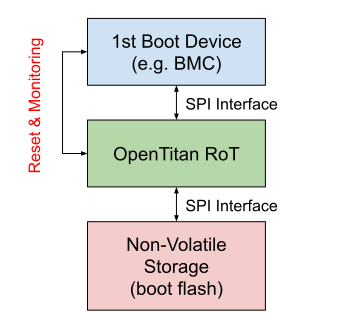

## Overview

OpenTitan's mission is to raise the security bar industry wide by implementing a transparent, logically secure hardware root of trust with wide application.

This document describes some of those use cases for OpenTitan.
These range from data center integrations, to embedded security applications such as security keys and smart cards.
References to relevant specifications and certification targets are noted where use cases are backed by industry standards.

## Platform Integrity Module

An OpenTitan IC used as a Platform Integrity Module interposes between a platform's boot flash and its main boot devices such as the Baseboard Management Controller (BMC), the Platform Controller Hub (PCH) and the CPU.

Figure 1: Platform Integrity Module

The Platform Integrity Module use case implements the following security properties:

* Measure integrity of first boot firmware stages before bringing the boot devices out of reset accessing boot flash via SPI or similar interface.
* Monitor resets and heartbeat of downstream boot devices.
  Monitoring tasks are handled by OpenTitan as Interrupt Service Routines (ISRs), and are not expected to operate under real time constraints.
* Enforce runtime boot device access policies, and manage A/B firmware updates for software stored in boot flash.
  The OpenTitan to boot device interface is implemented on SPI or a similar interface.
* Provides root key store and attestation flows as part of the platform integrity secure boot implementation.

### Minimum Crypto Algorithm Requirements

The current target for all crypto is at least 128-bit security strength.
This is subject to change based on the implementation timeline of any given instantiation of OpenTitan.
It is expected that a future implementation may be required to target a minimum of 192-bit or 256-bit security strength.

* TRNG: Entropy source for chip identity generation and KDF operations.
  In both cases, raw entropy is processed by a pseudorandom function before any key generation is done.
* Hash Algorithms:
  * SHA256: An approved hash algorithm with approximately the same security strength as its strongest asymmetric algorithm.
* Asymmetric Key Algorithms:
  * RSA-3072-bit: Secure boot signature verification.
  * ECDSA P-256: Signature and verification for identity and attestation keys.
* Symmetric Key Algorithms:
  * HMAC-SHA256:  NIST FIPS 180-4 compliant. Used in integrity measurements for storage and in transit data as well as secure boot.
  * AES: AES-CTR NIST 800-38A. Used to wrap keys and encrypt data stored in internal flash.

### Provisioning Requirements

Provisioning an OpenTitan device is performed in two steps:

* Device Personalization: The device is initialized with a unique cryptographic identity endorsed by a Transit PKI which is only used to support initial Ownership Transfer.
* Ownership Transfer: Ownership is assigned to a user that has the ability to run software on the device.
  As Silicon Owner, the user can generate a cryptographic identity strongly associated to the hardware and the software version running on the device.

OpenTitan used as a Platform Integrity Module has the following provisioning requirements:

* Unique Global Identifier: Non-Cryptographic big integer value (up to 256b) used to facilitate tracking of the devices throughout their life cycle.
  The identifier is stored in One Time Programmable (OTP) storage during manufacturing.
* Hardware Cryptographic Identity: Symmetric and asymmetric keys associated with the hardware, used to attest the authenticity of the chip and also as a component of the Owner Cryptographic Identity.
   These keys are generated inside the device by the secure manufacturing process.
* Hardware Transport Certificate: Used to endorse the asymmetric hardware identity with a transit PKI trusted by the Silicon Owner at Ownership Transfer time.
* Factory Firmware: Baseline image with support for firmware update and Ownership Transfer.
  Firmware update may be actuated by writing an OpenTitan update payload to boot flash.
  Upon reset, OpenTitan scans the boot flash device for valid updates.
  The factory image may not be owned by the Silicon Owner and its main purpose is to assist Ownership Transfer.
* Owner Cryptographic Identity: The Silicon Owner is required to generate an identity as part of the Ownership transfer flow.
  Owner identities are bound to the Hardware Identity and the software version running on the device.
  Owner identities are used in Silicon Ownership attestation flows and as a root component of Application keys.
* Application Keys: Keys bound to the owner identity and the application version running on the device.
  Application keys are provisioned in most cases when the application runs for the first time.
  The purpose of each key is configured at the application layer and enforced by the kernel.

### Performance Requirements

Performance requirements are derived from integration-specific requirements.
The following performance requirements are presented for illustration purposes:

* Boot Time: Maximum time allowed to get to device kernel serving state from cold reset.
* Resume Time: Maximum time allowed to get to device kernel serving state from sleep.
* External Flash Verification Time: Maximum time allowed for verification of external flash as part of platform boot verified boot implementation.
  Defined in milliseconds for a given flash partition size.

### Packaging Constraints

* Non-HDI packaging is required.
* (Proposed) Device packaging QR code with device ID linkable to manufacturing data.

### Additional Requirements

#### Memory Requirements

* At least 512KB of flash storage with 2 partitions, 4KB page size, 100K endurance cycles.
  1MB flash would be ideal to allow for future code size growth.
* At least 16KB of isolated flash storage for manufacturing and device life cycle operations.
* At least 8KB of OTP for manufacturing and device life cycle operations.
* At least 64KB of SRAM. 128KB would be ideal for future growth.

#### External Peripherals

The following list of peripheral requirements is speculative at the moment and subject to change based on platform integration requirements:

* SPI Host/Device:
  * Dual support. Quad support needs to be evaluated.
  * Required features for EEPROM mode:
      - Passthrough boot flash interface with support for EEPROM command handling/filtering.
      - Access to on-die ram and flash memory regions.
      - Mailbox interface with support for custom opcode commands.
* eSPI: Enhanced Serial Peripheral (eSPI) which enables asynchronous processing of boot flash commands issued by a boot device supporting the eSPI protocol and serviced by OpenTitan.
* UART: Debug console interface. May be disabled by production firmware.
* GPIO: Reset control and monitoring. Status signals.
* I2C interface compatible with SMBus interfaces.

## Universal 2nd-Factor Security Key

When used as a security key, OpenTitan implements the Universal 2nd Factor (U2F) authentication standard, using a Universal Serial Bus (USB) 1.1 interface to communicate with host devices.
U2F requires the implementation of a challenge-response authentication protocol based on public key cryptography.
The security key is provisioned with a unique identity in the form of an asymmetric key, which may be self-endorsed by a certificate issued at manufacturing time.

When used as a security key, OpenTitan shall meet the FIDO Authenticator security goals and measures described in the [FIDO Security Reference v1.2][1] specification.
See [Universal 2nd Factor (U2F) Overview v1.2][2] for more details on the functional requirements of this use case.

### Certification Requirements

* [BSI-PP-CC-0096-V3-2018][3] FIDO Universal Second Factor (U2F) Authenticator.
  The minimum assurance level for this Protection Profile (PP) is EAL4 augmented.
  This PP supports composite certification on top of the Security IC Platform Protection Profile with Augmentation Packages, BSI-CC-PP-0084-2014 (referred to as PP84).
* [FIPS 140-2 L1 + L3 physical][4] certification is required for some use cases.

### Minimum Crypto Algorithm Requirements

The current target for all crypto is at least 128-bit security strength.
This is subject to change based on the implementation timeline of any given instantiation of OpenTitan.
It is expected that a future implementation may be required to target a minimum of 192-bit or 256-bit security strength.

* TRNG:
  * Entropy source for ECDSA keypair generation (seed and nonce).
  * (optional) Symmetric MAC key generation.
* Asymmetric Key Algorithms:
  * ECDSA: Signature and verification on NIST P-256 curve for identity and attestation keys.
  * RSA-3072-bit: Secure boot signature verification. Used to verify the signature of the device's firmware.
* Symmetric Key Algorithms:
  * AES-CTR:
      - (optional) Used to wrap a user private key in a key handle. Implementation dependent.
  * HMAC-SHA256:
      - For application key handle generation.
* Hash Algorithms:
  * SHA-256:
      - Code and hardware measurements used in internal secure boot implementation.
      - (optional) For key handle generation. Implementation dependent.
      - (optional) Attestation cert generation, if generated on the fly.

### Provisioning Requirements

OpenTitan used as a security key has the following provisioning requirements:

* Unique Global Identifier: Non-Cryptographic big integer value (up to 256b) used to facilitate tracking of the devices throughout their life cycle.
  The identifier is stored in One Time Programmable (OTP) storage during manufacturing.
* Attestation Key: Unique cryptographic identity used for attestation purposes.
* Self-Signed Attestation Certificate: Self signed certificate and extracted at manufacturing time for registration purposes.
  U2F backend servers can create an allow-list of certificates reported by the secure key manufacturer, and use them to perform authenticity checks as part of the registration flow.
* Factory Firmware: Baseline image with support for firmware update via USB, and the USB HID U2F command spec.

### Additional Requirements

* Physical Presence GPIO: U2F requires physical user presence checks for registration and authentication flows.
  This is implemented either via a push button or capacitive touch sensor connected to an input GPIO pin.
  * At least 2 PWM peripherals can facilitate implementation of capacitive touch sensor IO operations.
* Status LEDs GPIO: The security key may use LEDs to provide feedback to the user.
  This requires up to 4 additional output GPIO pins.
* USB HID U2F Stack: The security key communicates with host devices via a USB HID protocol.
  OpenTitan shall meet the USB 1.1 connectivity and protocol requirements to interface with the host.

### Relevant specs

https://fidoalliance.org/specifications/download/

[1]: https://fidoalliance.org/specs/fido-u2f-v1.2-ps-20170411/fido-security-ref-v1.2-ps-20170411.html
[2]: https://fidoalliance.org/specs/fido-u2f-v1.2-ps-20170411/fido-u2f-overview-v1.2-ps-20170411.html
[3]: https://www.commoncriteriaportal.org/files/ppfiles/pp0096V3b_pdf.pdf
[4]: https://en.wikipedia.org/wiki/FIPS_140-2#Security_levels
