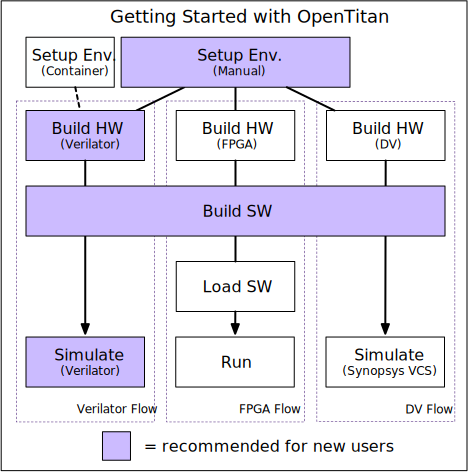

Welcome!

This guide will help you get OpenTitan up and running by instructing you how to:

1. setup an adequate build/testing environment on your machine,
2. clone the OpenTitan Git repository, and
3. build OpenTitan software/hardware for the target of your choosing.

As shown in the diagram above, we currently support multiple build targets and workflows, including: Verilator, FPGA, and DV.
However, if you are new to the project, we recommend simulation with Verilator, as this uses only free EDA tools, and does not require any additional hardware.

## Environment Setup

There are two choices for setting up an OpenTitan environment:
1. \[Supported\] [manual installation](), or
2. \[Experimental\] [provided Docker container]().

While the first option is the only one currently supported, the second option is the quickest to get running.
If you plan on being a long term user of the project, and/or contributer, we recommend the first (manual installation) option.
Alternatively, if your goal is to get a Verilator simulation up and running as quickly as possible, you may find it easier to try the second (container) option.

## Cloning the OpenTitan Repository

The [OpenTitan Repository](https://github.com/lowRISC/opentitan) must be checked out locally.
If you wish to contribute to OpenTitan you will need to make a fork on GitHub, otherwise you can just locally clone the main repository.
There are a set of [notes for using GitHub]() which explains how to work with your own fork.

***Note: throughout the documentation `$REPO_TOP` refers to the path where the OpenTitan repository is checked out.***

## Building OpenTitan Software/Hardware

Once you have setup a suitable environment and cloned the OpenTitan source code, you need to choose a top-level OpenTitan design to build.
The code base contains multiple [top-level designs](), which can be synthesized or simulated.
A target can be a simulation tool, an FPGA board, or an ASIC technology.
We currently support two out of the three aformentioned target types (i.e., simulation tools and FPGA), as described in this table:
| Target| Type | Primary Purpose | EDA Licenses Required? | Extra Hardware Required? | Link |
|-------|------|-----------------|------------------------|--------------------------|------|
| Verilator | Simulation Tool | SW Testing | no | no | [Getting Started with Verilator]()|
| FPGA | FPGA Board | Testing & Evaluation | maybe (FPGA size dependent) | yes | [Getting Started on FPGAs]() |
| DV | Simulation Tool | HW Verification | yes | no | [Getting Started with Design Verification]() |
| Formal | Simulation Tool | HW Verification | yes | no | [Getting Started with Formal Verification]() |

The instructions on how to compile the required demo software, and synthesize the main top-level hardware design ([Earl Grey]()) for each target are linked above in the table.
**Again, if you are new to the project, we recommend starting with the Verilator target, as this uses only free EDA tools, and does not require any additional hardware.**

## Additional Resources

If you have made it this far, congratulations!
Hopefully you got a "Hello World!" demo running on OpenTitan using either the Verilator or FPGA targets.
As you may have guessed, there are several other pieces of hardware and software, besides a "Hello World!" demo, that are being actively developed for the OpenTitan project.
If you are interested in these, check out the additional resources below.

### General
* [Directory Structure]()
* [GitHub Notes]()
* [Building Documentation]()
* [Design Methodology within OpenTitan]()

### Hardware
* [Getting Started Designing Hardware]()
* [OpenTitan Hardware]()

### Software
* [Getting Started Building Software]()
* [OpenTitan Software]()
* [Writing and Building Software for OTBN]()
* [Rust for Embedded C Programmers]()

