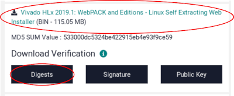
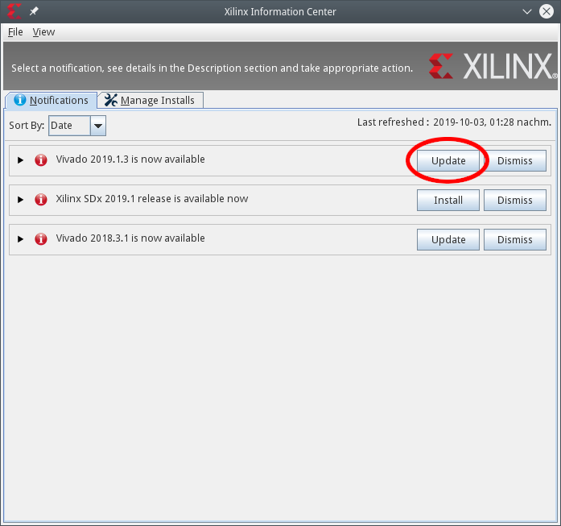
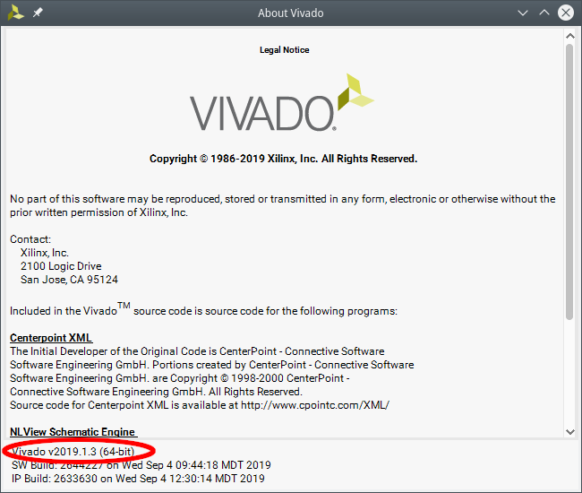

# Install Build Requirements

{{% toc 3 }}

## System requirements

_**Note for all Windows users:** many tools we're using can in theory work on Windows.
However, we didn't test on Windows and things will be broken there.
Unless you are experienced in debugging various tool problems on Windows using Linux will improve your developer experience significantly._

This guide makes assumes the following system setup.

* A reasonably powerful PC running Linux.
  Using a virtual machine can work, but will slow down builds considerably.
  8 GB of RAM or more are highly recommended.
* Physical access to that machine, root permissions and a graphical environment.
* Python 3.5 or newer. Python 3.6+ is recommended.
* 60 GB or more of disk space.
  EDA tools like Xilinx Vivado can easily take up 40 GB each.
* We develop and test on the following Linux distributions:
  * Ubuntu 16.04 LTS
  * Debian testing
  * openSUSE Tumbleweed
  * TODO: Check RHEL/CentOS and SLES (used in many commercial environments)

TODO: Be more specific about the system requirements, especially the Linux distribution.

## System preparation

By convention tools which are not provided through a package manager will be installed into `/tools`.
This directory can be replaced by any sufficiently large directory without spaces in the directory name.
It is assumed that the user executing the build instructions has full write permissions to this directory; the following commands ensure that.

```console
$ sudo mkdir /tools
$ sudo chown $(id -un) /tools
```

### Install required software

A number of software packages from the distribution's package manager is required.
All installation instructions below are for Ubuntu 16.04.
Adjust as necessary for other Linux distributions.

```console
$ sudo apt-get install python3 python3-pip python3-setuptools build-essential ninja-build pkgconf srecord zlib1g-dev
```

Some tools in this repository are written in Python 3 and require
Python dependencies to be installed through `pip`. (Note that the
`diff_generated_util_output.py` tool works better with Python3.6 or
later where the order is preserved in `dict` types, earlier versions
of Python will show spurious differences caused by things being
reordered.)

```console
$ cd $REPO_TOP
$ pip3 install --user -r python-requirements.txt
```

The `pip` installation instructions use the `--user` flag to install without root permissions.
Binaries are installed to `~/.local/bin`; check that this directory is listed in your `PATH` by running `fusesoc --version`.
If the `fusesoc` binary is not found, add `~/.local/bin` to your `PATH`, e.g. by modifying your `~/.bashrc` file.

## Software development

### Compiler toolchain

To build software you need a baremetal rv32imc compiler toolchain.
You can either build your own or use a prebuilt one.
We recommend installing the toolchain to `/tools/riscv`.

#### Option 1 (recommended): Use the lowRISC-provided prebuilt GCC toolchain

lowRISC provides a prebuilt GCC toolchain for the OpenTitan project.
Download the file starting with `lowrisc-toolchain-gcc-rv32imc-` from [GitHub releases](https://github.com/lowRISC/lowrisc-toolchains/releases/latest) and unpack it to `/tools/riscv`.

Or alternatively, use a in-tree helper script.

```cmd
$ cd $REPO_TOP
$ ./util/get-toolchain.py
```

#### Option 2: Compile your own GCC toolchain

1. Install all build prerequisites listed [in the documentation](https://github.com/riscv/riscv-gnu-toolchain/#prerequisites).

2. Build the toolchain
    ```console
    $ git clone --recursive https://github.com/riscv/riscv-gnu-toolchain
    $ cd riscv-gnu-toolchain
    $ ./configure --prefix=/tools/riscv --with-abi=ilp32 --with-arch=rv32imc --with-cmodel=medany
    $ make
    ```

The `make` command installs the toolchain to `/tools/riscv`, no additional `make install` step is needed.

### OpenOCD

OpenOCD is a tool to connect with the target chip over JTAG and similar transports.
It also provides a GDB server which is an "intermediate" when debugging software on the chip with GDB.

Unfortunately the upstream sources of OpenOCD do not contain all necessary patches to support RISC-V, and hence typical distribution packages don't work.
We therefore need to build OpenOCD from source from a forked repository.

For FTDI support the libraries libftdi > 1.0 and libusb > 1.0 are needed.
Install those packages prior to building OpenOCD.

```console
$ sudo apt-get install libftdi1-dev libusb-1.0-0-dev
$ git clone https://github.com/riscv/riscv-openocd.git
$ cd riscv-openocd
$ ./bootstrap
$ mkdir build
$ cd build
$ ../configure --enable-ftdi --enable-verbose-jtag-io --disable-vsllink --enable-remote-bitbang --prefix=/tools/openocd
$ make -j4
$ sudo make install
```

## Verilator

Even though Verilator is packaged for most Linux distributions these versions tend to be too old to be usable.
We recommend compiling Verilator from source, as outlined here.

First some build prerequisites need to be installed.
For Ubuntu the following packages are needed.
```console
$ sudo apt-get install git make autoconf g++ flex bison
```

### Install Verilator

Then you can fetch, build and install Verilator itself.

```console
$ export VERILATOR_VERSION=4.010

$ git clone http://git.veripool.org/git/verilator
$ cd verilator
$ git checkout v$VERILATOR_VERSION

$ autoconf
$ ./configure --prefix=/tools/verilator/$VERILATOR_VERSION
$ make
$ make install
```

After installation you need to add `/tools/verilator/$VERILATOR_VERSION/bin` to your `PATH` environment variable.

## Xilinx Vivado

### About Xilinx Vivado

To generate a bitstream for Xilinx devices a software called Vivado is required.
Vivado is provided by Xilinx, it is freeware for certain (smaller) FPGA devices but requires a commercial license for larger FPGAs.
The free version is called "WebPACK", the commercial version "Design Edition".
The installation instructions below are valid for both installation methods.

Most lowRISC designs support at least one FPGA board which works with a free WebPACK license.

### Install Xilinx Vivado

Vivado can be installed in two ways: either through an "All OS installer Single-File Download", or via the "Linux Self Extracting Web Installer".
In the following, we use the web installer to significantly reduce the download size.

1. Go to the [Xilinx download page](https://www.xilinx.com/support/download.html) and download two files for the current version of Vivado.
   (We used Vivado 2019.1 to prepare this guide.)
   1. The file "Vivado HLx <VERSION>: WebPACK and Editions - Linux Self Extracting Web Installer".
   2. The "Digests" file below the download.

   

   You need to register for a free Xilinx account to download the software, and you'll need it again later to install the software.
   Create a new account if you don't have one yet.

2. Before you proceed ensure that the download didn't get corrupted by verifying the checksum.

    ```console
    $ sha512sum --check Xilinx_Vivado_SDK_Web_2019.1_0524_1430_Lin64.bin.digests
    Xilinx_Vivado_SDK_Web_2019.1_0524_1430_Lin64.bin: OK
    sha512sum: WARNING: 22 lines are improperly formatted
    ```

    If you see an "OK" after the downloaded file proceed to the next step. Otherwise delete the download and start over. (You can ignore the warning produced by `sha512sum`.)

3. Now run the installer

    ```console
    $ sh Xilinx_Vivado_SDK_Web_2019.1_0524_1430_Lin64.bin --keep --noexec --target vivado-installer
    $ cd vivado-installer/
    $ ./xsetup -b AuthTokenGen
    Running in batch mode...
    Copyright (c) 1986-2019 Xilinx, Inc.  All rights reserved.

    INFO : Log file location - /home/user/.Xilinx/xinstall/xinstall_1570100376363.log
    INFO : Internet connection validated, can connect to internet.
    INFO : In order to generate the authentication token please provide your Xilinx account User ID and password.
    User ID:youremailaddress@example.com
    Password:

    INFO : Generating authentication token...
    INFO : Saved authentication token file successfully, valid until 10/10/2019 11:59 am.

    $ ./xsetup --agree 3rdPartyEULA,WebTalkTerms,XilinxEULA --batch Install --edition "Vivado HL WebPACK" --location "/tools/xilinx"
    Running in batch mode...
    Copyright (c) 1986-2019 Xilinx, Inc.  All rights reserved.

    INFO : Log file location - /home/user/.Xilinx/xinstall/xinstall_1570100957466.log
    INFO : Internet connection validated, can connect to internet.
    INFO : Authenticated user youremailaddress@example.com successfully.
    INFO : Installing Edition: Vivado HL WebPACK
    INFO : Installation directory is /tools/xilinx
    .
    INFO : Downloading.....
    INFO : Downloaded successfully 295 archives representing 10,5 GiB in 47 min, 11 sec
    INFO : Installing......
    INFO : Log file is copied to : /tools/xilinx/.xinstall/Vivado_2019.1/xinstall.log
    INFO : Installation completed successfully.

    ```

    Now Vivado will download and install multiple gigabytes of data, which typically takes multiple hours to complete.
    After the installer completes, Vivado is installed to `/tools/xilinx/Vivado/2019.1`.
    Before you use Vivado, we recommend installing any updates as described next.

### Update Xilinx Vivado to a Point Release (e.g. 2019.1.x)

The installer installs the initially released version of a given Vivado quarterly release (e.g. 2019.1).
To get all point releases after that, e.g. 2019.1.1 you need to run the updater available from the Xilinx Information Center.

1. Start the Xilinx Information Center (XIC).

   From the command line:

   ```console
   $ /tools/xilinx/xic/xic
   ```

   or select Xilinx Design Tools > Xilinx Information Center from the application menu of your desktop environment.

2. Choose the applicable update, and click on "Update".

   

3. The update installer will launch and first ask you for your Xilinx registration information: your email address and your password.
   Enter this information.

4. In the installer window, continue to press "Next" without making other changes.
   Then click "Install" to start the download and installation of the update.
   This process typically takes 15-30 minutes, depending on your internet connection.

5. After the installation completes close the Xilinx Information Center.

6. As final step, confirm the installed version.
   Run Vivado (see the section below for instructions on how to do so) and click on Help > About Vivado.
   The version number is displayed at the bottom of the dialog and should equal the version you just installed.

   

### Run Xilinx Vivado

Vivado can be started through the desktop's application menu by clicking on Xilinx Design Tools > Vivado.

Alternatively, Vivado can be started from the command line:

```console
$ source /tools/xilinx/Vivado/2019.1/settings64.sh
$ vivado
```

### Device permissions: udev rules

To program FPGAs user using Vivado typically needs to have permission to USB devices connected to the PC.
Depending on your security policy you can take different steps to enable this access.
One way of doing so is given in the udev rule outlined below.

To do so, create a file named `/etc/udev/rules.d/90-lowrisc.rules` and add the following content to it:

```
# Grant access to board peripherals connected over USB:
# - The USB devices itself (used e.g. by Vivado to program the FPGA)
# - Virtual UART at /dev/tty/XXX

# Future Technology Devices International, Ltd FT2232C/D/H Dual UART/FIFO IC
# used on Digilent boards
ACTION=="add|change", SUBSYSTEM=="usb|tty", ATTRS{idVendor}=="0403", ATTRS{idProduct}=="6010", ATTRS{manufacturer}=="Digilent", MODE="0666"

# Future Technology Devices International, Ltd FT232 Serial (UART) IC
ACTION=="add|change", SUBSYSTEM=="usb|tty", ATTRS{idVendor}=="0403", ATTRS{idProduct}=="6001", MODE="0666"
```

You then need to reload the udev rules:

```console
# udevadm control --reload
```
