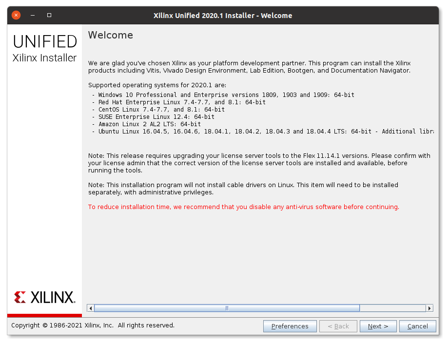

## System requirements

This guide makes assumes the following system setup.

* A reasonably powerful PC.
  Using a virtual machine can work, but will slow down builds considerably.
  8 GB of RAM or more are highly recommended.
* Physical access to that machine, root permissions and a graphical environment are assumed in this guide.
  However, with an appropriate setup, none of these things are strictly needed.
* 60 GB or more of disk space, depending on the EDA tools used.
  (EDA tools like Xilinx Vivado can easily take up 40 GB each.)
* Linux
  * Ubuntu 18.04 LTS is the recommended reference platform.
    Our continuous integration setup runs on Ubuntu 18.04 LTS, which gives us the most confidence that this distribution works out of the box.
  * We do our best to support other Linux distributions.
    However, we cannot guarantee they can be used "out of the box" and might require updates of packages.
    Please file a [GitHub issue](https://github.com/lowRISC/opentitan/issues) if you need help or would like to propose a change to increase compatibility with other distributions.
    * RedHat Enterprise Linux (RHEL)/CentOS.

      On RHEL/CentOS not all required packages are part of the base distribution; however, they can be installed easily.
      All required packages except for a C/C++ compiler can be obtained by enabling the [EPEL repository](https://fedoraproject.org/wiki/EPEL).
      A sufficiently recent version of GCC or LLVM (clang) can be obtained through [Red Hat Software Collections](https://www.softwarecollections.org/en/).
      SCLs can also be used to obtain newer version of Python if needed.

    * Many of our contributors use rolling release distributions, which generally include the latest stable releases of all software packages, such as Debian unstable, openSUSE Tumbleweed, or Arch Linux.

The following software packages are required to build and use the software, hardware, and tools in the OpenTitan repository.
Not every interaction with the repository requires all tools -- however, we recommend users installing all dependencies listed below for a seamless development experience.

Note: Version numbers given below indicate a minimum version, newer versions are generally expected to work, unless explicitly stated.
For packages listed below without a version number we have not determined a minimum version.

* git
* Python 3.6 with pip.
  Additional Python dependencies are installed through pip.
* A C++14 capable compiler.
  GCC 5 or Clang 3.5 should meet this requirement.
* clang-format.
  The use of clang-format 6.0 is recommended to match the formatting enforced when submitting a pull request.
* [ninja](https://ninja-build.org/)  
* Bash
* curl
* xz tools
* LSB core packages (only the `lsb_release` tool must be available)
* srecord
* GNU make
* pkg-config or pkgconf
* libelf with development headers
* libftdi with development headers
* OpenSSL 1.0 or 1.1 with development headers
* libusb 1.0 (called libusbx in older distributions)
* OpenOCD
* [Verible](https://github.com/google/verible) 

To synthesize and simulate the hardware components of OpenTitan multiple EDA tools are supported.
Depending on how you interact with the OpenTitan hardware code, one of more of the following tools need to be available.

* [Verilator](https://verilator.org) 
* Xilinx Vivado 2018.3
* Synopsys VCS
* Cadence Xcelium
* Cadence JasperGold
* RealIntent Ascent Lint
* Synopsys Design Compiler (DC)

To build our documentation the following additional sofware packages are required.

* [Hugo extended](https://gohugo.io/) .
  A supported binary build of Hugo is installed when building the documentation.
  However, the binaries do not run on very old distributions, such as RHEL 6.
  In this case, Hugo must be installed separately (e.g. by building it from source).
* [doxygen](https://www.doxygen.nl/) 1.8
* xsltproc

## System preparation

<div class="bd-callout bd-callout-warning">
  <h5>Note</h5>

  This documentation and the following steps in general assume our reference distribution, Ubuntu 18.04.
  Users inexperienced with Linux and OpenTitan are strongly encouraged to use this distribution for a seamless development experience.

  Users of other Linux distributions should use these steps as guidance, but will need to adjust them as necessary.
  Please file [GitHub issues](https://github.com/opentitan/issues/new) if you have questions.
</div>

By convention tools which are not provided through a package manager will be installed into `/tools`.
This directory can be replaced by any sufficiently large directory without spaces in the directory name.
It is assumed that the user executing the build instructions has full write permissions to this directory; the following commands ensure that.

```console
$ sudo mkdir /tools
$ sudo chown $(id -un) /tools
```

### Clone repository

If you intend to contribute back to OpenTitan you will want your own fork of the repository on GitHub and to work using that, see the [notes for using GitHub]().
Otherwise make a simple clone of the main OpenTitan repository.

```console
$ cd <working-area>
$ git clone https://github.com/lowRISC/opentitan.git
```

The repository will be checked out into `<working-area>/opentitan` (this is the `$REPO_TOP` path).

### Install required software

A number of software packages from the distribution's package manager are required.
On Ubuntu 18.04, the required packages can be installed with the following command.



Our recommended reference platform is Ubuntu 18.04, but the command can be adjusted as necessary for other Linux distributions.

For example, for Red Hat Enterprise Linux (RHEL) 7 and derivatives (such as CentOS 7) the following packages are required.
Note that we don't have the possibilities to actively verify that our instructions continue work on RHEL/CentOS and hence also can't test anything on these distributions.
The following instructions are effectively community contributed and we encourage users to raise pull requests if they find the package requirements to be outdated.
First of all, the [EPEL repository](https://fedoraproject.org/wiki/EPEL) has to be enabled.
A sufficiently recent version of GCC or LLVM (clang) can be obtained through [Red Hat Software Collections](https://www.softwarecollections.org/en/).
Then run the following command to install the required package dependencies on RHEL/CentOS 7.



Some tools in this repository are written in Python 3 and require Python dependencies to be installed through `pip`.

```console
$ cd $REPO_TOP
$ pip3 install --user -r python-requirements.txt
```

The `pip` installation instructions use the `--user` flag to install without root permissions.
Binaries are installed to `~/.local/bin`; check that this directory is listed in your `PATH` by running `fusesoc --version`.
If the `fusesoc` binary is not found, add `~/.local/bin` to your `PATH`, e.g. by modifying your `~/.bashrc` file.

## Software development

### Device compiler toolchain (RV32IMC)

To build device software you need a baremetal RV32IMC compiler toolchain.
We recommend using a prebuilt toolchain provided by lowRISC.
Alternatively, you can build your own.
Whichever option you choose, we recommend installing the toolchain to `/tools/riscv`.

#### Option 1 (recommended): Use the lowRISC-provided prebuilt toolchain

lowRISC provides a prebuilt toolchain for the OpenTitan project.
This toolchain contains both GCC and Clang, targeting RISC-V.
By default the device software is built with Clang.
We recommend using the `util/get-toolchain.py` tool to download and install the latest version of this toolchain.

```cmd
$ cd $REPO_TOP
$ ./util/get-toolchain.py
```

This tool will automatically adjust the toolchain configuration if you override the installation directory (by using the `--install-dir` option).
It also provides the ability to perform a staged installation (by supplying a `--dest-dir` option), if the toolchain needs to be unpacked first at a temporary staging directory, before it can be moved to the final installation directory.
Alternatively, manually download the file starting with `lowrisc-toolchain-rv32imc-` from [GitHub releases](https://github.com/lowRISC/lowrisc-toolchains/releases/latest) and unpack it to the desired installation directory.

#### Option 2: Compile your own GCC toolchain

1. Install all build prerequisites listed [in the documentation](https://github.com/riscv/riscv-gnu-toolchain/#prerequisites).

2. Build the toolchain (this should be done outside the `$REPO_TOP` directory):
    ```console
    $ git clone --recursive https://github.com/riscv/riscv-gnu-toolchain
    $ cd riscv-gnu-toolchain
    $ ./configure --prefix=/tools/riscv --with-abi=ilp32 --with-arch=rv32imc --with-cmodel=medany
    $ make
    ```

    The `make` command installs the toolchain to `/tools/riscv`, no additional `make install` step is needed.

3. Write a [meson toolchain configuration file](https://mesonbuild.com/Cross-compilation.html#defining-the-environment) for your toolchain.
   It should look like the following (though your paths may be different):
    ```ini
    [binaries]
    c = '/tools/riscv/bin/riscv32-unknown-elf-gcc'
    cpp = '/tools/riscv/bin/riscv32-unknown-elf-g++'
    ar = '/tools/riscv/bin/riscv32-unknown-elf-ar'
    ld = '/tools/riscv/bin/riscv32-unknown-elf-ld'
    objdump = '/tools/riscv/bin/riscv32-unknown-elf-objdump'
    objcopy = '/tools/riscv/bin/riscv32-unknown-elf-objcopy'
    strip = '/tools/riscv/bin/riscv32-unknown-elf-strip'
    as = '/tools/riscv/bin/riscv32-unknown-elf-as'

    [properties]
    needs_exe_wrapper = true
    has_function_printf = false
    c_args = ['-march=rv32imc', '-mabi=ilp32', '-mcmodel=medany']
    c_link_args = ['-march=rv32imc', '-mabi=ilp32', '-mcmodel=medany']
    cpp_args = ['-march=rv32imc', '-mabi=ilp32', '-mcmodel=medany']
    cpp_link_args = ['-march=rv32imc', '-mabi=ilp32', '-mcmodel=medany']

    [host_machine]
    system = 'bare metal'
    cpu_family = 'riscv32'
    cpu = 'ibex'
    endian = 'little'
    ```

    You will need to pass the path to this file to `./meson_init.sh` using the `-t FILE` option.


### OpenOCD

OpenOCD is a tool to connect with the target chip over JTAG and similar transports.
It also provides a GDB server which is an "intermediate" when debugging software on the chip with GDB.

Unfortunately the upstream sources of OpenOCD do not contain all necessary patches to support RISC-V, and hence typical distribution packages don't work.
We therefore need to build OpenOCD from source from a forked repository.

To build OpenOCD (this should be done outside the `$REPO_TOP` directory):

```console
$ git clone https://github.com/riscv/riscv-openocd.git
$ cd riscv-openocd
$ ./bootstrap
$ mkdir build
$ cd build
$ ../configure --enable-ftdi --enable-verbose-jtag-io --disable-vsllink --enable-remote-bitbang --prefix=/tools/openocd
$ make -j4
$ sudo make install
```

## Verilator

Even though Verilator is packaged for most Linux distributions these versions tend to be too old to be usable.
We recommend compiling Verilator from source, as outlined here.

### Install Verilator

Then you can fetch, build and install Verilator itself (this should be done outside the `$REPO_TOP` directory).

```console
$ export VERILATOR_VERSION=

$ git clone https://github.com/verilator/verilator.git
$ cd verilator
$ git checkout v$VERILATOR_VERSION

$ autoconf
$ ./configure --prefix=/tools/verilator/$VERILATOR_VERSION
$ make
$ make install
```

After installation you need to add `/tools/verilator/$VERILATOR_VERSION/bin` to your `PATH` environment variable.

## Verible

Verible is an open source  SystemVerilog style linter and formatting tool.
The style linter is relatively mature and we use it as part of our [RTL design flow]().
The formatter is still under active development, and hence its usage is more experimental in OpenTitan.

You can download and build Verible from scratch as explained on the [Verible GitHub page](https://github.com/google/verible/).
But since this requires the Bazel build system the recommendation is to download and install a pre-built binary as described below.

### Install Verible

Go to [this page](https://github.com/google/verible/releases) and download the correct binary archive for your machine.
The example below is for Ubuntu 18.04:

```console
$ export VERIBLE_VERSION=

$ wget https://github.com/google/verible/releases/download/v${VERIBLE_VERSION}/verible-${VERIBLE_VERSION}-Ubuntu-18.04-bionic-x86_64.tar.gz
$ tar -xf verible-${VERIBLE_VERSION}-Ubuntu-18.04-bionic-x86_64.tar.gz

$ sudo mkdir -p /tools/verible/${VERIBLE_VERSION}/
$ sudo mv verible-${VERIBLE_VERSION}/* /tools/verible/${VERIBLE_VERSION}/
```

After installation you need to add `/tools/verible/$VERIBLE_VERSION/bin` to your `PATH` environment variable.

Note that we currently use version , but it is expected that this version is going to be updated frequently, since the tool is under active develpment.

## Xilinx Vivado

### About Xilinx Vivado

To generate a bitstream for Xilinx devices a software called Vivado is required.
Vivado is provided by Xilinx, it is freeware for certain (smaller) FPGA devices but requires a commercial license for larger FPGAs.
The free version is called "WebPACK", the commercial version "Design Edition".
The installation instructions below are valid for both installation methods.

Most lowRISC designs support at least one FPGA board which works with a free WebPACK license.

### Install Xilinx Vivado

_**Vivado Version:** Vivado 2019.1 and all its minor updates are not compatible with this project._

Vivado can be installed in two ways: either through an "All OS installer Single-File Download", or via the "Linux Self Extracting Web Installer".
Neither option is great:
the "All OS installer" is a huge download of around 20 GB (and the Xilinx download servers seem to be overloaded regularly), but it supports an unattended installation.
The web installer downloads only necessary subsets of the software, which significantly reduces the download size.
But unfortunately it doesn't support the batch mode for unattended installations, requiring users to click through the GUI and select the right options.

To get started faster we use the web installer in the following.

1. Go to the [Xilinx download page](https://www.xilinx.com/support/download/index.html/content/xilinx/en/downloadNav/vivado-design-tools/2020-1.html) and download two files for Vivado 2020.1.
   (The version can be chosen on the left side if version 2020.1 is not already selected.)
   1. The file "Xilinx Unified Installer 2020.1: Linux Self Extracting Web Installer".
   2. The "Digests" file below the download.

   

   You need to register for a free Xilinx account to download the software, and you'll need it again later to install the software.
   Create a new account if you don't have one yet.

2. Before you proceed ensure that the download didn't get corrupted by verifying the checksum.

    ```console
    $ sha512sum --check Xilinx_Unified_2020.1_0602_1208_Lin64.bin.digests
   Xilinx_Unified_2020.1_0602_1208_Lin64.bin: OK
    sha512sum: WARNING: 22 lines are improperly formatted
    ```

    If you see an "OK" after the downloaded file proceed to the next step. Otherwise delete the download and start over. (You can ignore the warning produced by `sha512sum`.)
3. Run the graphical installer.

    ```console
    $ sh Xilinx_Unified_2020.1_0602_1208_Lin64.bin
    ```

4. Now you need to click through the installer.
   Click "Next" on the first screen.

   

5. Type in your Xilinx User ID (your email address) and the associated password.
   Choose the "Download and Install Now" option.
   Click "Next" to continue.

   

6. Click all "I Agree" checkboxes, and click on "Next" to continue.

   

7. Choose "Vivado HL WebPACK" if you do not have a commercial Vivado license, or "Vivado HL Design Edition" if you have a valid license.
   In this walk through we'll install the WebPACK edition.

   

8. Choose the features to install.
    You can restrict the features to the ones shown in the screenshot below.
    Click "Next" to continue.

   

9. Choose an installation location.
    Any location which doesn't have a whitespace in its path and enough free space is fine.
    We use `/tools` in our example, but a path in `/opt` or within the home directory works equally well.
    Click "Next" to continue.

   

10. Double-check the installation summary and click on "Install" to start the installation process.

   

11. Now Vivado is downloaded and installed, a process which can easily take multiple hours.

   

12. As soon as the installation has completed close the installer and you're now ready to use Vivado!

### Device permissions: udev rules

To program FPGAs user using Vivado typically needs to have permission to USB devices connected to the PC.
Depending on your security policy you can take different steps to enable this access.
One way of doing so is given in the udev rule outlined below.

To do so, create a file named `/etc/udev/rules.d/90-lowrisc.rules` and add the following content to it:

```
# Grant access to board peripherals connected over USB:
# - The USB devices itself (used e.g. by Vivado to program the FPGA)
# - Virtual UART at /dev/tty/XXX

# Future Technology Devices International, Ltd FT2232C/D/H Dual UART/FIFO IC
# used on Digilent boards
ACTION=="add|change", SUBSYSTEM=="usb|tty", ATTRS{idVendor}=="0403", ATTRS{idProduct}=="6010", ATTRS{manufacturer}=="Digilent", MODE="0666"

# Future Technology Devices International, Ltd FT232 Serial (UART) IC
ACTION=="add|change", SUBSYSTEM=="usb|tty", ATTRS{idVendor}=="0403", ATTRS{idProduct}=="6001", MODE="0666"
```

You then need to reload the udev rules:

```console
$ sudo udevadm control --reload
```
