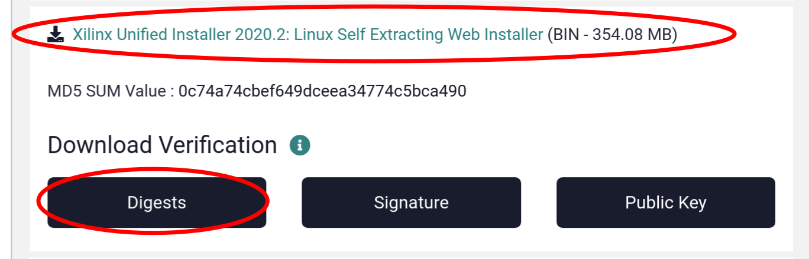
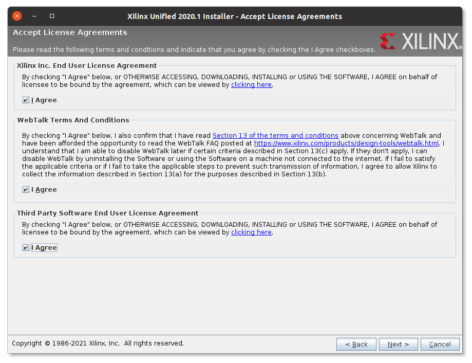
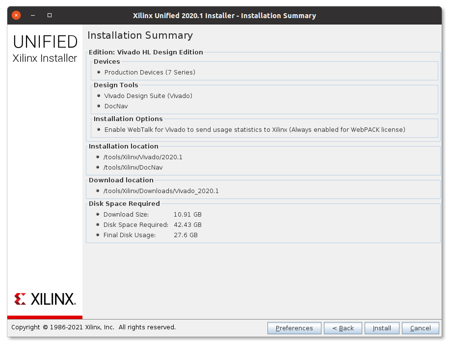

# Install Build Requirements


## System requirements

_**Note for all Windows users:** many tools we're using can in theory work on Windows.
However, we didn't test on Windows and things will be broken there.
Unless you are experienced in debugging various tool problems on Windows using Linux will improve your developer experience significantly._

This guide makes assumes the following system setup.

* A reasonably powerful PC running Linux.
  Using a virtual machine can work, but will slow down builds considerably.
  8 GB of RAM or more are highly recommended.
* Physical access to that machine, root permissions and a graphical environment.
* Python 3.5.2 or newer. Python 3.6+ is recommended.
* A C++14 capable compiler. GCC 5 or Clang 3.5 should meet this requirement.
* 60 GB or more of disk space.
  EDA tools like Xilinx Vivado can easily take up 40 GB each.
* We develop and test on the following Linux distributions:
  * Ubuntu 16.04 LTS
  * Debian testing
  * openSUSE Tumbleweed
  * TODO: Check RHEL/CentOS and SLES (used in many commercial environments)

TODO: Be more specific about the system requirements, especially the Linux distribution.

## System preparation

By convention tools which are not provided through a package manager will be installed into `/tools`.
This directory can be replaced by any sufficiently large directory without spaces in the directory name.
It is assumed that the user executing the build instructions has full write permissions to this directory; the following commands ensure that.

```console
$ sudo mkdir /tools
$ sudo chown $(id -un) /tools
```

### Clone repository

If you intend to contribute back to OpenTitan you will want your own fork of the repository on GitHub and to work using that, see the [notes for using GitHub]().
Otherwise make a simple clone of the main OpenTitan repository.

```console
$ cd <working-area>
$ git clone https://github.com/lowRISC/opentitan.git
```

The repository will be checked out into `<working-area>/opentitan` (this is the
`$REPO_TOP` path).

### Install required software

A number of software packages from the distribution's package manager is required.
All installation instructions below are for Ubuntu 16.04.
Adjust as necessary for other Linux distributions.

```console
$ sudo apt-get install git python3 python3-pip python3-setuptools \
    build-essential autoconf flex bison ninja-build pkgconf \
    srecord zlib1g-dev libftdi1-dev libftdi1-2 libssl-dev \
    libusb-1.0-0-dev libtool libelf-dev
```

Some tools in this repository are written in Python 3 and require Python dependencies to be installed through `pip`.
(Note that the `diff_generated_util_output.py` tool works better with Python 3.6 or later where the order is preserved in `dict` types, earlier versions of Python will show spurious differences caused by things being reordered.)

```console
$ cd $REPO_TOP
$ pip3 install --user -r python-requirements.txt
```

The `pip` installation instructions use the `--user` flag to install without root permissions.
Binaries are installed to `~/.local/bin`; check that this directory is listed in your `PATH` by running `fusesoc --version`.
If the `fusesoc` binary is not found, add `~/.local/bin` to your `PATH`, e.g. by modifying your `~/.bashrc` file.

## Software development

### Device compiler toolchain (RV32IMC)

To build device software you need a baremetal RV32IMC compiler toolchain.
You can either build your own or use a prebuilt one.
We recommend installing the toolchain to `/tools/riscv`.

#### Option 1 (recommended): Use the lowRISC-provided prebuilt GCC toolchain

lowRISC provides a prebuilt GCC toolchain for the OpenTitan project.
Download the file starting with `lowrisc-toolchain-gcc-rv32imc-` from [GitHub releases](https://github.com/lowRISC/lowrisc-toolchains/releases/latest) and unpack it to `/tools/riscv`.

Or alternatively, use a in-tree helper script.

```cmd
$ cd $REPO_TOP
$ ./util/get-toolchain.py
```

#### Option 2: Compile your own GCC toolchain

1. Install all build prerequisites listed [in the documentation](https://github.com/riscv/riscv-gnu-toolchain/#prerequisites).

2. Build the toolchain (this should be done outside the `$REPO_TOP` directory):
    ```console
    $ git clone --recursive https://github.com/riscv/riscv-gnu-toolchain
    $ cd riscv-gnu-toolchain
    $ ./configure --prefix=/tools/riscv --with-abi=ilp32 --with-arch=rv32imc --with-cmodel=medany
    $ make
    ```

The `make` command installs the toolchain to `/tools/riscv`, no additional `make install` step is needed.

### OpenOCD

OpenOCD is a tool to connect with the target chip over JTAG and similar transports.
It also provides a GDB server which is an "intermediate" when debugging software on the chip with GDB.

Unfortunately the upstream sources of OpenOCD do not contain all necessary patches to support RISC-V, and hence typical distribution packages don't work.
We therefore need to build OpenOCD from source from a forked repository.

To build OpenOCD (this should be done outside the `$REPO_TOP` directory):

```console
$ git clone https://github.com/riscv/riscv-openocd.git
$ cd riscv-openocd
$ ./bootstrap
$ mkdir build
$ cd build
$ ../configure --enable-ftdi --enable-verbose-jtag-io --disable-vsllink --enable-remote-bitbang --prefix=/tools/openocd
$ make -j4
$ sudo make install
```

## Verilator

Even though Verilator is packaged for most Linux distributions these versions tend to be too old to be usable.
We recommend compiling Verilator from source, as outlined here.

### Install Verilator

Then you can fetch, build and install Verilator itself (this should be done outside the `$REPO_TOP` directory).

```console
$ export VERILATOR_VERSION=4.010

$ git clone http://git.veripool.org/git/verilator
$ cd verilator
$ git checkout v$VERILATOR_VERSION

$ autoconf
$ ./configure --prefix=/tools/verilator/$VERILATOR_VERSION
$ make
$ make install
```

After installation you need to add `/tools/verilator/$VERILATOR_VERSION/bin` to your `PATH` environment variable.

## Xilinx Vivado

### About Xilinx Vivado

To generate a bitstream for Xilinx devices a software called Vivado is required.
Vivado is provided by Xilinx, it is freeware for certain (smaller) FPGA devices but requires a commercial license for larger FPGAs.
The free version is called "WebPACK", the commercial version "Design Edition".
The installation instructions below are valid for both installation methods.

Most lowRISC designs support at least one FPGA board which works with a free WebPACK license.

### Install Xilinx Vivado

_**Vivado Version:** Vivado 2019.1 and all its updates are not compatible with this project.
A discussion on this problem can be found in the [Github issue](https://github.com/lowRISC/opentitan/issues/89)._

Vivado can be installed in two ways: either through an "All OS installer Single-File Download", or via the "Linux Self Extracting Web Installer".
Neither option is great:
the "All OS installer" is a huge download of around 20 GB (and the Xilinx download servers seem to be overloaded regularly), but it supports an unattended installation.
The web installer downloads only necessary subsets of the software, which significantly reduces the download size.
But unfortunately it doesn't support the batch mode for unattended installations, requiring users to click through the GUI and select the right options.

To get started faster we use the web installer in the following.

1. Go to the [Xilinx download page](https://www.xilinx.com/support/download/index.html/content/xilinx/en/downloadNav/vivado-design-tools/2018-3.html) and download two files for Vivado 2018.3.
   (The version can be chosen on the left side if version 2018.3 is not already selected.)
   1. The file "Vivado HLx 2018.3: WebPACK and Editions - Linux Self Extracting Web Installer".
   2. The "Digests" file below the download.

   

   You need to register for a free Xilinx account to download the software, and you'll need it again later to install the software.
   Create a new account if you don't have one yet.

2. Before you proceed ensure that the download didn't get corrupted by verifying the checksum.

    ```console
    $ sha512sum --check Xilinx_Vivado_SDK_Web_2018.3_1207_2324_Lin64.bin.digests
    Xilinx_Vivado_SDK_Web_2018.3_1207_2324_Lin64.bin: OK
    sha512sum: WARNING: 22 lines are improperly formatted
    ```

    If you see an "OK" after the downloaded file proceed to the next step. Otherwise delete the download and start over. (You can ignore the warning produced by `sha512sum`.)
3. Run the graphical installer.

    ```console
    $ sh Xilinx_Vivado_SDK_Web_2018.3_1207_2324_Lin64.bin
    ```

4. Now you need to click through the installer.
   Click "Next" on the first screen.

   

5. Type in your Xilinx User ID (your email address) and the associated password.
   Choose the "Download and Install Now" option.
   Click "Next" to continue.

   

6. Click all "I Agree" checkboxes, and click on "Next" to continue.

   

7. Choose "Vivado HL WebPACK" if you do not have a commercial Vivado license, or "Vivado HL Design Edition" if you have a valid license.
   In this walk through we'll install the WebPACK edition.

   

8. Choose the features to install.
    You can restrict the features to the ones shown in the screenshot below.
    Click "Next" to continue.

   

9. Choose an installation location.
    Any location which doesn't have a whitespace in its path and enough free space is fine.
    We use `/tools` in our example, but a path in `/opt` or within the home directory works equally well.
    Click "Next" to continue.

   

10. Double-check the installation summary and click on "Next" to start the installation process.

   

11. Now Vivado is downloaded and installed, a process which can easily take multiple hours.

   

12. As soon as the installation has completed close the installer and you're now ready to use Vivado!

### Device permissions: udev rules

To program FPGAs user using Vivado typically needs to have permission to USB devices connected to the PC.
Depending on your security policy you can take different steps to enable this access.
One way of doing so is given in the udev rule outlined below.

To do so, create a file named `/etc/udev/rules.d/90-lowrisc.rules` and add the following content to it:

```
# Grant access to board peripherals connected over USB:
# - The USB devices itself (used e.g. by Vivado to program the FPGA)
# - Virtual UART at /dev/tty/XXX

# Future Technology Devices International, Ltd FT2232C/D/H Dual UART/FIFO IC
# used on Digilent boards
ACTION=="add|change", SUBSYSTEM=="usb|tty", ATTRS{idVendor}=="0403", ATTRS{idProduct}=="6010", ATTRS{manufacturer}=="Digilent", MODE="0666"

# Future Technology Devices International, Ltd FT232 Serial (UART) IC
ACTION=="add|change", SUBSYSTEM=="usb|tty", ATTRS{idVendor}=="0403", ATTRS{idProduct}=="6001", MODE="0666"
```

You then need to reload the udev rules:

```console
$ sudo udevadm control --reload
```
