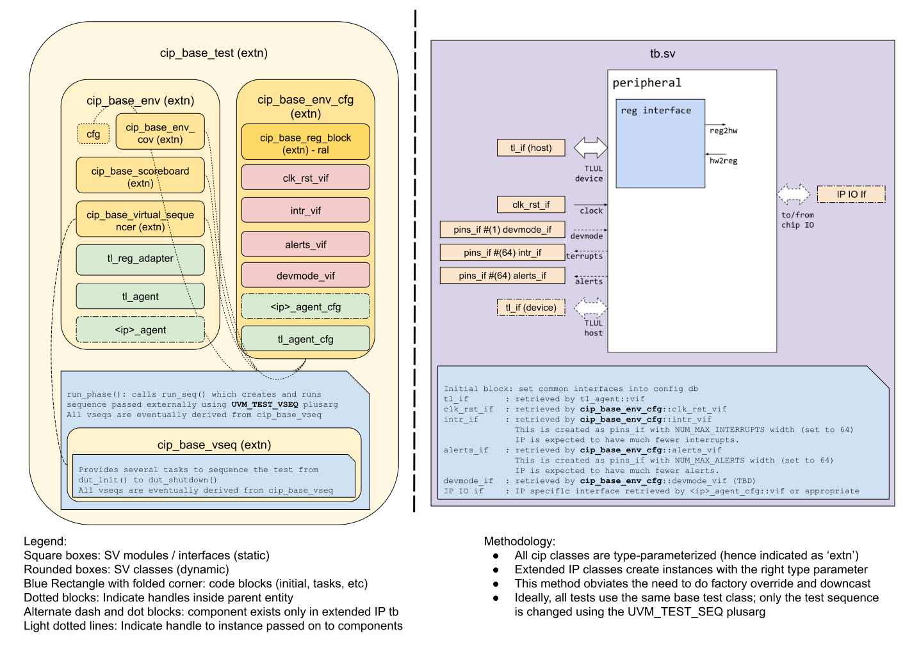

# Comportable IP Testbench Architecture

## Overview
Going along the lines of what it takes to design an IP that adheres to the
[Comportability Specifications](../../../../doc/contributing/hw/comportability/README.md),
we attempt to standardize the DV methodology for developing the IP level
testbench environment as well by following the same approach. This document describes
the Comportable IP (CIP) library, which is a complete UVM environment framework that
each IP level environment components can extend from to get started with DV. The goal
here is to maximize code reuse across all test benches so that we can improve the
efficiency and time to market. The features described here are not exhaustive,
so it is highly recommended to the reader that they examine the code directly. In
course of development, we also periodically identify pieces of verification logic that
might be developed for one IP but is actually a good candidate to be added to
these library classes instead. This doc is instead intended to provide the user
a foray into what these are and how are the meant to be used.


## CIP environment block diagram


## CIP library classes
The CIP library includes the base ral model, env cfg object, coverage
object, virtual sequencer, scoreboard, env, base virtual sequence and finally
the test class. To achieve run-time polymorphism, these classes are type
parameterized to indicate what type of child objects are to be created. In the
IP environments, the extended classes indicate the correct type parameters.

### cip_base_env_cfg
This class is intended to contain all of the settings, knobs, features, interface
handles and downstream agent cfg handles. Features that are common to all IPs in
accordance with the comportability spec are made a part of this base class, while the
extended IP env cfg class will contain settings specific to that IP. An instance of
the env cfg class is created in `cip_base_test::build_phase` and the handle is
passed over uvm_config_db for the CIP env components to pick up. This allows
the handle to the env cfg object to be available in the env's build_phase. Settings
in the env cfg can then be used to configure the env based on the test needs.

A handle to this class instance is passed on to the scoreboard, virtual
sequencer and coverage objects so that all such common settings and features
are instantly accessible everywhere.

This class is type parameterized in the following way:
```systemverilog
class cip_base_env_cfg #(type RAL_T = dv_base_reg_block) extends uvm_object;
```
The IP env cfg class will then extend from this class with the RAL_T parameter set
to the actual IP RAL model class. This results in IP RAL model getting factory
overridden automatically in the base env cfg itself during creation, so there is no
need for manual factory override. We follow the same philosophy in all CIP library
classes.

The following is a list of common features and settings:
* **clk_rst_if**: A handle to the clk_rst_if that controls the main clk and reset
  to the DUT.
* **intr_vif**: This is a handle to the `pins_if #(NUM_MAX_INTERRUPTS=64)` interface
  instance created in the tb to hookup the DUT interrupts. The actual number of
  interrupts might be much less than 64, but that is ok - we just connect as
  many as the DUT provides. The reason for going with a fixed width pins_if is
  to allow the intr_vif to be available in this base env cfg class (which does not
  know how many interrupt each IP DUT provides).
* **tl_agent_cfg**: The downstream TileLink host agent created in the cip_base_env
  class requires the agent cfg handle to tell it how to configure the agent.
* **alert_agent_cfgs**: Similar to tl_agent_cfg, the downstream alert device agent
  created in the cip_base_env class requires the agent cfg handles to tell it how to
  configure the agent. In default, alert agent is configured in device mode,
  asynchronous, active and the ping coverage is turned off.
* **ral**: This is the instance to the auto-generated RAL model that is
  extended from `dv_base_reg_block`. In the base class, this is created using
  the RAL_T class parameter which the extended IP env cfg class sets correctly.
* **tl_intg_alert_name**: Name of the alert that will be triggered on  TLUL
  integrity error detection. The default name used for this type of alert is
  "fatal_fault". The block may use a different name too - in that case, please
  update this member to reflect the correct name in the `initialize()` method.
* **tl_intg_alert_fields**: An associative array of CSR fields keyed with the
  objection handle of the corresponding CSR field and valued with the expected
  value. This is the list of CSR fields that are modified when an alert triggers
  due to TL integrity violation event. The DV user is required to build this list
  in the `initialize()` method after `super.initialize(csr_base_addr);`
```systemverilog
virtual function void initialize(bit [31:0] csr_base_addr = '1);
  super.initialize(csr_base_addr); // ral model is created in `super.initialize`
  tl_intg_alert_fields[ral.a_status_reg.a_field] = value;
```

Apart from these, there are several common settings such as `zero_delays`,
`clk_freq_mhz`, which are randomized as well as knobs such as `en_scb` and
`en_cov` to turn on/off scoreboard and coverage collection respectively.

Another setting that can be configured is `can_reset_with_csr_accesses`. This
should be set to true by environments for IPs that support resets when CSR
accesses are in flight. For this to work properly, the environment must avoid
checking correctness of CSR reads if a reset happens while the read is in
progress. Any vseqs must also make sure to complete when a reset is asserted.
This flag governs the behaviour of `run_seq_with_rand_reset_vseq`, described
below.

The base class provides a virtual method called `initialize()` which is called
in `cip_base_test::build_phase` to create some of the objects listed above. If
the extended IP env cfg class has more such objects added,  then the `initialize()`
method is required to be overridden to create those objects as well.

We make all downstream interface agent cfg handles as a part of IP extension of
cip_base_env_cfg so that all settings for the env and all downstream agents are
available within the env cfg handle. Since the env cfg handle is passed to all cip
components, all those settings are also accessible.

### cip_base_env_cov
This is the base coverage object that contain all functional coverpoints and
covergroups. The main goal is to have all functional coverage elements
implemented in a single place. This class is extended from `uvm_component`
so that it allows items to be set via `'uvm_config_db` using the component's
hierarchy. This is created in cip_base_env and a handle to it is passed to the
scoreboard and the virtual sequencer. This allows coverage to be sampled in
scoreboard as well as the test sequences.

This class is type parameterized with the env cfg class type `CFG_T` so that it
can derive coverage on some of the env cfg settings.
```systemverilog
class cip_base_env_cov #(type CFG_T = cip_base_env_cfg) extends uvm_component;
```

The following covergroups are defined outside of the class for use by all IP
testbenches:
* `intr_cg`: Covers individual and cross coverage on intr_enable and intr_state for all interrupts in IP
* `intr_test_cg`: Covers intr_test coverage and its cross with intr_enable and intr_state for all interrupts in IP
* `intr_pins_cg`: Covers values and transitions on all interrupt output pins of IP
* `sticky_intr_cov`: Covers sticky interrupt functionality of all applicable interrupts in IP

Covergroups `intr_cg`, `intr_test_cg` and `intr_pins_cg` are instantiated
and allocated in `cip_base_env_cov` by default in all IPs.
On the other hand, `sticky_intr_cov` is instantiated with string key.
The string key represents the interrupts names that are sticky. This is specific
to each IP and is required to be created and instantiated in extended `cov` class.

### cip_base_virtual_sequencer
This is the base virtual sequencer class that contains a handle to the
`tl_sequencer` to allow layered test sequences to be created. The extended IP
virtual sequencer class will include handles to the IP specific agent
sequencers.

This class is type-parameterized with the env cfg class type `CFG_T` and coverage
class type `COV_T` so that all test sequences can access the env cfg settings and
sample the coverage via the `p_sequencer` handle.
```systemverilog
class cip_base_virtual_sequencer #(type CFG_T = cip_base_env_cfg,
                                   type COV_T = cip_base_env_cov) extends uvm_sequencer;
```

### cip_base_scoreboard
This is the base scoreboard component that already connects with the TileLink
agent monitor to grab tl packets via analysis port at the address and the data
phases. It provides a virtual task called `process_tl_access` that the extended
IP scoreboard needs to implement. Please see code for additional details. The
extended IP scoreboard class will connect with the IP-specific interface monitors
if applicable to grab items from those analysis ports.

This class is type-parameterized with the env cfg class type `CFG_T`, ral class
type `RAL_T` and the coverage class type `COV_T`.
```systemverilog
class cip_base_scoreboard #(type RAL_T = dv_base_reg_block,
                            type CFG_T = cip_base_env_cfg,
                            type COV_T = cip_base_env_cov) extends uvm_component;
```
There are several virtual tasks and functions that are to be overridden
in extended IP scoreboard class. Please take a look at the code for more
details.

### cip_base_env
This is the base UVM env that puts all of the above components together
and creates and makes connections across them. In the build phase, it retrieves
the env cfg class type handle from `uvm_config_db` as well as all the virtual
interfaces (which are actually part of the env cfg class). It then uses the env
cfg settings to modify the downstream agent cfg settings as required. All of
the above components are created based on env cfg settings, along with the TileLink
host agent and alert device agents if the module has alerts. In the connect phase,
the scoreboard connects with the monitor within the TileLink agent to be able to
grab packets from the TL interface during address and the data phases. The scoreboard
also connects the alert monitor within the alert_esc_agent to grab packets
regarding alert handshake status. In the end of elaboration phase, the ral
model within the env cfg handle is locked and the ral sequencer and adapters are
set to be used with the TileLink interface.

This class is type parameterized with env cfg class type CFG_T, coverage class type
`COV_T`, virtual sequencer class type `VIRTUAL_SEQUENCER_T` and scoreboard class
type `SCOREBOARD_T`.
```systemverilog
class cip_base_env #(type CFG_T               = cip_base_env_cfg,
                     type VIRTUAL_SEQUENCER_T = cip_base_virtual_sequencer,
                     type SCOREBOARD_T        = cip_base_scoreboard,
                     type COV_T               = cip_base_env_cov) extends uvm_env;
```

### cip_base_vseq
This is the base virtual sequence class that will run on the cip virtual
sequencer. This base class provides 'sequencing' set of tasks such as
`dut_init()` and `dut_shutdown()` which are called within `pre_start` and
`post_start` respectively. This sequence also provides an array of
sub-sequences some of which are complete tests within themselves, but
implemented as tasks. The reason for doing so is SystemVerilog does not
support multi-inheritance so all sub-sequences that are identified as being
common to all IP benches implemented as tasks in this base virtual sequence class.
Some examples:
* **task run_csr_vseq_wrapper**: This is a complete CSR test suite in itself -
  Extended IP CSR vseq can simply call this in the body. This is paired with a
  helper function `add_csr_exclusions`.
* **function add_csr_exclusions**: This is extended in the IP CSR vseq to add
  exclusions when running the CSR suite of tests.
* **task tl_access**: This is a common generic task to create a read or a write
  access over the TileLink host interface.
* **task cfg_interrupts, check_interrupts**: All interrupt CSRs are standardized
  according to the comportability spec, which allows us to create common tasks
  to turn on / off interrupts as well as check them.
* **task run_tl_errors_vseq**: This task will test all kinds of TileLink error
  cases, including unmapped address error, protocol error, memory access error
  etc. All the items sent in this task will trigger d_error and won't change the
  CSR/memory value.
* **task run_tl_intg_err_vseq**: This task will test TLUL integrity error. It contains
  2 parallel threads. The first one invokes the `csr_rw` seq to drive random, legal
  CSR accesses. The second drives a bad TLUL transaction that violates the payload
  integrity. The bad packet is created by corrupting upto 3 bits either in the integrity
  (ECC) fields (`a_user.cmd_intg`, `a_user.d_intg`), or in their corresponding command /
  data payload itself. The sequence then verifies that the DUT not only returns an error
  response (with `d_error` = 1), but also triggers a fatal alert and updates status CSRs
  such as `ERR_CODE`. The list of CSRs that are impacted by this alert event, maintained
  in `cfg.tl_intg_alert_fields`, are also checked for correctness.
* **task run_seq_with_rand_reset_vseq**: This task runs a provided sequence
  while injecting TL errors with `run_tl_errors_vseq`. After a randomised wait,
  it injects a reset. Once the reset is complete, it reads all the CSRs to check
  that they contain their expected reset values.

  The provided sequence must make sure not to drive a reset itself. The reset
  that would be driven in `dut_init` is disabled in this task by setting the
  sequence's `do_apply_reset` value to zero, but this behaviour needs to be
  passed on to any sub-sequence that it wishes to spawn by ensuring that they
  also have `do_apply_reset=0`. An example from `hmac_stress_all_vseq.sv`:
  ```
  // randomly trigger internal dut_init reset sequence
  // disable any internal reset if used in stress_all_with_rand_reset vseq
  if (do_dut_init) hmac_vseq.do_dut_init = $urandom_range(0, 1);
  else hmac_vseq.do_dut_init = 0;
  ```

  The exact mechanism for injecting this reset is configured by the
  `can_reset_with_csr_accesses` flag from `cip_base_env_cfg` (described
  elsewhere in this document). If the flag is false, the task is careful to wait
  until there are no outstanding CSR accesses before it injects the reset. It
  then injects the reset and uses `disable fork` to kill the sequence that was
  being run.

  If the flag is true, the task injects the reset at any time it feels
  appropriate. It then asserts that the sequence that was running has run to
  completion before the reset is de-asserted, which means it does not need to
  kill the process.
* **task run_same_csr_outstanding_vseq**: This task tests the same CSR with
  non-blocking accesses as the regular CSR sequences don't cover that due to
  limitation of uvm_reg.
* **task run_mem_partial_access_vseq**: This task tests the partial access to the
  memories by randomizing mask, size, and the 2 LSB bits of the address. It also runs
  with non-blocking access enabled.

This class is type parameterized with the env cfg class type `CFG_T`, ral class type
`RAL_T` and the virtual sequencer class type `VIRTUAL_SEQUENCER_T` so that the
env cfg settings, the ral CSRs are accessible and the `p_sequencer` type can be
declared.

```systemverilog
class cip_base_vseq #(type RAL_T               = dv_base_reg_block,
                      type CFG_T               = cip_base_env_cfg,
                      type COV_T               = cip_base_env_cov,
                      type VIRTUAL_SEQUENCER_T = cip_base_virtual_sequencer) extends uvm_sequence;
```
All virtual sequences in the extended IP will eventually extend from this class and
can hence, call these tasks and functions directly as needed.

### cip_base_test
This basically creates the IP UVM env and its env cfg class instance. Any env cfg
setting that may be required to be controlled externally via plusargs are looked
up here, before the env instance is created. This also sets a few variables that
pertain to how / when should the test exit on timeout or failure. In the run
phase, the test calls `run_seq` which basically uses factory to create the
virtual sequence instance using the `UVM_TEST_SEQ` string that is passed via
plusarg. As a style guide, it is preferred to encapsulate a complete test within
a virtual sequence and use the same `UVM_TEST` plusarg for all of the tests (which
points to the extended IP test class), and only change the `UVM_TEST_SEQ` plusarg.

This class is type parameterized with the env cfg class type `CFG_T` and the env
class type `ENV_T` so that when extended IP test class creates the env and env cfg
specific to that IP.
```systemverilog
class cip_base_test #(type CFG_T = cip_base_env_cfg,
                      type ENV_T = cip_base_env) extends uvm_test;
```

### cip_tl_seq_item
This is extended class of tl_seq_item to generate correct integrity values in
`a_user` and `d_user`.

## Extending from CIP library classes
Let's say we are verifying an actual comportable IP `uart` which has `uart_tx`
and `uart_rx` interface. User then develops the `uart_agent` to be able to talk
to that interface. User invokes the `ralgen` tool to generate the `uart_reg_block`,
and then starts developing UVM environment by extending from the CIP library
classes in the following way.

### uart_env_cfg
```systemverilog
class uart_env_cfg extends cip_base_env_cfg #(.RAL_T(uart_reg_block));
```
User adds the `uart_agent_cfg` object as a member so that it remains as a
part of the env cfg and can be accessed everywhere. In the base class's
`initialize()` function call, an instance of `uart_reg_block` is created, not
the `dv_base_reg_block`, since we override the `RAL_T` type.

### uart_env_cov
```systemverilog
class uart_env_cov extends cip_base_env_cov #(.CFG_T(uart_env_cfg));
```
User adds `uart` IP specific coverage items and uses the `cov` handle in
scoreboard and test sequences to sample the coverage.

### uart_virtual_sequencer
```systemverilog
class uart_virtual_sequencer extends cip_base_virtual_sequencer #(.CFG_T(uart_env_cfg),
                                                                  .COV_T(uart_env_cov));
```
User adds the `uart_sequencer` handle to allow layered test sequences
to send traffic to / from TileLink as well as `uart` interfaces.

### uart_scoreboard
```systemverilog
class uart_scoreboard extends cip_base_scoreboard #(.CFG_T(uart_env_cfg),
                                                    .RAL_T(uart_reg_block),
                                                    .COV_T(uart_env_cov));
```
User adds analysis ports to grab packets from the `uart_monitor` to
perform end-to-end checking.

### uart_env
```systemverilog
class uart_env extends cip_base_env #(.CFG_T               (uart_env_cfg),
                                      .COV_T               (uart_env_cov),
                                      .VIRTUAL_SEQUENCER_T (uart_virtual_sequencer),
                                      .SCOREBOARD_T        (uart_scoreboard));
```
User creates `uart_agent` object in the env and use it to connect with the
virtual sequencer and the scoreboard. User also uses the env cfg settings to
manipulate the uart agent cfg settings if required.

### uart_base_vseq
```systemverilog
class uart_base_vseq extends cip_base_vseq #(.CFG_T               (uart_env_cfg),
                                             .RAL_T               (uart_reg_block),
                                             .COV_T               (uart_env_cov),
                                             .VIRTUAL_SEQUENCER_T (uart_virtual_sequencer));
```
User adds a base virtual sequence as a starting point and adds common tasks and
functions to perform `uart` specific operations. User then extends from
`uart_base_vseq` to add layered test sequences.

### uart_base_test
```systemverilog
class uart_base_test extends cip_base_test #(.ENV_T(uart_env), .CFG_T(uart_env_cfg));
```
User sets `UVM_TEST` plus arg to `uart_base_test` so that all tests create the UVM env
that is automatically tailored to UART IP. Each test then sets the
`UVM_TEST_SEQ` plusarg to run the specific test sequence, along with additional
plusargs as required.

## Configure Alert Device Agent from CIP library classes

To configure alert device agents in a block level testbench environment that is extended
from this CIP library class, please follow the steps below:
* **${ip_name}_env_pkg.sv**: Add parameter `LIST_OF_ALERTS[]` and `NUM_ALERTS`.
  Please make sure the alert names and order are correct.
  For example in `otp_ctrl_env_pkg.sv`:
  ```systemverilog
  parameter string LIST_OF_ALERTS[] = {"fatal_macro_error", "fatal_check_error"};
  parameter uint NUM_ALERTS         = 2;
  ```
* **${ip_name}_env_cfg.sv**: In function `initialize()`, assign `LIST_OF_ALERTS`
  parameter to `list_of_alerts` variable which is created in `cip_base_env_cfg.sv`.
  Note that this assignment should to be written before calling `super.initialize()`,
  so that creating alert host agents will take the updated `list_of_alerts` variable.
  For example in `otp_ctrl_env_cfg.sv`:
  ```systemverilog
  virtual function void initialize(bit [31:0] csr_base_addr = '1);
    list_of_alerts = otp_ctrl_env_pkg::LIST_OF_ALERTS;
    super.initialize(csr_base_addr);
  ```
* **tb.sv**: Add `DV_ALERT_IF_CONNECT` macro that declares alert interfaces,
  connect alert interface wirings with DUT, and set alert_if to uvm_config_db.
  Then connect alert_rx/tx to the DUT ports.
  For example in otp_ctrl's `tb.sv`:
  ```systemverilog
  `DV_ALERT_IF_CONNECT()
  otp_ctrl dut (
    .clk_i                      (clk        ),
    .rst_ni                     (rst_n      ),
    .alert_rx_i                 (alert_rx   ),
    .alert_tx_o                 (alert_tx   ),
  ```
Note that if the testbench is generated from `uvmdvgen.py`, using the `-hr` switch
will automatically generate the skeleton code listed above for alert device agent.
Details on how to use `uvmdvgen.py` please refer to the
[uvmdvgen document](../../../../util/uvmdvgen/README.md).

## CIP Testbench

The block diagram above shows the CIP testbench architecture, that puts
together the static side `tb` which instantiates the `dut`, and the dynamic
side, which is the UVM environment extended from CIP library. The diagram
lists some common items that need to be instantiated in `tb`
and set into `uvm_config_db` for the testbench to work.

## Security Verification in cip_lib
CIP contains reusable security verification components, sequences and function coverage.
This section describes the details of them and the steps to enable them.

### Security Verification for bus integrity
The countermeasure of bus integrity can be fully verified via importing [tl_access_tests](https://github.com/lowRISC/opentitan/blob/master/hw/dv/tools/dvsim/tests/tl_access_tests.hjson) and [tl_device_access_types_testplan](https://github.com/lowRISC/opentitan/blob/master/hw/dv/tools/dvsim/testplans/tl_device_access_types_testplan.hjson).
The `tl_intg_err` test injects errors on control, data, or the ECC bits and verifies that the integrity error will trigger a fatal alert (provided via `cfg.tl_intg_alert_name`) and error status (provided via `cfg.tl_intg_alert_fields`) is set.
Refer to section [cip_base_env_cfg](#cip_base_env_cfg) for more information on these 2 variables.
The user may update these 2 variables as follows.
```systemverilog
class ip_env_cfg extends cip_base_env_cfg #(.RAL_T(ip_reg_block));
  virtual function void initialize(bit [31:0] csr_base_addr = '1);
    super.initialize(csr_base_addr);
    tl_intg_alert_name = "fatal_fault_err";
    // csr / field name may vary in different IPs
    tl_intg_alert_fields[ral.fault_status.intg_err] = 1;
```

### Security Verification for memory integrity
The memory integrity countermeasure stores the data integrity in the memory rather than generating the integrity on-the-fly during a read.
The [passthru_mem_intg_tests](https://github.com/lowRISC/opentitan/blob/master/hw/dv/tools/dvsim/tests/passthru_mem_intg_tests.hjson) can fully verify this countermeasure.
The details of the test sequences are described in the [tl_device_access_types_testplan](https://github.com/lowRISC/opentitan/blob/master/hw/dv/tools/dvsim/testplans/passthru_mem_intg_testplan.hjson). Users need to override the task `inject_intg_fault_in_passthru_mem` to inject an integrity fault to the memory in the block common_vseq.

The following is an example from `sram_ctrl`, in which it flips up to `MAX_TL_ECC_ERRORS` bits of the data and generates a backdoor write to the memory.
```systemverilog
class sram_ctrl_common_vseq extends sram_ctrl_base_vseq;
  ...
  virtual function void inject_intg_fault_in_passthru_mem(dv_base_mem mem,
                                                          bit [bus_params_pkg::BUS_AW-1:0] addr);
    bit[bus_params_pkg::BUS_DW-1:0] rdata;
    bit[tlul_pkg::DataIntgWidth+bus_params_pkg::BUS_DW-1:0] flip_bits;

    rdata = cfg.mem_bkdr_util_h.sram_encrypt_read32_integ(addr, cfg.scb.key, cfg.scb.nonce);

    `DV_CHECK_STD_RANDOMIZE_WITH_FATAL(flip_bits,
        $countones(flip_bits) inside {[1:cip_base_pkg::MAX_TL_ECC_ERRORS]};)

    `uvm_info(`gfn, $sformatf("Backdoor change mem (addr 0x%0h) value 0x%0h by flipping bits %0h",
                              addr, rdata, flip_bits), UVM_LOW)

    cfg.mem_bkdr_util_h.sram_encrypt_write32_integ(addr, rdata, cfg.scb.key, cfg.scb.nonce,
                                                   flip_bits);
  endfunction
endclass
```

### Security Verification for shadow CSRs
The countermeasure of shadow CSRs can be fully verified via importing [shadow_reg_errors_tests](https://github.com/lowRISC/opentitan/blob/master/hw/dv/tools/dvsim/tests/shadow_reg_errors_tests.hjson) and [shadow_reg_errors_testplan](https://github.com/lowRISC/opentitan/blob/master/hw/dv/tools/dvsim/testplans/shadow_reg_errors_testplan.hjson).
The details of the test sequences are described in the testplan. Users need to assign the status CSR fields to `cfg.shadow_update_err_status_fields` and `cfg.shadow_storage_err_status_fields` for update error and storage error respectively.
```systemverilog
class ip_env_cfg extends cip_base_env_cfg #(.RAL_T(ip_reg_block));
  virtual function void initialize(bit [31:0] csr_base_addr = '1);
    super.initialize(csr_base_addr);
    // csr / field name may vary in different IPs
    shadow_update_err_status_fields[ral.err_code.invalid_shadow_update] = 1;
    shadow_storage_err_status_fields[ral.fault_status.shadow] = 1;
```

### Security Verification for REGWEN CSRs
If the REGWEN CSR meets the following criteria, it can be fully verified by the common [csr_tests](https://github.com/lowRISC/opentitan/blob/master/hw/dv/tools/dvsim/tests/csr_tests.hjson).
 - The REGWEN CSR and its related lockable CSRs are HW read-only registers.
 - The related lockable CSRs are not WO type, otherwise the read value is always 0 and CSR tests can't really verify if the write value is taken or not.
 - No CSR exclusions have been added to the REGWEN CSR and its related lockable CSRs.
If not, users need to write a test to verify it separately since cip_lib and dv_base_reg can't predict its value.
For example, the [sram_ctrl_regwen_vseq](https://github.com/lowRISC/opentitan/blob/master/hw/ip/sram_ctrl/dv/env/seq_lib/sram_ctrl_regwen_vseq.sv) has been added to verify `ctrl_regwen` and the lockable register `ctrl` since `ctrl` is a `WO` register and excluded in CSR tests.

Functional coverage for REGWEN CSRs and their related lockable CSRs is generated automatically in dv_base_reg.
The details of functional coverage is described in [csr_testplan](https://github.com/lowRISC/opentitan/blob/master/hw/dv/tools/dvsim/testplans/csr_testplan.hjson).

### Security Verification for MUBI type CSRs
A functional covergroup of MUBI type CSR is automatically created in the RAL model for each MUBI CSR, which ensures `True`, `False` and at least N of other values (N = width of the MUBI type) have been collected.
This covergroup won't be sampled in CSR tests, since CSR tests only test the correctness of the value of register read / write but it won't check the block behavior when a different value is supplied to the MUBI CSR.
Users should randomize the values of all the MUBI CSRs in non-CSR tests and check the design behaves correctly.
The helper functions `cip_base_pkg::get_rand_mubi4|8|12|16_val(t_weight, f_weight, other_weight)` can be used to get the random values.

### Security Verification for MUBI/LC_TX type ports
In OpenTitan [Design Verification Methodology](../../../../doc/contributing/dv/methodology/README.md), it's mandatory to have 100% toggle coverage on all the ports.
However, the MUBI defined values (`True` and `False`) are complement numbers.
If users only test with `True` and `False` without using other values, toggle coverage can be 100%.
Hence, user should add a functional covergroup for each MUBI type input port, via binding the interface `cip_mubi_cov_if` which contains a covergroup for MUBI.
The type `lc_ctrl_pkg::lc_tx_t` is different than the Mubi4 type, as its defined values are different.
So, it needs to be bound with the interface `cip_lc_tx_cov_if`.
The helper functions `cip_base_pkg::get_rand_mubi4|8|12|16_val(t_weight, f_weight, other_weight)` and `cip_base_pkg::get_rand_lc_tx_val` can be used to get the random values.

The following is an example from `sram_ctrl`, in which it binds the coverage interface to 2 MUBI input ports.
```systemverilog
module sram_ctrl_cov_bind;

  bind sram_ctrl cip_mubi_cov_if #(.Width(4)) u_hw_debug_en_mubi_cov_if (
    .rst_ni (rst_ni),
    .mubi   (lc_hw_debug_en_i)
  );

  bind sram_ctrl cip_lc_tx_cov_if u_lc_escalate_en_cov_if (
    .rst_ni (rst_ni),
    .val    (lc_escalate_en_i)
  );
endmodule
```
Note: The `sim_tops` in sim_cfg.hjson should be updated to include this bind file.

### Security Verification for common countermeasure primitives
A [security countermeasure verification framework](../../../../doc/contributing/dv/sec_cm_dv_framework/README.md) is implemented in cip_lib to verify common countermeasure primitives in a semi-automated way.

#### Design Verification
cip_lib imports [sec_cm_pkg](https://github.com/lowRISC/opentitan/tree/master/hw/dv/sv/sec_cm), which automatically locates all the common countermeasure primitives and binds an interface to each of them.
In the cib_base_vseq, it injects a fault to each of these primitives and verifies that the fault will lead to a fatal alert.
The details of the sequences can be found in testplans - [sec_cm_count_testplan](https://github.com/lowRISC/opentitan/blob/master/hw/dv/tools/dvsim/testplans/sec_cm_count_testplan.hjson), [sec_cm_fsm_testplan](https://github.com/lowRISC/opentitan/blob/master/hw/dv/tools/dvsim/testplans/sec_cm_fsm_testplan.hjson) and [sec_cm_double_lfsr_testplan](https://github.com/lowRISC/opentitan/blob/master/hw/dv/tools/dvsim/testplans/sec_cm_double_lfsr_testplan.hjson).
If the block uses common security countermeasure primitives (prim_count, prim_sparse_fsm_flop, prim_double_lfsr), users can enable this sequence to fully verify them via following steps.

1. Import the applicable sec_cm testplans.
If more checks or sequences are needed, add another testpoint in the block testplan.
For example, when the fault is detected by countermeasure, some subsequent operations won’t be executed.
Add a testpoint in the testplan to capture this sequence and the checks.

2. Import [sec_cm_tests](https://github.com/lowRISC/opentitan/blob/master/hw/dv/tools/dvsim/tests/sec_cm_tests.hjson) in sim_cfg.hjson file, as well as add applicable sec_cm bind files for `sim_tops`.
The `ip_sec_cm` test will be added and all common countermeasure primitives will be verified in this test.

```
sim_tops: ["ip_ctrl_bind", "ip_ctrl_cov_bind",
           // only add the corresponding bind file if DUT has the primitive
           "sec_cm_prim_sparse_fsm_flop_bind",
           "sec_cm_prim_count_bind",
           "sec_cm_prim_double_lfsr_bind"]
```

3. Import sec_cm_pkg in the env_pkg
```systemverilog
package ip_env_pkg;
  import uvm_pkg::*;
  import sec_cm_pkg::*;
  …
```

4. Set alert name for countermeasure if the alert name is different from the default name - “fatal_fault”.
```systemverilog
class ip_env_cfg extends cip_base_env_cfg #(.RAL_T(ip_reg_block));
  virtual function void initialize(bit [31:0] csr_base_addr = '1);
    super.initialize(csr_base_addr);
    sec_cm_alert_name = "fatal_check_error";
```

5. Override the `check_sec_cm_fi_resp` task in ip_common_vseq to add additional sequences and checks after fault injection.
This is an example from keymgr, in which CSR `fault_status` will be updated according to the location of the fault and the operation after fault inject will lead design to enter `StInvalid` state.
```systemverilog
class keymgr_common_vseq extends keymgr_base_vseq;
  virtual task check_sec_cm_fi_resp(sec_cm_base_if_proxy if_proxy);
    bit[TL_DW-1:0] exp;

    super.check_sec_cm_fi_resp(if_proxy);

    case (if_proxy.sec_cm_type)
      SecCmPrimCount: begin
        // more than one prim_count are used, distinguishing them through the path of the primitive.
        if (!uvm_re_match("*.u_reseed_ctrl*", if_proxy.path)) begin
          exp[keymgr_pkg::FaultReseedCnt] = 1;
        end else begin
          exp[keymgr_pkg::FaultCtrlCnt] = 1;
        end
      end
      SecCmPrimSparseFsmFlop: begin
        exp[keymgr_pkg::FaultCtrlFsm] = 1;
      end
      default: `uvm_fatal(`gfn, $sformatf("unexpected sec_cm_type %s", if_proxy.sec_cm_type.name))
    endcase
    csr_rd_check(.ptr(ral.fault_status), .compare_value(exp));

    // after an advance, keymgr should enter StInvalid
    keymgr_advance();
    csr_rd_check(.ptr(ral.op_status), .compare_value(keymgr_pkg::OpDoneFail));
    csr_rd_check(.ptr(ral.working_state), .compare_value(keymgr_pkg::StInvalid));
  endtask : check_sec_cm_fi_resp
```

6. Fault injection may trigger unexpected SVA errors. Override the `sec_cm_fi_ctrl_svas` function to disable them. `sec_cm_fi_ctrl_svas(.enable(1))` will be invoked before injecting fault. After reset, `sec_cm_fi_ctrl_svas(.enable(0))` will be called to re-enable the SVA checks.
```systemverilog
class keymgr_common_vseq extends keymgr_base_vseq;
   virtual function void sec_cm_fi_ctrl_svas(sec_cm_base_if_proxy if_proxy, bit enable);
    case (if_proxy.sec_cm_type)
      SecCmPrimCount: begin
        if (enable) begin
          $asserton(0, "tb.keymgr_kmac_intf");
          $asserton(0, "tb.dut.tlul_assert_device.gen_device.dDataKnown_A");
          $asserton(0, "tb.dut.u_ctrl.DataEn_A");
          $asserton(0, "tb.dut.u_ctrl.DataEnDis_A");
          $asserton(0, "tb.dut.u_ctrl.CntZero_A");
          $asserton(0, "tb.dut.u_kmac_if.LastStrb_A");
          $asserton(0, "tb.dut.KmacDataKnownO_A");
        end else begin
          $assertoff(0, "tb.keymgr_kmac_intf");
          $assertoff(0, "tb.dut.tlul_assert_device.gen_device.dDataKnown_A");
          $assertoff(0, "tb.dut.u_ctrl.DataEn_A");
          $assertoff(0, "tb.dut.u_ctrl.DataEnDis_A");
          $assertoff(0, "tb.dut.u_ctrl.CntZero_A");
          $assertoff(0, "tb.dut.u_kmac_if.LastStrb_A");
          $assertoff(0, "tb.dut.KmacDataKnownO_A");
        end
      end
      SecCmPrimSparseFsmFlop: begin
        // No need to disable any assertion
      end

      default: `uvm_fatal(`gfn, $sformatf("unexpected sec_cm_type %s", if_proxy.sec_cm_type.name))
    endcase
  endfunction: sec_cm_fi_ctrl_svas
```

#### Formal Verification
Please refer to [formal document](../../../formal/README.md) on how to create a FPV environment for common countermeasures.
