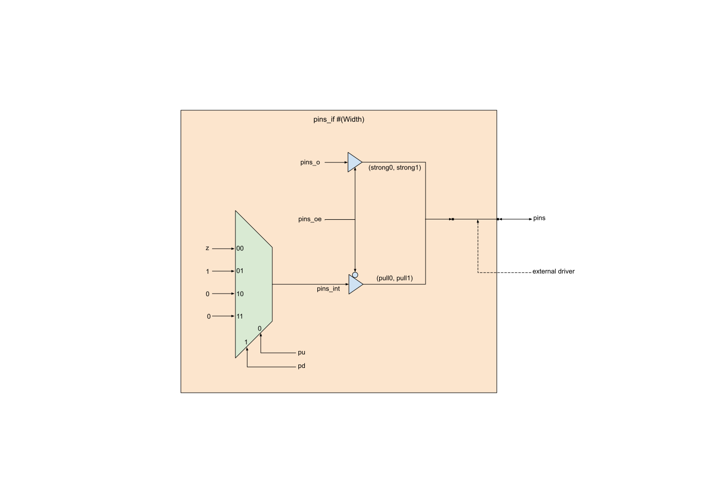

# Common interfaces


## Overview
In this directory, we provide commonly used interfaces used to construct
testbenches for DV. These interfaces are instantiated inside `tb` module for
connecting dut signals. They are described in detail below.

### `clk_if`
This is a passive clock interface that is used to wait for clock events in
testbenches. This interface has two clocking blocks, `cb` and `cbn`, for
synchronizing to positive and negative clock edges, respectively. The interface
also has the following tasks:
* `wait_clks`: waits for specified number of positive clock edges
* `wait_n_clks`: waits for specified number of negative clock edges

### `clk_rst_if`

Unlike `clk_if`, this interface can generate a clock and a reset signal. These
are connected as `inout` signals and the interface observes them passively
unless the `set_active` function is called.

Just like `clk_if`, this interface has clocking blocks `cb` and `cbn`, together
with `wait_clks` and `wait_n_clks` utility tasks. It also has
* `wait_for_reset`: wait for a reset signalled on `rst_n`

To generate a clock signal, call `set_active` at the start of the simulation.
This is typically called from an `initial` block in the testbench. To configure
the frequency and duty cycle of the generated clock, use the following
functions:
* `set_freq_mhz` / `set_freq_khz`: set the clock frequency in MHz / KHz. This
  is 50MHz by default.
* `set_period_ps`: set the clock period in picoseconds. This is 20_000ps by default
  (giving a clock period of 50MHz).
* `set_duty_cycle`: set the duty cycle (as a percentage: 1 - 99). This is 50 by
  default.

The clock can also have jitter added. This is generated as an offset in
picoseconds added to randomly selected clock half-periods. It can be enabled
and configured with:
* `set_jitter_chance_pc`: set the percentage probability of adding a jitter to
  a given half-period. By default, this is 0 and the clock has no jitter.
* `set_max_jitter_ps`: set the maximum jitter to add to each clock half-period
  in picoseconds. This is 1000ps (1 ns) by default.

To start and stop the clock or apply a reset, use the following tasks. These
will have no effect if `set_active` has not been called.
* `start_clk`: start the clock. The clock is started by default, so this
  task is only needed after a call to `stop_clk`.
* `stop_clk`: stop / gate the clk
* `apply_reset`: signal a reset on `rst_n`. The length of this reset and
  whether it is synchronous or not can be configured with arguments to the
  function.

### `pins_if`

This parameterized interface provides the ability to drive or sample any signal
in the DUT.

```systemverilog
interface pins_if #(
  parameter int Width = 1
) (
  inout [Width-1:0] pins
);
```

By default, it behaves as a passive interface. The values of the pins can be
read with the following functions:
* `sample`: sample and return all the pin values
* `sample_pin`: sample just the given pin

The interface can also be configured to drive, pull up, or pull down its
outputs. To do this, call
* `drive` / `drive_pin`: Drive the output to the given value.
* `drive_en` / `drive_en_pin`: Configure output enable; when enabled, this
  drives value previously stored by a call to `drive` or `drive_pin`.
* `set_pullup_en` / `set_pullup_en_pin`: Configure pull-up setting. If true and
  output enable is false, drives the output to `1`.
* `set_pulldown_en` / `set_pulldown_en_pin`: Configure pull-down setting. If
  true and both output_enable and pull-up are false, drives the output to `0`.

The diagram below gives a schematic view of `pins_if`. The driver shown is
replicated for each bit.


