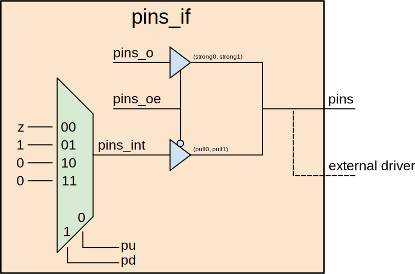

# Common interfaces


## Overview
In this directory, we provide commonly used interfaces used to construct
testbenches for DV. These interfaces are instantiated inside `tb` module for
connecting dut signals. They are described in detail below.

### `clk_if`
This is a passive clock interface that is used to wait for clock events in
testbenches.
This interface has two clocking blocks: `cb` and `cbn` for synchronizing to
positive and negative clock edges. This interface consists of following tasks:
* `wait_clks`: waits for specified number of positive clock edges
* `wait_n_clks`: waits for specified number of negative clock edges

### `clk_rst_if`
This interface provides the ability to drive / sample clock and reset signal.
It provides various methods related to clock and reset generation. These
methods can be categorized into `setup methods` and `drive / sample` methods.
Following are `setup methods` of `pins_if`:
* `set_freq_mhz`: set the clk frequency in mhz and calclate period in ns
* `set_duty_cycle`: set the duty cycle (1-99)
* `set_active`: enables `clk` and `rst_n` generation
   typically, called at t=0 (from tb top)
* `set_period_ns`: set the clk period in ns and calculate frequency in mhz
* `set_jitter_chance_pc`: set jitter chance in percentage (0 - 100)
  * 0: do not add any jitter
  * 100: add jitter on every clock edge
* `set_max_jitter_ps`: set maximum jitter in ps
Following are `drive / sample` methods of `pins_if`:
* `wait_for_reset`: wait for rst_n to assert and then deassert
* `apply_reset`: apply reset with specified scheme out of following:
  * fullly synchronous reset
  * async assert, sync dessert
  * async assert, async dessert
  * clk gated when reset asserted
* `add_jitter`: add jitter to `clk_hi` and `clk_lo` half periods based on
  `jitter_chance_pc`
* `start_clk`: start / ungate clock
* `stop_clk`: stop / gate the clk
* `wait_clks`: waits for specified number of positive clock edges
* `wait_n_clks`: waits for specified number of negative clock edges

### `pins_if`
This paramterized interface provides the ability to drive / sample any signal
in the DUT.
```systemverilog
interface pins_if #(
  parameter int Width = 1
) (
  inout [Width-1:0] pins
);
```
The member `pins` is inout type and it can be connected to any of input or
output port within of dut to drive or sample them. `pins` can be driven either
internally using `pins_o` and `pins_oe` signals, that constitute a tri-state
buffer implementation. This provide an ability to disconnects `pins` by driving
them to high impedance state. `pins` may also be driven through an external
driver that it gets connected to. This interface also provides capability
to drive weak pull-up or pull-down on `pins` in case of no internal or external
drivers. The members `pins_pu` and `pins_pd` control weak pull-up or pull-down
functionality. Following diagram explains working of `pins_if`:

## `pins_if` block diagram


Some of the commonly used methods of `pins_if` are as follows:
* `drive_en_pin`: Drive specified value `val` on specified index `idx` of
  `pins_oe` signal
* `drive_en`: Drive `pins_oe` signal to specified value `val`
* `drive_pin`: Drive specified index `idx` of pins_oe signal to 1, and the same
  index of `pins_o` to specified value `val`
  value
* `drive`: Drive `pins_oe` to all 1's and specified value `val` on `pins_o`
* `sample_pin`: Sample and return value of `pins[idx]` for specified index `idx`
* `sample`: Sample and return value of `pins`
* `set_pullup_en`: Implement pull-up on specific bits of `pins` based on
  specified value `val`
* `set_pulldown_en`: Implement pull-down on specifc bits of `pins` based on
  specified value `val`
