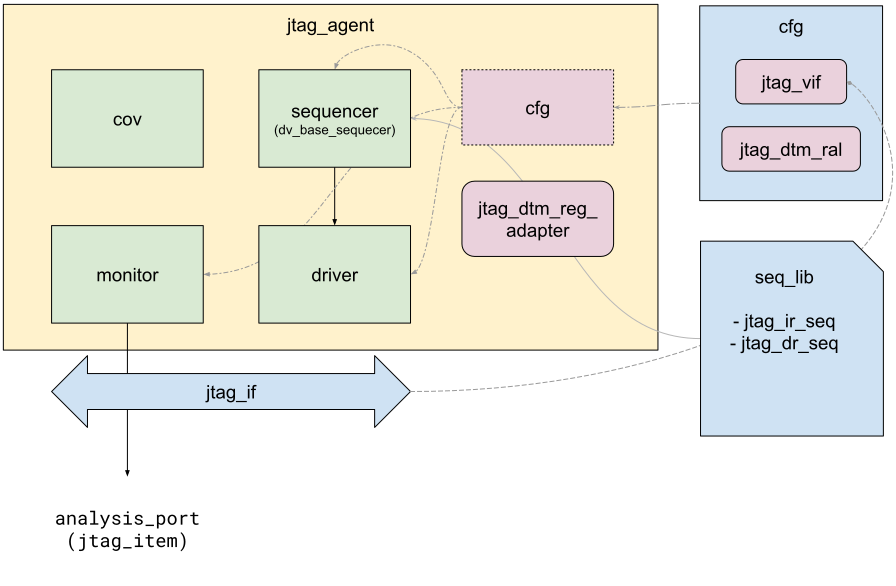

JTAG UVM Agent is extended from the
[DV library agent]() classes, which
provide common knobs and verification logic that help ease the effort of
writing interface agents.

## Block diagram

## jtag_if

This interface is used to drive and monitor the JTAG transactions. It is the
physical layer of the testbench, which directly connects to the JTAG signals
of the DUT.

## jtag_dtm_reg_block

This RAL model represents the JTAG DTM register space. This region is defined
in the
[RISC-V debug specification 0.13.2](https://github.com/riscv/riscv-debug-spec/raw/4e0bb0fc2d843473db2356623792c6b7603b94d4/riscv-debug-release.pdf),
chapter 6. It mirrors the registers in the design, which is useful to predict
what we thought we wrote to these registers and compare what we expect the
design to return on reads. This RAL model is hand-written, given that it is
only a few set of registers. It can be used to drive reads and writes using
our standard [CSR routines](). It
can also be used in higher level testbench components to develop the predicted
verification logic.

## jtag_dtm_reg_adapter

This object extends from the standard `uvm_reg_adapter` class, to implement the
underlying mechanics of accessing the modeled JTAG DTM registers in
`jtag_dtm_reg_block` using the JTAG sequencer. An instance of this class is
created in the `jtag_agent`, and hooked up to the `default_map` of
`jtag_reg_block` to facilitate the CSR accesses via the RAL model.

## jtag_agent_cfg

This agent configuration class provides a handle to the `jtag_if` instance.
It also creates the JTAG DTM RAL model as a member. An instance of this class
is created externally and passed on to `jtag_agent` via `uvm_config_db`. The
`jtag_agent` then sets the `cfg` handle in all sub-components, so that they all
have access to it.

## jtag_item

This represents the JTAG transaction class. It holds the IR as well as DR
information. It is used by the driver as well as the monitor. The
`ir_len` and `dr_len` fields indicate whether to drive or sample an IR update,
or DR update or both types of transactions. If each of these lengths
is 0, then that type of transaction is not driven / monitored.

The `dout` field indicates the captured DR value.

## jtag_driver

This component receives transactions from sequences via the sequencer using
the standard UVM TLM mechanism. If the `ir_len` and `dr_len` in the received
transaction item are both non-zero, it drives the IR update first, followed
by the DR update. If any of these lengths is 0, then that type of transaction
is not driven. It throws an error if both of these lengths are 0.

When driving the DR update, it also captures the DR by sampling `tdi` into the
transaction item's `dout` field, which is sent back to the sequence as
response.

Currently, the driver is only implemented in host mode. The device mode
implementation will be addressed in future.

## jtag_monitor

The JTAG monitor implements an FSM to detect an IR update cycle or a DR update
cycle. It discretely captures the IR update and DR update separately and writes
the transaction to the `analysis_port`. Transactions coming from this monitor
on the `analysis_port` will only have either the `ir_len` or the `dr_len` set
to a non-zero value. The higher level testbench components must check these
lengths to determine whether the IR was updated or the DR.
