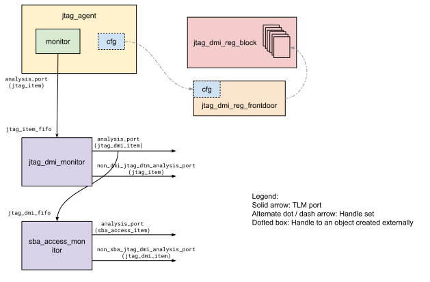

# JTAG_DMI UVM Agent

JTAG_DMI UVM Agent is extended from DV library agent classes. Contrary to what
the name suggests, it actually does not come with an agent. It is called an
agent because it comes with a monitor, an RAL model and a RAL frontdoor
accessor class, wrapped in a package that provides some additional utility
methods.

## Block diagram

## jtag_dmi_item

This class represents a predicted DMI transaction, captured by the monitor.
It consists of `req_op`, `addr`, `wdata`, `rsp_op` and `rdata`. The first three
captures a DMI request as initiated by the host, whereas the last two capture
the response type and read data respectively.

## jtag_dmi_monitor

This component converts the raw JTAG transactions captured from the
`jtag_monitor` in the `jtag_agent` over its TLM analysis port into a stream of
`jtag_dmi_item` transactions which are sent over this component's analysis
port. A JTAG DMI access is made by writing to the JTAG DTM DMI register with
the request, and polling it subsequently for completion. This monitor analyzes
the incoming raw JTAG transactions to see if the JTAG DMI register was
accessed, by matching the IR value. If it was, then it captures the subsequent
updates to its DR to extract the predicted DMI requests. It uses the JTAG DTM
RAL model to parse the DTM DMI register fields from these writes and reads.
Likewise, it examines the `dout` value of the transaction item (i.e. the read
value of the DTM DMI register) which indicates the status of the previously
initiated DMI request, as well as the read data. Partial requests are
immediately written to the `req_analysis_port` and are held in a local queue.
When it detects that the access completed, it pops the partial request from the
queue, updates the request with the response information, and writes the
completed transaction to the `analysis_port`.

Note that these transactions are predictions, based on reads and writes to the
JTAG DTM register. The actual internal DMI interface is not probed.

Any raw JTAG transactions that were not made to the JTAG DTM DMI register are
passed through the `non_dmi_jtag_dtm_analysis_port`.

This monitor is required to be instantiated alongside the `jtag_agent` in the
testbench environment that seeks to consume the captured JTAG DMI transactions.

## jtag_dmi_reg_block

This class represents the JTAG DMI register space, as indicated in the [RISCV
debug specification 0.13.2](https://github.com/riscv/riscv-debug-spec/raw/4e0bb0fc2d843473db2356623792c6b7603b94d4/riscv-debug-release.pdf).
The registers were specified in the adjoining `jtag_dmi.hjson` file and
converted to the model using our [reggen]()
tool. It has been hand-edited after generation to remove the comportability
assumptions. See the notes in the file for details.

The package provides a convenience function
`jtag_dmi_agent_pkg::create_jtag_dmi_reg_block()` that creates and returns
a handle to this model. It also attaches the frontdoor accessor class to
all registers, which replaces the traditional access of registers using a
map and an adapter. Like the JTAG DMI monitor, an object of this class is
also required to be manually instantiated in the parent environment.

This register model serves to be generic in nature. It does not cater to
a specific implementation. The actual implementation of this register space may
differ in the design. The reset values and access policies of these registers
may need to be altered in the parent environment before use, based on the
implementation.

## jtag_dmi_reg_frontdoor

Accesses to the DMI register space over JTAG happen indirectly via writes
to the DTM register called `dmi` which is specified in the
`jtag_dtm_reg_block` provided by the `jtag_agent`. Hence, the accesses to the
DMI register space cannot be made via the traditional register map and adapter
method. This sequence writes the DTM `dmi` register to issue a DMI read or
a write request, then polls it for completion. The DTM `dmi` register
on subsequent reads, indicates the status of the request (success, busy or
fail), in addition to the read data. If the request status is busy, it keeps
polling, until either a JTAG reset (`trst_n`) asserts or a timeout occurs.

It uses an externally created semaphore `jtag_dtm_ral_sem_h` to atomicize
accesses to the DTM `dmi` register, since accesses to all DMI registers go
through this shared resource. This semaphore is also created and set by the
convenience function `jtag_dmi_agent_pkg::create_jtag_dmi_reg_block()`.

## sba_access_item

This class represents the driven or predicted SBA transaction. It is used by
the routines provided in `sba_access_utils_pkg`, as well as by the
`sba_access_monitor`. It contains request and response related fields. It also
has special control knobs to modify the behavior of the design when initiating
accesses. These knobs - `readonaddr`, `readondata`, and `autoincrement` are
written to the SBCS register, if different from the defaults.

## sba_access_monitor

This monitor retrieves the predicted JTAG DMI transactions from the
`jtag_dmi_monitor` to further analyze accesses to the SBA subset of the DMI
register space, using the handle to the `jtag_dmi_reg_block` instance, which is
set externally. It examines the stream of reads and writes to the SBA registers
to predict outgoing SBA transactions. For this prediction to work correctly,
the stimulus needs to be sent correctly as well, which is facilitated by the
routines provided by the `sba_access_utils_pkg`.

Any JTAG DMI transactions that were not made to the SBA registers are passed
through the `non_sba_jtag_dmi_analysis_port`.

This monitor is required to be instantiated alongside the `jtag_agent` in the
testbench environment that seeks to consume the predicted SBA transactions.

## sba_access_utils_pkg

The JTAG DMI register space has registers to initiate and manage accesses into
the system through an external system bus (whatever that may be). Please see the
RISCV debug specification for more details. These registers are already
a part of the `jtag_dmi_reg_block` model.

This package provides some convenience tasks to initiate and manage accesses
into the system bus access interface (SBA) using these SBA registers, including
starting an access, waiting for completion and clearing the error bits. These
tasks take the handle to the `jtag_dmi_reg_block` model as one of the
arguments.
