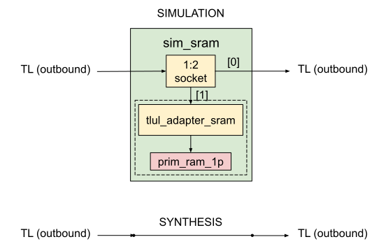

## Simulation SRAM

The `sim_sram` module intercepts an outbound TL interface to carve out a chunk of "fake" memory used for simulation purposes only.
This chunk of memory must not overlap with any device on the system address map - it must be an invalid address range from the system's perspective.

It has 4 interfaces - clock, reset, input TL interface and the output TL interface.
It instantiates a [1:2 TL socket]() to split the incoming TL access into two.
One of the outputs of the socket is sinked within the module while the other is returned back.

If the user chooses to instantiate an actual SRAM instance, the sinked TL interface is connected to TL SRAM adapter which converts the TL access into an SRAM access.
The [technology-independent]() `prim_ram_1p` module is used for instantiating the memory.



This module is not meant to be synthesized.
An easy way to ensure this is to instantiate it in simulation if and only if a special macro is defined.
Though, it is written with the synthesizable subset of SystemVerilog to be Verilator-friendly.

The most typical usecase for this module is for a SW test running on an embedded CPU in the design to be able to exchange information with the testbench.
In DV, this is envisioned to be used for the following purposes:
- write the status of the SW test
- use as a SW logging device
- write the output of an operation
- signal an event

These usecases apply to Verilator as well.
However, at this time, the Verilator based simulations rely on the on-device UART for logging.

This module must be instantiated before any XBAR / bus fabric element in the design which can return an error response when it sees an access to an invalid address range.
Ideally, it should be placed as close to the CPU (or equivalent) as possible to reduce the simulation time.

## Customizations

`sim_sram` exposes the following parameters:

- `InstantiateSram` (default: 0):

  Controls whether to instantiate the SRAM or not.
  The most typical (and a very much recommended) operating mode is for the SW test to only write data to this SRAM, to make it portable across various simulation platforms (DV, Verilator, FPGA etc.).
  The testbench can simply probe the sinked output of the socket to monitor writes to specific addresses within this range.
  So, in reality the actual SRAM instance is not needed for most cases.
  However, it does enable the possibility of having a testbench driven SW test control (the SW test can read the contents of the SRAM to know how to proceed) for tests that are custom written for a particular simulation platform.
  It also enables handshaking between the SW and the testbench without using any of the on-chip resources, should there be a need for them to synchronize during simulation.

- `AddrWidth` (default: 32):

  This should be the same as the address width of the TL interface.

- `Width` (default: 32):

  This should be the same as the data width of the TL interface.

- `Depth` (default: 8):

  Depth of the SRAM in bus words.

- `ErrOnRead` (default: 1):

  If the SW test reads from the SRAM, throw an error (see `InstantiateSram` above for more details).

In addition, the module instantiates the `sim_sram_if` interface to allow the testbench to control the `start_addr` of the SRAM (defaults to 0) at run-time by hierarchically referencing it:
```systemverilog
  // In top level testbench which instantiates the `sim_sram`:
  initial u_sim_sram.u_sim_sram_if.start_addr = 32'h3000_0000;
```
This interface also exposes `tl_i`, which is connected to the sinked TL output of the socket (qualified TL access made to the SRAM).
The handle to this interface can be supplied to the UVM side via `uvm_config_db` for fine-grained control and monitoring.

## Usage

This module needs to be instantiated on an existing outbound TL connection, possibly deep in an existing design hierarchy while also abiding by these guidelines:
- design sources must not depend on simulation components
- design sources must not directly instantiate simulation components, even with `ifdefs`
- synthesis of the design must not disturbed whatsoever
- we must be able to run simulations with Verilator (which prevents us from using forces for example)

One way of achieving this is by disconnecting an outbound TL interface in the design source where `sim_sram` needs to be inserted.
The disconnection must be made in the desired desigm block ONLY if `` `SYNTHESIS`` is NOT defined and a special macro (user's choice on the name) is defined for simulations.
This module is instantiated in the testbench rather than in the design.
Its inbound and outbound TL interaces are then connected to the disconnected TL interface in the design by hierarchically referencing their paths.

This disconnection is currently done in `hw/ip/rv_core_ibex/rtl/rv_core_ibex.sv`, which relies on `` `RV_CORE_IBEX_SIM_SRAM`` being defined.
In UVM DV simulations, we do not disconnect anything - we use forces instead to make the connections.
