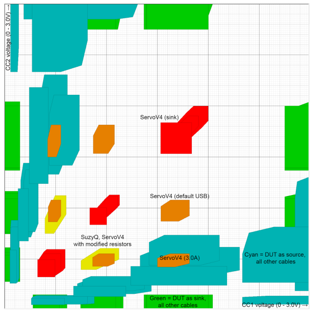

# Overview

This document specifies the ADC controller IP functionality.
This IP block implements control and filter logic for an analog block that implements a dual ADC.
This module conforms to the [Comportable guideline for peripheral functionality.]()
See that document for integration overview within the broader top level system.

## Features

The IP block implements the following features:

- Register interface to dual ADC analog block
- Support for 2 ADC channels
- Support for 8 filters on the values from the channels
- Support ADCs with 10-bit output (two reserved bits in CSR)
- Support for debounce timers on the filter output
- Run on a slow always-on clock to enable usage while the device is sleeping
- Low power periodic scan mode for monitoring ADC channels

## Description

The ADC controller is a simple front-end to an analog block that allows filtering and debouncing of the analog signals.

## Compatibility

The ADC controller programming interface is not based on any existing interface.

# Theory of Operation

The block diagram shows a conceptual view of the ADC controller state machine and filters.

## Block Diagram

## Hardware Interface



### Signals

In addition to the interrupts and bus signals, the tables below lists additional IOs.

Signal                  | Direction | Description
------------------------|-----------|---------------
`adc_o`                 | `output`  | Output controls to the actual `AST ADC` module.  Contains signals such as power down control and ADC channel select.
`adc_i`                 | `input`   | Input data from `AST ADC` module. Contains ADC data output as well as data valid indication.

## Design Details

## Sampling state machine

The state machine that takes ADC samples follows a very simple pattern:

1. *Power up ADC*: The controller issues the power up command to the ADC.

2. *Wait for ADC turn on*: The controller waits for the number of clock cycles programmed in  which should be set to match the ADC power up delay.

3. *Take sample Channel 0*: The ADC is requested to sample channel 0.
When the ADC signals complete the value is stored in .
Note that the time taken in this step depends on the properties of the ADC.

4. *Take sample Channel 1*: The ADC is requested to sample channel 1.
When the ADC signals complete the value is stored in .
Note that the time taken in this step depends on the properties of the ADC.

5. *Evaluate Filters*: The filters are evaluated and debounce logic applied (see [next section](#filters-and-debounce)).

6. *Scan type check*: At this point if the  bit is clear scanning continues at step (3).
   If the bit is set the next step depends on how many samples have hit the filters.
   If more than  samples have hit then continuous scanning continues at step (3) else periodic scanning will continue at the next step (7).

7. *Power off ADC*: The controller issues the power down command to the ADC.

8. *Wait sleep time*: The controller will wait for the next sample timer to time out before restarting at step (1).

In active operation the controller is in continuous scanning mode:
* The ADC is continually powered on.
* The sampling cycle time is the time taken for the ADC to take two samples (450us) plus internal processing time (4 clock cycles) from the ADC controller.
* The debounce timer will trigger the  and interrupt after a configurable number of matching ADC samples have been seen, as determined by .

For low power operation the periodic scanning mode can be used.
In this mode samples are taken using a slower periodic sampling cycle time with the ADC powered down most of the time.
Once a small number of cycles have hit the filter with periodic scanning then the controller switches to continuous scanning in order to more accurately debounce the signal.
In low power mode:
* The ADC is periodically powered up to take samples; this interval is determined by .
* Similar to normal operation, the ADC power-up delay is controlled by .
* Once the ADC is powered up, two samples are taken and compared to the filter thresholds.
* If a configurable number of matches, as determined by , are seen, the ADC controller transitions to normal operation for continuous sampling.

Although it can be used at any time, the periodic operation mode and use of the slow clock allows the ADC controller to continue to scan when most of the chip is in sleep or power-down modes.
The controller can be configured to issue a wakeup to the rest of the chip.

If a filter is enabled for wakeup in  and  indicates a match, a wakeup is generated to the system power manager.

## Filters and debounce

There are two reserved bits in ADC filter control registers for future use.
In the current implementation, ADC has 10-bit granularity.
Each step is 2.148mV.
It covers 0-2.2V.

The ADC controller implements eight pairs of filters that feed the debounce logic.
Each pair has a filter for channel 0 and a filter for channel 1.

A filter consists of a `max` value, a `min` value and a `cond` flag indicating if the filter is hit by a sample inside or outside the range.
* *Inside the range*: the filter is hit if `min` &le; `value` &le; `max`.
* *Outside the range*: inverse of inside, so the filter is hit if `value` &lt; `min` or `value` &gt; `max`.

Some example filters:
* Inside `min=7`, `max=23`: any value between and including 7 and 23 will hit.
* Outside `min=7`, `max=23`: any value less than 7 or greater than 23 will hit.
* Inside `min=7`, `max=7`: the value must be exactly 7 to hit (sample noise may make an exact hit unlikely).
* Inside `min=0`, `max=7`: the value must be less than 8 to hit.
* Outside `min=8`, `max=0xFFF`: the value must be less than 8 to hit (alternate method).
* Inside `min=0`, `max=0xFFF`: any value will hit. This may be useful to exclude one channel from the filter.
* Outside `min=0`, `max=0xFFF`: no value will hit. If set for either channel the filter is effectively disabled.

All pairs of filters that are enabled in  and  are evaluated after each pair of samples has been taken.
The filter result is passed to the periodic scan counter if enabled and not at its limit otherwise the result is passed to the debounce counter.
The list below describes how the counters interpret the filter results:
* If no filters are hit then the counter will reset to zero.
* If one or more filters are hit but the set hit differs from the previous evaluation the counter resets to zero.
* If one or more filters are hit and either none was hit in the previous evaluation or the same set was hit in the previous evaluation and the counter is not at its threshold then the counter will increment.
* If one or more filters are hit and the same set was hit in the previous evaluation and the counter is at its threshold then the counter stays at the threshold.
* If the counter is the periodic scan counter and it reaches its threshold, as defined by , then continuous scanning is enabled and the debounce counter will be used for future evaluations.
* If the counter is the debounce counter and it reaches its threshold, as defined by , then:
  * An interrupt is raised if the threshold is met for the first time.
  * The current sample values are latched into  and  .
    *  If a series of interrupts and matches are seen, these registers only record the value of the last debounced hit.
  * The  register is updated by setting the bits corresponding to filters that are hit (note that bits that are already set will not be cleared).
    This will cause the block to raise an interrupt if it was not already doing so.
  * If a filter is a hit and is also enabled in  the corresponding filter generates a wakeup.
  * Note that the debounce counter will remain at its threshold until the set of filters are changed by software to debounce a different event or if the current match changes.
    *  This implies that a stable matching event continuously matches until some condition in the system (changed filter settings or changed ADC output) alters the result.

Because scanning continues the  register will reflect any debounced events that are detected between the controller raising an interrupt and the status bits being cleared (by having 1 written to them).
However, the  and  registers record the value at the time the interrupt was first raised and thus reflect the filter state from that point.


{
  signal: [
    {node: '.a..b........', phase:0.2},
    {name: 'adc_pd_i'     , wave: '10|..|.....|....|..1'},
    {name: 'clk_ast_adc_i', wave: 'p.|..|.....|....|...'},
    {name: 'adc_chnsel_i' , wave: '0.|.3|..04.|....|0..'},
    {name: 'adc_d_val_o'  , wave: '0.|..|.1.0.|.1..|.0.'},
    {name: 'adc_d_o'      , wave: 'x.|..|.3.x.|.4..|.x.', data: ['ch0', 'ch1', 'ch1']},
  ],
  edge: [  'a<->b wakeup time',   ]
}


# Programmers Guide

## Initialization

The controller should be initialized with the properties of the ADC and scan times.
* The ADC power up delay must be set in .
* The time to delay between samples in a slow scan should be set in .
* The number of samples to cause transition from slow to fast scan should be set in .
* The number of samples for debounce should be set in .
* The filter registers  should be programmed.
* The interrupt  and wakeup  enables should be configured.
* All ones should be written to  and   to ensure there are no spurious pending triggers.
* Optionally, the low-power mode should be set in  if the system is going to the low-power mode.
* The state machine will only start running when  is set.

## Running in normal mode

If fast sampling is always required then the  bit should be clear.
In this case the values in the  are not used.
The ADC will always be enabled and consuming power.

If power saving is required then the controller can be set to operate in low power mode by setting .
The  must be programed prior to setting this bit.

## Running with the rest of the chip in sleep

Once programmed the controller and ADC can run when the rest of the chip is in low power state and the main clocks are stopped.
This allows the chip to be woken when appropriate values are detected on the two ADC channels.
The fast sampling mode can be used but will usually consume more power than desired when the chip is in sleep.
So it is expected that  is configured and low power mode enabled by setting  prior to the sleep being initiated.

If the ADC wakeup is not required then the controller and ADC should both be disabled by clearing  prior to the sleep being initiated.

## Use for USB-C debug accessory detection.

Please see the following diagram for the regions of interest in debug cable detection.

The ADC can be used to detect debug cable connection / disconnection in the non-overlapping regions.
As an example use case of the two channel filters they can be used for detection of a USB-C debug accessory.
The ADC must meet some minimum specifications:
* Full scale range is 0.0V to 2.2V
* If the signal is below 0.0V the ADC value will be zero.
* If the signal is above 2.2V the ADC value will be maximum (i.e. same as 2.2V)
* Absolute maximum error +/- 15 mV in the 0.25 - 0.45 V range
* Absolute maximum error +/- 30 mV in the rest of the 0.0 - 2.2 V range

The following assumes:
* The slow clock runs at 200kHz or 5 us.
* The ADC requires 30 us to power on.
* The ADC takes a single sample in 44 clocks (220 us)

The controller should be initialized with the properties of the ADC and scan times.
* The ADC power up delay must be set in  to `6` (30 us).
* The time to delay between samples in a slow scan should be set in  to `1600` (8ms).
* The number of samples to cause transition from slow to fast scan should be set in  to `4` (causing slow scan to be 4*8ms = 32ms of debounce time).
* The number of samples for debounce should be set in  to `155` (causing the total debounce time to be 32ms (slow scan) + 220us * 2 * 155 = 100ms, at the low end of the USB-C spec window).

* For the 10-bit ADC granularity, the filter registers  should be programmed to:

| Filter | Ch0 Min      | Ch0 Max      | Ch1 Min      | Ch1 Max      | Device connected            |
|--------|--------------|--------------|--------------|--------------|-----------------------------|
| 0 IN   |  149 (0.32V) |  279 (0.60V) |  149 (0.32V) |  279 (0.60V) | Debug Sink (local RpUSB)    |
| 1 IN   |  391 (0.84V) |  524 (1.125V)|  391 (0.84V) |  524 (1.125V)| Debug Sink (local Rp1.5A)   |
| 2 IN   |  712 (1.53V) |  931 (2.00V) |  712 (1.53V) |  931 (2.00V) | Debug Sink (local Rp3A)     |
| 3 IN   |  712 (1.53V) |  847 (1.82V) |  405 (0.87V) |  503 (1.08V) | Debug Source with RpUSB     |
| 4 IN   |  349 (0.75V) |  512 (1.12V) |  186 (0.40V) |  279 (0.60V) | Debug Source with Rp1.5A    |
| 5 IN   |  405 (0.87V) |  503 (1.08V) |  712 (1.53V) |  841 (1.82V) | Debug Source RpUSB Flipped  |
| 6 IN   |  186 (0.40V) |  279 (0.60V) |  349 (0.75V) |  521 (1.12V) | Debug Source Rp1.5A Flipped |
| 7 OUT  |  116 (0.25V) |  954 (2.05V) |  116 (0.25V) |  954 (2.05V) | Disconnect                  |

* The interrupt  and wakeup  enables should be configured.
* All ones should be written to  and   to ensure there are no spurious pending triggers.
* The state machine will only start running when  is set.

Note that for the debug controller (DTS in USB-C specification) as a power source the filter that is hit will indicate the orientation of the connector.
If the debug controller is acting as a power sink then the orientation cannot be known unless the debug controller supports the optional behavior of converting one of its pulldowns to an Ra (rather than Rp) to indicate CC2 (the CC that is not used for communication).
This would not be detected by the filters since it happens later than connection detection and debounce in the USB-C protocol state machine, but could be detected by monitoring the current ADC value.

## Registers


