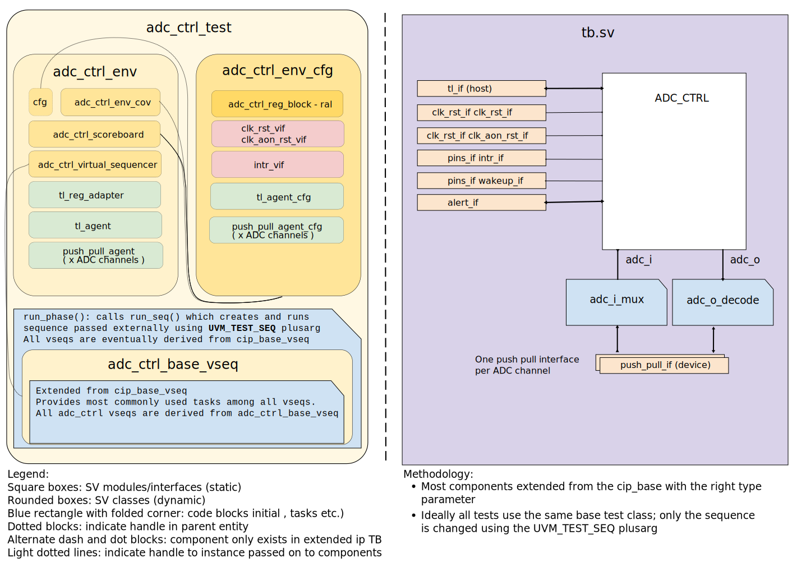

## Goals
* **DV**
  * Verify all ADC_CTRL IP features by running dynamic simulations with a SV/UVM based testbench
  * Develop and run all tests based on the [testplan](#testplan) below towards closing code and functional coverage on the IP and all of its sub-modules
* **FPV**
  * Verify TileLink device protocol compliance with an SVA based testbench

## Current status
* [Design & verification stage]()
  * [HW development stages]()
* [Simulation results](https://reports.opentitan.org/hw/ip/adc_ctrl/dv/latest/results.html)

## Design features
For detailed information on ADC_CTRL design features, please see the [ADC_CTRL HWIP technical specification]().

## Testbench architecture
ADC_CTRL testbench has been constructed based on the [CIP testbench architecture]().

### Block diagram


### Top level testbench
Top level testbench is located at `hw/ip/adc_ctrl/dv/tb/tb.sv`. It instantiates the ADC_CTRL DUT module `hw/ip/adc_ctrl/rtl/adc_ctrl.sv`.
In addition, it instantiates the following interfaces, connects them to the DUT and sets their handle into `uvm_config_db`:
* [Clock and reset interface]()
* [Always on clock and reset interface]()
* [TileLink host interface]()
* ADC_CTRL IOs
* Interrupts ([`pins_if`]()
* Alerts ([`pins_if`]()
* Wakeup ([`pins_if`]()
* [Push Pull Interface] () combined with some logic in `tb.sv` to emulate the ADC data interface

### Common DV utility components
The following utilities provide generic helper tasks and functions to perform activities that are common across the project:
* [dv_utils_pkg]()
* [csr_utils_pkg]()

### Global types & methods
All common types and methods defined at the package level can be found in
`adc_ctrl_env_pkg`.

### TL_agent
ADC_CTRL testbench instantiates (already handled in CIP base env) [tl_agent]()
which provides the ability to drive and independently monitor random traffic via
TL host interface into ADC_CTRL device.

### push_pull agents
The ADC data interface is emulated using push_pull agents. ([`push_pull_agent`]()

### UVM RAL Model
The ADC_CTRL RAL model is created with the [`ralgen`]() FuseSoC generator script automatically when the simulation is at the build stage.

It can be created manually by invoking [`regtool`]():

### Stimulus strategy
#### Test sequences
All test sequences reside in `hw/ip/adc_ctrl/dv/env/seq_lib`.
The `adc_ctrl_base_vseq` virtual sequence is extended from `cip_base_vseq` and serves as a starting point.
All test sequences are extended from `adc_ctrl_base_vseq`.
It provides commonly used handles, variables, functions and tasks that the test sequences can use.


#### Functional coverage
To ensure high quality constrained random stimulus, it is necessary to develop a functional coverage model.
The following covergroups have been developed to prove that the test intent has been adequately met:
* adc_ctrl_filter_cg: filter configurations, one instance per filter
These are sampled by the scoreboard when the ADC_CRTL is enabled by register and also on interrupt
and  wakeup line assertion. To distinguish between these situations and the fast clock gating
status additional flags are also sampled enabling cross coverage.
* adc_ctrl_testmode_cg: The mode of operation of the ADC_CTRL with transition bins to show modes can be selected
independantly of a previous selected mode.
* adc_ctrl_hw_reset_cg: The state of the FSM and counters when a hardware reset is applied.
* adc_ctrl_fsm_reset_cg: The state of the FSM and counters when a FSM reset is applied.

### Self-checking strategy
#### Scoreboard
The `adc_ctrl_scoreboard` is primarily used for end to end checking.
It creates the following analysis ports to retrieve the data monitored by corresponding interface agents:
* tl_[a_chan, d_chan, dir]_fifo_lc_ctrl_reg_block.analysis_export: Tile Link CSR reads/writes.
* m_adc_push_pull_fifo_[0,1,...].analysis_export: Transactions representing the ADC channel data
Using data fron the Tile Link and ADC data streams a model within the scoreboard predicts the interrupt and
wakeup line logic level at any point in the simulation. It also predicts various volatile register content.
The scoreboard uses the predictions to compare against the RTL signals and register read data.

#### Assertions
* TLUL assertions: The `sva/adc_ctrl_bind.sv` binds the `tlul_assert` [assertions]() to the IP to ensure TileLink interface protocol compliance.
* ADC_CTRL FSM assertions `sva/adc_ctrl_fsm_sva.sv` bound inside adc_ctrl_fsm
  * FsmStateSwReset_A: Checks FSM is reset by rst_aon_ni
  * PwrupTimerCntSwReset_A: Checks powerup timer counter is reset by rst_aon_ni
  * WakeupTimerCntSwReset_A: Checks wakeup timer counter is reset by rst_aon_ni
  * NpSampleCntSwReset_A: Checks normal power sample counter is reset by rst_aon_ni
  * LpSampleCntSwReset_A: Checks low power sample counter is reset by rst_aon_ni
  * FsmStateHwReset_A: Checks FSM is reset by  register adc_fsm_rst
  * PwrupTimerCntHwReset_A: Checks powerup timer counter is reset by register adc_fsm_rst
  * WakeupTimerCntHwReset_A: Checks wakeup timer counter is reset by register adc_fsm_rst
  * NpSampleCntHwReset_A: Checks normal power sample counter is reset register adc_fsm_rst
  * LpSampleCntHwReset_A: Checks low power sample counter is reset by register adc_fsm_rst
* Unknown checks on DUT outputs: The RTL has assertions to ensure all outputs are
initialized to known values after coming out of reset.
* Assertions in `tb.sv`
  * ChannelSelOnehot_A: Checks at most one ADC channel select is asserted at any time
  * ChannelSelKnown_A: Checks all ADC channel selects have a known logic value
  * PwrupTime_A: Checks the time period between low power sampling cycles is consistant
  with the value in the configuration object.
  * WakeupTime_A: Checks the time period between power up and first channel selected
  is consistant with the value in the configuration object.
  * EnterLowPower_A: Checks the ADC power down is asserted between sampling periods in
  low power mode.


## Building and running tests
We are using our in-house developed [regression tool]() for building and running our tests and regressions.
Please take a look at the link for detailed information on the usage, capabilities, features and known issues.
Here's how to run a smoke test:
```console
$ $REPO_TOP/util/dvsim/dvsim.py $REPO_TOP/hw/ip/adc_ctrl/dv/adc_ctrl_sim_cfg.hjson -i adc_ctrl_smoke
```

## Testplan

