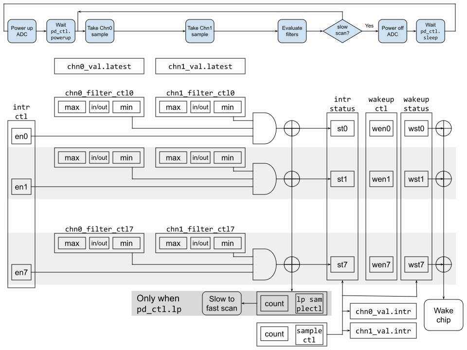

# Theory of Operation

The block diagram shows a conceptual view of the ADC controller state machine and filters.

## Block Diagram



### Signals

In addition to the interrupts and bus signals, the tables below lists additional IOs.

Signal                  | Direction | Description
------------------------|-----------|---------------
`adc_o`                 | `output`  | Output controls to the actual `AST ADC` module.  Contains signals such as power down control and ADC channel select.
`adc_i`                 | `input`   | Input data from `AST ADC` module. Contains ADC data output as well as data valid indication.


## Design Details

### Sampling state machine

The state machine that takes ADC samples follows a very simple pattern:

1. *Power up ADC*: The controller issues the power up command to the ADC.

2. *Wait for ADC turn on*: The controller waits for the number of clock cycles programmed in [`adc_pd_ctl.pwrup_time`](registers.md#adc_pd_ctl) which should be set to match the ADC power up delay.

3. *Take sample Channel 0*: The ADC is requested to sample channel 0.
When the ADC signals complete the value is stored in [`adc_chn_val[0].adc_chn_value`](registers.md#adc_chn_val).
Note that the time taken in this step depends on the properties of the ADC.

4. *Take sample Channel 1*: The ADC is requested to sample channel 1.
When the ADC signals complete the value is stored in [`adc_chn_val[1].adc_chn_value`](registers.md#adc_chn_val).
Note that the time taken in this step depends on the properties of the ADC.

5. *Evaluate Filters*: The filters are evaluated and debounce logic applied (see [next section](#filters-and-debounce)).

6. *Scan type check*: At this point if the [`adc_pd_ctl.lp_mode`](registers.md#adc_pd_ctl) bit is clear scanning continues at step (3).
   If the bit is set the next step depends on how many samples have hit the filters.
   If more than [`adc_lp_sample_ctl.lp_sample_cnt`](registers.md#adc_lp_sample_ctl) samples have hit then continuous scanning continues at step (3) else periodic scanning will continue at the next step (7).

7. *Power off ADC*: The controller issues the power down command to the ADC.

8. *Wait sleep time*: The controller will wait for the next sample timer to time out before restarting at step (1).

If the controller is configured as oneshot mode, ([`adc_en_ctl.oneshot_mode`](registers.md#adc_en_ctl)), the controller waits for high value (1) from channel 0 and 1 in order.
Once it gets high value from both channel, it goes back to power off state without evaluatging the filters after setting [`adc_intr_status.oneshot`](registers.md#adc_intr_status).

In active operation the controller is in continuous scanning mode:
* The ADC is continually powered on.
* The sampling cycle time is the time taken for the ADC to take two samples (450us) plus internal processing time (4 clock cycles) from the ADC controller.
* The debounce timer will trigger the [`filter_status`](registers.md#filter_status) and interrupt after a configurable number of matching ADC samples have been seen, as determined by [`adc_sample_ctl`](registers.md#adc_sample_ctl).

For low power operation the periodic scanning mode can be used.
In this mode samples are taken using a slower periodic sampling cycle time with the ADC powered down most of the time.
Once a small number of cycles have hit the filter with periodic scanning then the controller switches to continuous scanning in order to more accurately debounce the signal.
In low power mode:
* The ADC is periodically powered up to take samples; this interval is determined by [`adc_pd_ctl.wakeup_time`](registers.md#adc_pd_ctl).
* Similar to normal operation, the ADC power-up delay is controlled by [`adc_pd_ctl.pwrup_time`](registers.md#adc_pd_ctl).
* Once the ADC is powered up, two samples are taken and compared to the filter thresholds.
* If a configurable number of matches, as determined by [`adc_lp_sample_ctl`](registers.md#adc_lp_sample_ctl), are seen, the ADC controller transitions to normal operation for continuous sampling.

Although it can be used at any time, the periodic operation mode and use of the slow clock allows the ADC controller to continue to scan when most of the chip is in sleep or power-down modes.
The controller can be configured to issue a wakeup to the rest of the chip.

If a filter is enabled for wakeup in [`adc_wakeup_ctl`](registers.md#adc_wakeup_ctl) and [`filter_status`](registers.md#filter_status) indicates a match, a wakeup is generated to the system power manager.


## Filters and debounce

There are two reserved bits in ADC filter control registers for future use.
In the current implementation, ADC has 10-bit granularity.
Each step is 2.148mV.
It covers 0-2.2V.

The ADC controller implements eight pairs of filters that feed the debounce logic.
Each pair has a filter for channel 0 and a filter for channel 1.

A filter consists of a `max` value, a `min` value and a `cond` flag indicating if the filter is hit by a sample inside or outside the range.
* *Inside the range*: the filter is hit if `min` &le; `value` &le; `max`.
* *Outside the range*: inverse of inside, so the filter is hit if `value` &lt; `min` or `value` &gt; `max`.

Some example filters:
* Inside `min=7`, `max=23`: any value between and including 7 and 23 will hit.
* Outside `min=7`, `max=23`: any value less than 7 or greater than 23 will hit.
* Inside `min=7`, `max=7`: the value must be exactly 7 to hit (sample noise may make an exact hit unlikely).
* Inside `min=0`, `max=7`: the value must be less than 8 to hit.
* Outside `min=8`, `max=0xFFF`: the value must be less than 8 to hit (alternate method).
* Inside `min=0`, `max=0xFFF`: any value will hit. This may be useful to exclude one channel from the filter.
* Outside `min=0`, `max=0xFFF`: no value will hit. If set for either channel the filter is effectively disabled.

All pairs of filters that are enabled in [`adc_chn0_filter_ctl[7:0]`](registers.md#adc_chn0_filter_ctl) and [`adc_chn1_filter_ctl[7:0]`](registers.md#adc_chn1_filter_ctl) are evaluated after each pair of samples has been taken.
The filter result is passed to the periodic scan counter if enabled and not at its limit otherwise the result is passed to the debounce counter.
The list below describes how the counters interpret the filter results:
* If no filters are hit then the counter will reset to zero.
* If one or more filters are hit but the set hit differs from the previous evaluation the counter resets to zero.
* If one or more filters are hit and either none was hit in the previous evaluation or the same set was hit in the previous evaluation and the counter is not at its threshold then the counter will increment.
* If one or more filters are hit and the same set was hit in the previous evaluation and the counter is at its threshold then the counter stays at the threshold.
* If the counter is the periodic scan counter and it reaches its threshold, as defined by [`adc_lp_sample_ctl.lp_sample_cnt`](registers.md#adc_lp_sample_ctl), then continuous scanning is enabled and the debounce counter will be used for future evaluations.
* If the counter is the debounce counter and it reaches its threshold, as defined by [`adc_sample_ctl.np_sample_cnt`](registers.md#adc_sample_ctl), then:
  * An interrupt is raised if the threshold is met for the first time.
  * The current sample values are latched into [`adc_chn_val[0].adc_chn_value_intr`](registers.md#adc_chn_val) and  [`adc_chn_val[1].adc_chn_value_intr`](registers.md#adc_chn_val).
    *  If a series of interrupts and matches are seen, these registers only record the value of the last debounced hit.
  * The [`adc_intr_status`](registers.md#adc_intr_status) register is updated by setting the bits corresponding to filters that are hit (note that bits that are already set will not be cleared).
    This will cause the block to raise an interrupt if it was not already doing so.
  * If a filter is a hit and is also enabled in [`adc_wakeup_ctl`](registers.md#adc_wakeup_ctl) the corresponding filter generates a wakeup.
  * Note that the debounce counter will remain at its threshold until the set of filters are changed by software to debounce a different event or if the current match changes.
    *  This implies that a stable matching event continuously matches until some condition in the system (changed filter settings, changed ADC output, software issued fsm reset in [`adc_fsm_rst`](registers.md#adc_fsm_rst)) alters the result.


Because scanning continues the [`adc_intr_status`](registers.md#adc_intr_status) register will reflect any debounced events that are detected between the controller raising an interrupt and the status bits being cleared (by having 1 written to them).
However, the [`adc_chn_val[0].adc_chn_value_intr`](registers.md#adc_chn_val) and [`adc_chn_val[1].adc_chn_value_intr`](registers.md#adc_chn_val) registers record the value at the time the interrupt was first raised and thus reflect the filter state from that point.

### ADC_CTRL and ADC Interface

The interface between the ADC controller and the ADC is diagrammed below.
The interface is from the perspective of the ADC controller.
Before operation can begin, the ADC controller first powers on the ADC by setting `adc_o.pd` to 0.
The controller then waits for the ADC to fully power up, as determined by [`adc_pd_ctl.pwrup_time`](registers.md#adc_pd_ctl).

Once the ADC is ready to go, the controller then selects the channel it wishes to sample by setting `adc_o.channel_sel`.
The controller holds this value until the ADC responds with `adc_i.data_valid` and `adc_i.data`.

Since there is no request sample signal between the controller and the ADC, the ADC takes a new sample when `adc_o.channel_sel` is changed from 0 to a valid channel.
To take a new sample then, the controller actively sets `adc_o.channel_sel` to 0, before setting it to another valid channel.

```wavejson
{
  signal: [
    {node: '.a..b........', phase:0.2},
    {name: 'clk_aon_i',         wave: 'p.|..|.....|....|...'},
    {name: 'adc_o.pd',          wave: '10|..|.....|....|..1'},
    {name: 'adc_o.channel_sel', wave: '0.|.3|..04.|....|0..'},
    {name: 'adc_i.data_valid',  wave: '0.|..|.1.0.|.1..|.0.'},
    {name: 'adc_i.data',        wave: 'x.|..|.3.x.|.4..|.x.', data: ['ch0', 'ch1', 'ch1']},
  ],
  edge: [  'a<->b wakeup time',   ]
}
```
