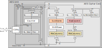

# Overview

This document specifies the AES hardware IP functionality.
[Advanced Encryption Standard (AES)](https://www.nist.gov/publications/advanced-encryption-standard-aes) is the primary symmetric encryption and decryption mechanism used in OpenTitan protocols.
The AES unit is a cryptographic accelerator that accepts requests from the processor to encrypt or decrypt 16 byte blocks of data.
It is attached to the chip interconnect bus as a peripheral module and conforms to the [Comportable guideline for peripheral functionality.]()


## Features

The AES unit supports the following features:

- Encryption/Decryption using AES-128/192/256 in Electronic Codebook (ECB) mode
- Support for AES-192 can be removed to save area, and is enabled/disabled using a compile-time Verilog parameter
- Latency per 16 byte data block of 12/14/16 clock cycles in AES-128/192/256 mode
- Register-based data and control interface
- On-the-fly round-key generation in parallel to the actual encryption/decryption from a single initial 128/192/256-bit key provided through the register interface (for more details see Theory of Operations below)

This AES unit targets medium performance (16 parallel S-Boxes, \~1 cycle per round).
High-speed, single-cycle operation for high-bandwidth data streaming is not required.

Cipher modes other than ECB are beyond this version of the AES unit but might be supported in future versions.


## Description

The AES unit is a cryptographic accelerator that accepts requests from the processor to encrypt or decrypt 16B blocks of data.
It supports AES-128/192/256 in Electronic Codebook (ECB) mode.
Other cipher modes might be added in future versions.

The AES unit is attached to the chip interconnect bus as a peripheral module.
Communication with the processor happens through a set of control and status registers (CSRs).
This includes input/output data and key, as well as status and control information.
Future versions of the AES unit might include a separate interface through which a possible system key manager can provide the key without exposing it to the processor or other hosts attached to the system bus interconnect.


# Theory of Operations

The AES unit supports both encryption and decryption for AES-128/192/256 in ECB mode using a single, shared data path.
That is, it can either do encryption or decryption but not both at the same time.

The AES unit features a key expanding mechanism to generate the required round keys on-the-fly from a single initial key provided through the register interface.
This means the processor needs to provide just the initial encryption key to the AES unit via register interface.
The AES unit then uses this key to generate all round keys as they are needed in parallel to the actual encryption/decryption.
The benefits of this design compared to passing all round keys via register interface include:

- Reduced storage requirements and smaller circuit area: Instead of storing 15 128-bit round keys, only 3 256-bit key registers are required for AES-256:
  - one set of registers to which the processor writes the initial key, i.e., the start key for encryption,
  - one set of registers to hold the current full key, and
  - one set of registers to hold the full key of the last encryption round, i.e., the start key for decryption.
- Faster re-configuration and key switching: The core just needs to perform 8 write operations instead of 60 write operations for AES-256.

On-the-fly round-key generation comes however at the price of an initial delay whenever the key is changed by the processor before the AES unit can perform ECB **decryption** using this new key.
During this phase, the key expanding mechanism iteratively computes the start key for the decryption.
The duration of this delay phase corresponds to the latency required for encrypting one 16B block (i.e., 12/14/16 cycles for AES-128/192/256).
Once the start key for decryption has been computed, it is stored in a dedicated internal register for later use.
The AES unit can then switch between decryption and encryption without additional overhead.

For encryption, there is no such initial delay upon changing the key.
If the next operation after a key switch is ECB **decryption**, the AES unit automatically initiates an encryption procedure in the key expanding mechanism first (to generate the start key for decryption, the actual data path remains idle during that phase).

The AES unit uses a status register to indicate to the processor when ready to receive the next input data block via the register interface.
While the AES unit is performing encryption/decryption of a data block, it is safe for the processor to provide the next input data block.
Similarly, the AES unit indicates via a status register when having new output data available to be read by the processor.
Also, there is a back-pressure mechanism for the output data.
If the AES unit wants to finish the encryption/decryption of a data block but the previous output data has not yet been read by the processor, the AES unit is stalled.
It hangs and does not drop data.
It only continues once the previous output data has been read and the corresponding registers can be safely overwritten.
This is the default behavior.
It can be disabled by setting the FORCE_DATA_OVERWRITE bit in  to `1`.
In this case, the AES unit never stalls and just overwrites previous output data, independent of whether it has been read or not.


## Block Diagram

This AES unit targets medium performance (\~1 cycle per round).
High-speed, single-cycle operation for high-bandwidth data streaming is not required.

Therefore, the AES unit uses an iterative architecture with a 128-bit wide data path as shown in the figure below.
Using an iterative architecture allows for a smaller circuit area at the cost of throughput.
Employing a 128-bit wide data path allows to achieve the latency requirements of 12/14/16 clock cycles per 16B data block in AES-128/192/256 mode, respectively.



Both the data paths for the actual cipher (left) and the round key generation (right) are shared between encryption and decryption.
Consequently, the blocks shown in the diagram always implement the forward and backward (inverse) version of the corresponding operation.
For example, SubBytes implements both SubBytes and InvSubBytes.


## Hardware Interfaces

In the current implementation, the AES unit has no security alerts.
These will eventually be added in future versions.




## Design Details

This section discusses different design details of the AES module.


### Datapath Architecture and Operation

The AES unit implements the Equivalent Inverse Cipher described in the [AES specification](https://csrc.nist.gov/csrc/media/publications/fips/197/final/documents/fips-197.pdf).
This allows for more efficient cipher data path sharing between encryption/decryption as the operations are applied in the same order (less muxes, simpler control), but requires the round key in decryption mode to be transformed using an inverse MixColumns in all rounds except for the first and the last one.

This architectural choice targets at efficient cipher data path sharing and low area footprint.
Depending on the application scenario, other architectures might offer a more suitable area/performance tradeoff.
For example if only CTR mode is ever used, decryption is not used at all.
Moreover, if the key is changed extremely rarely (as for example in the case of bulk decryption), it may pay off to store all round keys instead of generating them on the fly.
Future versions of the AES unit might offer compile-time parameters to selectively instantiate the encryption/decryption part only to allow for dedicated encryption/decryption-only units.

All submodules in the data path are purely combinational.
The only sequential logic in the cipher and round key generation are the State, Full Key and Decryption Key registers.

The AES unit operates as follows:

1. The initial key as well as the input data are provided to the AES unit via a set of control and status registers (CSRs) accessible by the processor via TL-UL bus interface.
2. When receiving the start command, the AES unit first loads the input data as well as the initial key into the corresponding registers (State and Full Key at the top of the block diagram).
   Note, if the decryption is performed, the Full Key register is loaded with the value stored in the Decryption Key register.
3. Once these registers have been loaded, the AES unit starts the encryption/decryption by adding the first round key to the state (all blocks in both data paths are bypassed).
   The result is stored back in the State register.
4. Then, the AES unit performs 9/11/13 rounds of encryption/decryption when using a 128/192/256-bit key, respectively.
   In every round, the cipher data path performs the four following transformations.
   For more details, refer to the [AES specification](https://csrc.nist.gov/csrc/media/publications/fips/197/final/documents/fips-197.pdf).
    1. SubBytes Transformation: A non-linear byte substitution that operates independently on each byte of the state using a substitution table (S-Box).
    2. ShiftRows Transformation: The bytes of the last three rows of the state are cyclically shifted over different offsets.
    3. MixColumns Transformation: Each of the four columns of the state are considered as polynomials over GF(2^8) and individually multiplied with another fixed polynomial.
    4. AddRoundKey Transformation: The round key is XORed with the output of the MixColumns operation and stored back into the State register.
       The 128-bit round key itself is extracted from the current value in the Full Key register.
       In parallel, the full key used for the next round is computed on the fly using the key expand module.
5. Finally, the AES unit performs the final encryption/decryption round in which the MixColumns operation is skipped.
   The output of this final round is forwarded to the output register in the CSRs and stored back into the State register.

Having separate registers for input, output and internal state prevents the extraction of intermediate state via TL-UL bus interface and allows to overlap reconfiguration with operation.
While the AES unit is performing encryption/decryption, the processor can safely write the next input data block into the CSRs or read the previous output data block from the CSRs.
The State register is internal to the AES unit and not exposed via the TL-UL bus interface.
If the AES unit wants to finish the encryption/decryption of an output data block but the previous one has not yet been read by the processor, the AES unit is stalled.
It hangs and does not drop data.
It only continues once the previous output data has been read and the corresponding registers can be safely overwritten.
In contrast, the initial key can only be updated if the AES unit is idle, which eases design verification (DV).

The architecture of the AES unit is derived from the architecture proposed by Satoh et al.: ["A compact Rijndael Hardware Architecture with S-Box Optimization"](https://link.springer.com/chapter/10.1007%2F3-540-45682-1_15).
The expected circuit area in a 110nm CMOS technology is in the order of 12 - 22 kGE (AES-128 only).

For a description of the various sub modules, see the following sections.


### SubBytes / S-Box

The SubBytes operation is a non-linear byte substitution that operates independently on each byte of the state using a substitution table (S-Box).
It is both used for the cipher data path and the key expand data path.
In total, 20 S-Boxes are used (16 for SubBytes, 4 for KeyExpand), each having 8-bit input and output.

The design of this S-Box and its inverse can have a big impact on circuit area, timing critical path, robustness and power leakage, and is itself its own research topic.

Since the S-Boxes can be decoupled from the rest of the AES unit, they can easily be replaced by a different implementation if required.
The AES unit currently uses a LUT-based S-Box implementation (default) but also supports the implementation proposed by [Canright: "A very compact Rijndael S-Box"](https://hdl.handle.net/10945/25608) (selectable by a compile-time parameter).

A possible candidate implementation that employs masking (i.e. that randomizes the power consumption of the AES unit in every cipher round) to aggravate power analysis attacks has been proposed by [Canright and Batina: "A very compact "perfectly masked" S-Box for AES (corrected)"](https://eprint.iacr.org/2009/011.pdf).


### ShiftRows

The ShiftRows operation simply performs a cyclic shift of Rows 1, 2 and 3 of the state matrix.
Consequently, it can be implemented using 3\*4 32-bit 2-input muxes (encryption/decryption).


### MixColumns

Each of the four columns of the state are considered as polynomials over GF(2^8) and individually multiplied with another fixed polynomial.
The whole operation can be implemented using 36 2-input XORs and 16 4-input XORs (all 8-bit), 8 2-input muxes (8-bit), as well as 78 2-input and 24 3-input XOR gates.


### KeyExpand

The key expand module (KEM) integrated in the AES unit is responsible for generating the various round keys from the initial key for both encryption and decryption.
The KEM generates the next 128/192/256-bit full key in parallel to the actual encryption/decryption based on the current full key or the initial key (for the first encryption round).
The actual 128-bit round key is then extracted from this full key.

Generating the keys on-the-fly allows for lower storage requirements and smaller circuit area but comes at the price of an initial delay before doing ECB **decryption** whenever the key is changed.
During this phase, the KEM cycles through all full keys to obtain the start key for decryption (equals the key for final round of encryption).
The duration of this delay phase corresponds to the latency required for encrypting one 16B block.
During this initial phase, the cipher data path is kept idle.

The timing diagram below visualizes this process.


{
  signal: [
    {    name: 'clk',         wave: 'p........|.......'},
    ['TL-UL IF',
      {  name: 'write',       wave: '01...0...|.......'},
      {  name: 'addr',        wave: 'x2345xxxx|xxxxxxx', data: 'K0 K1 K2 K3'},
      {  name: 'wdata',       wave: 'x2345xxxx|xxxxxxx', data: 'K0 K1 K2 K3'},
    ],
    {},
    ['AES Unit',
      {  name: 'Config mode', wave: 'x4...............', data: 'DECRYPT'},
      {  name: 'AES mode',    wave: '2........|.4.....', data: 'IDLE DECRYPT'},
      {  name: 'KEM mode',    wave: '2....3...|.4.....', data: 'IDLE ENCRYPT DECRYPT'},
      {  name: 'round',       wave: 'xxxxx2.22|22.2222', data: '0 1 2 9 0 1 2 3 4'},
      {  name: 'key_init',    wave: 'xxxx5....|.......', data: 'K0-3'},
      {  name: 'key_full',    wave: 'xxxxx5222|4.22222', data: 'K0-3 f(K) f(K) f(K) K0-3\' f(K) f(K) f(K) f(K) f(K)'},
      {  name: 'key_dec',     wave: 'xxxxxxxxx|4......', data: 'K0-3\''},
    ]
  ]
}


The AES unit is configured to do decryption (`Config mode` = DECRYPT).
Once the new key has been provided via the control and status registers (top), this new key is loaded into the Full Key register (`key_full` = K0-3) and the KEM starts performing encryption (`KEM mode`=ENCRYPT).
The cipher data path remains idle (`AES mode`=IDLE).
In every round, the value in `key_full` is updated.
After 10 encryption rounds, the value in `key_full` equals the start key for decryption.
This value is stored into the Decryption Key register (`key_dec` = K0-3' at the very bottom).
Now the AES unit can switch between encryption/decryption without overhead as both the start key for encryption (`key_init`) and decryption (`key_dec`) can be loaded into `full_key`.

For details on the KeyExpand operation refer to the [AES specification, Section 5.2](https://csrc.nist.gov/csrc/media/publications/fips/197/final/documents/fips-197.pdf).

Key expanding is the only operation in the AES unit for which the functionality depends on the selected key length.
Having a KEM that supports 128-bit key expansion, support for the 256-bit mode can be added at low overhead.
In contrast, the 192-bit mode requires much larger muxes.
Support for this mode is thus optional and can be enabled/disabled via a design-time parameter.

Once we have cost estimates in terms of gate count increase for 192-bit mode, we can decide on whether or not to use it in OpenTitan.
Typically, systems requiring security above AES-128 go directly for AES-256.

### System Key-Manager Interface

This version of the AES unit is controlled entirely by the processor.
The processor writes both input data as well as the initial key to dedicated registers via the system bus interconnect.

Future versions of the AES unit might include a separate interface through which a possible system key manager can provide the key without exposing it to the processor or other hosts attached to the system bus interconnect.


### Security Hardening

The primary focus of the first version of the AES unit lies in having a first functional implementation.

Future efforts on this unit will have a focus on security hardening of the design.
Future versions of this AES unit thus might employ different means at architectural, microarchitectural and physical levels to reduce side-channel leakage (e.g. power and electromagnetic) and mitigate potential fault injection attacks.


# Programmers Guide

This section discusses how software can interface with the AES unit.


## Initialization

To initialize the AES unit, software must write the initial key to the Initial Key registers  - .
Note that all registers are little-endian.
The key length is configured using the KEY_LEN field of .
Independent of the selected key length, software must always write all 8 32-bit registers.
The order in which these registers are written does not matter.
Anything can be written to the unused key registers.
For AES-128 and AES-192, the actual initial key used for encryption is formed by using the  -  and  - , respectively.


## Block Operation

For block operation, software must initialize the AES unit as described in the previous section and then:

1. Make sure that the AES unit:
   1. Automatically starts encryption/decryption when new input data is available by setting the MANUAL_START_TRIGGER bit in  to `0`.
   2. Does not overwrite previous output data that has not been read by the processor by setting the FORCE_DATA_OVERWRITE bit in  to `0`.
2. Write Input Data Block `0` to the Input Data registers  - .
   The order in which these registers are written does not matter.
3. Wait for the INPUT_READY bit in  to become `1`, i.e. wait for the AES unit to load Input Data Block `0` into the internal state register and start operation.
4. Write Input Data Block `1` to the Input Data registers.

Then for every Data Block `I=0,..,N-3`, software must:
1. Wait for the OUTPUT_VALID bit in  to become `1`, i.e., wait for the AES unit to finish encryption/decryption of Block `I`.
   The AES unit then directly starts processing the previously input block `I+1`
2. Read Output Data Block `I` from the Output Data registers  - .
   The order in which these registers are read does not matter.
3. Write Input Data Block `I+2` into the Input Data register.
   There is no need to check INPUT_READY as the cycle following OUTPUT_VALID being set the current input is loaded in.

Once all blocks have been input the final data blocks `I=N-2,N-1` must be read out
1. Wait for the OUTPUT_VALID bit in  to become `1`, i.e., wait for the AES unit to finish encryption/decryption of Block `I`.
2. Read Output Data Block `I` from the Output Data register.

Note that interrupts are not provided, the latency of the AES unit is such that they are of little utility.

The code snippet below shows how to perform block operation.

```c
  // Enable autostart, disable overwriting of previous output data
  REG32(AES_CTRL(0)) =
      mode << AES_CTRL_MODE |
      (key_len & AES_CTRL_KEY_LEN_MASK) << AES_CTRL_KEY_LEN_OFFSET |
      0x0 << AES_CTRL_MANUAL_START_TRIGGER |
      0x0 << AES_CTRL_FORCE_DATA_OVERWRITE;

  // Write Input Data Block 0 - Note: All registers are little-endian.
  for (int j = 0; j < 4; j++) {
    REG32(AES_DATA_IN0(0) + j * 4) = input_data[j];
  }

  // Wait for INPUT_READY bit
  while (!((REG32(AES_STATUS(0)) >> AES_STATUS_INPUT_READY) & 0x1)) {
  }

  // Write Input Data Block 1
  for (int j = 0; j < 4; j++) {
    REG32(AES_DATA_IN0(0) + j * 4) = input_data[j + 4];
  }

  // For Data Block I=0,...,N-1
  for (int i = 0; i < N; i++) {

    // Wait for OUTPUT_VALID bit
    while (!((REG32(AES_STATUS(0)) >> AES_STATUS_OUTPUT_VALID) & 0x1)) {
    }

    // Read Output Data Block I
    for (int j = 0; j < 4; j++) {
      output_data[j + i * 4] = REG32(AES_DATA_OUT0(0) + j * 4);
    }

    // Write Input Data Block I+2 - For I=0,...,N-3 only.
    if (i < N - 2) {
      for (int j = 0; j < 4; j++) {
        REG32(AES_DATA_IN0(0) + j * 4) = input_data[j + 4 * (i + 2)];
      }
    }
  }

```


## De-Initialization

After finishing operation, software must:
1. Disable the AES unit to no longer automatically start encryption/decryption by setting the MANUAL_START_TRIGGER bit in  to `1`.
1. Clear all key registers as well as the Input Data and the Output Data registers by setting the KEY_CLEAR, DATA_IN_CLEAR and DATA_OUT_CLEAR bits in  to `1`.

The code snippet below shows how to perform this task.

```c
  // Disable autostart
  REG32(AES_CTRL(0)) = 0x1 << AES_CTRL_MANUAL_START_TRIGGER;

  // Clear all key register, Input Data and Output Data registers
  REG32(AES_TRIGGER(0)) =
      (0x1 << AES_TRIGGER_KEY_CLEAR) |
      (0x1 << AES_TRIGGER_DATA_IN_CLEAR) |
      (0x1 << AES_TRIGGER_DATA_OUT_CLEAR);
```


## Register Table

The AES unit uses 8 and 4 separate write-only registers for the initial key and input data, as well as 4 separate read-only registers for the output data.
All registers are little-endian.
Compared to first-in, first-out (FIFO) interfaces, having separate registers has a couple of advantages:

- Supported out-of-the-box by the register tool (the FIFO would have to be implemented separately).
- Usability: critical corner cases where software updates input data or the key partially only are easier to avoid using separate registers and the `hwqe`-signals provided by the Register Tool.
- Easier interaction with DMA engines
Also, using a FIFO interface for something that is not actually FIFO (internally, 16B of input/output data are consumed/produced at once) is less natural.

For a detailed overview of the register tool, please refer to the [Register Tool documentation.]()


