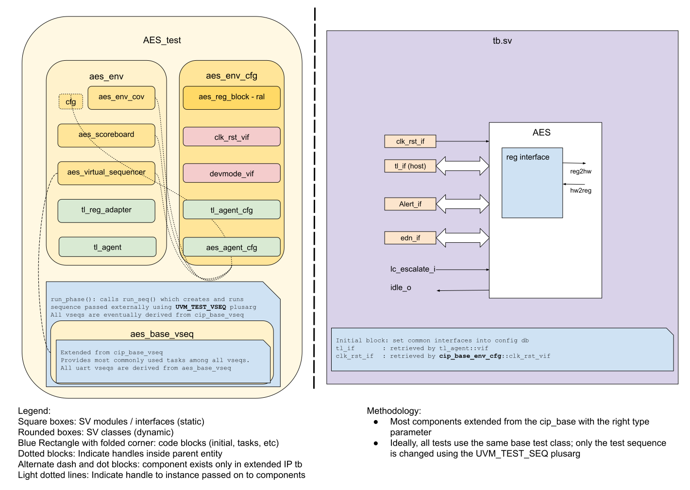

## Goals
* **DV**
  * Verify all AES IP features by running dynamic simulations with a SV/UVM based testbench
  * Develop and run all tests based on the [DV plan](#dv-plan) below towards closing code and functional coverage on the IP.
* **FPV**
  * Verify TileLink device protocol compliance with an SVA based testbench

## Current status
* [Design & verification stage]()
  * [HW development stages]()
* [Simulation results](https://reports.opentitan.org/hw/ip/aes/dv/latest/results.html)

## Design features
For detailed information on AES design features, please see the [AES HWIP Technical Specification]().

## Testbench architecture
AES testbench has been constructed based on the [CIP testbench architecture]().

### Block diagram


### Top level testbench
Top level testbench is located at `hw/ip/aes/dv/tb/tb.sv`.
It instantiates the AES DUT module `hw/ip/aes/rtl/aes.sv`.
In addition, it instantiates the following interfaces, connects them to the DUT and sets their handle into `uvm_config_db`:
* [Clock and reset interface]()
* [TileLink host interface]()


### Common DV utility components
The following utilities provide generic helper tasks and functions to perform activities that are common across the project:
* [common_ifs]()
* [dv_utils_pkg]()
* [csr_utils_pkg]()

### Global types & methods
All common types and methods defined at the package level can be found in `aes_env_pkg`.
Some of them in use are:
```systemverilog
parameter uint NUM_ALERTS = 2;
```

### TL_agent
AES instantiates (already handled in CIP base env) [tl_agent]()
which provides the ability to drive and independently monitor random traffic via
TL host interface into AES device.


### UVM RAL model
The AES RAL model is created with the [`ralgen`]() FuseSoC generator script automatically when the simulation is at the build stage.

It can be created manually by invoking [`regtool`]():

### Stimulus strategy
#### Test sequences
All test sequences reside in `hw/ip/aes/dv/env/seq_lib`.
The `aes_base_vseq` virtual sequence is extended from `cip_base_vseq` and serves as a starting point.
All test sequences are extended from `aes_base_vseq`.
`aes_base_vseq` provides commonly used handles, variables, functions and tasks that the test sequences can simple use / call.
Some of the most commonly used tasks / functions are as follows:
* aes_init:    Initialize the AES module from the randomized environment variables in the config.
* set_op:      Set AES operation to encrypt or decrypt.
* write_key:   Write initial key to AES init key registers.
* add_data:    Add the next 128 block to the input registers.
* read_output:  Poll the status register for data ready bit and read the result from AES output registers.
* clear_reg:  Based on the input this function clears data input-, data output- or key-registers or any combination of these.
* set_manual_trigger: Chooses between AES auto start and manual start.
* trigger_start:  Set the start bit to trigger a new encryption/decryption.

#### Functional coverage
To ensure high quality constrained random stimulus, it is necessary to develop a functional coverage model.
The following cover groups have been developed to prove that the test intent has been adequately met.

WORK IN PROGRESS WILL COME WITH V2.


### Self-checking strategy
#### Scoreboard
The `aes_scoreboard` is primarily used for end to end checking.
It creates the following analysis FIFOs to retrieve the data monitored by corresponding interface agents:
* tl_a_chan_fifo: tl address channel
* tl_d_chan_fifo: tl data channel

These 2 FIFOs provide transaction items at the end of the address channel and data channel respectively.
Each FIFO is monitored and incoming transactions are stored.
Whenever a transaction is finished the sequence item is handed over to a reference model that will generate the expected response.
At the same time the scoreboard is waiting for the result of the AES module to compute.
Once complete the result is scored against the prediction made by the reference model.

The reference model is selected to be either a C-implementation or an SSL-library selected on a random basis with the default distribution of 80% OpenSSL/BoringSSL and  20% C-model.

The default behavior for the verification is that the scoreboard wait until the complete message has been encrypted/decrypted before checking the result against the reference model.

The scoreboard has a step through mode where the scoring is done after each 128bit block.
This setting is only available when using the C-model as reference and is controlled with a knob.

#### Assertions
* TLUL assertions: The `tb/aes_bind.sv` binds the `tlul_assert` [assertions]() to the IP to ensure TileLink interface protocol compliance.
* Unknown checks on DUT outputs: The RTL has assertions to ensure all outputs are initialized to known values after coming out of reset.

## Building and running tests
We are using our in-house developed [regression tool]() for both building and running our tests and regressions.
Please take a look at the link for detailed information on the usage, capabilities, features and known issues.
Here's how to run a smoke test:
```console
$ $REPO_TOP/util/dvsim/dvsim.py $REPO_TOP/hw/ip/aes/dv/aes_sim_cfg.hjson -i aes_smoke
```
Here's how to run a basic test without DPI calls:
```console
$ $REPO_TOP/util/dvsim/dvsim.py $REPO_TOP/hw/ip/aes/dv/aes_sim_cfg.hjson -i aes_wakeup
```
## DV plan

