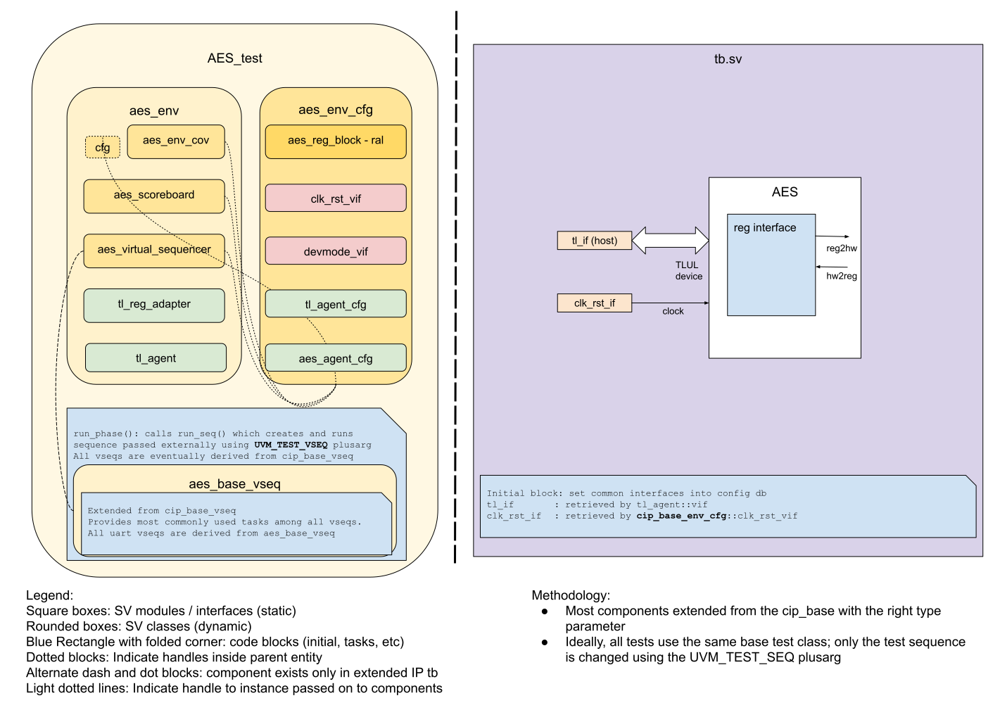

## Goals
* **DV**
  * Verify all AES IP features by running dynamic simulations with a SV/UVM based testbench
  * Develop and run all tests based on the [testplan](#testplan) below towards closing code and functional coverage on the IP.
* **FPV**
  * Verify TileLink device protocol compliance with an SVA based testbench

## Current status
* [Design & verification stage]()
  * [HW development stages]()
* DV regression results dashboard (link TBD)

## Design features
For detailed information on AES design features, please see the [AES HWIP Technical Specification]().

## Testbench architecture
AES testbench has been constructed based on the [CIP testbench architecture]().

### Block diagram


### Top level testbench
Top level testbench is located at `hw/ip/aes/dv/tb/tb.sv`. It instantiates the AES DUT module `hw/ip/aes/rtl/aes.sv`.
In addition, it instantiates the following interfaces, connects them to the DUT and sets their handle into `uvm_config_db`:
* [Clock and reset interface]()
* [TileLink host interface]()


### Common DV utility components
The following utilities provide generic helper tasks and functions to perform activities that are common across the project:
* [common_ifs]()
* [dv_utils_pkg]()
* [csr_utils_pkg]()

### Global types & methods
All common types and methods defined at the package level can be found in `aes_env_pkg`.
Some of them in use are:
```systemverilog
parameter uint AES_ADDR_MAP_SIZE   = 2048;
```

### TL_agent
AES instantiates (already handled in CIP base env) [tl_agent]()
which provides the ability to drive and independently monitor random traffic via
TL host interface into AES device.


### RAL
The AES RAL model is constructed using the [regtool.py script]()  and is placed at `env/aes_reg_block.sv`.

### Stimulus strategy
#### Test sequences
All test sequences reside in `hw/ip/aes/dv/env/seq_lib`.
The `aes_base_vseq` virtual sequence is extended from `cip_base_vseq` and serves as a starting point.
All test sequences are extended from `aes_base_vseq`.
It provides commonly used handles, variables, functions and tasks that the test sequences can simple use / call.
Some of the most commonly used tasks / functions are as follows:
* aes_init:    Configure aes control and can via a knob be set to randomize register content before starting a test.
* set_mode:    Set AES to encrypt or decrypt.
* write_key:   Write initial key to aes init key registers.
* add_data:    Add the next 128 block to the input registers.
* read_output:  Poll the status reg for dataready bit and read the result from aes output regs

#### Functional coverage
To ensure high quality constrained random stimulus, it is necessary to develop a functional coverage model.
The following covergroups have been developed to prove that the test intent has been adequately met:
*---  Work in Progress ---

### Self-checking strategy
#### Scoreboard
The `aes_scoreboard` is primarily used for end to end checking.
It creates the following analysis fifos to retrieve the data monitored by corresponding interface agent:
* tl_a_chan_fifo, tl_d_chan_fifo: These 2 fifos provides transaction items at the end of address channel and data channel respectively


#### Assertions
* TLUL assertions: The `tb/aes_bind.sv` binds the `tlul_assert` [assertions]) to the IP to ensure TileLink interface protocol compliance.
* Unknown checks on DUT outputs: The RTL has assertions to ensure all outputs are initialized to known values after coming out of reset.

## Building and running tests
We are using our in-house developed [regression tool]() for building and running our tests and regressions.
Please take a look at the link for detailed information on the usage, capabilities, features and known issues.
Here's how to run a basic sanity test:
```console
$ cd hw/ip/aes/dv
$ make TEST_NAME=aes_sanity
```
Here's how to run a basic test wihtout DPI calls:
```console
$ cd hw/ip/aes/dv
$ make TEST_NAME=aes_wakeup_test
```
## Testplan

