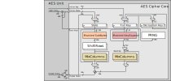

# Theory of Operation

The AES unit supports both encryption and decryption for AES-128/192/256 in ECB, CBC, CFB, OFB and CTR modes as well as GCM using a single, shared data path.
That is, it can either do encryption or decryption but not both at the same time.

The AES unit features a key expanding mechanism to generate the required round keys on-the-fly from a single initial key provided through the register interface.
This means the processor needs to provide just the initial encryption key to the AES unit via register interface.
The AES unit then uses this key to generate all round keys as they are needed in parallel to the actual encryption/decryption.
The benefits of this design compared to passing all round keys via register interface include:

- Reduced storage requirements and smaller circuit area: Instead of storing 15 128-bit round keys, only 3 256-bit key registers are required for AES-256:
  - one set of registers to which the processor writes the initial key, i.e., the start key for encryption,
  - one set of registers to hold the current full key, and
  - one set of registers to hold the full key of the last encryption round, i.e., the start key for decryption.
- Faster re-configuration and key switching: The core just needs to perform 8 write operations instead of 60 write operations for AES-256.

On-the-fly round-key generation comes however at the price of an initial delay whenever the key is changed by the processor before the AES unit can perform ECB/CBC **decryption** using this new key.
During this phase, the key expanding mechanism iteratively computes the start key for the decryption.
The duration of this delay phase corresponds to the latency required for encrypting one 16B block (i.e., 12/14/16 cycles for AES-128/192/256).
Once the start key for decryption has been computed, it is stored in a dedicated internal register for later use.
The AES unit can then switch between decryption and encryption without additional overhead.

For encryption or if the mode is set to CFB, OFB or CTR, there is no such initial delay upon changing the key.
If the next operation after a key switch is ECB or CBC **decryption**, the AES unit automatically initiates a key expansion using the key schedule first (to generate the start key for decryption, the actual data path remains idle during that phase).

The AES unit uses a status register to indicate to the processor when ready to receive the next input data block via the register interface.
While the AES unit is performing encryption/decryption of a data block, it is safe for the processor to provide the next input data block.
The AES unit automatically starts the encryption/decryption of the next data block once the previous encryption/decryption is finished and new input data is available.
The order in which the input registers are written does not matter.
Every input register must be written at least once for the AES unit to automatically start encryption/decryption.
This is the default behavior.
It can be disabled by setting the MANUAL_OPERATION bit in [`CTRL_SHADOWED`](registers.md#ctrl_shadowed) to `1`.
In this case, the AES unit only starts the encryption/decryption once the START bit in [`TRIGGER`](registers.md#trigger) is set to `1` (automatically cleared to `0` once the next encryption/decryption is started).

Similarly, the AES unit indicates via a status register when having new output data available to be read by the processor.
Also, there is a back-pressure mechanism for the output data.
If the AES unit wants to finish the encryption/decryption of a data block but the previous output data has not yet been read by the processor, the AES unit is stalled.
It hangs and does not drop data.
It only continues once the previous output data has been read and the corresponding registers can be safely overwritten.
The order in which the output registers are read does not matter.
Every output register must be read at least once for the AES unit to continue.
This is the default behavior.
It can be disabled by setting the MANUAL_OPERATION bit in [`CTRL_SHADOWED`](registers.md#ctrl_shadowed) to `1`.
In this case, the AES unit never stalls and just overwrites previous output data, independent of whether it has been read or not.


## Block Diagram

This AES unit targets medium performance (\~1 cycle per round for the unmasked implementation).
High-speed, single-cycle operation for high-bandwidth data streaming is not required.

Therefore, the AES unit uses an iterative cipher core architecture with a 128-bit wide data path as shown in the figure below.
Note that for the sake of simplicity, the figure shows the unmasked implementation.
For details on the masked implementation of the cipher core refer to [Security Hardening below](#security-hardening)).
Using an iterative architecture allows for a smaller circuit area at the cost of throughput.
Employing a 128-bit wide data path allows to achieve the latency requirements of 12/14/16 clock cycles per 16B data block in AES-128/192/256 mode in the unmasked implementation, respectively.


Inside the cipher core, both the data paths for the actual cipher (left) and the round key generation (right) are shared between encryption and decryption.
Consequently, the blocks shown in the diagram always implement the forward and backward (inverse) version of the corresponding operation.
For example, SubBytes implements both SubBytes and InvSubBytes.

Besides the actual AES cipher core, the AES unit features a set of control and status registers (CSRs) accessible by the processor via TL-UL bus interface, a counter module (used in CTR mode and GCM only), and a GHASH module (used in GCM only).
The counter module implements the Standard Incrementing Function according to [Recommendation for Block Cipher Modes of Operation (Appendix B.1)](https://nvlpubs.nist.gov/nistpubs/Legacy/SP/nistspecialpublication800-38a.pdf) with a fixed parameter m = 128 (32 for GCM, see [Recommendations for Block Cipher Modes of Operation: Galois/Counter Mode (GCM) and GMAC (Section 5.3)](https://nvlpubs.nist.gov/nistpubs/Legacy/SP/nistspecialpublication800-38d.pdf)).
Note that for AES, parameter b = 128 and the counter increment is big-endian.
The GHASH module is responsible for computing the integrity tag in GCM.
Internally, it uses iteratively decomposed Galois Field GF(2^128) multipliers with a latency of 8 or 32 clock cycles for the unmasked or masked implementation, respectively.
For details on the data path of the masked GHASH module refer to [Security Hardening below](#1st-order-masking-of-the-ghash-block).
As the GHASH module can operate in parallel to the AES cipher core and since the latency of GHASH module is lower than the latency of the AES cipher core, the overall throughput of the AES unit is independent of the mode.

Note that CFB mode is supported with a fixed parameter s = 128 (CFB-128).
Support for data segment sizes other than 128 bits would require a substantial amount of additional muxing resources and is thus not provided.
The initialization vector (IV) register and the register to hold the previous input data are used in CBC, CFB, OFB and CTR modes, as well as in GCM only.


## Design Details

This section discusses different design details of the AES module.


### Datapath Architecture and Operation

The AES unit implements the Equivalent Inverse Cipher described in the [AES specification](https://csrc.nist.gov/csrc/media/publications/fips/197/final/documents/fips-197.pdf).
This allows for more efficient cipher data path sharing between encryption/decryption as the operations are applied in the same order (less muxes, simpler control), but requires the round key during decryption to be transformed using an inverse MixColumns in all rounds except for the first and the last one.

This architectural choice targets at efficient cipher data path sharing and low area footprint.
Depending on the application scenario, other architectures might offer a more suitable area/performance tradeoff.
For example if only CFB, OFB or CTR modes are ever used, the inverse cipher is not used at all.
Moreover, if the key is changed extremely rarely (as for example in the case of bulk decryption), it may pay off to store all round keys instead of generating them on the fly.
Future versions of the AES unit might offer compile-time parameters to selectively instantiate the forward/inverse cipher part only to allow for dedicated encryption/decryption-only units.

All submodules in the data path are purely combinational.
The only sequential logic in the cipher and round key generation are the State, Full Key and Decryption Key registers.

The following description explains how the AES unit operates, i.e., how the operation of the AES cipher is mapped to the datapath architecture of the AES unit.
Phrases in italics apply to peculiarities of different block cipher modes.
For a general introduction into these cipher modes, refer to [Recommendation for Block Cipher Modes of Operation](https://nvlpubs.nist.gov/nistpubs/Legacy/SP/nistspecialpublication800-38a.pdf).
Note that GCM is special as the way it operates the data path depends on the GCM phase:
- the initialization phase uses ECB mode,
- the plaintext/ciphertext phase uses CTR mode, and
- the additional authenticated data (AAD) phase does not use the AES data path but only the GHASH module.

For a general introduction into GCM and the GHASH operation, refer to [Recommendations for Block Cipher Modes of Operation: Galois/Counter Mode (GCM) and GMAC](https://nvlpubs.nist.gov/nistpubs/Legacy/SP/nistspecialpublication800-38d.pdf).
For more information on how the different GCM phases are mapped to the AES unit, refer to the [Programmer's Guide](programmers_guide.md#galoiscounter-mode-gcm).
The data path of the masked GHASH module is explained in detail in [Security Hardening below](#1st-order-masking-of-the-ghash-module).

1. The configuration and initial key is provided to the AES unit via a set of control and status registers (CSRs) accessible by the processor via TL-UL bus interface.
   The processor must first provide the configuration to the [`CTRL_SHADOWED`](registers.md#ctrl_shadowed) register.
   Then follows the initial key.
   Each key register must be written at least once.
   The order in which the registers are written does not matter.
1. _The processor provides the initialization vector (IV) or initial counter value to the four IV registers via TL-UL bus interface in CBC, CFB and OFB modes, or CTR mode, respectively.
   Each IV register must be written at least once.
   The order in which the registers are written does not matter.
   Note that while operating, the AES unit automatically updates the IV registers after having consumed the current IV value.
   Whenever a new message is started, the processor must provide the corresponding IV value via TL-UL bus interface.
   In ECB mode, no IV needs to be provided.
   The content of the IV registers is ignored in ECB mode._
1. The input data is provided to the AES unit via four CSRs.
   Each input register must be written at least once.
   The order in which the registers are written does not matter.
1. If new input data is available, the AES unit automatically starts encryption/decryption by performing the following actions.
    1. The AES unit loads initial state into the State register inside the cipher core.

       _Depending on the cipher mode, the initial state is a combination of input data as well as IV._
       _Note, if CBC decryption is performed, or if running in CFB, OFB or CTR mode, the input data is also registered (Data In Prev in the block diagram)._
    2. The initial key is loaded into the Full Key register inside the cipher core.

       _Note, if the ECB/CBC decryption is performed, the Full Key register is loaded with the value stored in the Decryption Key register._

    _Note, for the AES unit to automatically start in CBC, CFB, OFB or CTR mode, also the IV must be ready.
    The IV is ready if -- since the last IV update (either done by the processor or the AES unit itself) -- all IV registers have been written at least once or none of them.
    The AES unit will not automatically start the next encryption/decryption with a partially updated IV._

    By setting the MANUAL_OPERATION bit in [`CTRL_SHADOWED`](registers.md#ctrl_shadowed) to `1`, the AES unit can be operated in manual mode.
    In manual mode, the AES unit starts encryption/decryption whenever the START bit in [`TRIGGER`](registers.md#trigger) is set to `1`, irrespective of the status of the IV and input data registers.

1. Once the State and Full Key registers have been loaded, the AES cipher core starts the encryption/decryption by adding the first round key to the initial state (all blocks in both data paths are bypassed).
   The result is stored back in the State register.
1. Then, the AES cipher core performs 9/11/13 rounds of encryption/decryption when using a 128/192/256-bit key, respectively.
   In every round, the cipher data path performs the four following transformations.
   For more details, refer to the [AES specification](https://csrc.nist.gov/csrc/media/publications/fips/197/final/documents/fips-197.pdf).
    1. SubBytes Transformation: A non-linear byte substitution that operates independently on each byte of the state using a substitution table (S-Box).
    2. ShiftRows Transformation: The bytes of the last three rows of the state are cyclically shifted over different offsets.
    3. MixColumns Transformation: Each of the four columns of the state are considered as polynomials over GF(2^8) and individually multiplied with another fixed polynomial.
    4. AddRoundKey Transformation: The round key is XORed with the output of the MixColumns operation and stored back into the State register.
       The 128-bit round key itself is extracted from the current value in the Full Key register.

    In parallel, the full key used for the next round is computed on the fly using the key expand module.

    _If running in CTR mode, the counter module iteratively updates the IV in parallel to the cipher core performing encryption/decryption.
    Internally, the counter module uses one 16-bit counter, meaning it requires 8 clock cycles to increment the 128-bit counter value stored in the IV register.
    Since the counter value is used in the first round only, and since the encryption/decryption of a single block takes 12/14/16 cycles, the iterative counter implementation does not affect the throughput of the AES unit._
1. Finally, the AES cipher core performs the final encryption/decryption round in which the MixColumns operation is skipped.
   The output is forwarded to the output register in the CSRs but not stored back into the State register.
   The internal State register is cleared with pseudo-random data.

   _Depending on the cipher mode, the output of the final round is potentially XORed with either the value in the IV registers (CBC decryption) or the value stored in the previous input data register (CFB, OFB, CTR modes), before being forwarded to the output register in the CSRs.
   If running in CBC mode, the IV registers are updated with the output data (encryption) or the value stored in the previous input data register (decryption).
   If running in CFB or OFB mode, the IV registers are updated with the output data or the output of the final cipher round (before XORing with the previous input data), respectively._

Having separate registers for input, output and internal state prevents the extraction of intermediate state via TL-UL bus interface and allows to overlap reconfiguration with operation.
While the AES unit is performing encryption/decryption, the processor can safely write the next input data block into the CSRs or read the previous output data block from the CSRs.
The State register is internal to the AES unit and not exposed via the TL-UL bus interface.
If the AES unit wants to finish the encryption/decryption of an output data block but the previous one has not yet been read by the processor, the AES unit is stalled.
It hangs and does not drop data.
It only continues once the previous output data has been read and the corresponding registers can be safely overwritten.
The order in which the output registers are read does not matter.
Every output register must be read at least once for the AES unit to continue.
In contrast, the initial key, and control register can only be updated if the AES unit is idle, which eases design verification (DV).
Similarly, the initialization vector (IV) register can only be updated by the processor if the AES unit is idle.
If the AES unit is busy and running in CBC or CTR mode, the AES unit itself updates the IV register.

The cipher core architecture of the AES unit is derived from the architecture proposed by Satoh et al.: ["A compact Rijndael Hardware Architecture with S-Box Optimization"](https://link.springer.com/chapter/10.1007%2F3-540-45682-1_15).
The expected circuit area in a 110nm CMOS technology is in the order of 12 - 22 kGE (unmasked implementation, AES-128 only).
The expected circuit area of the entire AES unit with masking enabled is around 136 kGE (112 kGE if support for GCM is disabled).

For a description of the various sub modules, see the following sections.


### SubBytes / S-Box

The SubBytes operation is a non-linear byte substitution that operates independently on each byte of the state using a substitution table (S-Box).
It is both used for the cipher data path and the key expand data path.
In total, the AES unit instantiates 20 S-Boxes in parallel (16 for SubBytes, 4 for KeyExpand), each having 8-bit input and output.
In combination with the 128-bit wide data path, this allows to perform one AES round per iteration.

The design of this S-Box and its inverse can have a big impact on circuit area, timing critical path, robustness and power leakage, and is itself its own research topic.

The S-Boxes are decoupled from the rest of the AES unit with a handshake protocol, allowing them to be easily replaced by different implementations if required.
The AES unit comes with the following S-Box implementations that can be selected by a compile-time Verilog parameter:
- Domain-oriented masking (DOM) S-Box: default, see [Gross et al.: "Domain-Oriented Masking: Compact Masked Hardware Implementations with Arbitrary Protection Order"](https://eprint.iacr.org/2016/486.pdf)
- Masked Canright S-Box: provided for reference, usage discouraged, a version w/ and w/o mask re-use is provided, see [Canright and Batina: "A very compact "perfectly masked" S-Box for AES (corrected)"](https://eprint.iacr.org/2009/011.pdf)
- Canright S-Box: only use when disabling masking, recommended when targeting ASIC implementation, see [Canright: "A very compact Rijndael S-Box"](https://hdl.handle.net/10945/25608)
- LUT-based S-Box: only use when disabling masking, recommended when targeting FPGA implementation

The DOM S-Box has a latency of 5 clock cycles.
All other implementations are fully combinational (one S-Box evaluation every clock cycle).
See also [Security Hardening below.](#1st-order-masking-of-the-cipher-core)

### ShiftRows

The ShiftRows operation simply performs a cyclic shift of Rows 1, 2 and 3 of the state matrix.
Consequently, it can be implemented using 3\*4 32-bit 2-input muxes (encryption/decryption).


### MixColumns

Each of the four columns of the state are considered as polynomials over GF(2^8) and individually multiplied with another fixed polynomial.
The whole operation can be implemented using 36 2-input XORs and 16 4-input XORs (all 8-bit), 8 2-input muxes (8-bit), as well as 78 2-input and 24 3-input XOR gates.


### KeyExpand

The key expand module (KEM) integrated in the AES unit is responsible for generating the various round keys from the initial key for both encryption and decryption.
The KEM generates the next 128/192/256-bit full key in parallel to the actual encryption/decryption based on the current full key or the initial key (for the first encryption round).
The actual 128-bit round key is then extracted from this full key.

Generating the keys on-the-fly allows for lower storage requirements and smaller circuit area but comes at the price of an initial delay before doing ECB/CBC **decryption** whenever the key is changed.
During this phase, the KEM cycles through all full keys to obtain the start key for decryption (equals the key for final round of encryption).
The duration of this delay phase corresponds to the latency required for encrypting one 16B block.
During this initial phase, the cipher data path is kept idle.

The timing diagram below visualizes this process.

```wavejson
{
  signal: [
    {    name: 'clk',       wave: 'p........|.......'},
    ['TL-UL IF',
      {  name: 'write',     wave: '01...0...|.......'},
      {  name: 'addr',      wave: 'x2345xxxx|xxxxxxx', data: 'K0 K1 K2 K3'},
      {  name: 'wdata',     wave: 'x2345xxxx|xxxxxxx', data: 'K0 K1 K2 K3'},
    ],
    {},
    ['AES Unit',
      {  name: 'Config op', wave: 'x4...............', data: 'DECRYPT'},
      {  name: 'AES op',    wave: '2........|.4.....', data: 'IDLE DECRYPT'},
      {  name: 'KEM op',    wave: '2....3...|.4.....', data: 'IDLE ENCRYPT DECRYPT'},
      {  name: 'round',     wave: 'xxxxx2.22|22.2222', data: '0 1 2 9 0 1 2 3 4'},
      {  name: 'key_init',  wave: 'xxxx5....|.......', data: 'K0-3'},
      {  name: 'key_full',  wave: 'xxxxx5222|4.22222', data: 'K0-3 f(K) f(K) f(K) K0-3\' f(K) f(K) f(K) f(K) f(K)'},
      {  name: 'key_dec',   wave: 'xxxxxxxxx|4......', data: 'K0-3\''},
    ]
  ]
}
```

The AES unit is configured to do decryption (`Config op` = DECRYPT).
Once the new key has been provided via the control and status registers (top), this new key is loaded into the Full Key register (`key_full` = K0-3) and the KEM starts performing encryption (`KEM op`=ENCRYPT).
The cipher data path remains idle (`AES op`=IDLE).
In every round, the value in `key_full` is updated.
After 10 encryption rounds, the value in `key_full` equals the start key for decryption.
This value is stored into the Decryption Key register (`key_dec` = K0-3' at the very bottom).
Now the AES unit can switch between encryption/decryption without overhead as both the start key for encryption (`key_init`) and decryption (`key_dec`) can be loaded into `full_key`.

For details on the KeyExpand operation refer to the [AES specification, Section 5.2](https://csrc.nist.gov/csrc/media/publications/fips/197/final/documents/fips-197.pdf).

Key expanding is the only operation in the AES unit for which the functionality depends on the selected key length.
Having a KEM that supports 128-bit key expansion, support for the 256-bit mode can be added at low overhead.
In contrast, the 192-bit mode requires much larger muxes.
Support for this mode is thus optional and can be enabled/disabled via a design-time parameter.

Once we have cost estimates in terms of gate count increase for 192-bit mode, we can decide on whether or not to use it in OpenTitan.
Typically, systems requiring security above AES-128 go directly for AES-256.

### System Key-Manager Interface

By default, the AES unit is controlled entirely by the processor.
The processor writes both input data as well as the initial key to dedicated registers via the system bus interconnect.

Alternatively, the processor can configure the AES unit to use an initial key provided by the [key manager](../../keymgr/README.md) via key sideload interface without exposing the key to the processor or other hosts attached to the system bus interconnect.
To this end, the processor has to set the SIDELOAD bit in [`CTRL_SHADOWED`](registers.md#ctrl_shadowed) to `1`.
Any write operations of the processor to the Initial Key registers [`KEY_SHARE0_0`](registers.md#key_share0) - [`KEY_SHARE1_7`](registers.md#key_share1) are then ignored.
In normal/automatic mode, the AES unit only starts encryption/decryption if the sideload key is marked as valid.
To update the sideload key, the processor has to 1) wait for the AES unit to become idle, 2) wait for the key manager to update the sideload key and assert the valid signal, and 3) write to the [`CTRL_SHADOWED`](registers.md#ctrl_shadowed) register to start a new message.
After using a sideload key, the processor has to trigger the clearing of all key registers inside the AES unit (see [De-Initialization](programmers_guide.md#de-initialization) below).


# Security Hardening

The AES unit employs different means at architectural, micro-architectural and physical levels for security hardening against side-channel analysis and fault injection.

## Side-Channel Analysis

To deter side-channel analysis (SCA), the AES unit implements the following countermeasures.

### 1st-order Masking of the Cipher Core

The AES unit employs 1st-order masking of the AES cipher core.
More precisely, both the cipher and the key expand data path use two shares.
As shown in the block diagram below, the width of all registers and data paths basically doubles.



The initial key is provided in two shares via the register interface.
The input data is provided in unmasked form and masked outside of the cipher core to obtain the two shares of the initial state.
The pseudo-random data (PRD) required for masking the input data is provided by the pseudo-random number generator (PRNG) of the cipher core.
Similarly, the two shares of the output state are combined outside the cipher core to obtain the output data.

The same PRNG also generates the fresh randomness required by the masked SubBytes (16 masked S-Boxes) and the masked KeyExpand (4 masked S-Boxes).
The masking scheme selected for the S-Box can have a high impact on SCA resistance, circuit area, number of PRD bits consumed per cycle and per S-Box evaluation, and throughput.
The selection of the masked S-Box implementation can be controlled via compile-time Verilog parameter.
By default, the AES unit uses domain-oriented masking (DOM) for the S-Boxes as proposed by [Gross et al.: "Domain-Oriented Masking: Compact Masked Hardware Implementations with Arbitrary Protection Order".](https://eprint.iacr.org/2016/486.pdf)
The provided implementation has a latency of 5 clock cycles per S-Box evaluation.
As a result, the overall latency for processing a 16-byte data block increases from 12/14/16 to 56/66/72 clock cycles in AES-128/192/256 mode, respectively.
The provided implementation further forwards partial, intermediate results among DOM S-Box instances for remasking purposes.
This allows to reduce circuit area related to generating, buffering and applying PRD without impacting SCA resistance.
Alternatively, the two original versions of the masked Canright S-Box can be chosen as proposed by [Canright and Batina: "A very compact "perfectly masked" S-Box for AES (corrected)".](https://eprint.iacr.org/2009/011.pdf)
These are fully combinational (one S-Box evaluation every cycle) and have lower area footprint, but they are significantly less resistant to SCA.
They are mainly included for reference but their usage is discouraged due to potential vulnerabilities to the correlation-enhanced collision attack as described by [Moradi et al.: "Correlation-Enhanced Power Analysis Collision Attack".](https://eprint.iacr.org/2010/297.pdf)

The masking PRNG is reseeded with fresh entropy via [EDN](../../edn/README.md) automatically 1) whenever a new key is provided (see [`CTRL_AUX_SHADOWED.KEY_TOUCH_FORCES_RESEED`](registers.md#ctrl_aux_shadowed)) and 2) based on a block counter.
The rate at which this block counter initiates automatic reseed operations can be configured via [`CTRL_SHADOWED.PRNG_RESEED_RATE`](registers.md#ctrl_shadowed--prng_reseed_rate).
In addition software can manually initiate a reseed operation via [`TRIGGER.PRNG_RESEED`](registers.md#trigger--prng_reseed).

Note that the masking can be enabled/disabled via compile-time Verilog parameter.
It may be acceptable to disable the masking when using the AES cipher core for random number generation e.g. inside [CSRNG.](../../csrng/README.md)
When disabling the masking, also an unmasked S-Box implementation needs to be selected using the corresponding compile-time Verilog parameter.
When disabling masking, it is recommended to use the unmasked Canright or LUT S-Box implementation for ASIC or FPGA targets, respectively.
Both are fully combinational and allow for one S-Box evaluation every clock cycle.

It's worth noting that since input/output data are provided/retrieved via register interface in unmasked form, the AES unit should not be used to form an identity ladder where the output of one AES operation is used to form the key for the next AES operation in the ladder.
In OpenTitan, the [Keccak Message Authentication Code (KMAC) unit](../../kmac/README.md) is used for that purpose.

### Fully-Parallel Data Path

Any 1st-order masking scheme primarily protects against 1st-order SCA.
Vulnerabilities against higher-order SCA might still be present.
A common technique to impede higher-order attacks is to increase the noise in the system e.g. by leveraging parallel architectures.
To this end, the AES cipher core uses a 128-bit parallel data path with a total of up to 20 S-Boxes (16 inside SubBytes, 4 inside KeyExpand) that are evaluated in parallel.

Besides more noise for increased resistance against higher-order SCA, the fully-parallel architecture also enables for higher performance and flexibility.
It allows users to seamlessly switch out the S-Box implementation in order to experiment with different masking schemes.
To interface the data paths with the S-Boxes, a handshake protocol is used.

### 1st-order Masking of the GHASH Module

The masking implementation of the GHASH module is based on state of the art SCA hardening concepts for GCM such as [Oshida et al.: "On Masked Galois-Field Multiplication for Authenticated Encryption Resistant to Side Channel Analysis"](https://link.springer.com/chapter/10.1007/978-3-319-89641-0_3) and [Seo et al.: "SCA-Resistant GCM Implementation on 8-Bit AVR Microcontrollers"](https://ieeexplore.ieee.org/stamp/stamp.jsp?tp=&arnumber=8772132), but adapted to the masked AES cipher core delivering outputs in fresh shares and extended to process both the hash subkey H and the encrypted initial counter block S in shares to improve robustness against SCA, and ultimately improved to pass formal masking verification at the netlist level using [Alma: Execution-aware Masking Verification](https://github.com/IAIK/coco-alma).

#### Masking Concept

The employed masking concept aims at protecting both the hash subkey H and the encrypted initial counter block S against SCA.
Recovering either H or S would allow maliciously constructing valid authentication tags.
However, it would not allow to recover the AES encryption key to break confidentiality.
The other input to the GHASH module, i.e., the ciphertext, is considered to be known to adversaries and is not masked by this implementation.

The AES cipher core outputs both H and S in masked form.
Even if the AES key and consequently the hash subkey H (obtained by encrypting an all-zero block using the AES key) remain the same, different GCM executions can get a fresh sharing of H (and S, but S needs to be different for every execution anyway).
In addition, the context switching feature can be used to refresh the sharing of H and S for any execution (See [Programmer's Guide](programmers_guide.md#gcm-context-restoring)).

The goal of the employed masking concept is to process both the hash subkey H = H<sub>0</sub> + H<sub>1</sub> as well as the encrypted initial counter block S = S<sub>0</sub> + S<sub>1</sub> in shares without combining to prevent SCA leakage.

The following points are worth noting before going into the algorithmic details of the masking concept:
- The inputs to the Galois Field GF(2^128) multiplications involved in the GHASH operation can be masked in a straightforward manner because the multiplication is linear: inputs can be split additively (XOR), two multiplications can be performed on both shares, and the results can be added again at the end.
  Or in other words GHASH(H, x) = H * x = H * x<sub>0</sub> + H * x<sub>1</sub> where x = x<sub>0</sub> + x<sub>1</sub>.
- Any XOR-additive masking before a multiplication must be corrected again before the next multiplication because the squaring does not distribute across addition, i.e., a<sup>2</sup> + b<sup>2</sup> != (a + b)<sup>2</sup> .
- It is possible to re-use the randomness from S which is provided in XOR shares at the start similar to [Oshida et al.: "On Masked Galois-Field Multiplication for Authenticated Encryption Resistant to Side Channel Analysis"](https://link.springer.com/chapter/10.1007/978-3-319-89641-0_3).
- The first input block is masked with S and after each multiplication, the H-multiples of this masking are subtracted, and the same masking is added again similarly to [Seo et al.: "SCA-Resistant GCM Implementation on 8-Bit AVR Microcontrollers"](https://ieeexplore.ieee.org/stamp/stamp.jsp?tp=&arnumber=8772132).

#### Algorithmic Overview

The figure below illustrates the operating principle of the masking concept and the table provides information on the content of the two state registers at points of interest.

There are two parallel paths, each featuring their own Galois Field GF(2^128) multiplier to separate the processing of the two shares H<sub>0</sub> and H<sub>1</sub> of the hash subkey H to prevent SPA on the multiplication.
Using two separate multipliers allows to prevent unmasking H at any point during the execution, incl. e.g., due to accidental leakage occurring due to multiplexing H<sub>0</sub> and H<sub>1</sub>.
The multipliers are implemented in a serial-parallel fashion to trade off area vs. performance.
For better SPA robustness, the data input is scanned, not the more critical H input.

At the beginning, the two shares S<sub>0</sub> and S<sub>1</sub> of the initial encrypted counter block S are loaded into the two state registers.
Then, the very first Block T0 is added to both state shares (1) and the state shares are separately multiplied by the shares of H (2).
To finish the processing of the first block, two correction terms are added:
Share 0 gets added S<sub>0</sub> * (H<sub>0</sub> + 1) and Share 1 gets added S<sub>1</sub> * H<sub>1</sub> (3).
Note that the former will be used again for the following blocks while the latter is used just once for Block 0.


| Step | 1 | 2 | 3 | 4 | 5 | 6 | 7 |
|:-----|:--|:--|:--|:--|:--|:--|:--|
| State Share&#160;0 | S<sub>0</sub>+T0 | (S<sub>0</sub>+T0)\*H<sub>0</sub> | T0\*H<sub>0</sub>+S<sub>0</sub> | T0\*H<sub>0</sub>+S<sub>0</sub>+T1+T0\*H<sub>1</sub> = T0\*H+S<sub>0</sub>+T1 | T0\*H\*H<sub>0</sub>+S<sub>0</sub>\*H<sub>0</sub>+ T1\*H<sub>0</sub> | T0\*H\*H<sub>0</sub>+T1\*H<sub>0</sub>+S<sub>0</sub> | T0\*H<sup>2</sup>+T1\*H+S = Tag |
| State Share&#160;1 | S<sub>1</sub>+T0 | (S<sub>1</sub>+T0)\*H<sub>1</sub> | T0\*H<sub>1</sub> |  | T0\*H\*H<sub>1</sub>+S<sub>0</sub>\*H<sub>1</sub>+ T1\*H<sub>1</sub> | T0\*H\*H<sub>1</sub>+T1\*H<sub>1</sub> |  |
| Notes |  |  | S and H shared | H not shared but masked with S<sub>0</sub> | H not shared but masked with S<sub>0</sub> and H<sub>0</sub> / H<sub>1</sub> | H not shared but masked with S<sub>0</sub> and H<sub>0</sub> / H<sub>1</sub> | S and H not shared |

All following blocks T1 till TN-1 are started by adding the block to State Share 0 and afterwards adding State Share 1 into Share 0 (4).
Then follows the multiplication with the shared hash subkey (5) and the addition of the correction terms S<sub>0</sub> * (H<sub>0</sub> + 1) to Share 0 and S<sub>0</sub> * H<sub>1</sub> to Share 1 (6).

Finally, the two state shares are added again and Share 1 of S, i.e., S<sub>1</sub>, is added to obtain the final authentication tag.

Note regarding context saving and restoring:
With this masking concept, context saving and restoring is possible after every block, e.g. (3) or (6).
To save the context, the final tag generation step is run, i.e., the state shares are unmasked (added together) and S<sub>1</sub> is added.
Before restoring a state, the GHASH block will first get H and S in fresh shares, then load the previously saved state into State Share 0 while leaving State Share 1 untouched.
Since State Share 1 is initialized to S<sub>1</sub> this is equal to subtract S<sub>1</sub> from the overall state, i.e., the state is where it was left of before (3) or (6) with the difference that H and S have both been refreshed.
This means the context save and restore feature can be used to refresh the masks if necessary.

#### Mapping the Masked Algorithm to the Hardware

The figure below shows the resulting data path architecture for implementing this algorithm in hardware. All wires are 128 bits wide unless noted otherwise.


The Hash Subkey registers (Hash Subkey 0 and Hash Subkey 1) are directly initialized using the masked cipher core output (`cipher_state_done_i`) at the beginning of the operation.
The GHASH state registers (State 0 and State 1) as well as the S 1 register are initialized with the masked, encrypted initial counter block.
The repeatedly used correction terms (S<sub>0</sub> \* H<sub>0</sub>) + S<sub>0</sub> and S<sub>0</sub> \* H<sub>1</sub> are computed after the initialization and then stored in the Corr Term 0 and 1 registers, respectively.
The third correction term S<sub>1</sub> \* H<sub>1</sub> which is used only once for the first block is computed on the fly and not stored.
The `data_in_prev_i` input (connected to the internal data\_in\_prev register inside the AES block) is used for feeding the unmasked AAD part of the message as well as the unmasked ciphertext in the case of decryption into the GHASH module.
The `data_out_i` input (carrying the sum of the unmasked cipher core output and the `data_in_prev` register) is used for feeding the ciphertext into the GHASH module in the case of encryption.

There are two GF(2^128) multipliers with a latency of 32 clock cycles to match the latency of the masked AES cipher core (56 clock cycles for AES-128). The hash subkey inputs to the multipliers are not multiplexed to avoid accidentally unmasking the hash subkey.

Note on clearing the various registers with pseudo-random data: While the cipher core is busy with an encryption, the `cipher_state_done_i` and `data_out_i` inputs of the GHASH block carry pseudo-random data.
The same holds for when the AES unit is performing a clearing operation (in which case also the `data_in_prev_i` input is random).
This means to clear the various registers inside the GHASH block, the hardware first overwrites the state and hash subkey registers as well as the S 1 register with pseudo-random data, and then runs the multipliers to clear the internal state of the multipliers as well as the correction term registers.

#### Formal Masking Verification

The masking implementation of the GHASH module successfully passes formal masking verification at the netlist level using [Alma: Execution-aware Masking Verification](https://github.com/IAIK/coco-alma).
The flow required for repeating the masking verification together with a Howto can be found [here](https://github.com/vogelpi/opentitan/blob/aes-gcm-review/hw/ip/aes/pre_sca/alma/README.md).
To verify the masking of the GHASH module the following modifications are required to the Howto:
1. Change the `LR_SYNTH_TOP_MODULE` variable in `syn_setup.sh` to `aes_ghash_wrap`.
1. Run the GHASH specific run script `${REPO_TOP}/hw/ip/aes/pre_sca/alma/verify_aes_ghash.sh` instead of the one for the cipher core.

### Note on Reset vs. Non-Reset Flip-Flops

The choice of flip-flop type for registering sensitive assets such as keys can have implications on the vulnerability against e.g. combined reset glitch attacks and SCA.
Following the [OpenTitan non-reset vs. reset flops rationale](https://github.com/lowRISC/opentitan/issues/2603), the following observations can be made:
- If masking is enabled, key and state values are stored in two shares inside the AES unit.
  Neither the Hamming weights of the individual shares nor the summed Hamming weight are proportional to the Hamming weight of the secret asset.
- Input/output data and IV values are (currently) not stored in multiple shares but these are less critical as they are used only once.
  Further, they are stored in banks of 32 bits leaving a larger hypothesis space compared to when glitching e.g. an 8-bit register into reset.
  In addition, they could potentially also be extracted when being transferred over the TL-UL bus interface.

For this reason, the AES unit uses reset flops only.
However, all major key and data registers are cleared with pseudo-random data upon reset.

### Clearing Registers with Pseudo-Random Data

Upon reset or if initiated by software, all major key and data registers inside the AES module are cleared with pseudo-random data (PRD).
This helps to reduce SCA leakage when both writing these registers for reconfiguration and when clearing the registers after use.

In addition, the state registers inside the cipher core are cleared with PRD during the last round of every encryption/decryption.
This prevents Hamming distance leakage between the states of the last two rounds as well as between output and input data.

## Fault Injection

Fault injection (FI) attacks can be distinguished based on the FI target.

### Control Path

In cryptographic devices, fault attacks on the control path usually aim to disturb the control flow in a way to facilitate SCA or other attacks.
Example targets for AES include: switch to less secure mode of operation (ECB), keep processing the same input data, reduce the number of rounds/early termination, skip particular rounds, skip individual operations in a round.

To protect against FI attacks on the control path, the AES unit implements the following countermeasures.

- Shadowed Control Registers:
  The main, auxiliary and GCM control registers are implemented as shadow registers.
  This means software has to perform two subsequent write operations to perform an update.
  Internally, shadow copies are used that are constantly compared with the actual register values.
  For further details, refer to the [Register Tool documentation.](../../../../util/reggen/README.md#shadow-registers)

- Sparse encodings of FSM states:
  All FSMs inside the AES unit use sparse state encodings.

- Sparse encodings for mux selector signals:
  All main muxes use sparsely encoded selector signals.

- Sparse encodings for handshake and other important control signals.

- Multi-rail control logic:
  Main, cipher core and CTR FSMs inside the AES unit are implemented using multiple independent and redundant logic rails.
  Every rail evaluates and drives exactly one bit of sparsely encoded handshake or other important control signals.
  The outputs of the different rails are constantly compared to detect potential faults.
  The number of logic rails can be scaled up by means of relatively easy RTL modifications.
  By default, three independent logic rails are used.

- Hardened round counter:
  Similar to the cipher core FSM, the internal round counter is protected against FI through a multi-rail implementation.
  The outputs of the different rails are constantly compared to detect potential faults in the round counter.

If any of these countermeasures detects a fault, a fatal alert is triggered, the internal FSMs go into a terminal error state, the AES unit does not release further data and locks up until reset.
Since the AES unit has no ability to reset itself, a system-supplied reset is required before the AES unit can become operational again.
Such a condition is reported in [`STATUS.ALERT_FATAL_FAULT`](registers.md#status--alert_fatal_fault).
Details on where the fault has been detected are not provided.

### Data Path

The aim of fault attacks on the data path is typically to extract information on the key by means of statistical analysis.
The current version of the AES unit does not employ countermeasures against such attacks, but future versions most likely will.
