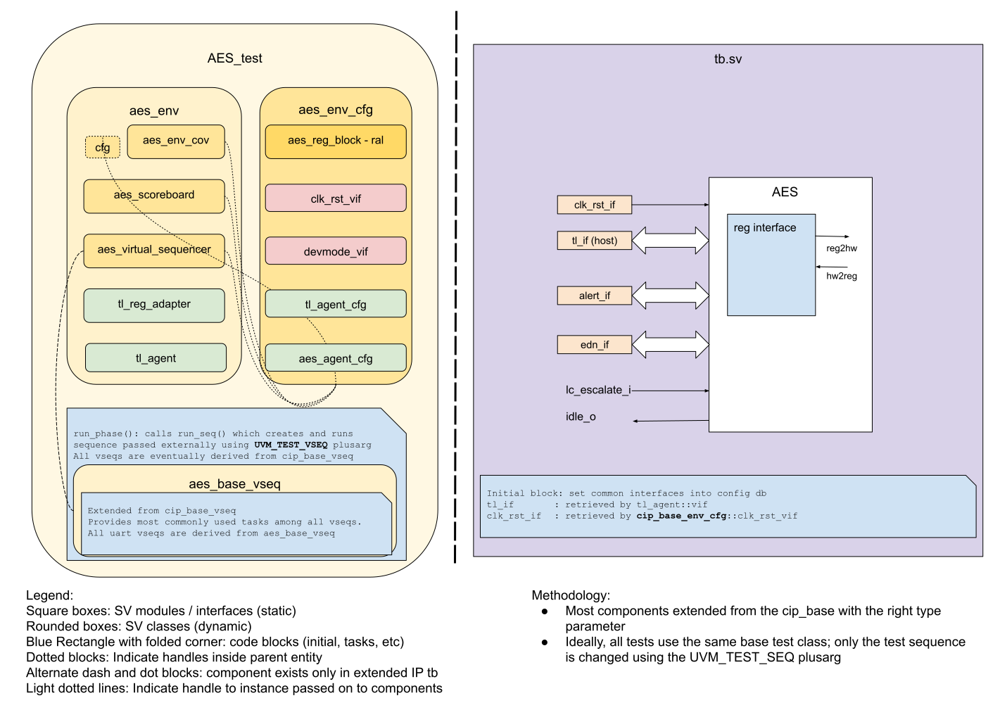

# AES DV document

## Goals
* **DV**
  * Verify all AES IP features by running dynamic simulations with a SV/UVM based testbench
  * Develop and run all tests based on the [testplan](#testplan) below towards closing code and functional coverage on the IP.
* **FPV**
  * Verify TileLink device protocol compliance with an SVA based testbench

## Current status
* [Design & verification stage](../../../README.md)
  * [HW development stages](../../../../doc/project_governance/development_stages.md)
* [Simulation results for Masked AES](https://reports.opentitan.org/hw/ip/aes_masked/dv/latest/report.html)
* [Simulation results for Unmasked AES](https://reports.opentitan.org/hw/ip/aes_unmasked/dv/latest/report.html)

## Design features
For detailed information on AES design features, please see the [AES HWIP Technical Specification](../README.md).

## Testbench architecture
AES testbench has been constructed based on the [CIP testbench architecture](../../../dv/sv/cip_lib/README.md).

### Block diagram


### Top level testbench
Top level testbench is located at `hw/ip/aes/dv/tb/tb.sv`.
It instantiates the AES DUT module `hw/ip/aes/rtl/aes.sv`.
In addition, it instantiates the following interfaces, connects them to the DUT and sets their handle into `uvm_config_db`:
* [Clock and reset interface](../../../dv/sv/common_ifs/README.md)
* [TileLink host interface](../../../dv/sv/tl_agent/README.md)


### Common DV utility components
The following utilities provide generic helper tasks and functions to perform activities that are common across the project:
* [common_ifs](../../../dv/sv/common_ifs/README.md)
* [dv_utils_pkg](../../../dv/sv/dv_utils/README.md)
* [csr_utils_pkg](../../../dv/sv/csr_utils/README.md)

### Global types & methods
All common types and methods defined at the package level can be found in `aes_env_pkg`.
Some of them in use are:
```systemverilog
parameter uint NUM_ALERTS = 2;
```

### TL_agent
AES instantiates (already handled in CIP base env) [tl_agent](../../../dv/sv/tl_agent/README.md)
which provides the ability to drive and independently monitor random traffic via
TL host interface into AES device.

### EDN agent

AES instantiates (already handles in the CIP base env) [edn_agent](../../edn/dv/README.md)
which provides the ability to drive and monitor edn traffic via the edn interface.

### UVM RAL model
The AES RAL model is created with the [`ralgen`](../../../dv/tools/ralgen/README.md) FuseSoC generator script automatically when the simulation is at the build stage.

It can be created manually by invoking [`regtool`](../../../../util/reggen/doc/setup_and_use.md):

### Stimulus strategy
#### Test sequences
All test sequences reside in `hw/ip/aes/dv/env/seq_lib`.
The `aes_base_vseq` virtual sequence is extended from `cip_base_vseq` and serves as a starting point.
All test sequences are extended from `aes_base_vseq`.
`aes_base_vseq` provides commonly used handles, variables, functions and tasks that the test sequences can simply use / call.
The tasks can be split into two groups and those that provide more complex functionality.
Simple tasks include:
* **aes_init**:    Initialize the AES module from the randomized environment variables in the config.
* **set_op**:      Set AES operation to encrypt or decrypt.
* **write_key**:   Write initial key to AES init key registers.
* **add_data**:    Add the next 128 block to the input registers.
* **read_output**:  Poll the status register for data ready bit and read the result from AES output registers.
* **clear_reg**:  Based on the input this function clears data input-, data output- or key-registers or any combination of these.
* **set_manual_trigger**: Chooses between AES auto start and manual start.
* **trigger_start**:  Set the start bit to trigger a new encryption/decryption.

More complex tasks include:
These are the ones used by the higher level sequences and the ones that should be used to create new tests from:
* **generate_message_queue**: Generate a queue of randomized message items.
Each item will describe the parameters of a message but not hold any data, the data will be added later.
This function does not call any sub-functions.
* **send_msg_queue**: Take the queue of messages items and process them one by one.
Send_msg_queue converts each message item into a queue of message transactions each called an aes_items by calling generate aes_item_queue().
Then each message now described by a queue of items is processed by calling send_msg().
* **generate_aes_item_queue**: Expands a message into a queue of a configuration item and N Data items where N = Message_length/block size.
Data is randomized based on the constraints.
* **send_msg**: Take a queue of configuration and data items and pass them to the AES for processing.
This task will handle configuration of the core based on the configuration item.
Then based on the test configuration it will do either a balanced or unbalanced processing of the data items.
A balanced processing implies that for each input the task will wait until the resulting output have been read before attempting to write the next input.
The unbalanced version will write the next data item as soon as the AES status register indicates that a new input will be accepted.
In unbalanced mode the send_msg task also handles reading the output register.
Knobs are available to control the balance between reads and writes.
In either case the status_fsm task is called.
* **status_fsm**: Read the status of the AES IP and based on the inputs return the status.
When the task is in control of reading the output register it will poll the status until it indicates that the output is valid.
It will also track the progress of processing, detecting if something has gone differently than expected.
If this happens it will try to recover.

Using these higher level functions and tasks one can build a highly customized constraint random test without low level knowledge of the test environment and the DUT.

Most tests use the aes_stress_vseq sequence as test sequence, and achieves different tests scenarios by using the constrained knobs to generate different behavior.


#### Functional coverage'
To ensure high quality constrained random stimulus, it is necessary to develop a functional coverage model.
The model will cover that the test plan is exercising the expected test points and that  we cover all functionality.
The functional coverage plan can be found here [coverage_plan](#testplan)


### Self-checking strategy
#### Scoreboard
The `aes_scoreboard` is primarily used for end to end checking.
It creates the following analysis FIFOs to retrieve the data monitored by corresponding interface agents:
* tl_a_chan_fifo: tl address channel
* tl_d_chan_fifo: tl data channel

These 2 FIFOs provide transaction items at the end of the address channel and data channel respectively.
Each FIFO is monitored and incoming transactions are stored.
Whenever a transaction is finished the sequence item is handed over to a reference model that will generate the expected response.
At the same time the scoreboard is waiting for the result of the AES module to compute.
Once complete the result is scored against the prediction made by the reference model.

The reference model is selected to be either a C-implementation or an SSL-library selected on a random basis with the default distribution of 80% OpenSSL/BoringSSL and  20% C-model.

The default behavior for the verification is that the scoreboard wait until the complete message has been encrypted/decrypted before checking the result against the reference model.

The scoreboard has a step through mode where the scoring is done after each 128bit block.
This setting is only available when using the C-model as reference and is controlled with a knob.

#### Assertions
* TLUL assertions: The `tb/aes_bind.sv` binds the `tlul_assert` [assertions](../../tlul/doc/TlulProtocolChecker.md) to the IP to ensure TileLink interface protocol compliance.
* Unknown checks on DUT outputs: The RTL has assertions to ensure all outputs are initialized to known values after coming out of reset.

## Building and running tests
We are using our in-house developed [regression tool](../../../../util/dvsim/README.md) for both building and running our tests and regressions.
Please take a look at the link for detailed information on the usage, capabilities, features and known issues.
Here's how to run a smoke test:
```console
$ $REPO_TOP/util/dvsim/dvsim.py $REPO_TOP/hw/ip/aes/dv/aes_sim_cfg.hjson -i aes_smoke
```
Here's how to run a basic test without DPI calls:
```console
$ $REPO_TOP/util/dvsim/dvsim.py $REPO_TOP/hw/ip/aes/dv/aes_${VARIANT}_sim_cfg.hjson -i aes_wakeup
```
In this run command, $VARIANT can be `masked` or `unmasked`.
## Testplan
[Testplan](../data/aes_testplan.hjson)
