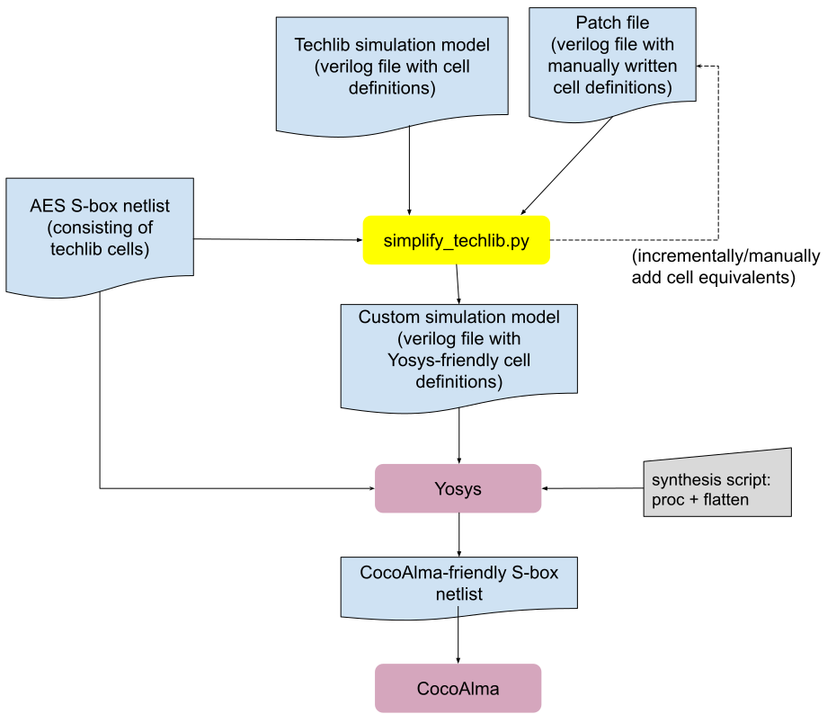

# Post-synthesis Formal Verification (CocoAlma) of AES S-box

CocoAlma is a tool that can verify a cryptographic implementation against a formal side-channel probing model.
CocoAlma takes the netlist of the cryptographic HW implementation as an input.
However, the netlist must only consist of simple gates, which excludes many complex-type gates provided by a technology library.
The flow described in this document tries to bridge this gap, by replacing the cell definitions in the netlist by their simpler equivalents (i.e. by flattening), so that we can use CocoAlma to verify this flattened netlist (which is equivalent to the original netlist).

## Introduction

The main limitation with CocoAlma is that it can only process 2-fan-in gates such as AND, NAND, XOR, NOR gates, a simple flip-flop, and a simple MUX of 2 inputs.
Therefore, the main goal behind this flow is to take a synthesized AES S-box netlist as input and provide its closest equivalent in the sense that each techlib cell is represented in terms of simpler gates accepted by CocoAlma.
By closest equivalent, we mean that:
* Each techlib cell is broken down into a simpler representation that provides the same logical behavior.
This introduces new _shadow_ wires that do not exist in the original netlist, however shadow wires do not interact with the other shadows wires from different cells.
* No cell or interconnecting _original_ wires among original cells are removed from the design.

In summary, this flow is about converting a CocoAlma-incompatible netlist into CocoAlma-compatible netlist with minimal changes.
In theory, commercial tools could also take care of this flattening, but there are two primary reasons to justify the fine-grained Yosys-based flow explained here:

1. CocoAlma  over-approximates leakages during its calculation.
This means that for complex combinatorial gates how they are broken down into simpler gates does matter.
In other words, if CocoAlma fails at verifying an otherwise-secure circuit because of its over approximation, tweaking complex cell definitions might salvage the situation (even though the mathematical definition of the cell remains the same).
This potential avenue would not be possible with commercial flows, but it is enabled by this flow.
1. We can control the flattening Yosys script in a way that can guarantee there is no optimization.
1. If the formal verification fails because of a issue in the design that leads to side-channel leakage, this transparent flow allows backtracking the root cause in the RTL more easily.

## High-level Flow

The formal verification in this flow consists of the following steps:

1. Identify all used cells in the S-box netlist so that we can understand which technology library cells are of interest.
Otherwise, because of the manual labor involved, evaluating all cells of the technology library might not be practical.
Hence, this step extracts a list of required cell names.
1. Among all cells used by the netlist, identify those that require special treatment (DFFs, clock-gating cells, buffers, complex combinatorial gates etc.) and provide simpler logical equivalent for them in verilog language.
This is a manual effort and these definitions are provided through a patch file.
1. Construct a technology library simulation verilog file, by applying the manual patches from the patch file of the previous step.
At the end, we obtain a verilog file that has Yosys-friendly definition for all required cells.
1. Use Yosys to flatten the original netlist.
This replaces each cell instantion in the netlist with their logical equivalents defined in the previous step.
1. Pass the flattened circuit `circuit.v` to CocoAlma for verification.



## Tool requirements

For this flow, we need a clone of CocoAlma tool, which also requires Yosys and verilator installed.
This flow was tested on `ot-verif-flow` branch of CocoAlma fork `https://github.com/ballifatih/coco-alma.git` with commit id 10146d0d07fcdb72ddd848c4c1b0776939d91bbd.
Note that the installation guide of CocoAlma on this particular commit requires specific tools versions, such that `yosys >= 0.15` and `verilator >= 4.106`.

CocoAlma python environment can be set up as follows (taken from "Setup and Installation" part of CocoAlma's README).

1. Clone CocoAlma:
   ```sh
   git clone https://github.com/ballifatih/coco-alma.git
   git checkout ot-verif-flow
   ```
1. Inside CocoAlma directory, set up a python virtual environment, activate the environment and install necessary packages:

   Enter the directory using
   ```sh
   cd coco-alma
   ```
   Set up a new virtual Python environment
   ```sh
   python3 -m venv dev
   source dev/bin/activate
   ```
   And install the Python requirements
   ```sh
   pip3 install -r requirements.txt
   ```
   Note that setting up virtual environment is required only once.
   Other terminal sessions can not directly access this environment, so it might require activation:
   ```sh
   source <path-to-coco-alma>/dev/bin/activate
   ```
1. Install `yosys >= 0.15` and `verilator >= 4.106`, if available in the package manager of the system.
   This guide does not cover the case where the desired versions of  are not available in the package manager.
   In that case, one might need to follow official guides to install [Yosys](https://github.com/YosysHQ/Yosys) and [verilator](https://www.veripool.org/projects/verilator/wiki/Installing).
1. Although not necessary, it is recommended to follow [the example](https://github.com/IAIK/coco-alma/blob/master/readme.md#example) from CocoAlma's guideline to confirm that CocoAlma is running without issues.

## Other requirements

Besides the CocoAlma tool, this flow requires access to verilog simulation file of the technology library, and a manually prepared cell patch file, and a synthesized AES S-box.
These files are only available through the private ASIC repo with restricted access.

   1. The simulation verilog file contains the behavioral model of cells and this is provided as part of the silicon technology toolkit.

   1. A manually-prepared cell patch file contains some of complex cells from the simulation file and it is incrementally and manually prepared.
   This file is updated every time a netlist change introduces another new complex cell that CocoAlma cannot handle.

   1. Synthesized AES S-box is generally extracted during the chip-level synthesis flow.
Optionally, a similar netlist can also be produced with the existing synthesis scripts of AES HWIP.
This flow does not address how to synthesize a netlist, it rather assumes that the netlist is given as input.

## Running the flow

Before running the flow, envrionment variables that define necessary paths must be loaded.
Based on the local insallation, a few variables might require fixing:
  * `REPO_TOP` should refer to the top directory of opentitan-discrete.
  * `ASIC_TOP` should refer to the shared ASIC technology library repo (with limited access).
  * `ALMA_TOP` should refer to the top directory of CocoAlma.

The other variables usually do not need editing.

1. Load the environment variables:
   ```sh
   source ${REPO_TOP}/util/build_consts.sh
   source ${REPO_TOP}/hw/ip/aes/pre_sca/alma_post_syn/load_env.sh
   ```
1. Activate the python environment:
   ```sh
   source ${ALMA_TOP}/dev/bin/activate
   ```
1. Run the verification flow:
   ```sh
   ${REPO_TOP}/hw/ip/aes/pre_sca/alma_post_syn/verify_aes_post_syn.sh
   ```
   which should print something like below indicating that verification succeeded:
   ```sh
   ...
   Finished in 0.42
   The execution is secure
   ```

## Incrementally updating the flow

### Format of the simulation model (verilog) file
The python script `simplify_techlib.py` makes few assumptions on the simulation model file from the techlib:

1. The cell definitions are wrapped with surrounding lines `` `celldefine`` and `` `endcelldefine``.
These markers are used to split cells during parsing.

1. The cell names have a particular form (e.g. `ABC_NOT2_1`) that appears after `module` where the part after the last underscore refers to the size of the cell.
The cells `ABC_NOT2_1` and `ABC_NOT2_2` are internally represented with `ABC_NOT2_` by dropping the size parameter, so that the patching effort is not repeated for the cells with the same functional description.
What is really important about the format is that the script uses a matching regexp to capture it.
If another techlib uses another format, then the regexp part of the script needs to be updated to match the corresponding format.

An example artificial cell would look like below:

```
`celldefine
module ABC_NOT2_1 (Out, In1, In2);
   output Out;
   input In1, In2;
   nand (Out, In1, In2);

   specify
   // there is usually timing information here
   // but the flow strips this part out
   endspecify

endmodule
`endcelldefine
```

### Adding complex cell definitions to the patch file

As outline above, the patch file does not provide definitions for all cells, but only those cells from the simulation model that are too complex for Yosys to digest.
A single synthesis of AES S-box contains only a small selection of cells from the technology library, and therefore the patch file only addresses the complex cells from this very subset.
When AES S-box is synthesized again with other parameters, leading to a fresh netlist, that netlist is likely (but not necessarily) to include complex gates that the patch file does not address.
Hence these new complex cell definitions need to be incrementally added to the patch file, so that Yosys flow can use them without an issue.

The first simple thing to do with a fresh netlist is to try to run the flow, in order to understand whether new complex cells are introduced into the flow.
If this is the case, an error like following appers, indicating that Yosys is not able to process the raw definition of a cell coming from techlib:

```
Starting yosys synthesis...
/tmp/alma_tmp/modified_cell_library.v:46: ERROR: syntax error, unexpected '(', expecting TOK_ID or '#'
```

In this example, the root cause is the scan flip flop cell called `ABC_SFF_1`, whose definition includes custom `mux` primitive defined in the same techlib file.
Yosys complains because it does not recognize this custom primitive definition.
The solution is to rewrite the equivalent definition of the cell manually and add it to the patch file.
We define the following _template cell_ in the patch file, and every occurrence of cells `ABC_SFF_1`, `ABC_SFF_2` etc. will be replaced by this given definition by the flow.

```
`celldefine
module ABC_SFF_ (Q, SO, CK, D, SI, SE, RD);
  output Q, SO;
  input CK, D, SI, SE, RD;
  reg QQ;
  wire selected_D;
  always @ (posedge CK or negedge RD) begin
    if (!RD) begin
      QQ <= 0;
    end else begin
      QQ <= selected_D;
    end
  end
  assign selected_D = SE ? SI : D;
  assign Q = QQ;
endmodule
`endcelldefine
```

This process can be incrementally repeated until all the complex cells are defined in the patch file.
As the patch file grows, this issue should be encountered less frequently.

As a final note, if it is feasible, it is recommmended to run a functional verification on the netlist produced after the Yosys-flow, in order to check that manually defined cells do not introduce functional bugs into the design.
