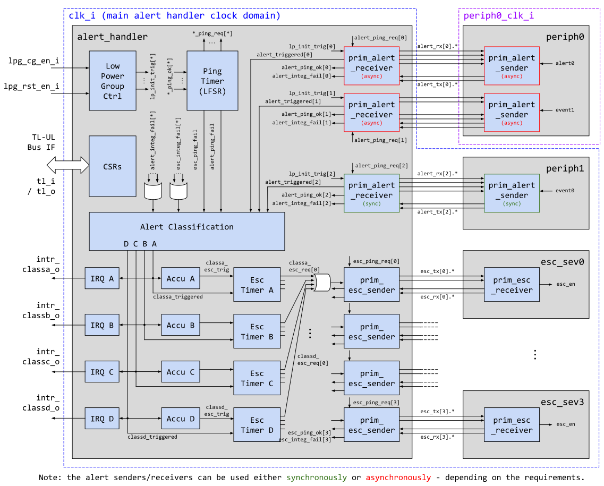

# Overview

This document specifies the functionality of the alert handler mechanism. The
alert handler is a module that is a peripheral on the chip interconnect bus,
and thus follows the [Comportability Specification]().
It gathers alerts - defined as interrupt-type signals from other peripherals
that are designated as potential security threats - throughout the design,
and converts them to interrupts that the processor can handle. If the processor
does not handle them, the alert handler mechanism provides hardware
responses to handle the threat.


## Features

- Differentially-signaled, asynchronous alert inputs from `NAlerts` peripheral
sources, where `NAlerts` is a function of the requirements of the peripherals.

- Ping testing of alert sources: responder module requests periodic alert
response from each source to ensure proper wiring.

- Register locking on all configuration registers.
    - Once locked, can not be modified by software until next system reset.

- Register-based assignment of alert to alert-class.
    - Four classes, can be individually disabled.
    - Each class generates one interrupt.
    - Disambiguation history for software to determine which alert caused the
    class interrupt.
    - Each class has configurable response time for escalation.
    - Disable allows for ignoring alerts, should only be used in cases when
    alerts are faulty. Undesirable access is enforced by locking the register
    state after initial configuration.

- Register-based escalation controls.
    - Number of alerts in class before escalation.
    - Timeout for unhandled alert IRQs can also trigger escalation.
    - Configurable escalation enables for 4 escalation signals.
        - Could map to NMI, wipe secrets signal, lower privilege, chip reset,
         etc.
        - Escalation signals differentially-signaled with heartbeat, will
         trigger response if differential or heartbeat failure at destination.
    * Configurable time in cycles between each escalation level.

- Two locally sourced hardware alerts.
    - Differential signaling from a source has failed.
    - Ping response from a source has failed.


## Description

The alert handler module manages incoming alerts from throughout the system,
classifies them, sends interrupts, and escalates interrupts to hardware
responses if the processor does not respond to any interrupts. The intention is
for this module to be a stand-in for security responses in the case where the
processor can not handle the security alerts.

It is first notable that all security alerts are rare events. Module and top
level designers should only designate events as alerts if they are expected to
never happen, and if they have potential security consequences. Examples are
parity errors (which might indicate an attack), illegal actions on cryptography
or security modules, physical sensors of environmental modification
(e.g. voltage, temperature), etc. Alerts will be routed through this module and
initially converted to interrupts for the processor to handle. The expectation
is that the secure operating system has a protocol for handling any such alert
interrupt in software. The operating system should respond, then clear the
interrupt. Since these are possible security attacks, the response is not always
obvious, but the response is beyond the scope of this document.

This module is designed to help the full chip respond to security threats in the
case where the processor is not trusted: either it has been attacked, or is not
responding. It does this by escalating alerts beyond a processor interrupt. It
provides four such escalation signals that can be routed to chip functions for
attack responses. This could include such functions as wiping secret chip
material, power down, reset, etc. It is beyond the scope of this document to
specify what those escalation responses are at the chip level.

To ease software management of alerts, classification is provided
whereby each alert can be classified into one of four classes. How the
classification is done by software is beyond the scope of this document, but it
is suggested that alerts of a similar profile (risk of occurring, level of
security concern, frequency of false trigger, etc) are classed together. For
each class a counter of alerts is kept, clearable by software. If that counter
exceeds a programmable maximum value, then the escalation protocol for that
class begins.

The details for alert signaling, classification, and escalation are all given in
the Theory of Operations section.


# Theory of Operations

## Block Diagram

The figure below shows a block diagram of the alert handler module, as well as
a few examples of alert senders in other peripheral modules. In this diagram,
there are seven sources of alerts: three sources from external modules (two from
`periph0` and one from `periph1`), and four local sources (`alert_ping_fail`,
`alert_sig_int`, `esc_ping_fail`, `esc_sig_int`). The local sources represent
alerts that are created by this module itself. See the later section on special
local alerts.



Also shown are internal modules for classification, interrupt generation,
accumulation, escalation and ping generation. These are described later in the
document. Note that the differential alert sender and receiver blocks used for
alert signaling support both _asynchronous_ and _synchronous_ clocking schemes,
and hence peripherals able to raise alerts may be placed in clock domains
different from that of the alert handler (Jittered clock domains are also
supported in the asynchronous clocking scheme). Proper care must however be
taken when formulating the timing constraints for the diff pairs, and when
determining clock-dependent parameters (such as the ping timeout) of the design.
On the escalation sender / receiver side, the differential signaling blocks
employ a fully synchronous clocking scheme throughout.

## Hardware Interfaces

### Parameters

The following table lists the main parameters used throughout the alert handler
design. Note that the alert handler is generated based on the system
configuration, and hence these parameters are placed into a package as
"localparams". The parameterization rules are explained in more detail in the
architectural description.

Localparam     | Default (Max)         | Top Earlgrey | Description
---------------|-----------------------|--------------|---------------
`NAlerts`      | 8 (248)               | 1            | Number of alert instances. Maximum number bounded by LFSR implementation that generates ping timing.
`EscCntWidth`  | 32 (32)               | 32           | Width of the escalation counters in bit.
`AccuCntWidth` | 16 (32)               | 16           | Width of the alert accumulation counters in bit.
`AsyncOn`      | '0 (2^`NAlerts`-1)    | `1'b0`       | This is a bit array specifying whether a certain alert sender / receiver pair goes across an asynchronous boundary or not.
`LfsrSeed`     | '1 (2^31-1)           | `0x7fffffff` | Seed for the LFSR timer, must be nonzero.

The next table lists free parameters in the `prim_alert_sender` and
`prim_alert receiver` submodules.

Parameter      | Default (Max)    | Description
---------------|------------------|---------------
`AsyncOn`      | `1'b0` (`1'b1`)  | 0: Synchronous, 1: Asynchronous, determines whether additional synchronizer flops and logic need to be instantiated.


### Signals



The table below lists other alert handler module signals. The number of alert
instances is parametric and hence alert and ping diff pairs are grouped together
in packed arrays. The diff pair signals are indexed with the corresponding alert
instance `<number>`.

Signal                  | Direction        | Type                      | Description
------------------------|------------------|----------------           |---------------
`crashdump_o`           | `output`         | packed `struct`           | This is a collection of alert handler state registers that can be latched by hardware debugging circuitry, if needed.
`entropy_i`             | `input`          | `logic`                   | Entropy input bit for LFSRtimer (can be connected to TRNG, otherwise tie off to `1'b0` if unused).
`alert_tx_i[<number>]`  | `input`          | packed `alert_tx_t` array | Incoming alert or ping response(s), differentially encoded. Index range: `[NAlerts-1:0]`
`alert_rx_o[<number>]`  | `output`         | packed `alert_rx_t` array | Outgoing alert acknowledgment and ping requests, differentially encoded. Index range: `[NAlerts-1:0]`
`esc_tx_o[<sev>]`       | `output`         | packed `esc_tx_t` array   | Escalation or ping request, differentially encoded. Index corresponds to severity level, and ranges from 0 to 3.
`esc_rx_i[<sev>]`       | `input`          | packed `esc_rx_t` array   | Escalation ping response, differentially encoded. Index corresponds to severity level, and ranges from 0 to 3.


For each alert, there is a pair of input and two pairs of output signals. These
signals are connected to a differential sender module within the source, and a
differential receiver module within the alert handler. Both of these modules are
described in more detail in the following section. These signal pairs carry
differentially encoded messages that enable two types of signaling: a native
alert and a ping/response test of the alert mechanism. The latter is to ensure
that all alert senders are always active and have not been the target of an
attack. Note that low power states are not considered at this time, but could
affect the signaling and testing of alerts.

The `crashdump_o` struct outputs a collection of CSRs and alert handler state bits that can be latched by hardware debugging circuitry:

```systemverilog
  typedef struct packed {
    // alerts
    logic    [NAlerts-1:0] alert_cause;     // alert cause bits
    logic    [3:0]         loc_alert_cause; // local alert cause bits
    // class state
    logic    [3:0][15:0]   class_accum_cnt; // current accumulator value
    logic    [3:0][31:0]   class_esc_cnt;   // current escalation counter value
    cstate_e [3:0]         class_esc_state; // current escalation protocol state
  } alert_crashdump_t;
```

This can be useful for extracting more information about possible failures or bugs without having to use the tile-link bus interface (which may become unresponsive under certain circumstances).
It is recommended for the top level to store this information in an always-on location.


## Design Details

This section gives the full design details of the alert handler module and its
submodules.


### Alert Definition

Alerts are defined as events that have security implications, and should be
handled by the main processor, or escalated to other hardware modules to take
action. Each peripheral has the option to define one or more alert signals.
Those peripherals should instantiate one module (`prim_alert_sender`) to convert
the event associated with that alert into a signal to the alert handler module.
The alert handler instantiates one receiver module (`prim_alert_receiver`) per
alert, then handles the classification, accumulation, and escalation of the
received signal. The differential signaling submodules may either use a
synchronous or asynchronous clocking scheme, since the message type to be
transferred is a single discrete event.


### Differential Alert Signaling

Each alert sender is connected to the corresponding alert receiver via the 3 differential pairs `alert_tx_i/o.alert_p/n`, `alert_rx_i/o.ack_p/n` and `alert_rx_i/o.ping_p/n`, as illustrated below:


Alerts are encoded differentially and signaled using a full handshake on the `alert_tx_i/o.alert_p/n` and `alert_rx_i/o.ack_p/n` wires.
The use of a full handshake protocol allows this mechanism to be used with an asynchronous clocking strategy, where peripherals may reside in a different clock domain than the alert handler.
The full handshake guarantees that alert messages are correctly back-pressured and no alert is "lost" at the asynchronous boundary due to (possibly variable) clock ratios greater or less than 1.0.
The "native alert message" will be repeated on the output wires as long as the alert event is still true within the peripheral.

The wave pattern below illustrates differential full handshake mechanism.


{
  signal: [
    { name: 'clk_i',                wave: 'p...............' },
    { name: 'alert_req_i',          wave: '01.|..|..|...|..' },
    { name: 'alert_ack_o',          wave: '0..|..|..|10.|..' },
    { name: 'alert_tx_o/i.alert_p', wave: '01.|..|0.|..1|..' , node: '.a.....c....e'},
    { name: 'alert_tx_o/i.alert_n', wave: '10.|..|1.|..0|..' },
    { name: 'alert_rx_i/o.ack_p',   wave: '0..|1.|..|0..|1.' , node: '....b.....d..'},
    { name: 'alert_rx_i/o.ack_n',   wave: '1..|0.|..|1..|0.' },
    { name: 'alert_o',              wave: '0..|10|..|...|10' },
  ],
  edge: [
   'a~>b Phase 0/1',
   'b~>c Phase 1/2',
   'c~>d Phase 2/3',
   'd~>e 2 Pause Cycles',
  ],
  head: {
    text: 'Alert signaling and repeat pattern',
  },
  foot: {
    text: 'Native alert at time 1 with 4-phase handshake; repeated alert at time 12;',
    tick: 0,
  }
}


The handshake pattern is repeated as long as the alert is true.  The sender will
wait for 2 cycles between handshakes.

Note that the alert is immediately propagated to `alert_o` once the initial level change on `alert_tx_i.alert_p/n` has been received and synchronized to the local clock on the receiver side.
This ensures that the first occurrence of an alert is always propagated - even if the handshake lines have been manipulated to emulate backpressure.
(In such a scenario, all subsequent alerts would be back-pressured and eventually the ping testing mechanism described in the next subsection would detect that the wires have been tampered with.)

The alert sender and receiver modules can either be used synchronously or
asynchronously. The signaling protocol remains the same in both cases, but the
additional synchronizer flops at the diff pair inputs may be omitted, which
results in lower signaling latency.

### Ping Testing

In order to ensure that the event sending modules have not been compromised,
the alert receiver module `prim_alert_receiver` will "ping" or line-test the
senders periodically every few microseconds. Pings timing is randomized so their
appearance can not be predicted.


The ping timing is generated by a central LFSR-based timer within the alert handler that randomly asserts the `ping_req_i` signal of a particular `prim_alert_receiver` module.
Once `ping_req_i` is asserted, the receiver module encodes the ping message as a level change on the differential `alert_rx_o.ping_p/n` output, and waits until the sender responds with a full handshake on the `alert_tx_i.alert_p/n` and `alert_rx_o.ack_p/n` lines.
Once that handshake is complete, the `ping_ok_o` signal is asserted.
The LFSR timer has a programmable ping timeout, after which it will automatically assert a "pingfail" alert.
That timeout is a function of the clock ratios present in the system, and has to be programmed accordingly at system startup (as explained later in the LFSR timer subsection).

The following wave diagram illustrates a correct ping sequence, viewed from the receiver side:


{
  signal: [
    { name: 'clk_i',              wave: 'p..............' },
    { name: 'ping_req_i',         wave: '01.|..|..|..|.0' },
    { name: 'ping_ok_o',          wave: '0..|..|..|..|10' , node: '.............e'},
    { name: 'alert_rx_o.ping_p',  wave: '01.|..|..|..|..' , node: '.a'},
    { name: 'alert_rx_o.ping_n',  wave: '10.|..|..|..|..' , node: '.b'},
    { name: 'alert_tx_i.alert_p', wave: '0..|1.|..|0.|..' , node: '....c'},
    { name: 'alert_tx_i.alert_n', wave: '1..|0.|..|1.|..' },
    { name: 'alert_rx_o.ack_p',   wave: '0..|..|1.|..|0.' , node: '.............d'},
    { name: 'alert_rx_o.ack_n',   wave: '1..|..|0.|..|1.' },
  ],
  edge: [
   'a-b',
   'b~>c ping response',
   'd->e response complete',
  ],
  head: {
    text: 'Ping testing',
  },
  foot: {
    text: 'Level change at time 1 triggers a full handshake (ping response) at time 4',
    tick: 0,
  }
}


In the unlikely case that a ping request collides with a native alert at the
sender side, the native alert is held back until the ping handshake has been
completed. This slightly delays the transmission of a native alert, but the
alert will eventually be signaled. Further, if an alert is sent out right
before a ping requests comes in at the sender side, the receiver will treat the
alert as a ping response. However, the "true" ping response will be returned
right after the alert handshake completed, and thus the alert will eventually
be signaled with a slight delay.

Note that in both collision cases mentioned, the delay will be in the order of
the handshake length, plus the constant amount of pause cycles between
handshakes (2 sender cycles).


### Monitoring of Signal Integrity Issues

All differential pairs are monitored for signal integrity issues, and if an
encoding failure is detected, the receiver module asserts a signal integrity
alert via `integ_fail_o`. In particular, this covers the following failure
cases:

1. The `alert_tx_i.alert_p/n` pair is not correctly encoded on the receiver side.
This can be directly flagged as an integrity failure on the receiver side.

2. The `alert_rx_i.ping_p/n` or the `alert_rx_i.ack_p/n` pairs are not correctly encoded on the sender side.
This is signaled to the receiver by setting the `alert_tx_o.alert_p/n` wires to the same value, and that value will be continuously toggled.
This implicitly triggers a signal integrity alert on the receiver side.

Some of these failure patterns are illustrated in the wave diagram below:


{
  signal: [
    { name: 'clk_i',               wave: 'p..............' },
    { name: 'alert_tx_o.alert_p',  wave: '0.1...|0..10101' , node: '..a.......d'},
    { name: 'alert_tx_o.alert_n',  wave: '1.....|....0101' },
    { name: 'alert_rx_i.ack_p',    wave: '0.....|.1......' , node: '........c'},
    { name: 'alert_rx_i.ack_n',    wave: '1.....|........' },
    { name: 'integ_fail_o',        wave: '0...1.|0....1..' , node: '....b.......e'},
  ],
  edge: [
   'a~>b sigint issue detected',
   'c~>d',
   'd~>e indirect sigint issue detected',
  ],
  head: {
    text: 'Detection of Signal Integrity Issues',
  },
  foot: {
    text: 'signal integrity issues occur at times 2 and 8; synchronizer latency is 2 cycles.',
    tick: 0,
  }
}


Note that if signal integrity failures occur during ping or alert handshaking,
it is possible that the protocol state-machines lock up and the alert sender and
receiver modules become unresponsive. However, the above mechanisms ensure that
this will always trigger either a signal integrity alert or eventually a
"pingfail" alert.

### Skew on Asynchronous Differential Pairs

Note that there is likely a (small) skew present within each differential pair
of the signaling mechanism above. Since these pairs cross clock domain
boundaries, it may thus happen that a level change appears in staggered manner
after resynchronization, as illustrated below:


{
  signal: [
    { name: 'clk_i',   wave: 'p...........' },
    { name: 'diff_p',  wave: '0.1.|.0.|..1' , node: '......a....d' },
    { name: 'diff_n',  wave: '1.0.|..1|.0.' , node: '.......b..c.' },
  ],
  edge: [
   'a-~>b skew',
   'c-~>d skew'
  ],
  head: {
    text: 'Skewed diff pair',
  },
  foot: {
    text: 'Correctly sampled diff pair at time 2; staggered samples at time 6-7 and 10-11',
    tick: 0,
  }
}


This behavior is permissible, but needs to be accounted for in the protocol
logic. Further, the skew within the differential pair should be constrained to
be smaller than the shortest clock period in the system. This ensures that the
staggered level changes appear at most 1 cycle apart from each other.


### LFSR Timer

The `ping_req_i` inputs of all signaling modules (`prim_alert_receiver`, `prim_esc_sender`) instantiated within the alert handler are connected to a central ping timer that determines the random amount of wait cycles between ping requests.
Further, this ping timer also randomly selects a particular line to be pinged.
That should make it more difficult to predict the next ping occurrence based on past observations.

The ping timer is implemented using an
[LFSR-based PRNG of Galois type](). In order
to increase the entropy of the pseudo random sequence, 1 random bit from the
TRNG is XOR'ed into the LFSR state every time a new random number is drawn
(which happens every few 10k cycles). The LFSR is 32bits wide, but only 24bits
of its state are actually being used to generate the random timer count and
select the alert/escalation line to be pinged. I.e., the 32bits first go through
a fixed permutation function, and then bits `[23:16]` are used to determine which
peripheral to ping. The random cycle count is created by splitting bits `[15:0]`
and concatenating them as follows:

```
cycle_cnt = {permuted[15:2], 8'b01, permuted[1:0]}
```

This constant DC offset introduces a minimum ping spacing of 4 cycles (1 cycle +
margin) to ensure that the handshake protocols of the sender receiver pairs work.

After selecting one of the peripherals to ping, the LFSR timer waits until
either the corresponding `*_ping_ok[<number>]`  signal is asserted, or until the
programmable ping timeout value is reached. In both cases, the LFSR timer
proceeds with the next ping, but in the second case it will additionally raise a
"pingfail" alert. The ping enable signal remains asserted during the time where
the LFSR counter waits.

The timeout value is a function of the ratios between the alert handler clock
and peripheral clocks present in the system, and can be programmed at startup
time via the register . Note that this register is locked in
together with the alert enable and disable configuration.

The ping timer starts as soon as the initial configuration phase is over and the
registers have been locked in.

Note that the ping timer directly flags a "pingfail" alert if a spurious "ping
ok" message comes in that has not been requested.


### Alert Receiving

The alert handler module contains one alert receiver module
(`prim_alert_receiver`) per sending module. This receiver module has three
outputs based upon the signaling of the input alert. Primary is the signal of a
received native alert, shown in the top-level diagram as
`alert_triggered[<number>]`. Also generated are two other outputs, one that
signals a differential encoding error (`alert_integ_fail[<number>]`), and one
that signals the receipt of a ping response (`alert_ping_ok[<number>]`). Each
"triggered" alert received is sent into the classification block for individual
configuration. All of the `integ_fail` signals are OR'ed together to create one
alert for classification. The ping responses are fed to the LFSR timer, which
determines whether a ping has correctly completed within the timeout window or
not.


### Alert Classification and Interrupts

Each of the incoming and local alert signals can be classified generically to
one of four classes, or disabled for no classification at all. These are the
classes A, B, C, and D. There is no pre-determined definition of a class, that
is left to software. But for guidance, software can consider that some alert
types are similar to others; some alert types are more "noisy" than others
(i.e. when triggered they stay on for long periods of time); some are more
critical than others, etc.

For each alert class (A-D), an interrupt is generally sent. Like all other
peripheral interrupts, there is a triad of registers: enable, status, test. Thus
like all other interrupts, software should handle the source of the interrupt
(in this case, the original alert), then clear the state. Since the interrupt
class is disassociated with the original alert (due to the classification
process), software can access cause registers to determine which alerts have
fired since the last clearing. Since alerts are expected to be rare (if ever)
events, the complexity of dealing with multiple interrupts per class firing
during the same time period should not be of concern. See the programming
section on interrupt clearing.

Each of the four interrupts can optionally trigger a timeout counter that
triggers escalation if the interrupt is not handled and cleared within a certain
time frame. This feature is explained in more detail in the next subsection
about escalation mechanisms.

Note that an interrupt always fires once an alert has been registered in the
corresponding class. Interrupts are not dependent on escalation mechanisms like
alert accumulation or timeout as described in the next subsection.


### Escalation Mechanisms

There are two mechanisms per class that can trigger the corresponding escalation
protocol:

1. The first consists of an accumulation counter that counts the amount of alert
   occurrences within a particular class. An alert classified to class A
   indicates that on every received alert trigger, the accumulation counter for
   class A is incremented. Note: since alerts are expected to be rare or never
   occur, the module does not attempt to count every alert per cycle, but rather
   all triggers per class are ORd before sending to the accumulation counter as
   an increment signal. Once the threshold has been reached, the next occurrence
   triggers the escalation escalation protocol for this particular class. The
   counter is a saturation counter, meaning that it will not wrap around once it
   hits the maximum representable count. This mechanism has two associated CSRs:

    - Accumulation max value. This is the total number (sum of all alerts
      classified in this group) of alerts required to enter escalation phase
      (see below). Example register is .
    - Current accumulation register. This clearable register indicates how many
      alerts have been accumulated to date. Software should clear before it
      reaches the accumulation setting to avoid escalation. Example register is
      .

2. The second way is an interrupt timeout counter which triggers escalation
   if an alert interrupt is not handled within the programmable timeout
   window. Once the counter hits the timeout threshold, the escalation
   protocol is triggered. The corresponding CSRs are:

    - Interrupt timeout value in cycles . The
      interrupt timeout is disabled if this is set to 0 (default).
    - The current interrupt timeout value can be read via 
      if  is in the `Timeout` state. Software should clear the
      corresponding interrupt state bit  before the
      timeout expires to avoid escalation.

Technically, the interrupt timeout feature (2. above) is implemented using the
same counter used to time the escalation phases. This is possible since
escalation phases or interrupt timeout periods are non-overlapping (escalation
always takes precedence should it be triggered).


### Programmable Escalation Protocol

There are four output escalation signals, 0, 1, 2, and 3. There is no
predetermined definition of an escalation signal, that is left to the
top-level integration. Examples could be processor Non Maskable Interrupt (NMI),
privilege lowering, secret wiping, chip reset, etc. Typically the assumption
is that escalation level 0 is the first to trigger, followed by 1, 2, and then
3, emulating a "fuse" that is lit that can't be stopped once the first triggers
(this is however not a requirement). See register section for discussion of
counter clearing and register locking to determine the finality of accumulation
triggers.

Each class can be programmed with its own escalation protocol. If one of the two
mechanisms described above fires, a timer for that particular class is started.
The timer can be programmed with up to 4 delays (e.g., ),
each representing a distinct escalation phase (0 - 3). Each of the four
escalation severity outputs (0 - 3) are by default configured to be asserted
during the corresponding phase, e.g., severity 0 in phase 0,  severity 1 in
phase 1, etc. However, this mapping can be freely reassigned by modifying the
corresponding enable/phase mappings (e.g.,  for enable bit
0 of class A). This mapping will be locked in together with the alert enable
configuration after initial configuration.

SW can stop a triggered escalation protocol by clearing the corresponding
escalation counter (e.g., ). Protection of this clearing is up
to software, see the register control section that follows for
.

It should be noted that each of the escalation phases have a duration of at
least 1 clock cycle, even if the cycle count of a particular phase has been
set to 0.

The next waveform shows the gathering of alerts of one class until eventually
the escalation protocol is engaged. In this diagram, two different alerts are
shown for class A, and the gathering and escalation configuration values are
shown.


{
  signal: [
    { name: 'clk_i',                wave: 'p...................' },
    { name: 'CLASSA_ACCUM_THRESH',  wave: '2...................', data: ['15'] },
    { name: 'CLASSA_PHASE0_CYC',    wave: '2...................', data: ['1e3 cycles'] },
    { name: 'CLASSA_PHASE1_CYC',    wave: '2...................', data: ['1e4 cycles'] },
    { name: 'CLASSA_PHASE2_CYC',    wave: '2...................', data: ['1e5 cycles'] },
    { name: 'CLASSA_PHASE3_CYC',    wave: '2...................', data: ['1e6 cycles'] },
    { name: 'alert_triggered[0]',   wave: '010|.10.............' },
    { name: 'alert_triggered[1]',   wave: '0..|10..............' },
    { name: 'CLASSA_ACCUM_CNT',     wave: '33.|33..............', data: ['0', '1','15','16'] },
    { name: 'irq_o[0]',             wave: '01.|................' },
    { name: 'CLASSA_STATE',         wave: '3..|.3|3.|3..|3..|3.', data: ['Idle', '   Phase0','Phase1','Phase2','Phase3','Terminal'] },
    { name: 'CLASSA_ESC_CNT',       wave: '3..|.3|33|333|333|3.', data: ['0','1','1','2','1','2','3','1','2','3','0'] },
    { name: 'esc_tx_o.esc_p[0]',    wave: '0..|.1|.0...........', node: '.....a..b' },
    { name: 'esc_tx_o.esc_n[0]',    wave: '1..|.0|.1...........' },
    { name: 'esc_tx_o.esc_p[1]',    wave: '0..|..|1.|.0........', node: '.......c...d' },
    { name: 'esc_tx_o.esc_n[1]',    wave: '1..|..|0.|.1........' },
    { name: 'esc_tx_o.esc_p[2]',    wave: '0..|.....|1..|.0....', node: '..........e....f' },
    { name: 'esc_tx_o.esc_n[2]',    wave: '1..|.....|0..|.1....' },
    { name: 'esc_tx_o.esc_p[3]',    wave: '0..|.........|1..|.0', node: '..............g....h' },
    { name: 'esc_tx_o.esc_n[3]',    wave: '1..|.........|0..|.1' },
  ],
  edge: [
   'a->b 1e3 + 1 cycles',
   'c->d 1e4 + 1 cycles',
   'e->f 1e5 + 1 cycles',
   'g->h 1e6 + 1 cycles',
  ],
  head: {
    text: 'Alert class gathering and escalation triggers (fully synchronous case)',
  },
  foot: {
    text: 'alert class A gathers 16 alerts, triggers first escalation, followed by three more',
    tick: 0,
    }
}


In this diagram, the first alert triggers an interrupt to class A. The
assumption is that the processor is wedged or taken over, in which case it
does not handle the interrupt. Once enough interrupts gather (16 in this case),
the first escalation phase is entered, followed by three more (each phase has
its own programmable length). Note that the accumulator threshold is set to 15
in order to trigger on the 16th occurrence. If escalation shall be triggered on
the first occurrence within an alert class, the accumulation threshold shall be
set to 0. Also note that it takes one cycle to activate escalation and enter
phase 0.

The next wave shows a case where an interrupt remains unhandled and hence the
interrupt timeout counter triggers escalation.


{
  signal: [
    { name: 'clk_i',                   wave: 'p.....................' },
    { name: 'CLASSA_TIMEOUT_CYC',      wave: '2.....................', data: ['1e4 cycles'] },
    { name: 'alert_triggered[0]',      wave: '010.|.................' },
    { name: 'irq_o[0]',                wave: '01..|.................', node: '.a..|.b' },
    { name: 'CLASSA_ESC_STATE',        wave: '33..|.3|3.|3..|3...|3.', data: ['Idle', 'Timeout','   Phase0','Phase1','Phase2','Phase3','Terminal'] },
    { name: 'CLASSA_ESC_CNT',          wave: '3333|33|33|333|3333|3.', data: ['0', '1','2','3','1e4','1','1','2','1','2','3','1','2','3','4','0'] },
    { name: 'esc_tx_o.esc_p[0]',       wave: '0...|.1|.0............' },
    { name: 'esc_tx_o.esc_n[0]',       wave: '1...|.0|.1............' },
    { name: 'esc_tx_o.esc_p[1]',       wave: '0...|..|1.|.0.........' },
    { name: 'esc_tx_o.esc_n[1]',       wave: '1...|..|0.|.1.........' },
    { name: 'esc_tx_o.esc_p[2]',       wave: '0...|.....|1..|.0.....' },
    { name: 'esc_tx_o.esc_n[2]',       wave: '1...|.....|0..|.1.....' },
    { name: 'esc_tx_o.esc_p[3]',       wave: '0...|.........|1...|.0' },
    { name: 'esc_tx_o.esc_n[3]',       wave: '1...|.........|0...|.1' },
  ],
  edge: [
   'a->b 1e4 cycles',
  ],
  head: {
    text: 'Escalation due to an interrupt timeout (fully synchronous case)',
  },
  foot: {
    text: 'alert class A triggers an interrupt and the timeout counter, which eventually triggers escalation after 1e4 cycles.',
    tick: 0,
    }
}


It should be noted here that the differential escalation signaling protocol
distinguishes 'true' escalation conditions from mere pings by encoding them as
pulses that are N + 1 cycles long. This is reflected in the two wave diagrams
above. Refer to the subsequent section on escalation signaling for more details.

### Escalation Signaling

For each of the four escalation severities, the alert handler instantiates a
`prim_esc_sender` module and each of the four escalation countermeasures
instantiates an `prim_esc_receiver` module. The signaling mechanism has
similarities with the alert signaling mechanism - but it is a fully
synchronous protocol. Hence, it must be ensured at the top-level that all
escalation sender and receiver modules are using the same clock and reset
signals.

As illustrated in the following block diagram, a sender-receiver pair is
connected with two differential lines, one going from sender to receiver and
the other going from receiver to sender.


Upon receiving an escalation enable pulse of width N > 0 at the `esc_req_i`
input, the escalation sender encodes that signal as a differential pulse of
width N+1 on `esc_tx.esc_p/n`. The receiver decodes that message and asserts the
`esc_req_o` output after one cycle of delay. Further, it acknowledges the receipt
of that message by continuously toggling the `esc_rx.resp_p/n` signals as long
as the escalation signal is asserted. Any failure to respond correctly will
trigger a `integ_fail_o` alert, as illustrated below:


{
  signal: [
    { name: 'clk_i',             wave: 'p..................' },
    { name: 'ping_req_i',        wave: '0........|.........' },
    { name: 'ping_ok_o',         wave: '0........|.........' },
    { name: 'integ_fail_o',      wave: '0........|..1010...' , node: '............b.d' },
    { name: 'ping_fail_o',       wave: '0........|.........' },
    { name: 'esc_req_i',         wave: '01....0..|.1....0..' },
    { name: 'esc_rx_i/o.resp_p', wave: '0.101010.|.........',  node: '............a.c' },
    { name: 'esc_rx_i/o.resp_n', wave: '1.010101.|.........' },
    { name: 'esc_tx_o/i.esc_p',  wave: '01.....0.|.1.....0.' },
    { name: 'esc_tx_o/i.esc_n',  wave: '10.....1.|.0.....1.' },
    { name: 'esc_req_o',         wave: '0.1....0.|..?....0.'},
  ],
  edge: [
   'a~>b missing response',
   'c~>d',
  ],
  head: {
    text: 'Escalation signaling and response',
  },
  foot: {
    text: 'escalation enable pulse shown at input sender at time 1 and 11; missing response and repeated integfail at time 12 and 14',
    tick: 0,
  }
}


Further, any differential signal mismatch on both the `esc_tx_i.esc_p/n` and `esc_rx_i.resp_p/n` lines will trigger an `integ_fail_o` alert.
Mismatches on `esc_rx_i.resp_p/n` can be directly detected at the sender.
Mismatches on the `esc_tx_i.esc_p/n` line will be signaled back to the sender by setting both the positive and negative response wires to the same value - and that value is being toggled each cycle.
This implicitly triggers a signal integrity alert on the sender side.

This back-signaling mechanism can be leveraged to fast-track escalation and use
another countermeasure in case it is detected that a particular escalation
signaling path has been tampered with.

Some signal integrity failure cases are illustrated in the wave diagram below:


{
  signal: [
    { name: 'clk_i',           wave: 'p...........' },
    { name: 'ping_req_i',      wave: '0....|......' },
    { name: 'ping_ok_o',       wave: '0....|......' },
    { name: 'integ_fail_o',    wave: '0.1.0|.1....' , node: '..b....e' },
    { name: 'esc_req_i',       wave: '0....|......' },
    { name: 'esc_rx_i.resp_p', wave: '0.1.0|..1010',  node: '..a..' },
    { name: 'esc_rx_i.resp_n', wave: '1....|.01010',  node: '.......d' },
    { name: 'esc_tx_i.esc_p',  wave: '0....|1.....',  node: '......c..' },
    { name: 'esc_tx_i.esc_n',  wave: '1....|......' },
    { name: 'esc_req_o',       wave: '0....|......'},
  ],
  edge: [
   'a~>b',
   'c->d',
   'd->e',
  ],
  head: {
    text: 'possible signal integrity failure cases',
  },
  foot: {
    text: 'direct signal integrity failure at time 2; indirect failure at time 6',
    tick: 0,
  }
}



### Ping Testing of the Escalation Signals


Similarly to the alert signaling scheme, the escalation signaling lines can be pinged / line tested in order to test whether the escalation receiver has been tampered with.
This is achieved by asserting `ping_req_i` at the escalation sender module.
A ping request is encoded as a single cycle pulse on the `esc_tx_o.esc_p/n` outputs.
Hence, the receiver module will not decode this single cycle pulse as an escalation enable message, but it will respond to it with a "1010" pattern on the `esc_rx_i.resp_p/n` lines.
The escalation sender module will assert `ping_ok_o` if that pattern is received correctly after one cycle of latency.
Otherwise, the escalation sender will first assert `integ_fail_o` later, after the programmable ping timeout is reached, the LFSR timer will raise a "pingfail" alert.
The `integ_fail_o` triggers in this case since "no ping response" and "wrong ping response" are ambiguous in this setting, and it has been decided to not suppress integrity failures when expecting a ping response.

This mechanism is illustrated below from the viewpoint of the sender module.


{
  signal: [
    { name: 'clk_i',           wave: 'p..............' },
    { name: 'ping_req_i',      wave: '01....0|.1.....' ,  node: '.a'},
    { name: 'ping_ok_o',       wave: '0....10|.......' ,  node: '.....e....g'},
    { name: 'integ_fail_o',    wave: '0......|..10101' },
    { name: 'esc_req_i',       wave: '0......|.......' },
    { name: 'esc_rx_i.resp_p', wave: '0.1010.|.......' ,  node: '..c..d....f'},
    { name: 'esc_rx_i.resp_n', wave: '1.0101.|.......' },
    { name: 'esc_tx_o.esc_p',  wave: '010....|.10....' ,  node: '.b'},
    { name: 'esc_tx_o.esc_n',  wave: '101....|.01....' },
  ],
  edge: [
  'a->b',
  'b->c',
  'd->e correct response',
  'f->g missing response',
  ],
  head: {
    text: 'ping testing of escalation lines',
  },
  foot: {
    text: 'ping trig at sender input at time 1 and 9; correct response at time 5; missing response at time 10',
    tick: 0,
  }
}


Note that the escalation signal always takes precedence, and the `ping_req_i` will just be acknowledged with `ping_ok_o` in case `esc_req_i` is already asserted.
An ongoing ping sequence will be aborted immediately.

Another thing to note is that the ping and escalation response sequences have to start _exactly_ one cycle after either a ping or escalation event has been signalled.
Otherwise the escalation sender will assert `integ_fail_o` immediately.

# Programmers Guide


## Power-up and Reset Considerations

False alerts during power-up and reset are not possible since the alerts are
disabled by default, and need to be configured and locked in by the firmware.

The ping timer won't start until initial configuration is over and the registers
are locked in.


## Initialization

To initialize the block, software running at a high privilege levels (early in
the security settings process) should do the following:

1. For each alert and each local alert:

    - Determine if alert is enabled (should only be false if alert is known to
      be faulty).
      Set  and  accordingly.

    - Determine which class (A..D) the alert is associated with. Set
       and  accordingly.

    - Optionally lock each alert configuration by writing 0 to  or .
      Note however that only **locked and enabled** alerts are going to be pinged using the ping mechanism.
      This ensures that spurious ping failures cannot occur when previously enabled alerts are being disabled again (before locking).


2. Set the ping timeout value . This value is dependent on
   the clock ratios present in the system.

3. For each class (A..D):

    - Determine whether to enable escalation mechanisms (accumulation /
      interrupt timeout) for this particular class. Set 
      accordingly.

    - Determine if this class of alerts allows clearing of
      escalation once it has begun. Set  to true if clearing
      should be disabled. If true, once escalation protocol begins, it can not
      be stopped, the assumption being that it ends in a chip reset else it
      will be rendered useless thenceforth.

    - Determine the number of alerts required to be accumulated before
      escalation protocol kicks in. Set  accordingly.

    - Determine whether the interrupt associated with that class needs a
      timeout. If yes, set  to an appropriate value greater
      than zero (zero corresponds to an infinite timeout and disables the
      mechanism).

    - For each escalation phase (0..3):
        - Determine length of each escalation phase by setting
           accordingly

    - For each escalation signal (0..3):
        - Determine whether to enable the escalation signal, and set the
           bit accordingly (default is enabled).
          Note that setting all of the `E*_EN` bits to 0 within a class has the same
          effect of disabling the entire class by setting  to zero.
        - Determine the phase -> escalation mapping of this class and
          program it via the  values if it needs to be
          changed from the default mapping (0->0, 1->1, 2->2, 3->3).

    - Optionally lock the class configuration by writing 0 to .

4. After initial configuration at startup, enable the ping timer mechanism by writing 1 to .
It is also recommended to lock the ping timer configuration by clearing .
Note that only **locked and enabled** alerts are going to be pinged using the ping mechanism.
This ensures that spurious ping failures cannot occur when previously enabled alerts are being disabled again (before locking).

## Interrupt Handling

For every alert that is enabled, an interrupt will be triggered on class A, B,
C, or D. To handle an interrupt of a particular class, software should execute
the following steps:

1. If needed, check the escalation state of this class by reading
   . This reveals whether escalation protocol has been triggered
   and in which escalation phase the class is. In case interrupt timeouts are
   enabled the class will be in timeout state unless escalation has already been
   triggered. The current interrupt or escalation cycle counter can be read via
   .

2. Since the interrupt does not indicate which alert triggered, SW must read the
   cause registers  and  etc. The cause bits of
   all alerts are concatenated and chunked into 32bit words. Hence the register
   file contains as many cause words as needed to cover all alerts present in
   the system. Each cause register contains a sticky bit that is set by the
   incoming alert, and is clearable with a write by software. This should only
   be cleared after software has cleared the event trigger, if applicable. It is
   possible that the event requires no clearing (e.g. a parity error), or can't
   be cleared (a breach in the metal mesh protecting the chip).

   Note that in the rare case when multiple events are triggered at or about the
   same time, all events should be cleared before proceeding.

3. After the event is cleared (if needed or possible), software should handle
the interrupt as follows:

    - Resetting the accumulation register for the class by writing .
      This also aborts the escalation protocol if it has been triggered. If for some
      reason it is desired to never allow the accumulator or escalation to be
      cleared, software can initialize the  register to zero.
      If  is already false when an alert interrupt is detected
      (either due to software control or hardware trigger via
      ), then the accumulation counter can not be cleared and
      this step has no effect.

    - After the accumulation counter is reset (if applicable), software should
      clear the class A interrupt state bit . Clearing the
      class A interrupt state bit also clears and stops the interrupt timeout
      counter (if enabled).

Note that testing interrupts by writing to the interrupt test registers does
also trigger the internal interrupt timeout (if enabled), since the interrupt
state is used as enable signal for the timer. However, alert accumulation will
not be triggered by this testing mechanism.

## Register Table

The register description below matches the instance in the [Earl Grey top level
design]().

A similar register description can be generated with the `reg_alert_handler.py`
script. The reason for having yet another script for register generation is that
the alert handler is configurable for the number of alert sources (similar to
the rv_plic design).

In order to generate the register file for four alert sources, from
`hw/ip/alert_handler/doc`:

```console
$ ./reg_alert_handler.py alert_handler.hjson.tpl -n 4 > alert_handler.hjson
```




# Additional Notes

## Timing Constraints

The skew within all differential signal pairs must be constrained to be
smaller than the period of the fastest clock operating the alert handler receivers. The maximum
propagation delay of differential pair should also be constrained (although it
may be longer than the clock periods involved).


## Fast-track Alerts

Note that it is possible to program a certain class to provide a fast-track
response for critical alerts by setting its accumulation trigger value to 1,
and configuring the escalation protocol such that the appropriate escalation
measure is triggered within escalation phase 0. This results in a minimal
escalation latency of 4 clock cycles from alert sender input to escalation
receiver output in the case where all involved signaling modules are
completely synchronous with the alert handler. In case the alert sender is
asynchronous w.r.t. to the alert handler, the actual latency depends on the
clock periods involved. Assuming both clocks have the same frequency alert
propagation takes at least 6-8 clock alert handler clock cycles.

For alerts that mandate an asynchronous response (i.e. without requiring a
clock to be active), it is highly recommended to build a separate network at
the top-level. That network should OR' the critical sources together and
route the asynchronous alert signal directly to the highest severity
countermeasure device. Examples for alert conditions of this sort would be
attacks on the secure clock.


## Future Improvements and Enhancements

The list below sketches ideas for features and improvements which might be
added in the future.

- Ping pause support for IPs with low-power modes. This feature is a function
  of dedicated (and optional) low-power state signals exposed by the peripheral
  IPs. The software has only read access to these control signals. I.e., the
  idea is to have (possibly differentially encoded) power status bits coming
  from the peripheral IPs which can pause ping testing IFF this low-power mode
  has been enabled during initial configuration.

- Support for LFSR cross checking. This feature adds a second redundant LFSR to
  enable continuous comparison of the timer states. If they are not consistent
  (e.g. due to a glitch attack), a local alert will be raised. One idea would be
  to operate a Galois and Fibonacci implementation in parallel, since under
  certain circumstances they are guaranteed to produce the same sequence - yet
  with a differently wired logic and hence different response to glitching
  attacks. This needs some further theoretical work in order to validate whether
  this can work (there may be restrictions on the polynomials that can be used,
  and the initial states of the two LFSRs need to be correctly computed).

- Monitoring of the pings in order to make sure that every peripheral has been
  pinged during a certain time window. Since a full histogram approach would be
  expensive and is not really needed, the idea is to add a bank of set regs (one
  for each peripheral) which are set whenever a peripheral has successfully been
  pinged. Every now and then, these registers need to be checked. They could be
  exposed to SW in a similar manner as the cause / interrupt state bits such
  that SW can do the checking. HW could check these registers after a certain
  amount of correctly executed pings, and raise a local alert if not all
  peripherals have been exercised. Note however that since we have an entropy
  input in the LFSR timer, there is no way to guarantee a safe #pings threshold
  in this case. I.e., there is always a small probability of triggering false
  positives which have to be handled in SW.
