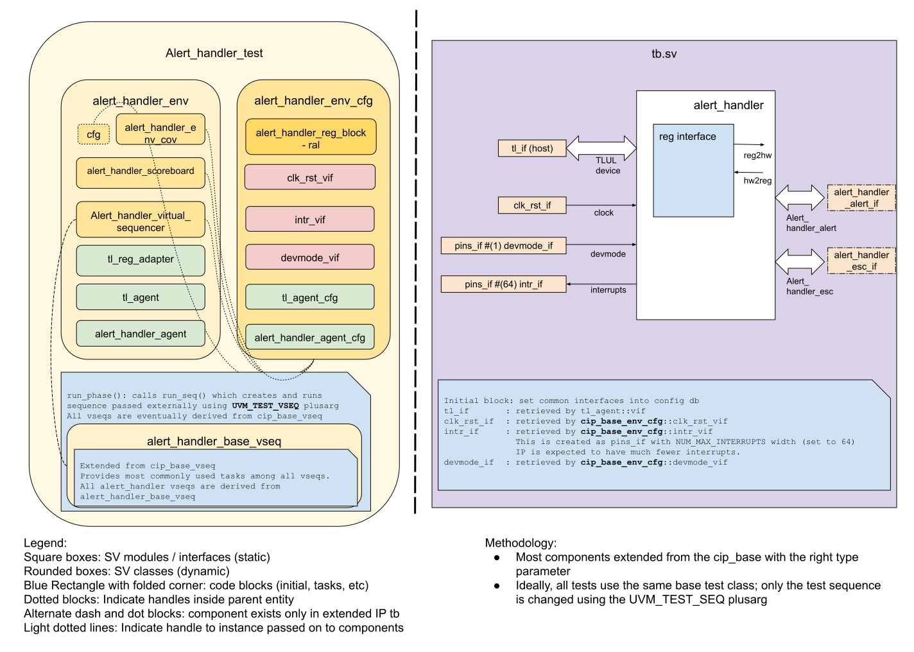

## Goals
* **DV**
  * Verify all ALERT_HANDLER IP features by running dynamic simulations with a SV/UVM based testbench
  * Develop and run all tests based on the [testplan](#testplan) below towards closing code and functional coverage on the IP and all of its sub-modules
* **FPV**
  * Verify TileLink device protocol compliance with an SVA based testbench
  * Verify transmitter and receiver pairs for alert and escalator
  * Partially verify ping_timer

## Current status
* [Design & verification stage]()
  * [HW development stages]()
* DV regression results dashboard (link TBD)

## Design features
For detailed information on ALERT_HANDLER design features, please see the [ALERT_HANDLER HWIP technical specification]().

## Testbench architecture
ALERT_HANDLER testbench has been constructed based on the [CIP testbench architecture]().

### Block diagram


### Top level testbench
Top level testbench is located at `hw/ip/alert_handler/dv/tb/tb.sv`. It instantiates the ALERT_HANDLER DUT module `hw/ip/alert_handler/rtl/alert_handler.sv`.
In addition, it instantiates the following interfaces, connects them to the DUT and sets their handle into `uvm_config_db`:
* [Clock and reset interface]()
* [TileLink host interface]()
* ALERT_HANDLER IOs
* Interrupts ([`pins_if`]())
* Devmode ([`pins_if`]())

### Common DV utility components
The following utilities provide generic helper tasks and functions to perform activities that are common across the project:
* [dv_utils_pkg]()
* [csr_utils_pkg]()

### Global types & methods
All common types and methods defined at the package level can be found in
`alert_handler_env_pkg`. Some of them in use are:
```systemverilog
  parameter uint ALERT_HANDLER_ADDR_MAP_SIZE = 2048;
  parameter uint NUM_MAX_ESC_SEV             = 8;
```

### TL_agent
ALERT_HANDLER testbench instantiates (already handled in CIP base env) [tl_agent]()
which provides the ability to drive and independently monitor random traffic via
TL host interface into ALERT_HANDLER device.

### ALERT_HANDLER Agent
[ALERT_HANDLER agent]:link WIP is used to drive and monitor transmitter and
receiver pairs for the alerts and escalators.

### UVM RAL Model
The ALERT_HANDLER RAL model is created with the `hw/dv/tools/gen_ral_pkg.py` wrapper script at the start of the simulation automatically and is placed in the build area, along with a corresponding `fusesoc` core file.
The wrapper script invokes the [regtool.py]() script from within to generate the RAL model.

It can be created manually by running `make ral` command from the `dv` area.

### Stimulus strategy
#### Test sequences
All test sequences reside in `hw/ip/alert_handler/dv/env/seq_lib`.
The `alert_handler_base_vseq` virtual sequence is extended from `cip_base_vseq` and serves as a starting point.
All test sequences are extended from `alert_handler_base_vseq`.
It provides commonly used handles, variables, functions and tasks that the test sequences can simple use / call.
Some of the most commonly used tasks / functions are as follows:
// Work in Process:
* task 1:
* task 2:

#### Functional coverage
To ensure high quality constrained random stimulus, it is necessary to develop a functional coverage model.
The following covergroups have been developed to prove that the test intent has been adequately met:
// Work in Process:
* cg1:
* cg2:

### Self-checking strategy
#### Scoreboard
The `alert_handler_scoreboard` is primarily used for end to end checking.
It creates the following analysis ports to retrieve the data monitored by corresponding interface agents:
// Work in Process:
* tl_a_chan_fifo: tl address channel
* tl_d_chan_fifo: tl data channel
<!-- explain inputs monitored, flow of data and outputs checked -->

#### Assertions
* TLUL assertions: The `tb/alert_handler_bind.sv` binds the `tlul_assert` [assertions]() to the IP to ensure TileLink interface protocol compliance.
* Unknown checks on DUT outputs: The RTL has assertions to ensure all outputs are initialized to known values after coming out of reset.

## Building and running tests
We are using our in-house developed [regression tool]() for building and running our tests and regressions.
Please take a look at the link for detailed information on the usage, capabilities, features and known issues.
Here's how to run a basic sanity test:
```console
$ cd hw/ip/alert_handler/dv
$ make TEST_NAME=alert_handler_sanity
```

## Testplan


