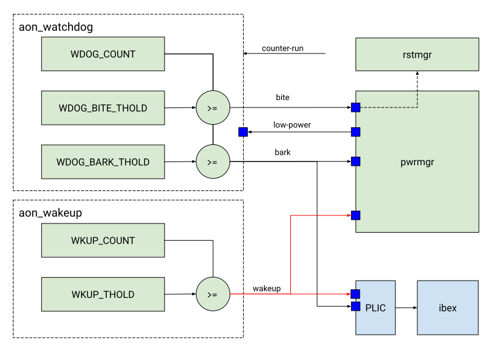

# Overview

This document specifies the Always-On ("AON") Timer IP functionality.
This module conforms to the [Comportable guideline for peripheral functionality.]()
See that document for an overview of how it is integrated into the top level system.

## Features

- Two 32-bit upcounting timers: one timer functions as a wakeup timer, one as a watchdog timer
- The watchdog timer has two thresholds: bark (generates an interrupt) and bite (resets core)
- There is 12 bit pre-scaler for the wakeup timer to enable very long timeouts

## Description

### AON Wakeup timer

The always-on wakeup timer operation is straightforward.
A count starts at 0 and slowly ticks upwards (one tick every N+1 clock cycles, where N is the pre-scaler value).
When it reaches / exceeds the wake count, a level wakeup signal is sent to the power manager and a level IRQ is sent to the processor.
This wakeup signal stays high until it is explicitly acknowledged by software (software must write zero to the wkup_cause register to clear it).
The wakeup timer can be used like a real-time clock for long periods in a low-power mode (though it does not give any guarantees of time-accuracy TODO: specify accuracy).

### AON Watchdog timer

The always-on watchdog timer behaves similarly to the wakeup timer.
It has an independent count starting at 0 which slowly ticks upwards.
When the first threshold is met or exceeded, a level wakeup signal (if enabled) is sent to the power manager.
Simultaneously, a level IRQ signal is also generated to the processor.

If the system is in a low power state, the wakeup signal asks the power manager to wake the system such that the IRQ can be serviced.
If the system is not in a low power mode, the IRQ is immediately serviced.
Both the wakeup and the IRQ signals remain asserted until system reset or explicit acknowledgement by software.
This first threshold is known as the watchdog bark.

Note that it is not recommended to connect this IRQ to a non-maskable interrupt (NMI) pin.
This would require the start-up (ROM) code to be able to handle the watchdog bark, or the core might get stuck when resuming from low-power modes.

When the second threshold is met (this is known as the watchdog bite), a reset request is sent to the power manager which will trigger a system reset.
This is independent of the IRQ sent as part of the watchdog bark.
The system reset also resets the always-on timer, so software is not required to directly acknowledge anything after a watchdog reset.

To prevent the watchdog bark or bite, software is expected to periodically reset the count when operating normally.
This is referred to as petting the watchdog, and is achieved by resetting the count to zero.

Since this timer functions as a watchdog, it has two additional functions not present in the always-on wakeup timer:
* Watchdog configuration lock
* Watchdog pause in sleep

Unlike the wakeup timer, the watchdog timer configuration can be locked by firmware until the next system reset.
This allows the option of preventing firmware from accidentally or maliciously disabling the watchdog.

The "pause in sleep" option controls whether the watchdog timer continues to count in low-power modes.
This allows configurations where the watchdog timer can remain programmed and locked while the device is put to sleep for relatively long periods, controlled by the wakeup timer.
Without this feature, the watchdog timer might wake up the core prematurely by triggering a watchdog bark.

# Theory of Operations

## Block Diagram

See the block diagram for high level function and connectivity.
The timer interacts with the CPU core and the power manager and reset manager to drive wakeup / reset events and interrupts.
There is also an extra input to tell the counter whether to run ("counter-run").
This is used to stop the watchdog timer running when in debugging mode or when the alert handler has put the system in a "killed" state.

## Hardware Interfaces



## Design Details

The always-on timer will run on a ~200KHz clock.
The timers themselves are 32b wide, giving a maximum timeout window of roughly ~6 hours.
For the wakeup timer, pre-scaler extends the maximum timeout to ~1000 days.

Since the timer core runs on a slow clock, register values are sampled into the main clock domain to ensure register read / writes do not incur large latencies.
The synchronization between clocks means that there is a delay between a register write completing and the underlying hardware taking the new value.
Software can read back register values to know if/when updates have taken effect.

# Programmers Guide

## Initialization

1. Write the timer values  and  to zero.
2. Program the desired wakeup pre-scaler value in .
3. Program the desired thresholds in ,  and .
4. Set the enable bit to 1 in the  /  registers.
5. If desired, lock the watchdog configuration by writing 1 to the `regwen` bit in .

## Watchdog pet

Pet the watchdog by writing zero to the  register.

## Interrupt Handling

If either timer reaches the programmed threshold, interrupts are generated from the AON_TIMER module.
Disable or reinitialize the wakeup timer if required by clearing the enable bit in  or clearing the timer value in .
Clear the interrupt by writing 1 into the Interrupt Status Register .

## Device Interface Functions (DIFs)

TODO

## Register Table


